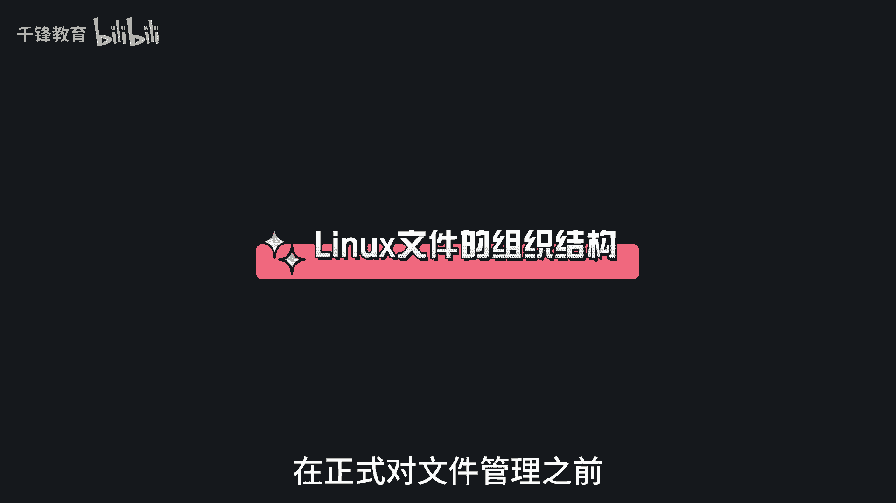
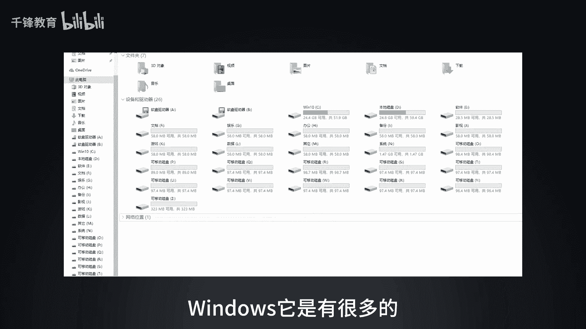
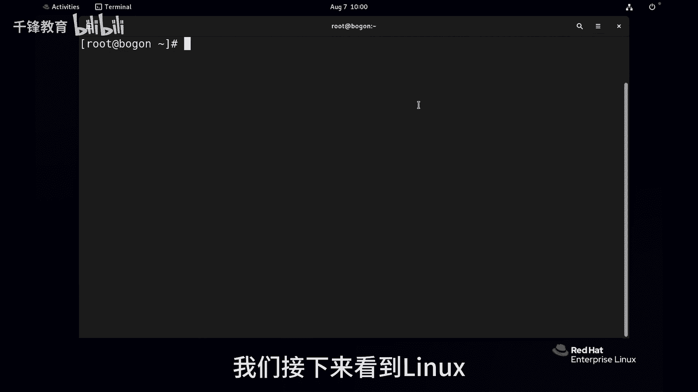
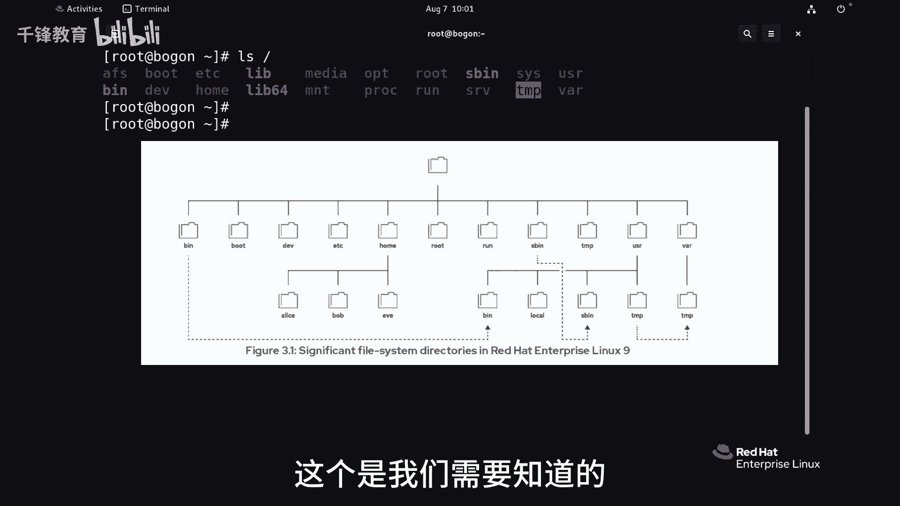
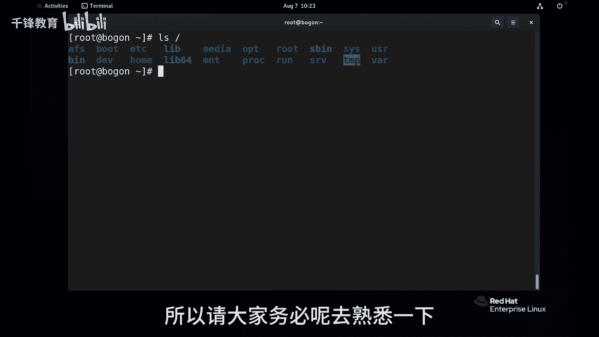

# Linux入门教程：013：Linux文件系统层次结构 📂

在本节课中，我们将要学习Linux文件系统的组织结构。了解文件系统的层次结构是管理文件的基础，它决定了文件在系统中的存放位置和逻辑关系。

上一节我们介绍了如何开始管理文件，本节中我们来看看Linux文件系统的整体布局。

## 概述：Linux的“树形”结构

Linux的文件系统结构与Windows不同。Windows通常使用C盘、D盘等分区。Linux则将所有文件和目录组织成一棵倒挂的树，最顶端是根目录 `/`，所有其他目录都是它的子目录。

这可能会让人误以为Linux只有一个分区，但这是不正确的，我们将在后续课程中详细讲解分区。

在这棵“树”上，有许多重要的目录，了解它们对于后续的系统管理工作至关重要。

## 文件类型简介

Linux系统中的文件大致可以分为以下几类：

*   **静态文件**：内容通常不会发生变化，例如图片、文档。
*   **动态文件**：内容会随着系统或进程的运行而变化，例如日志文件。当发生安全登录等事件时，日志文件会不断追加新内容。
*   **持久性文件**：系统重启后内容依然保留，例如配置文件（主机名、IP地址等）。
*   **临时性文件**：系统重启后可能会被删除，例如进程运行时产生的PID文件。

## 核心目录详解

以下是Linux根目录下一些最重要子目录的功能说明。

### `/boot` - 启动目录

此目录存放系统启动所需的文件。例如，启动时显示读秒界面的引导程序 `grub` 就位于此目录。没有它，系统无法加载内核。

另一个关键文件是 `vmlinuz`，它是Linux系统的内核文件。内核由Linus Torvalds编写，负责管理进程、设备等核心功能。

### `/dev` - 设备目录

此目录包含系统中所有的设备文件，体现了 **“Linux一切皆文件”** 的理念。例如，硬盘、网卡、终端、标准输入/输出等都在这里以文件形式存在。

### `/etc` - 配置目录

这是我们打交道非常多的目录，主要存放系统的配置文件。例如：
*   `/etc/hostname` 文件定义了系统的主机名。
*   网络配置也存放在此目录下。

通常，每个安装的软件都会在 `/etc` 下有自己的子目录来存放其配置文件。

### `/home` 与 `/root` - 家目录

*   `/root`：是系统管理员（root用户）的家目录。
*   `/home`：是**普通用户家目录的父目录**。例如，系统中有一个普通用户 `tianyun`，那么他的家目录路径就是 `/home/tianyun`。

家目录是用户登录后的默认工作目录，用于存放个人文件和配置。

### `/run` - 运行时目录

此目录存放系统启动后，进程运行时的数据，例如进程的PID（进程ID）文件。通常不需要人工干预。

例如，每个进程都有一个唯一的编号，即进程ID。我们可以通过命令查看和管理进程。

### `/tmp` 与 `/var/tmp` - 临时目录

这两个目录都用于存放临时文件，任何用户或进程都可以在此写入数据。它们的区别在于清理策略：
*   `/tmp`：默认**10天**内未被访问、更改或修改的文件会被自动删除。
*   `/var/tmp`：默认**30天**内未被访问、更改或修改的文件会被自动删除。

### `/usr` - 用户软件目录

这是一个重量级目录，存放用户安装的软件、共享库和只读程序数据。

*   `/usr/bin`：存放**普通用户**使用的命令（二进制文件），例如 `ls` 命令。
*   `/usr/sbin`：存放**系统管理员**使用的系统管理命令，例如创建用户的 `useradd` 命令。
*   `/usr/local`：通常存放用户**本地编译安装**的软件。

### `/var` - 可变数据目录

正如其名，此目录存放经常变化的（Variable）数据。主要包括：
*   `/var/log`：存放各种日志文件，如系统日志、安全日志、服务日志等。
*   数据库文件、缓存文件等也常位于此目录下。

## 总结

本节课中我们一起学习了Linux文件系统的层次结构。我们了解到Linux采用树形结构组织文件，根目录 `/` 是起点。我们重点介绍了 `/boot`、`/dev`、`/etc`、`/home`、`/root`、`/run`、`/tmp`、`/usr` 和 `/var` 等核心目录的作用。

熟悉这些目录是进行有效系统管理的基础。在后续的学习中，我们将逐步深入了解这些目录中的具体文件及其管理方法。