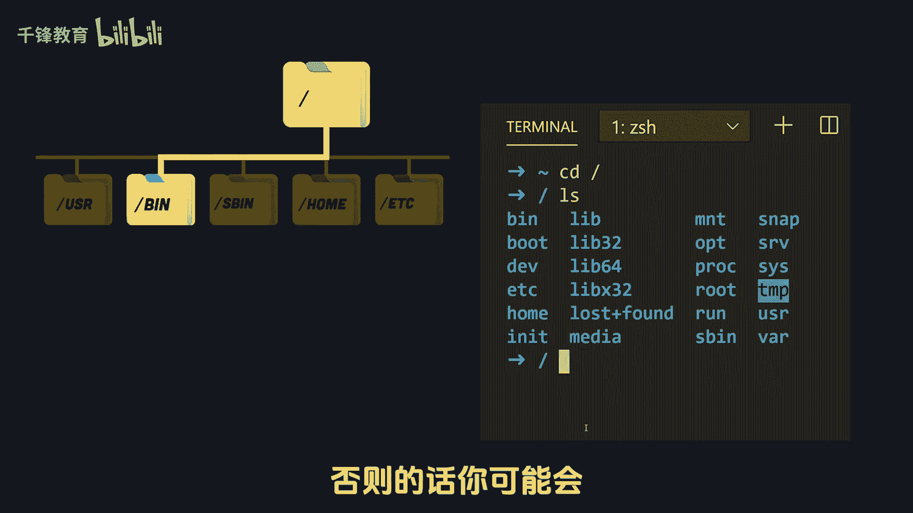
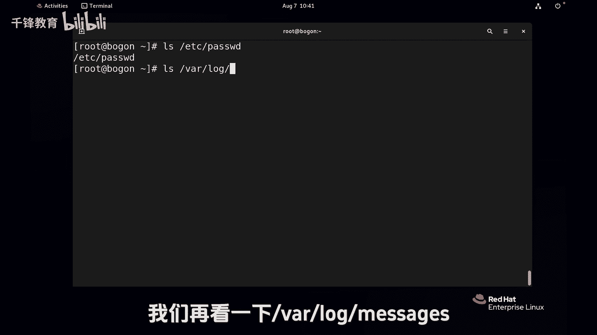
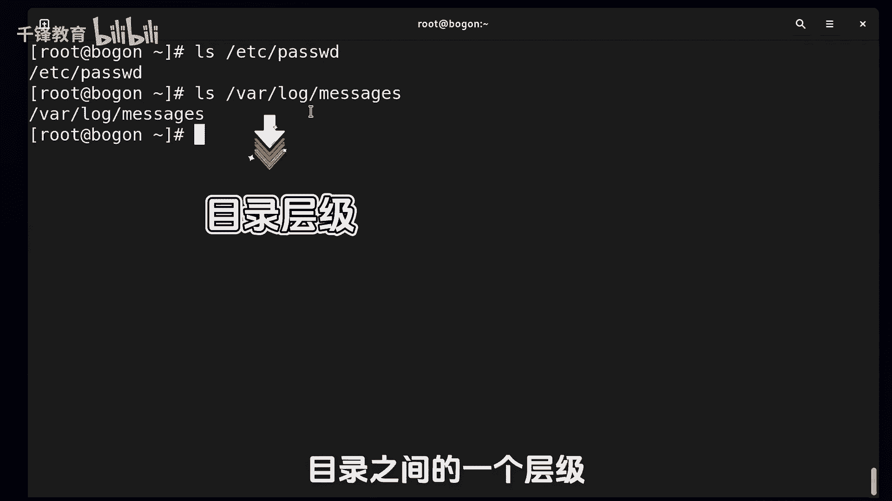
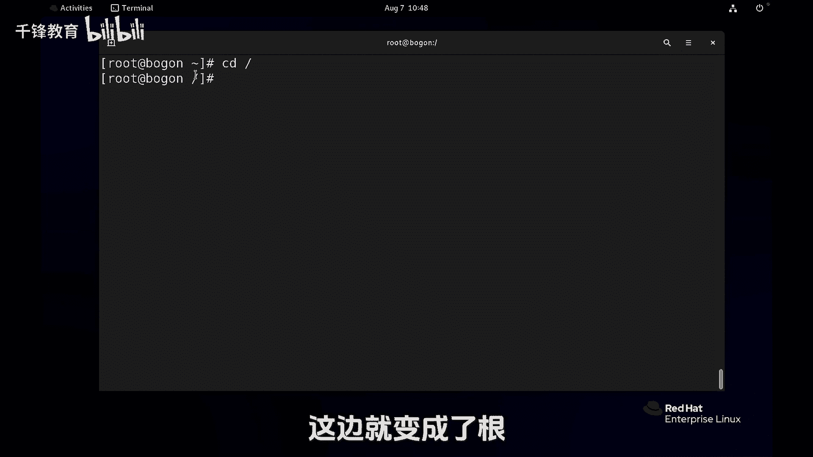
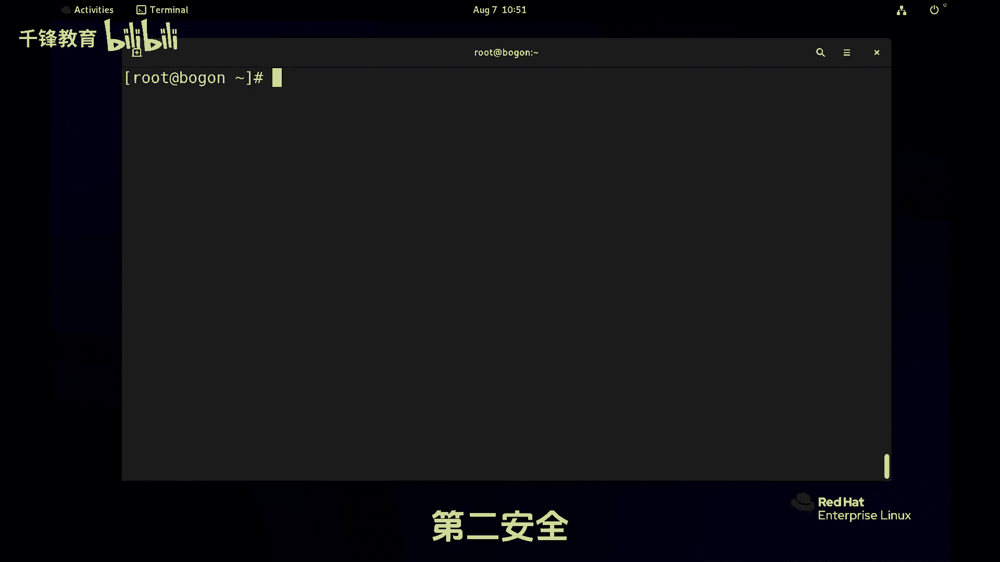

# Linux入门教程：014：绝对路径与相对路径 📂


在本节课中，我们将学习Linux系统中定位文件的核心概念：绝对路径与相对路径。理解这两种路径的用法，是高效、安全地管理文件的基础。


上一节我们介绍了文件管理的基本概念，本节中我们来看看如何精确地定位一个文件。



## 核心概念：路径

在Linux中，要对文件进行操作（如创建、删除），首先必须明确文件的位置和名称。路径就是用来描述文件或目录在文件系统中位置的字符串。

### 绝对路径



绝对路径是从文件系统的根目录（`/`）开始，逐级向下指向目标文件或目录的完整路径。它提供了文件的**绝对**位置，无论当前身处何处，使用绝对路径都能准确定位到同一个文件。



**公式**：`/一级目录/二级目录/.../文件名`

例如，路径 `/var/log/message` 就是一个绝对路径。它表示从根目录开始，进入 `var` 目录，再进入其下的 `log` 目录，最终定位到 `message` 文件。

> **注意**：路径开头的正斜线 `/` 代表根目录，是路径的起点。而路径中间的斜线 `/` 仅表示目录之间的层级分隔。

### 相对路径

相对路径是相对于**当前工作目录**的路径。它不以根目录 `/` 开头，而是以当前所在目录为起点进行导航。

**公式**：`./子目录/文件名` 或 `../上级目录/文件名`

例如，如果当前工作目录是 `/var`，那么 `log/message` 就是一个相对路径，它指向 `/var/log/message` 文件。

## 关键命令：定位与导航

以下是两个用于定位和导航的高频命令。

### 1. `pwd` 命令

`pwd`（Print Working Directory）命令用于显示当前工作目录的绝对路径。当在复杂的目录结构中切换时，可以使用它来确认自己的当前位置。

**代码示例**：
```bash
pwd
```
执行后，终端会输出类似 `/home/username` 的路径。

### 2. `cd` 命令



`cd`（Change Directory）命令用于切换当前工作目录。


**代码示例**：
```bash
cd /var/log  # 使用绝对路径切换到 /var/log 目录
cd ..        # 切换到上级目录
cd ~         # 切换到当前用户的家目录（波浪线 ~ 是家目录的简写）
```

## 路径选择策略：何时用绝对？何时用相对？

选择使用绝对路径还是相对路径，主要基于两个原则：**效率**与**安全**。

以下是具体的使用场景建议：

*   **效率优先**：选择到达目标的最短、最直接的路径。
    *   当目标文件就在当前目录或其子目录下时，使用相对路径更快捷。例如，在 `/var` 目录下查看 `log/message` 文件，直接使用 `cat log/message` 即可。
    *   当目标文件距离当前目录较远时，直接使用绝对路径可能更高效，无需先切换目录。例如，在 `/home` 目录下查看 `/etc/passwd` 文件，直接使用 `cat /etc/passwd`。

*   **安全优先**：在可能造成不可逆操作（尤其是删除）时，优先考虑路径的明确性。
    *   在命令行中执行删除（`rm`）等危险操作时，**建议使用绝对路径**，以确保你删除的是你真正想删除的文件，避免因相对路径的歧义误删系统关键文件。
    *   在编写脚本时，**强烈建议使用绝对路径**来指定文件。因为脚本可能在任何目录下被执行，使用绝对路径可以保证行为的一致性，避免因工作目录不同而引发灾难性错误。

## 总结

本节课中我们一起学习了Linux文件定位的核心知识。

*   **绝对路径**以根目录 `/` 开头，提供文件的唯一、绝对位置。
*   **相对路径**以当前目录为起点，用于指向附近的文件或目录。
*   使用 `pwd` 查看当前位置，使用 `cd` 切换目录。
*   选择路径时，应兼顾**效率**（使用最短路径）与**安全**（危险操作时使用绝对路径）。



理解并熟练运用绝对路径和相对路径，是你迈向Linux高手之路的重要一步。下一节，我们将开始学习具体的文件操作命令。