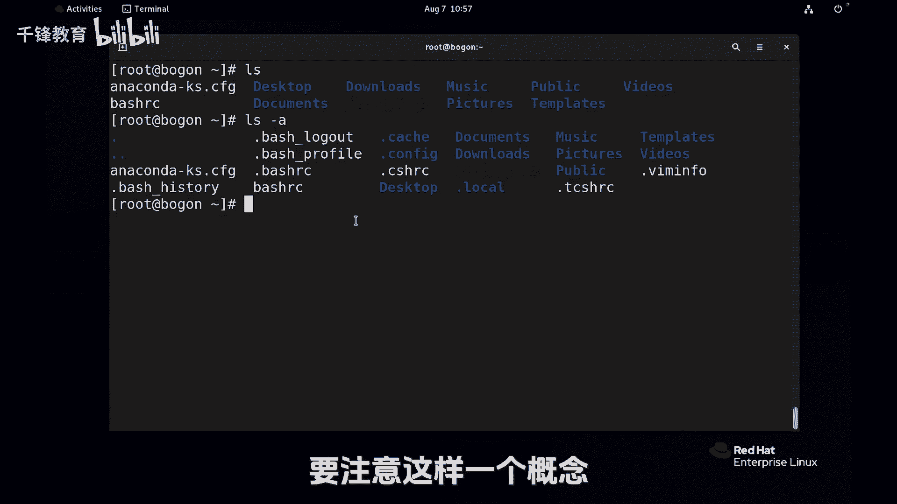

# Linux入门教程：015：Linux中 “.“和”..“的含义 📁


在本节课中，我们将要学习Linux文件系统中两个非常特殊的符号：`.`（点）和`..`（点点）。理解它们的含义和用法，是掌握Linux目录操作的基础。

## 概述


在Linux系统中，`.`代表当前目录，而`..`代表上一级目录。它们就像文件系统中的“快捷方式”，可以帮助我们快速地在目录间导航。

## 目录导航与“家”的概念

无论你身处文件系统的哪个位置，使用`cd`命令都可以直接返回当前用户的家目录。这就像不管去到多远，家永远是温馨的港湾。

例如，使用`cd`命令可以直接回家：
```bash
cd
```

## 理解“.”和“..”的含义

上一节我们介绍了`cd`命令的基本用法，本节中我们来看看如何使用`.`和`..`进行更灵活的目录切换。

`cd`命令用于切换目录。如果你想回到当前目录的上一层，一种方法是输入上一层的绝对路径。另一种更简便的方法是使用`..`。

例如，从 `/var/log` 目录返回到 `/var` 目录：
```bash
cd ..
```
执行后，你就回到了上一层目录。

你可能会发现，使用普通的`ls`命令看不到名为`.`或`..`的目录。这是因为它们默认是隐藏的。

以下是查看所有文件（包括隐藏文件）的方法：
```bash
ls -a
```
`-a`选项代表“all”，即显示所有文件。

这时，你会看到两个特殊的目录项：
*   `.`：代表当前目录本身。
*   `..`：代表上一级目录。

## “.”和“..”的用法

这两个符号都可以像普通目录名一样使用。

例如，使用`cd .`会停留在当前目录，没有变化：
```bash
cd .
```

使用`ls .`的效果和直接使用`ls`一样，都是列出当前目录的内容：
```bash
ls .
```

而使用`cd ..`则会切换到上一级目录。这是一个相对概念。在`/var`目录下，`.`代表`/var`自己，`..`则代表它的上一级，也就是根目录`/`。如果此时再次执行`cd ..`，就会回到根目录。

## 隐藏文件的概念

为什么`.`和`..`默认不显示呢？这里引出一个重要的概念：在Linux中，**凡是以点`.`开头的文件或目录都是隐藏文件**。

我们回到家目录，使用`ls -a`命令查看：
```bash
cd
ls -a
```
你会看到很多以点开头的文件或目录（蓝色通常代表目录，白色代表普通文件）。这些点开头的条目是文件名的一部分，就像人脸上的痣，是身份标识的一部分。

为了加深理解，我们创建一个新文件。这里会涉及一个新命令`touch`，初学者可以简单地理解为创建一个空文件。

例如，创建一个名为`.testrc`的文件：
```bash
touch .testrc
```
再创建一个名为`testrc`的文件：
```bash
touch testrc
```

现在使用`ls -a`查看，你会发现两个文件：`.testrc`和`testrc`。如果不加`-a`选项，则只能看到`testrc`文件。这证明以点开头的文件是隐藏的，并且`.testrc`和`testrc`是两个完全不同的文件。

## 总结



本节课中我们一起学习了Linux中`.`和`..`这两个特殊符号的核心含义与用法。`.`代表当前目录，`..`代表父目录，它们是文件系统结构的一部分，能帮助我们高效地进行目录导航。同时，我们也了解到在Linux中，以点`.`开头的文件或目录默认是隐藏的，需要使用`ls -a`命令才能查看。掌握这些概念，是熟练操作Linux命令行的重要一步。