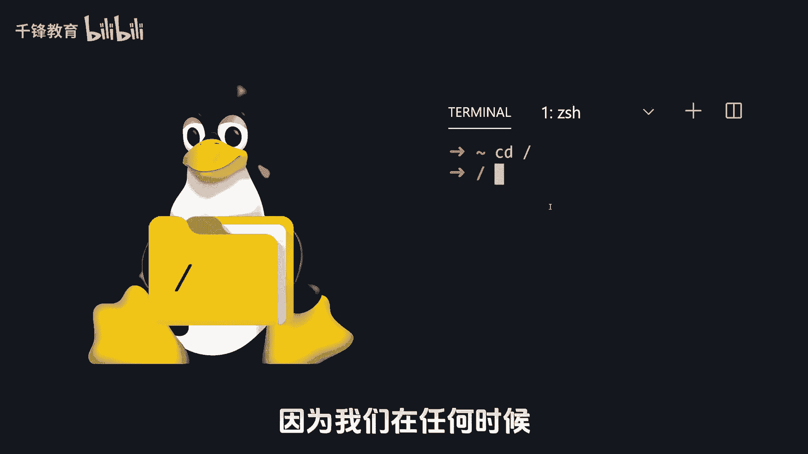
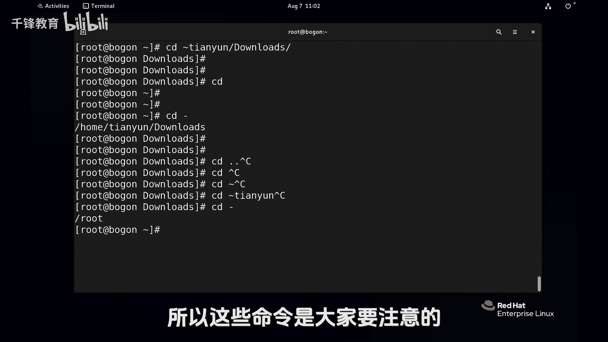

Linux入门教程：016：Linux中不可错过的cd命令 🚀




在本节课中，我们将深入学习Linux系统中一个极其高频且重要的命令——`cd`命令。它用于在文件系统的不同目录之间进行切换，是进行文件操作和管理的基础。


---

上一节我们介绍了Linux文件系统的基本结构，本节中我们来看看如何在目录间自由穿梭。

`cd`命令的核心功能是切换当前工作目录。其基本语法是：
```bash
cd [目录路径]
```
其中，`[目录路径]`可以是绝对路径或相对路径。

以下是`cd`命令的几种主要用法：

1.  **使用绝对路径切换目录**
    绝对路径从根目录`/`开始。例如，要切换到`/var/log`目录，命令为：
    ```bash
    cd /var/log
    ```

2.  **使用相对路径切换目录**
    相对路径基于当前目录。例如，当前在`/var`目录下，要进入其子目录`log`，命令为：
    ```bash
    cd log
    ```
    注意，如果路径是目录，在按`Tab`键自动补全时，系统通常会自动添加一个斜杠`/`，这有助于区分目录和文件。

3.  **快速返回家目录**
    家目录是用户的个人工作空间。有以下几种方式可以快速返回：
    *   `cd` 或 `cd ~`：直接返回当前登录用户的家目录。
    *   `cd ~用户名`：切换到指定用户的家目录（需要相应权限）。例如，`cd ~tianyun`会切换到用户`tianyun`的家目录（通常为`/home/tianyun`）。

4.  **返回上一级目录**
    `..`代表当前目录的父目录。使用`cd ..`可以向上返回一级。

5.  **在两个目录间快速切换**
    `cd -`命令非常实用，它可以快速切换回上一次所在的目录，类似于遥控器上的“返回”按钮，而不是简单地向上级目录移动。

---



本节课中我们一起学习了`cd`命令的各种用法，包括使用绝对路径和相对路径切换目录、快速返回家目录、向上级目录移动以及在两个目录间快速往返。熟练掌握`cd`命令是高效使用Linux命令行环境的关键第一步。