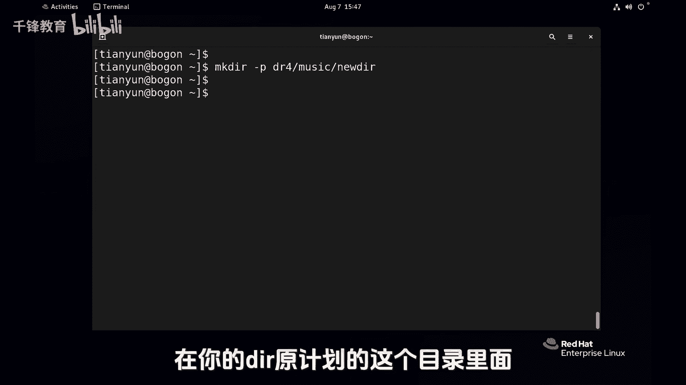
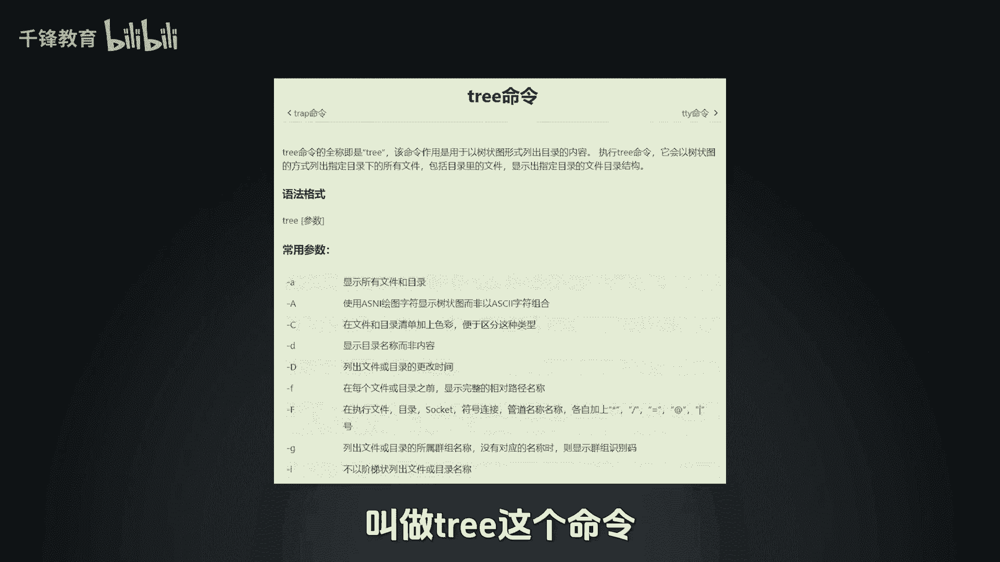
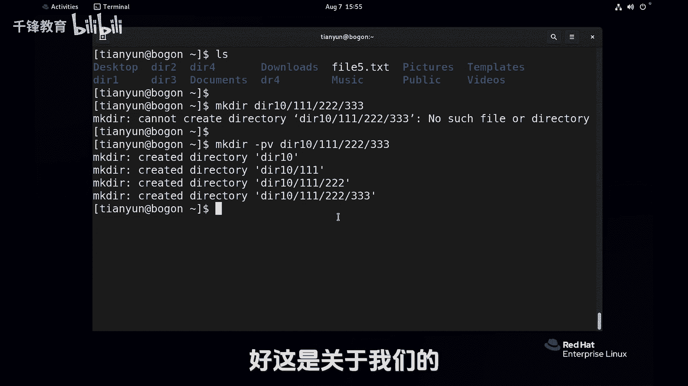

# Linux基础入门：017：创建目录和文件 📁📄


在本节课中，我们将要学习Linux系统中最基础的文件管理操作，包括如何创建目录和文件。这是管理Linux系统文件和目录结构的第一步。

## 创建目录

上一节我们介绍了Linux的基本概念，本节中我们来看看如何使用命令创建目录。创建目录主要使用 `mkdir` 命令，它是“make directory”的缩写。

**命令格式**：
```bash
mkdir [选项] 目录名
```

以下是使用 `mkdir` 命令的几种常见方式：

*   **创建单个目录**：在命令后直接跟上目录名即可。
    ```bash
    mkdir dir1
    ```
    执行后，若没有报错，则表示在当前目录下成功创建了一个名为 `dir1` 的目录。

*   **同时创建多个目录**：在命令后跟上多个目录名，用空格分隔。
    ```bash
    mkdir dir1 dir2 dir3
    ```
    这条命令会一次性创建 `dir1`、`dir2`、`dir3` 三个目录。



*   **创建多级目录（嵌套目录）**：如果需要创建的目录的上级目录不存在，直接创建会失败。这时需要使用 `-p` 选项。
    ```bash
    mkdir -p dir4/music
    ```
    这条命令会创建 `dir4` 目录，并在 `dir4` 目录下再创建 `music` 目录。`-p` 选项的作用是：如果父级目录不存在，则一并创建。



**关于 `-p` 选项的重要提示**：`-p` 选项虽然方便，但使用时务必小心。因为它会自动创建路径中所有不存在的目录。如果命令输入有误，可能会创建出一系列非预期的目录结构。例如，本想创建 `dir4/music`，但误输入为 `dirr4/music`，系统也会照常创建出 `dirr4` 和其下的 `music` 目录。

*   **显示创建过程的详细信息**：可以使用 `-v` 选项来查看命令执行的详细步骤。
    ```bash
    mkdir -pv dir10/111/222/333
    ```
    这条命令会显示创建每一级目录的过程。

## 创建文件

了解了目录的创建后，接下来我们学习如何创建文件。创建空文件通常使用 `touch` 命令。

**命令格式**：
```bash
touch 文件名
```

以下是使用 `touch` 命令的示例：

*   **创建单个空文件**：
    ```bash
    touch file1.txt
    ```
    执行后，会在当前目录下创建一个名为 `file1.txt` 的空文件。在Linux中，文件扩展名（如 `.txt`）本身没有特殊含义，主要是为了用户便于识别文件类型。

*   **同时创建多个空文件**：
    ```bash
    touch file2.txt file3.txt
    ```
    这条命令会一次性创建 `file2.txt` 和 `file3.txt` 两个空文件。

**关于路径的注意事项**：无论是 `mkdir` 还是 `touch` 命令，创建目录或文件的位置取决于你提供的路径。

*   **绝对路径**：从根目录（`/`）开始的完整路径，明确指定了位置。
    ```bash
    touch /tmp/test.txt
    ```
    这条命令明确在 `/tmp` 目录下创建 `test.txt` 文件。

*   **相对路径**：相对于当前所在目录的路径。
    ```bash
    touch file5.txt
    ```
    这条命令会在**当前工作目录**下创建 `file5.txt`。如果你在 `/home/user` 目录下执行，文件就会创建在那里，而不是 `/tmp` 目录。

**权限限制**：需要注意的是，你并非可以在系统的任何位置随意创建目录或文件。操作能否成功取决于当前用户对该位置的权限。例如，普通用户尝试在根目录（`/`）下创建目录通常会因“权限被拒绝”而失败。像 `/tmp` 这样的临时目录通常对所有用户开放写入权限。

---



本节课中我们一起学习了Linux中创建目录（`mkdir`）和创建文件（`touch`）的基础命令。我们了解了如何创建单个或多个目录/文件，如何使用 `-p` 选项创建多级目录结构，以及路径（绝对路径和相对路径）和用户权限对操作的影响。掌握这些是进行后续文件复制、移动、删除等操作的基础。