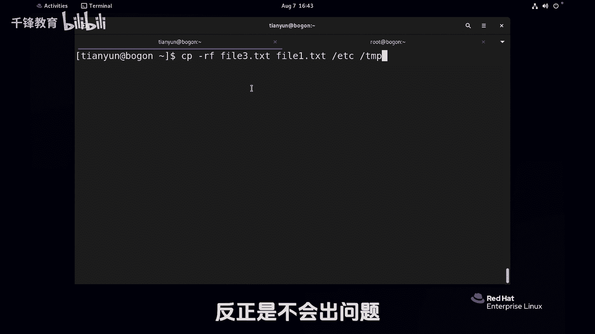

# Linux入门教程：018：文件复制 📂


在本节课中，我们将要学习Linux系统中一个非常基础且重要的操作——文件复制。我们将详细介绍`cp`命令的基本用法、不同用户权限下的行为差异，以及复制目录时的注意事项。通过学习，你将能够熟练地在不同位置复制文件和目录。

---

## 基本用法

`cp`命令用于复制文件或目录。其基本语法是 `cp 源文件 目标文件`。源文件是你要复制的文件，目标文件是你希望复制到的位置或新文件名。

以下是`cp`命令的一些基础操作示例：

*   **复制文件到目录**：将当前目录下的 `file1.txt` 文件复制到 `/tmp` 目录下，不改变文件名。
    ```bash
    cp file1.txt /tmp
    ```
*   **复制并重命名**：将 `file1.txt` 文件复制到 `/tmp` 目录下，并重命名为 `file11.txt`。
    ```bash
    cp file1.txt /tmp/file11.txt
    ```
*   **本地复制并重命名**：在当前目录下，将 `file1.txt` 复制一份并命名为 `file3.txt`。
    ```bash
    cp file1.txt file3.txt
    ```

执行上述操作后，你可以使用 `ls /tmp` 命令来验证 `/tmp` 目录下已存在 `file1.txt` 和 `file11.txt` 文件。

---

## 用户权限与覆盖行为

上一节我们介绍了`cp`命令的基本复制操作，本节中我们来看看不同用户权限对文件覆盖行为的影响。这是一个重要的安全特性。

当你尝试将一个文件复制到一个已存在同名文件的位置时，`cp`命令的默认行为因用户身份而异：

*   **普通用户**：默认直接覆盖，没有任何提示。
*   **root用户（管理员）**：默认会进行交互式询问，提示你是否覆盖。

这是因为root用户权限极高，可以修改系统任何文件，为了避免误操作造成严重问题，系统为其`cp`命令默认添加了 `-i`（interactive，交互）选项。你可以通过 `type -a cp` 命令来验证这一点，你会发现root用户的`cp`实际上是一个别名（alias），指向 `cp -i`。

如果你想临时以root身份执行不带提示的强制覆盖，有以下两种方法：

1.  使用命令的完整路径，绕过别名。
    ```bash
    /usr/bin/cp file1.txt /tmp/file1.txt
    ```
2.  在命令前使用反斜杠 `\` 来取消本次命令的别名。
    ```bash
    \cp file1.txt /tmp/file1.txt
    ```

对于普通用户，如果想在覆盖前获得提示，可以手动添加 `-i` 选项：
```bash
cp -i source_file destination
```

---

## 复制目录与进阶用法

掌握了文件和用户权限后，我们来看看如何复制目录。复制目录需要使用 `-r`（或 `-R`，recursive，递归）选项，表示递归地复制目录及其内部的所有子目录和文件。

以下是复制目录的操作示例：

*   **复制目录**：将当前目录下的 `dir1` 目录复制到 `/tmp` 下。
    ```bash
    cp -r dir1 /tmp
    ```
*   **以root身份复制系统目录**：复制 `/etc` 目录到 `/tmp`。由于文件众多，如果使用别名（`cp -i`）会不断询问，此时可以按 `Ctrl+C` 中断，并使用上述方法取消别名。
    ```bash
    \cp -r /etc /tmp
    ```

`cp`命令还支持同时复制多个文件到同一个目标目录。

以下是将多个项目复制到目标目录的操作步骤：

1.  将所有源文件（或目录）依次列出。
2.  最后一个参数指定为目标目录。
    ```bash
    cp -r file1.txt file2.txt dir1 /目标目录/
    ```

---

## 总结

本节课中我们一起学习了Linux下的文件复制操作。我们首先掌握了`cp`命令复制文件和重命名的基础语法。接着，我们探讨了不同用户（普通用户与root用户）在执行覆盖操作时的行为差异及其安全原理，并学会了如何控制覆盖提示。最后，我们学习了使用 `-r` 选项递归复制目录，以及一次性复制多个项目到指定目录的进阶用法。



记住，在不确定时，复制目录使用 `cp -r` 是一个稳妥的选择。熟练运用`cp`命令，是高效管理Linux文件系统的基础。