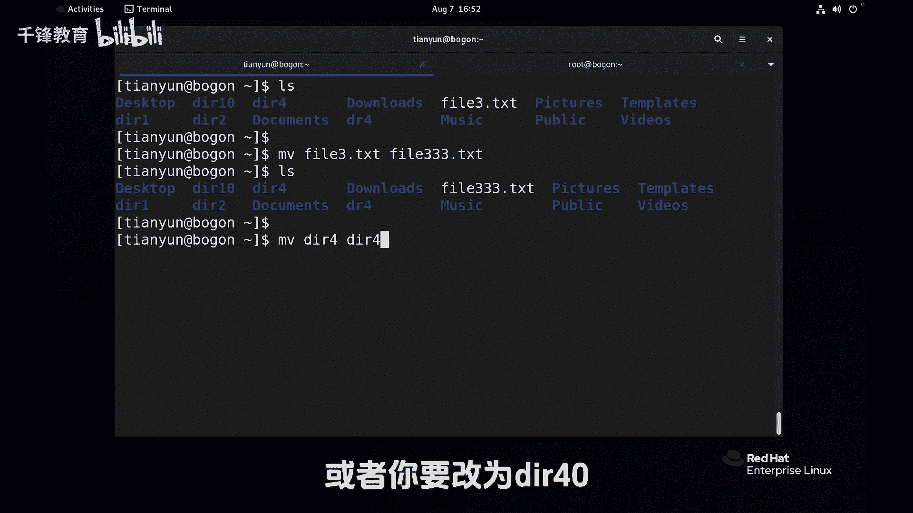
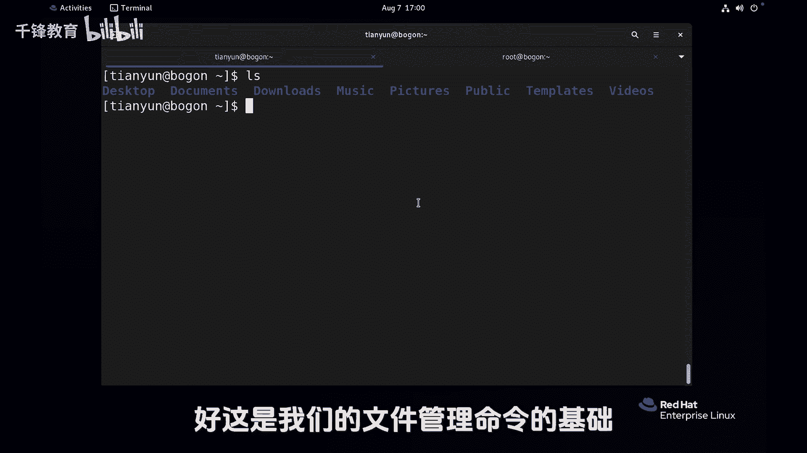

# Linux文件管理：P19：文件移动与删除 🗂️


在本节课中，我们将学习Linux系统中两个重要的文件管理操作：移动文件和删除文件。我们将详细讲解`mv`和`rm`命令的使用方法、注意事项以及它们与Windows中类似操作的区别。

---

## 文件移动操作

上一节我们介绍了文件复制，本节中我们来看看文件的移动。`mv`命令相当于Windows中的“剪切”操作。它与`cp`命令的核心区别在于，移动后源文件将不复存在。

**移动文件的基本语法是：**
```bash
mv 源文件 目标路径
```



以下是`mv`命令的几种常见用法：

1.  **移动文件并保留原名**：将文件移动到目标目录，不改变文件名。
    ```bash
    mv file1.txt /tmp/
    ```
    执行后，当前目录下的`file1.txt`文件会消失，出现在`/tmp/`目录下。


2.  **移动并重命名**：在移动的同时，可以指定新的文件名。
    ```bash
    mv file2.txt /tmp/newfile.txt
    ```
    这会将`file2.txt`移动到`/tmp`目录下，并重命名为`newfile.txt`。

3.  **在当前目录重命名**：如果目标路径是当前目录下的一个新名字，则实现重命名功能。
    ```bash
    mv file3.txt file333.txt
    ```
    这相当于将`file3.txt`改名为`file333.txt`。

4.  **移动或重命名目录**：`mv`命令同样适用于目录操作。
    ```bash
    mv dir4 dir44
    ```
    这会将目录`dir4`重命名为`dir44`。

`mv`命令的使用非常简单直接，没有复杂的选项。

---

## 文件删除操作

了解了文件的移动，接下来我们学习一个需要**极其谨慎**使用的命令——文件删除`rm`。网络上常说的“删库跑路”操作，指的就是`rm -rf /`命令。现在我们来详细了解`rm`命令。

**删除文件的基本语法是：**
```bash
rm 选项 文件或目录名
```

以下是`rm`命令的使用示例和注意事项：

1.  **删除普通文件**：直接使用`rm`命令即可。
    ```bash
    rm file333.txt
    ```

2.  **删除空目录**：需要加上`-d`选项。
    ```bash
    rm -d dir2
    ```

3.  **删除非空目录**：必须使用`-r`（递归）选项，表示删除目录及其内部所有内容。
    ```bash
    rm -r dir1
    ```
    对于普通用户，`rm -r`命令会直接删除，没有任何确认提示，操作非常“豪爽”。

### 管理员与普通用户的区别

这里有一个关键区别：**系统管理员（root用户）默认的`rm`命令是带有交互提示的别名**。

*   当管理员删除一个文件时，系统会询问是否确认。
    ```bash
    rm file2.txt
    # 输出：rm: remove regular file 'file2.txt'? y
    ```
*   当管理员删除一个包含大量文件的目录时，提示会非常繁琐。
    ```bash
    rm -r etc/
    # 会对目录下的每一个文件都进行确认询问
    ```

这是因为管理员使用的`rm`命令实际上是`rm -i`（交互模式）的别名。为了避免交互，管理员可以使用`-f`（强制）选项。
```bash
rm -rf etc/
```
`rm -rf`组合非常强大，会强制递归删除，无视任何提示。

### 一个至关重要的路径陷阱

这是曾经发生过的真实错误案例，请务必牢记：

**意图**：想删除用户家目录下的一个特定文件夹，例如`/home/tianyun/etc/`。

**危险操作**：在根目录`/`下，输入了不完整的路径就按下了回车。
```bash
rm -rf /home/tianyun/etc
# 如果光标在 `/` 后面就不小心按了回车，命令就变成了 `rm -rf /`，这将删除整个根目录！
```

**安全建议**：
*   **在命令行手动操作时，尽量使用相对路径**。先进入目标目录的父目录，再执行删除，这样能清楚看到自己在删除什么。
    ```bash
    cd /home/tianyun
    rm -rf etc/  # 此时你明确知道删除的是当前目录下的etc文件夹
    ```
*   **在编写脚本时，则必须使用绝对路径**，以避免因当前工作目录不确定而导致的错误。

`rm`命令威力巨大，请务必小心谨慎。平时操作尽量使用普通用户，仅在必要时切换为管理员。

---



本节课中我们一起学习了Linux的文件移动(`mv`)与删除(`rm`)命令。我们掌握了`mv`命令移动和重命名文件/目录的方法，并深入探讨了`rm`命令的强大与危险性，特别是管理员模式下`rm -i`别名的影响以及使用`rm -rf`时的路径安全准则。牢记：操作文件，尤其是删除时，务必确认路径，谨慎执行。