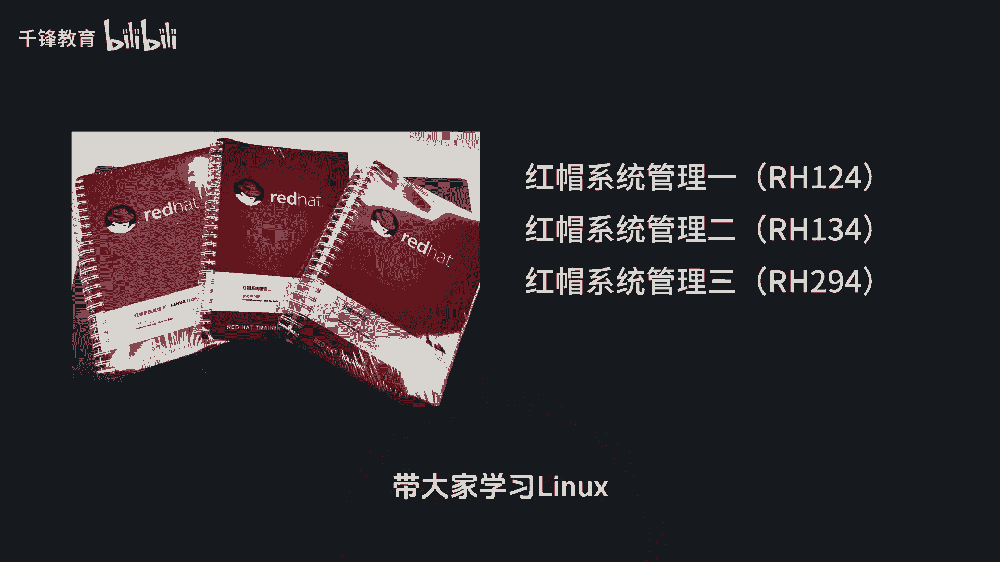
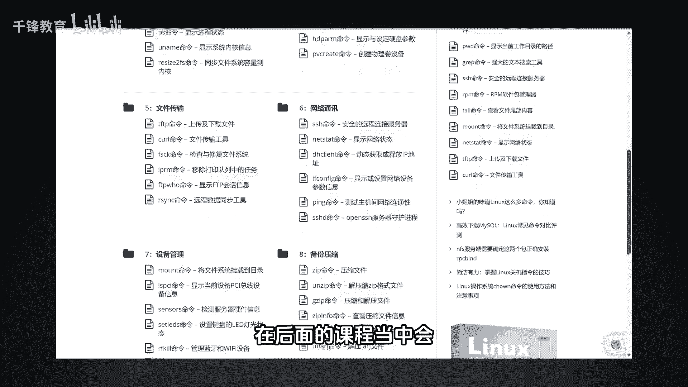

Linux红帽认证入门教程：001：课程先导与学习路径 🚀

在本节课中，我们将了解本系列教程的整体安排、学习目标以及如何高效地掌握Linux技能，并最终通过红帽认证考试。

很多同学可能在大学里接触过Linux，因为现在许多专业都开设了相关课程，但常常感到无从下手。一个普遍的困扰是Linux命令数量繁多，且每个命令又包含大量参数。

实际上，我们日常使用的核心命令并没有想象中那么多。高频使用的命令可能只有十几个到二十个，另一些命令的使用频率则相对较低。因此，学习的关键在于掌握核心命令，并学会如何自主查阅命令的帮助文档。这些具体的方法和技巧，我们将在后续的课程中为大家详细讲解。

所以，请大家跟随我的节奏，我们一起轻松学习Linux。

---

我们的目标是系统地掌握Linux这一基础技能，并顺利取得红帽认证RHCE。本课程将严格遵循红帽官方的三本教材顺序，带领大家进行学习。

---

### 课程总结

本节课我们一起了解了本系列教程的学习路径和目标。我们从学习Linux的常见困惑出发，明确了掌握核心命令和查阅帮助文档的重要性，并确立了跟随官方教材顺序、以通过RHCE认证为目标的清晰学习路线。在接下来的课程中，我们将正式开启Linux世界的大门。