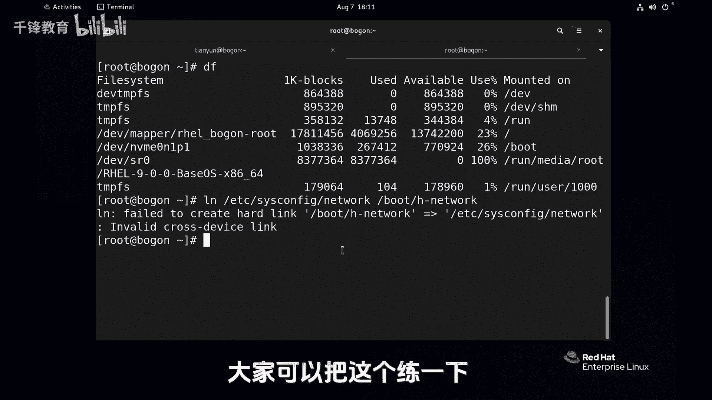

# Linux云计算入门：020：文件链接-硬链接 🔗


在本节课中，我们将要学习Linux系统中一种强大的文件管理特性——文件链接。我们将重点探讨**硬链接**的概念、创建方法、特点以及它的使用限制。通过学习，你将理解如何通过链接为文件创建多个访问入口，并了解它与Windows快捷方式的本质区别。

## 概述 📖


Linux系统支持两种文件链接：硬链接和软链接（符号链接）。本节我们将深入探讨硬链接。简单来说，硬链接是为同一个文件数据创建多个目录条目（文件名），所有这些条目都指向磁盘上相同的存储位置（索引节点）。这并非复制文件，而是增加了访问同一份数据的路径。

## 认识文件与链接数

在开始创建链接前，我们先来查看文件的详细信息。使用 `ls -l` 命令可以显示文件的长列表信息。

```
ls -l
```

实际上，系统中常为 `ls -l` 设置了别名 `ll`，它等价于 `ls -l --color=auto`，能显示颜色且更简洁。

```
ll
```

在 `ll` 命令的输出中，每一行的第一列表示文件类型（`-` 代表普通文件，`d` 代表目录）。第二列的数字表示该文件的**硬链接计数**。对于一个新创建的文件，其链接数通常为1。

每个文件在文件系统中都有一个唯一的编号，称为索引节点号（inode number）。我们可以使用 `ls -i` 命令来查看它。

```
ls -i file1.txt
```

## 创建硬链接

创建硬链接的命令是 `ln`。其基本语法是：

```
ln <源文件> <目标链接文件>
```

例如，我们有一个文件 `file1.txt`，可以为其创建一个名为 `h_file1.txt` 的硬链接。

```
ln file1.txt h_file1.txt
```

创建完成后，使用 `ll -i` 查看这两个文件的详细信息。

```
ll -i file1.txt h_file1.txt
```

你会发现：
1.  两个文件的索引节点号（inode number）**完全相同**。
2.  两个文件的硬链接计数都从1变成了2。

这证明 `file1.txt` 和 `h_file1.txt` 是同一个文件的两个不同名称。

## 硬链接的特性验证

上一节我们介绍了如何创建硬链接，本节我们来验证它的核心特性。

### 内容同步
由于硬链接指向同一份数据，因此修改任何一个链接文件的内容，其他所有链接文件的内容都会同步改变。

例如，向 `file1.txt` 写入内容：
```
echo “新内容” >> file1.txt
```
然后查看 `h_file1.txt`：
```
cat h_file1.txt
```
你会发现 `h_file1.txt` 的内容也已更新。

### 删除与链接计数
硬链接的删除遵循一个规则：只有当指向某个inode的所有硬链接（即所有文件名）都被删除后，该文件的数据才会从磁盘上真正释放。

例如，删除原始文件 `file1.txt`：
```
rm file1.txt
```
此时，通过 `h_file1.txt` 依然可以正常访问文件内容，因为链接计数只是从2减为1，文件数据依然存在。只有当 `h_file1.txt` 也被删除后，链接计数降为0，文件数据才会被清除。

## 硬链接的限制

尽管硬链接非常强大，但它也存在两个重要的限制。

以下是硬链接无法完成的操作：

1.  **不能对目录创建硬链接**：这是系统为防止目录环等复杂情况而设定的限制。
    ```
    ln dir1 dir2_hardlink
    # 输出错误：`ln: ‘dir1’: hard link not allowed for directory`
    ```

2.  **不能跨文件系统/分区创建硬链接**：硬链接依赖于相同的inode号，而不同文件系统（分区）拥有独立的inode编号体系。
    ```
    ln /etc/fstab /boot/fstab_hardlink
    # 输出错误：`ln: failed to create hard link ‘/boot/fstab_hardlink’ => ‘/etc/fstab’: Invalid cross-device link`
    ```

## 总结 🎯

本节课中，我们一起学习了Linux中的硬链接。
*   **本质**：硬链接是**多个文件名指向同一个inode**的关联关系，并非复制文件。
*   **创建**：使用 `ln <源文件> <目标链接>` 命令。
*   **特性**：所有硬链接地位平等，内容完全同步；删除一个链接不影响其他链接，只有所有链接被删除，文件数据才被移除。
*   **限制**：**不能链接目录**，也**不能跨文件系统（分区）** 创建。
*   **优势**：节省空间，便于多路径访问，可一定程度上防止文件误删。



理解硬链接是掌握Linux文件系统管理的重要一步。在下一节中，我们将学习另一种链接方式——软链接（符号链接），它能够突破硬链接的这些限制。