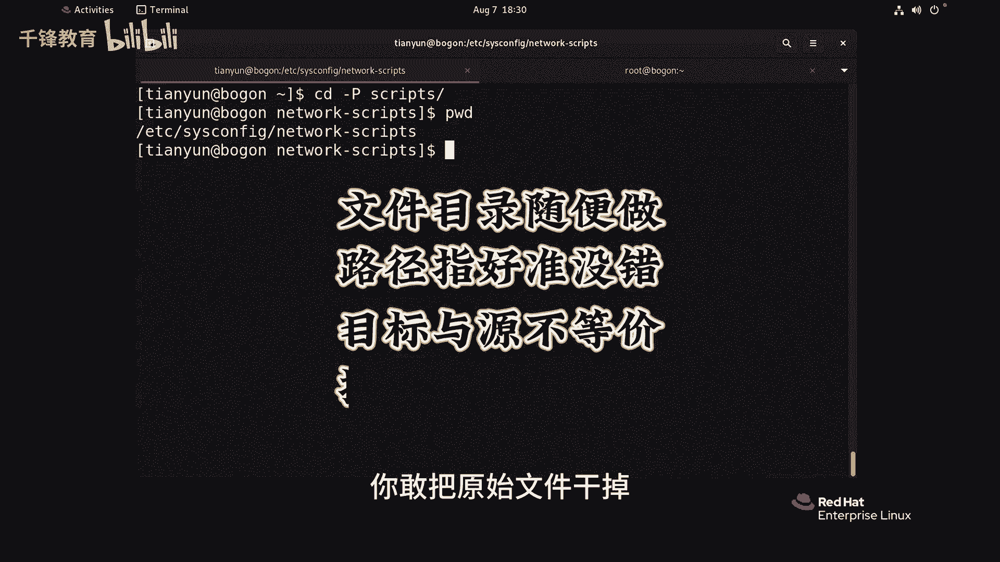

# Linux文件管理：021：文件链接-软链接 🔗


在本节课中，我们将要学习Linux系统中的一种重要文件类型——软链接（符号链接）。我们将了解它的创建方法、特点、与硬链接的区别，以及使用时的注意事项。

---

## 软链接的概念与创建

上一节我们介绍了硬链接，本节中我们来看看软链接。软链接，也称为符号链接，它更像Windows系统中的“快捷方式”。软链接是一个独立的文件，其内容存储的是目标文件的路径。

创建软链接的命令是 `ln -s`。以下是创建软链接的基本语法：

```bash
ln -s [源文件或目录] [链接文件名]
```

例如，我们有一个文件 `zhuzhuxia.txt`，可以为其创建一个名为 `s_zhuzhuxia` 的软链接：

```bash
ln -s zhuzhuxia.txt s_zhuzhuxia
```

使用 `ls -li` 命令查看，可以看到软链接文件在权限标识位以字母 `l` 开头，并且颜色通常为淡蓝色，清晰地指明了它指向的目标文件。

---

## 软链接与硬链接的核心区别

理解软链接与硬链接的区别至关重要。以下是两者的核心对比：

*   **本质不同**：硬链接是同一个文件的多个别名，共享相同的inode和数据块。软链接是一个独立的文件，拥有自己的inode，其内容是指向目标文件的路径。
*   **链接数影响**：创建硬链接会增加原始文件的链接计数。创建软链接**不会**增加原始文件的链接计数。
*   **跨文件系统**：硬链接不能跨文件系统创建。软链接可以指向任何位置，包括其他文件系统上的文件或目录。
*   **指向目录**：硬链接通常不能指向目录（超级用户在某些系统下可以，但不推荐）。软链接可以自由地指向文件或目录。
*   **删除原始文件的影响**：删除硬链接的原始文件，只要链接数不为0，数据依然可通过其他硬链接访问。删除软链接的原始文件，会导致软链接失效，成为“悬空链接”。

---

## 软链接的实践与特性演示

让我们通过一些实际操作来深入理解软链接的特性。

### 指向文件的软链接

首先，我们为文件创建一个软链接并观察其行为。

```bash
# 创建源文件
echo “Yangge Content” > zhuzhuxia.txt
# 创建软链接
ln -s zhuzhuxia.txt s_zhuzhuxia
# 查看链接详情
ls -li zhuzhuxia.txt s_zhuzhuxia
```

可以看到两个文件的inode编号不同，`s_zhuzhuxia` 的文件类型标记为 `l`。

### 指向目录的软链接

软链接也可以指向目录，这非常有用。

```bash
# 创建一个目录
mkdir dir1
# 为目录创建软链接
ln -s dir1 link_to_dir1
# 查看
ls -ld link_to_dir1  # 使用 -d 选项查看目录链接本身的信息
```

### 悬空链接与“复活”

这是软链接的一个关键特性。如果删除了软链接指向的原始文件，软链接就会失效。

```bash
# 删除原始文件
rm zhuzhuxia.txt
# 此时查看软链接，其会显示特殊的颜色（如红色闪烁）提示链接失效
ls -l s_zhuzhuxia
# 尝试访问会报错
cat s_zhuzhuxia  # 提示 “No such file or directory”
```

此时，`s_zhuzhuxia` 就是一个“悬空链接”。有趣的是，如果在同一路径下**新建一个同名文件**，这个软链接会立刻“指向”这个新文件，而不再悬空。

```bash
# 新建一个同名但内容不同的文件
echo “New Content 111” > zhuzhuxia.txt
# 再次访问软链接
cat s_zhuzhuxia  # 此时会输出 “New Content 111”
```

软链接会忠实地指向当前路径下名为 `zhuzhuxia.txt` 的文件，无论它是不是最初的那个文件。

---

## 访问目录软链接的路径问题

当使用软链接进入一个目录时，需要注意当前路径的含义。

```bash
# 创建一个指向 /etc/sysconfig/network-scripts 的软链接
ln -s /etc/sysconfig/network-scripts scripts
# 进入软链接
cd scripts
pwd  # 显示可能是 /home/yourname/scripts
```

此时 `pwd` 命令显示的是**软链接本身的路径**。如果想直接切换到**原始目标目录的真实物理路径**，可以使用 `cd -P` 命令。

```bash
cd -P scripts
pwd  # 显示为 /etc/sysconfig/network-scripts
```

这里的 `-P`（Physical）选项会让 `cd` 命令解析所有符号链接，直接进入实际的物理目录。

---

## 使用建议与总结

本节课中我们一起学习了Linux软链接的方方面面。以下是关于软链接使用的核心建议：

*   **使用绝对路径**：创建软链接时，**尽量使用源文件或目录的绝对路径**。这样可以避免在移动软链接本身后，出现链接失效的问题。
*   **理解其独立性**：牢记软链接是一个独立的文件。删除原始文件会导致链接失效，但删除软链接本身对原始文件毫无影响。
*   **灵活运用**：软链接的灵活性极高，可以用于简化长路径访问、版本切换、配置文件集中管理等场景。



**总结**：软链接（`ln -s`）通过存储目标路径来创建文件的快捷方式。它支持跨文件系统和指向目录，使用灵活。但其与目标文件是松耦合关系，目标文件被删除会导致链接悬空，这是与硬链接最根本的区别。正确理解和使用软链接，能极大提升Linux系统管理的效率。