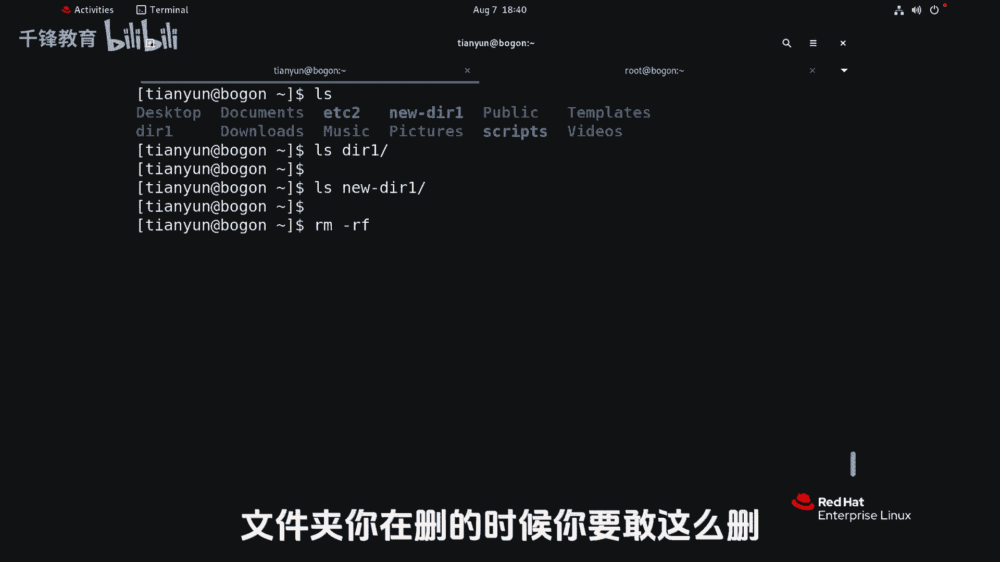
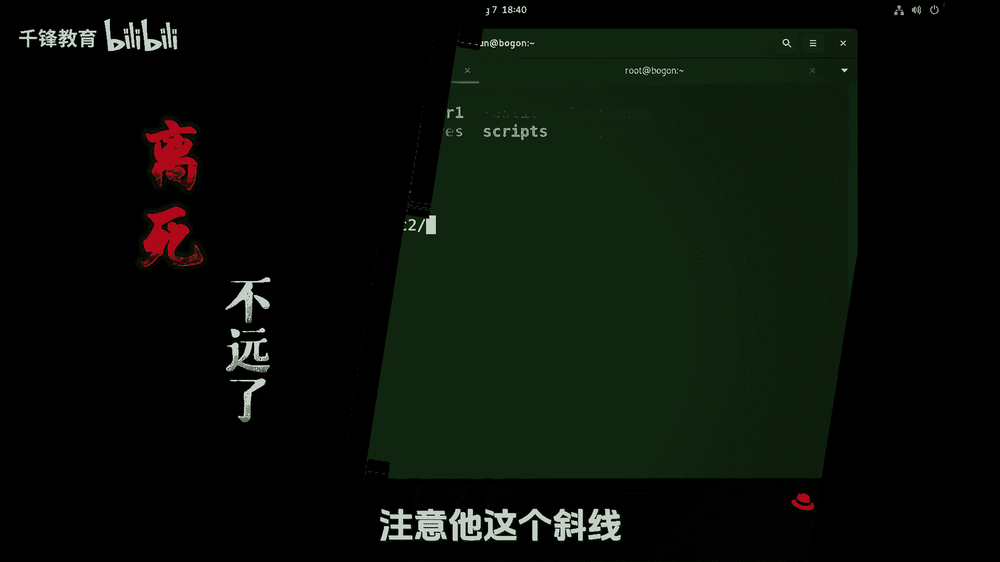
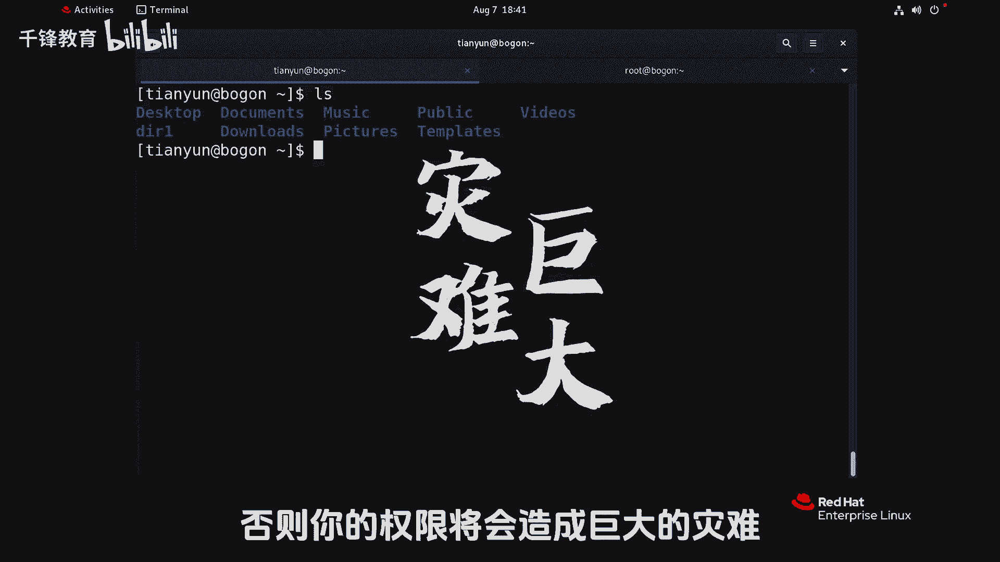
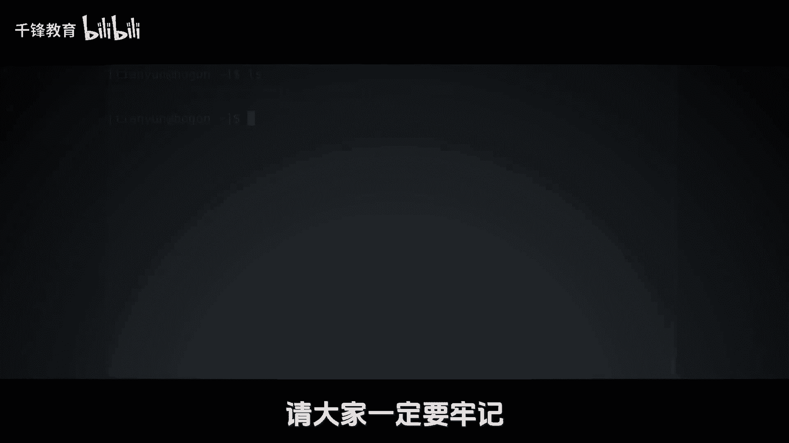

Linux入门教程：022：软链接的灾难 🚨


在本节课中，我们将要学习一个关于Linux软链接（符号链接）的重要且危险的细节。如果不了解这一点，可能会在删除操作中造成灾难性的后果，导致重要数据丢失。


上一节我们介绍了软链接的基本概念和创建方法，本节中我们来看看删除软链接目录时需要特别注意的关键事项。

### 软链接删除的风险演示

首先，软链接可以指向文件，也可以指向目录，并且能够跨文件系统创建。例如，我们可以创建一个指向 `/etc` 目录的软链接。

```bash
ln -s /etc ec2
```

执行 `ls -l` 命令查看，可以看到 `ec2` 是一个指向 `/etc` 的软链接。

```bash
ls -l ec2
```

现在，问题来了：如何删除这个软链接 `ec2`？一个常见的错误是直接使用 `rm -rf` 命令并加上路径。

以下是错误删除软链接目录的步骤和后果：

1.  创建一个测试目录 `test_dir` 并放入一些文件。
2.  为该目录创建一个软链接 `link_to_test`。
3.  尝试使用 `rm -rf link_to_test/`（注意结尾的斜杠 `/`）来删除。

```bash
# 创建测试目录和文件
mkdir test_dir
echo "important data" > test_dir/file1.txt

# 创建软链接
ln -s test_dir link_to_test

# 危险操作：错误地删除软链接
rm -rf link_to_test/
```

执行上述危险命令后，你会发现软链接 `link_to_test` 本身似乎还在，但原本的 `test_dir` 目录下的所有内容已经被清空了。这是因为命令末尾的斜杠 `/` 导致系统不是删除软链接本身，而是**进入了软链接所指向的真实目录，并删除其中的所有内容**。



### 如何正确删除软链接

因此，删除指向目录的软链接时，必须确保命令路径**末尾没有斜杠**。



以下是正确删除软链接的方法：

1.  删除软链接时，直接使用其名称，不要附加斜杠。
2.  使用 `rm` 命令时，`-r` 参数对于删除软链接本身通常不是必需的，但习惯上使用 `-rf` 也无妨，关键是路径格式。

```bash
# 正确方法：删除软链接本身
rm -rf link_to_test
# 或者
rm link_to_test
```

执行这个命令后，软链接 `link_to_test` 被移除，而原始目录 `test_dir` 及其内容完好无损。

### 核心要点总结



本节课中我们一起学习了软链接删除操作中的“灾难”场景及其避免方法。

*   **灾难原因**：在删除指向目录的软链接时，如果在路径末尾添加了斜杠 `/`，例如 `rm -rf linkname/`，系统会将其解析为删除**软链接目标目录下的所有内容**，而非删除软链接文件本身。
*   **正确做法**：删除软链接时，使用 `rm linkname` 或 `rm -f linkname`，确保路径末尾**没有斜杠**。
*   **特别警告**：对于系统关键目录（如 `/etc`, `/home`）的软链接，如果以root权限执行了错误删除命令，后果将是毁灭性的。操作时必须格外小心。



记住这个简单的规则：**处理软链接，尤其是目录软链接时，路径末尾的斜杠是区分“删除链接本身”还是“删除链接内容”的关键**。养成好习惯，避免数据损失。