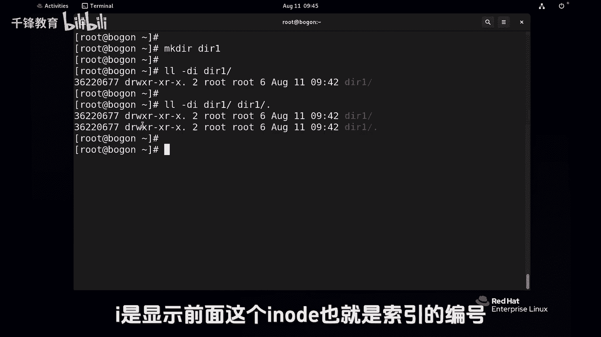

# Linux入门教程：P23：为什么根目录的链接次数是18？


## 概述
在本节课中，我们将探讨一个Linux文件系统的细节问题：为什么根目录的链接次数显示为18？我们将通过分析目录结构中的`.`和`..`链接来理解这个数字的含义。

---

## 目录链接次数的基本概念
上一节我们介绍了`ls -l`命令可以查看文件的详细信息。本节中我们来看看当这个命令用于目录时，第二列的数字代表什么。

这个数字表示该目录的**硬链接数**。对于文件，它表示有多少个文件名指向同一个数据块。对于目录，这个数字与目录内的特殊条目`.`和`..`有关。

**核心公式**：一个目录的默认链接数 = 2 + (其直接子目录的数量，这些子目录的`..`指向它)。

---

## 分析根目录的链接
执行命令`ls -ld /`可以查看根目录的详细信息。注意观察第二列的数字，它显示为18。

根目录下默认存在一些子目录。每个子目录内部都有两个特殊条目：
*   `.`：代表当前目录本身。
*   `..`：代表上一级目录（父目录）。

以下是根目录下所有子目录的`..`条目信息，它们都指向根目录：
```
ls -ld / /.. /. /afs/.. /boot/.. /dev/.. /etc/.. /home/.. /media/.. /opt/.. /root/.. /run/.. /srv/.. /tmp/.. /usr/.. /var/..
```
你会发现，所有这些命令输出的inode编号（第一列数字）都是相同的（例如128），证明它们指向同一个数据块——根目录。

如果我们统计一下上述命令列出的条目数量，会发现是19个。但根目录显示的链接数却是18。这是因为根目录比较特殊，其自身的`.`条目在统计链接数时不被计算在内。因此，有效的链接是：根目录自身（1个） + 根目录下的`..`（1个） + 所有子目录的`..`（16个） = 18个。

---

## 通过实验验证
我们可以通过创建和删除目录来动态观察根目录链接数的变化。

1.  **创建目录**：在根目录下创建一个新目录`/dir1`。
    ```
    mkdir /dir1
    ls -ld /
    ```
    此时根目录的链接数会从18变为19。因为`/dir1`目录下的`..`条目也指向了根目录，增加了一个硬链接。

2.  **删除目录**：删除刚才创建的目录。
    ```
    rmdir /dir1
    ls -ld /
    ```
    根目录的链接数又从19变回了18。

3.  **查看普通目录**：新建一个目录并查看其链接数。
    ```
    mkdir dir2
    ls -ldi dir2
    ```
    一个新创建的、空的目录，其链接数默认是2。这两个链接分别是：
    *   目录本身（`dir2`）
    *   目录内的`.`条目（`dir2/.`）

    如果在这个目录下创建子目录，其链接数会增加，因为子目录的`..`会指向它。

---

## 总结
本节课中我们一起学习了Linux目录链接次数的奥秘。

*   目录的链接数反映了指向该目录的硬链接总数，主要与特殊目录`.`和`..`相关。
*   根目录的链接数初始为18，这来源于其自身（1）、其下的`..`（1）以及所有一级子目录的`..`指向（16）。
*   普通空目录的默认链接数是2（自身和`.`）。
*   虽然用户不能直接为目录创建硬链接，但系统通过`.`和`..`机制在内部维护着目录间的链接关系。



理解这个概念有助于你更深入地认识Linux文件系统的树形结构是如何在底层通过链接组织起来的。