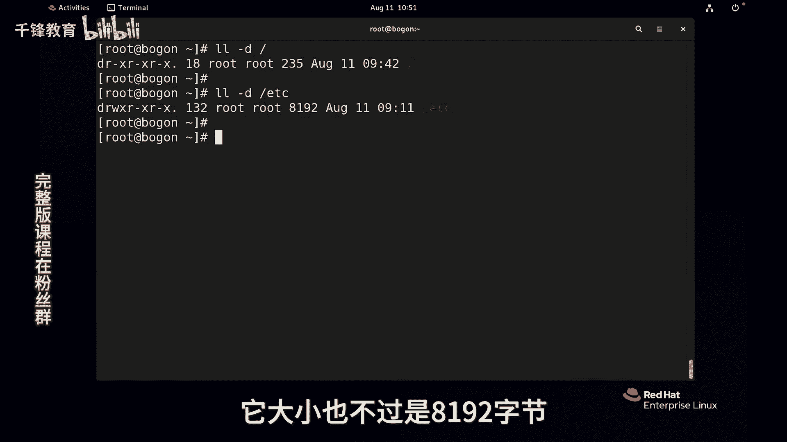
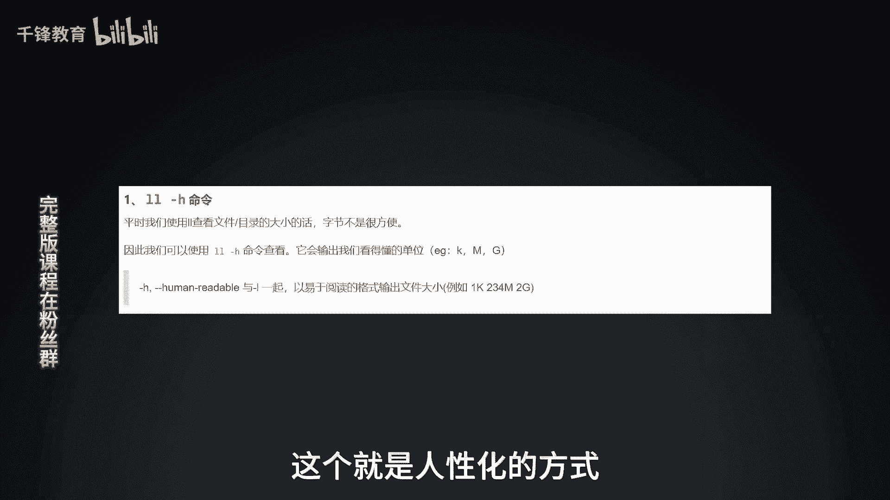
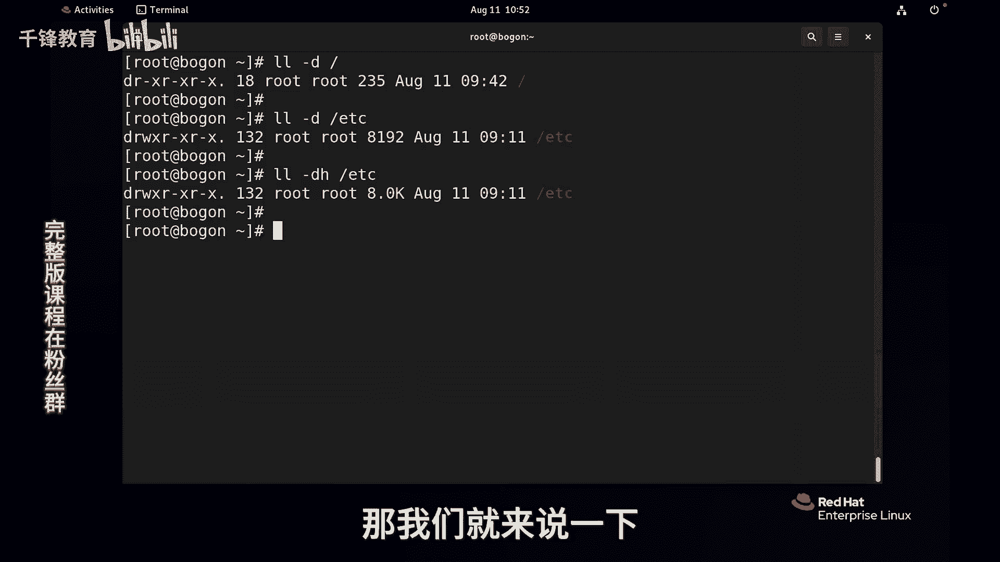
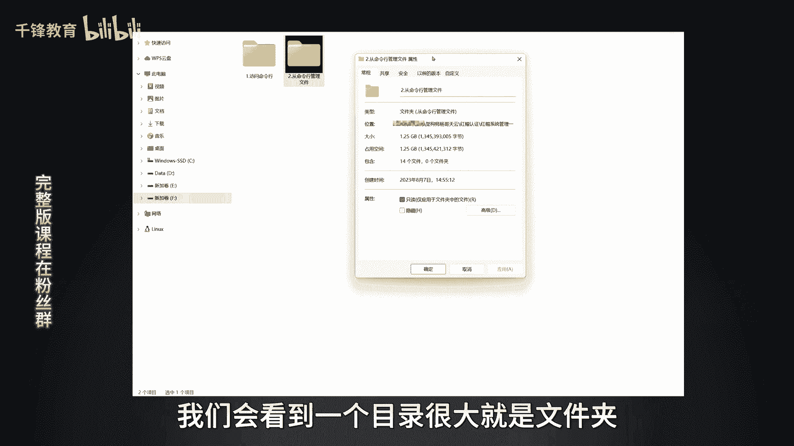
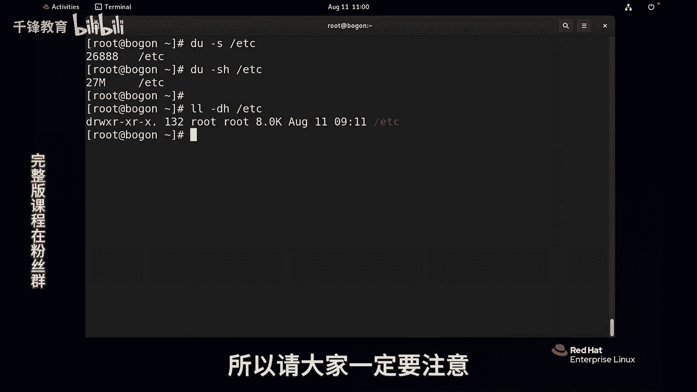

# Linux文件管理：0.24：为什么目录反而没有文件大？ 📁




在本节课中，我们将要学习一个Linux文件系统中看似矛盾的现象：为什么一个目录（文件夹）的大小，看起来比它里面存放的文件还要小。我们将深入探讨目录的本质，并学习如何正确查看目录及其内容的大小。



---



上一节我们介绍了文件的基本属性和查看方法，本节中我们来看看目录的特殊性。



在Linux中，使用 `ls -ld` 命令查看根目录 `/` 时，会发现它的大小仅为235字节。同样，查看 `/etc` 目录，其大小也仅为8192字节（8KB）。这与我们通常认为的“目录包含所有文件，所以应该很大”的直觉相悖。

**核心概念**：在Linux中，一切皆文件，目录本身也是一个特殊的文件。

这个目录文件里存储的并不是其下属文件的实际数据内容。那么，它存储的是什么呢？

---

目录文件内部存储的是一个列表，这个列表记录了其直接子级的**文件名**和对应的**inode编号**。这类似于一本书的目录页，目录页本身只记录了章节标题和对应的页码，并不包含章节的具体内容。

我们可以通过命令查看目录文件的内容列表（注意：这不是文件数据，而是目录条目）：
```bash
ls -i /etc | less
```
这个命令会列出 `/etc` 目录下所有文件的文件名和其inode号。目录文件本身的大小，就是存储这些“文件名-inode号”映射条目所占用的空间，因此通常很小。

---

如果想要查看一个目录连同其下所有文件和子目录的总大小（即我们通常理解的“文件夹大小”），需要使用 `du` 命令。

以下是 `du` 命令的常用方法：
*   **查看目录总大小**：使用 `-s` 选项汇总，`-h` 选项以人类可读格式显示。
    ```bash
    du -sh /etc
    ```
*   **查看目录下各项目大小**：不加 `-s` 选项，会列出目录内每一项的大小。
    ```bash
    du -h /etc
    ```

例如，执行 `du -sh /etc` 可能会显示27M，这表示 `/etc` 目录及其所有内容总共占用27MB的磁盘空间。而之前用 `ls -ld` 看到的8KB，仅仅是目录文件自身（即那个“目录页”）的大小。

---



本节课中我们一起学习了Linux目录的本质。目录本身是一个特殊的文件，仅存储其直接子项的文件名和inode映射表，因此其自身大小很小。要获取目录及其内容的实际磁盘占用总大小，应使用 `du -sh` 命令。理解这一点有助于澄清“目录大小”的常见误解。