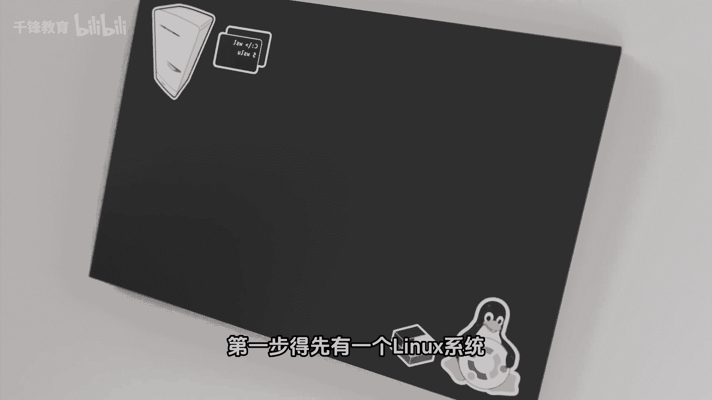
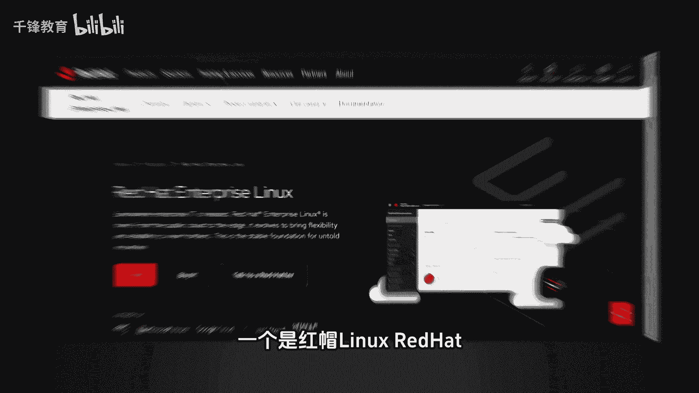
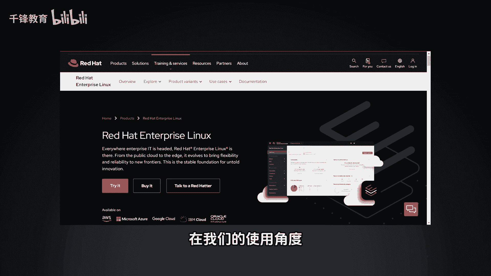
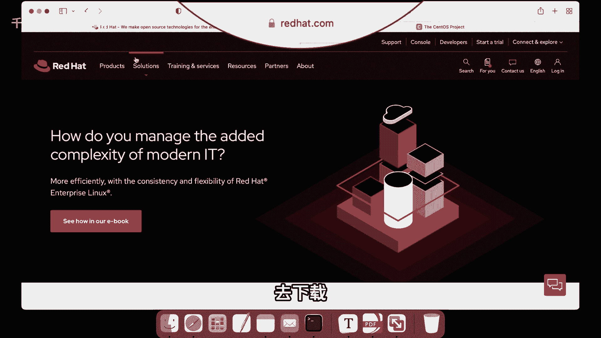
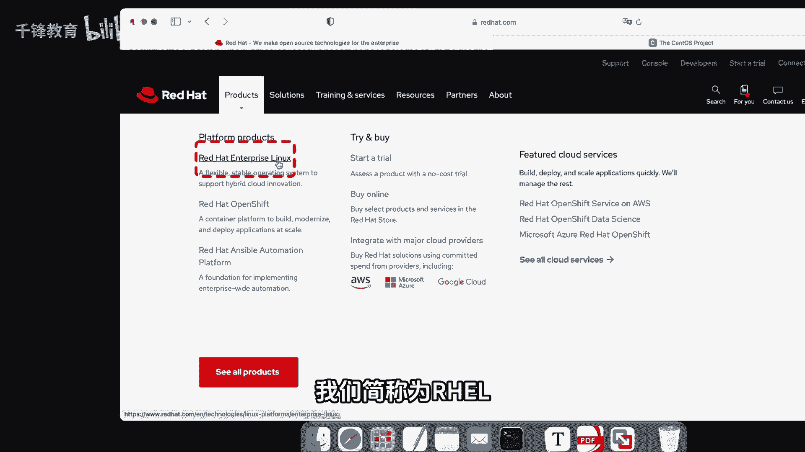
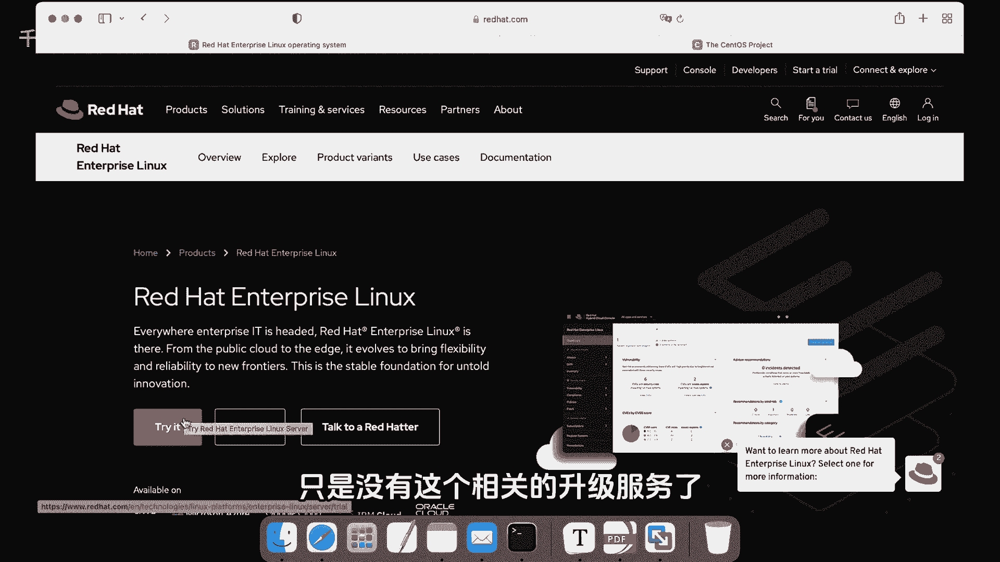
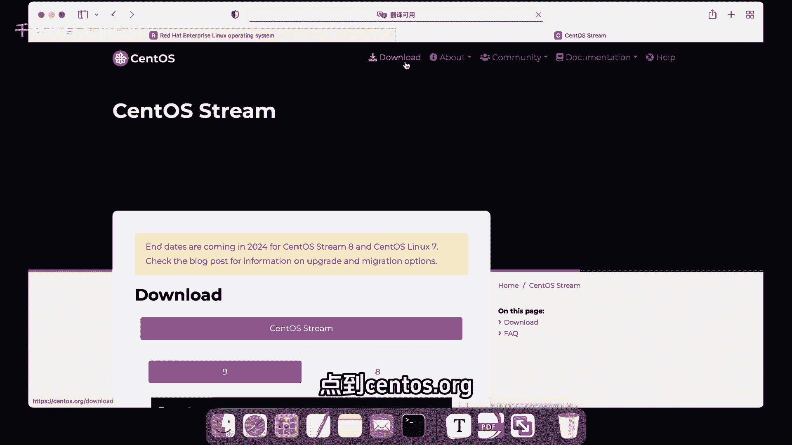
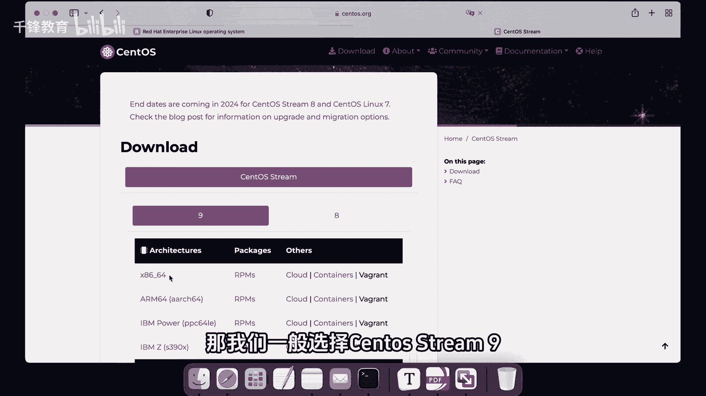
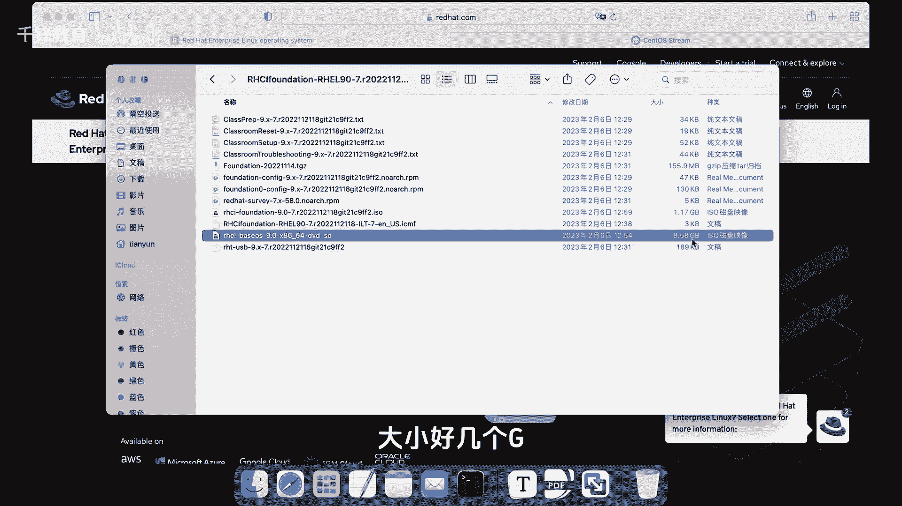

# Linux云计算入门：002：Linux系统安装包 🐧

在本节课中，我们将要学习如何获取Linux操作系统，这是学习Linux的第一步。我们将介绍两种主流的Linux发行版，并详细说明如何下载它们。

---

上一节我们介绍了学习Linux的必要性，本节中我们来看看如何获取一个Linux系统。在学习Linux之前，我们首先需要有一个Linux系统环境。

这里有两款主流的Linux发行版：
*   **红帽企业版Linux**：简称为 **RHEL**。
*   **CentOS Stream**：这是CentOS Linux的后续版本。

这两者在日常使用角度上基本没有太大区别，初学者可以任选其一进行学习。但需要注意的是，若最终目标是参加红帽认证RHCE考试，则必须使用红帽企业版。

---

上一节我们了解了两种选择，本节中我们来看看如何获取红帽企业版Linux。如果你选择使用红帽企业版，首先需要访问其官方网站。

以下是获取RHEL的步骤：
1.  访问红帽官方网站 `redhat.com`。
2.  在产品列表中找到并点击 **Red Hat Enterprise Linux**。
3.  你可以选择购买或申请60天的试用版。试用期结束后，系统仍可继续使用，但无法获得官方的更新和技术支持服务。

---

上一节介绍了从官方获取RHEL的方法，本节中我们来看看另一种便捷的获取方式。如果你觉得从红帽官网下载流程较为复杂，也可以选择从社区镜像站点下载。

以下是替代方案：
1.  访问社区镜像站点，例如 `centos.org`。
2.  该站点提供RHEL的重建版本，如版本8和版本9。我们一般选择最新的 **版本9** 进行下载。

此外，课程也已为大家准备好了RHEL 9.0版本的安装镜像文件，大小约为几个GB。如果需要，可以向讲师获取。

---

本节课中我们一起学习了如何获取Linux系统的安装包。我们认识了两款主流的Linux发行版：**RHEL** 和 **CentOS Stream**，并详细介绍了通过官方网站和社区镜像两种方式下载RHEL系统的方法。准备好系统安装包是搭建学习环境的第一步。