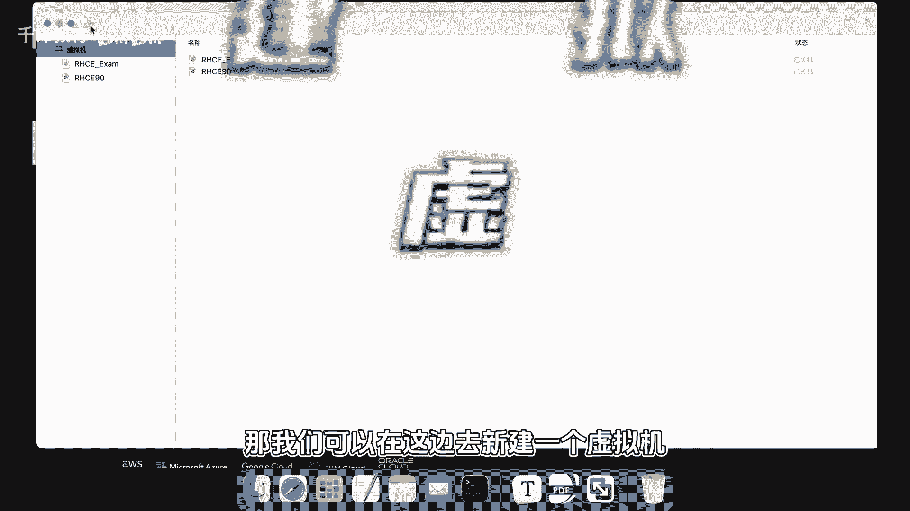
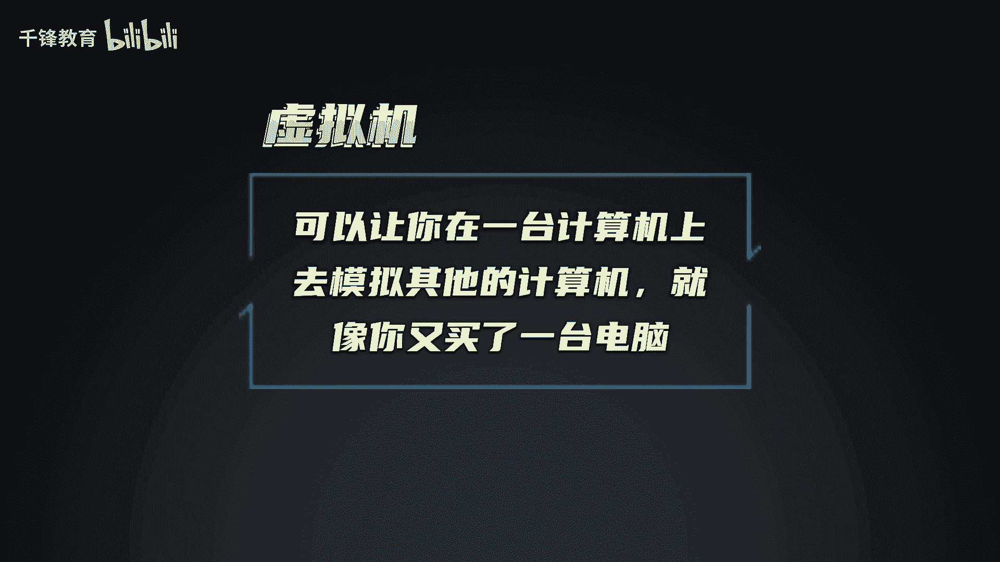
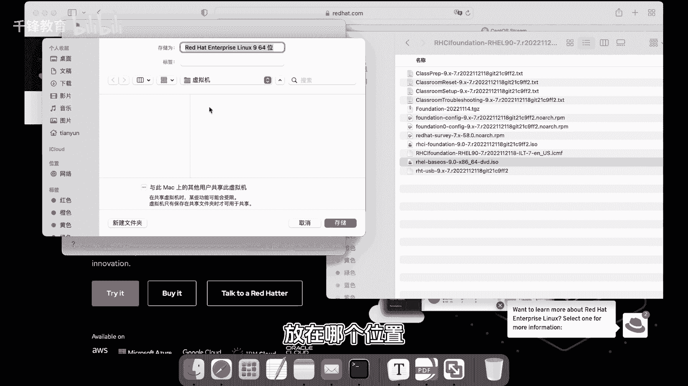
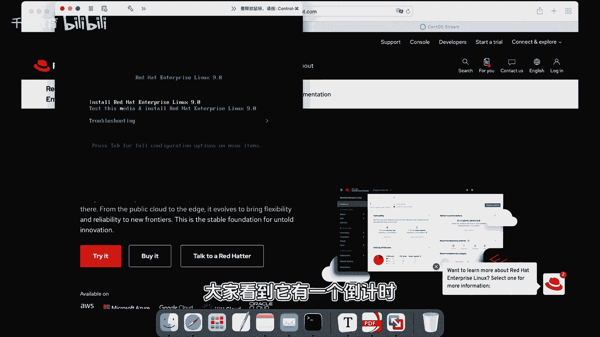
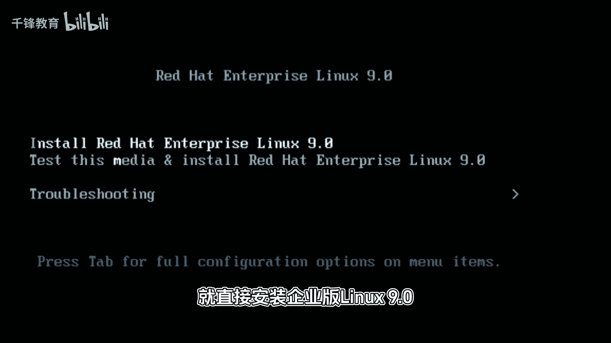
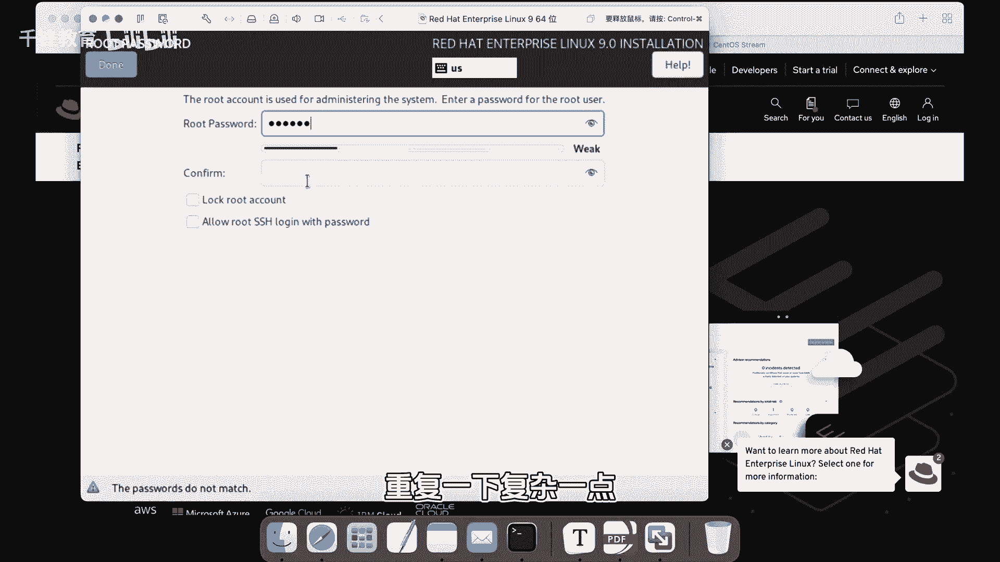
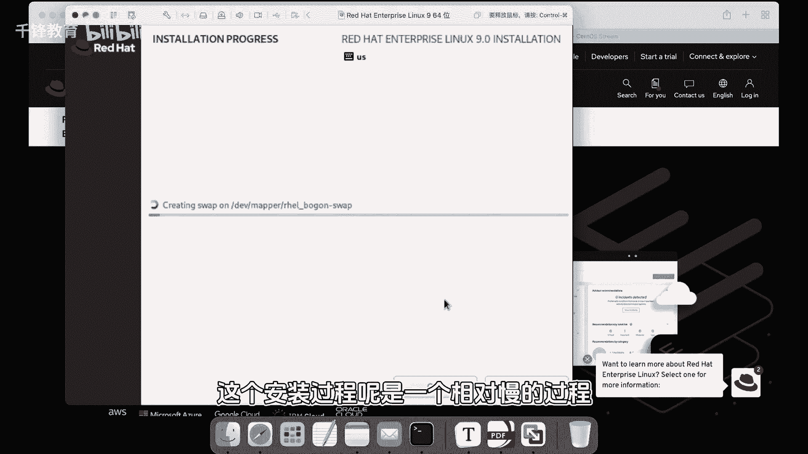

# Linux云计算入门：P3：003.Linux系统安装 💻




在本节课中，我们将要学习如何在虚拟机中安装一个Linux操作系统。这是学习Linux的第一步，我们将使用红帽企业版Linux 9作为示例，详细讲解从创建虚拟机到完成系统安装的每一个步骤。



## 概述

虚拟机软件允许你在一台物理计算机上模拟出另一台完整的计算机。这为我们学习Linux提供了一个安全、便捷的环境，无需准备额外的硬件设备。本节教程将引导你完成整个安装流程。



## 安装步骤



### 1. 创建虚拟机



首先，我们需要在虚拟机软件中创建一个新的虚拟机。这个过程就像组装一台新电脑，我们需要为其指定安装镜像文件。

以下是创建虚拟机的基本步骤：
*   选择“新建虚拟机”。
*   将下载好的红帽Linux 9 ISO镜像文件关联到虚拟机。
*   在安装方式选择中，不使用快捷安装，以便进行自定义配置。
*   虚拟机的名称、存储位置等参数均可使用默认设置。
*   完成创建后，启动虚拟机。

### 2. 启动与初始设置

虚拟机启动后，会进入安装引导界面。我们将开始进行系统的初始配置。

以下是初始设置的关键选择：
*   在启动菜单中，选择第一项“安装红帽企业版Linux 9”，跳过媒体测试。
*   语言环境选择“英语”。对于服务器系统，使用英文环境可以避免后续可能出现的字符显示异常问题。
*   键盘布局等其他设置保持默认即可。

### 3. 系统配置

接下来，我们需要对即将安装的系统进行关键配置，包括分区、软件选择和用户设置。

以下是核心的系统配置项：

**安装目的地（分区）**
对于初学者，建议使用自动分区。点击“安装目的地”，然后直接点击“完成”即可，安装程序会自动为你规划好磁盘分区。

**软件选择**
这里决定了系统安装后包含哪些功能。主要选项有：
*   **带GUI的服务器**：安装图形化桌面界面。
*   **服务器**：仅安装命令行界面，没有图形桌面。
为了保持系统轻量高效，本教程选择“服务器”模式。图形化界面可以在后期需要时再安装。




**网络和主机名**
网络配置可以保持默认，安装程序通常会启用网络连接。

**根密码设置**
`root`是Linux系统中权限最高的管理员账户，相当于Windows的`Administrator`。为其设置一个强密码至关重要。

**密码强度公式**：`强密码 = 大写字母 + 小写字母 + 数字 + 特殊符号`

在生产环境中，简单的密码会带来严重的安全风险。示例如下：
```bash
# 这是一个弱密码示例（请勿使用）
password123

# 这是一个强密码示例（仅为格式示范）
R3dH@t2024!
```

**创建用户**
系统会提示你创建一个普通用户。日常操作应使用普通账户，而非直接使用`root`账户，以降低误操作风险。创建用户时需要设置用户名和密码。

### 4. 开始安装



完成以上所有配置后，点击“开始安装”按钮。系统安装过程需要一些时间，请耐心等待。安装完成后，系统会提示重启。


## 总结


本节课中我们一起学习了在虚拟机中安装Linux系统的完整流程。我们掌握了创建虚拟机、选择安装选项、配置系统分区、设置`root`密码以及创建普通用户等关键步骤。记住，对于初学者，在分区时选择自动分区，在软件选择时使用“服务器”模式，是快速上手的有效方法。安装完成后，我们就拥有了一个可以开始学习和实验的Linux环境。