# Linux入门与红帽认证：004：Root账号与普通管理员账号登录 🔑


在本节课中，我们将学习如何登录Linux系统，并理解超级管理员（root）账号与普通用户账号的区别。这是后续所有命令行操作的基础。

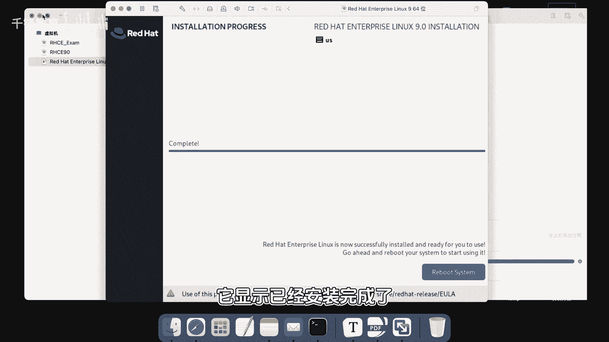

---

我们继续学习红帽Linux。虚拟机安装完成后，我们直接双击打开它。

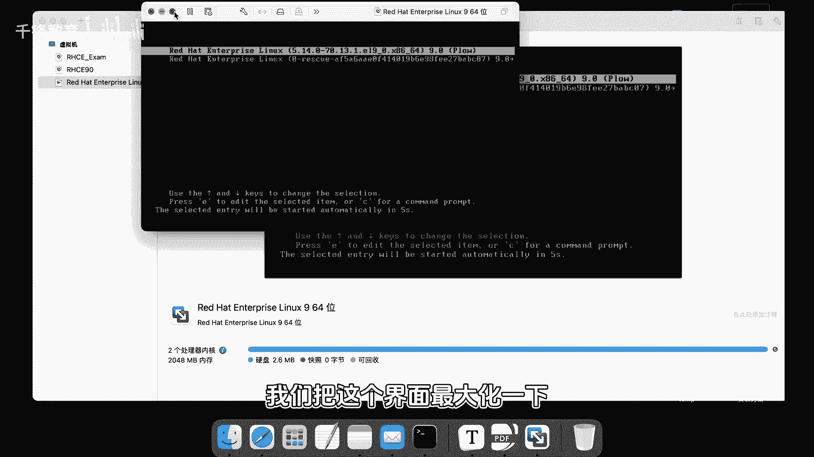


系统显示已经安装完成。我们可以直接点击“Reboot”按钮来重启系统。


重启后，我们将登录界面最大化。

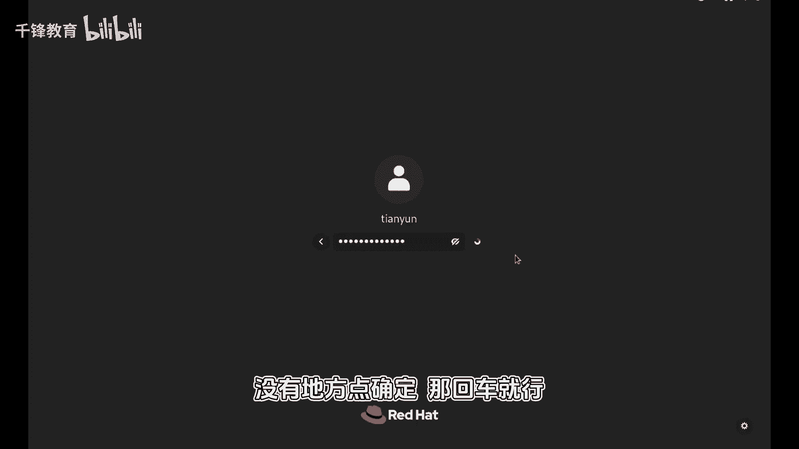


界面上列出了可登录的用户。大家还记得我们创建了两个账号：一个是**root**账号（超级管理员），另一个是我们自己创建的普通账号**tianyun**。界面上方有“关机”、“暂停”、“重启”等选项。下方有一个“Not listed?”选项，用于登录未显示在列表中的账号。例如，如果你想用root账号登录，就需要点击这里。

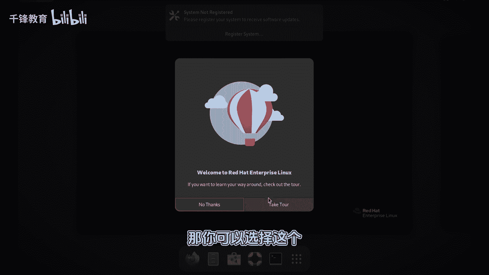

接下来，我们将分别使用这两个账号登录系统。首先使用普通账号**tianyun**登录，密码是**yangge**。输入密码后，按回车键即可登录。


登录成功后，会看到欢迎界面和一些初始设置选项。我们可以先跳过这些设置。如果你安装的是CentOS Stream，则不存在订阅服务注册的步骤。


进入图形化桌面后，可以看到一个类似苹果的界面，左上角有一只小鸟图标。界面上还有一个“终端”（Terminal）图标。我们后续的绝大部分操作都将在这个终端里，通过命令行来完成。

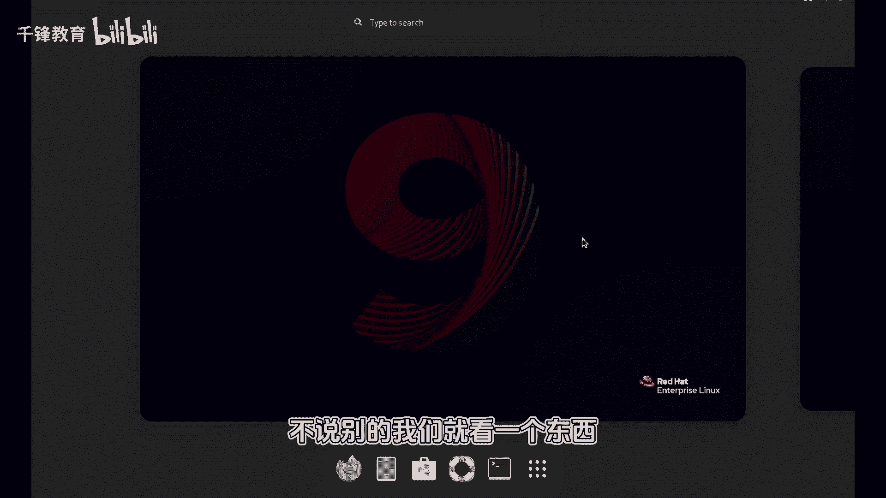

现在，我们点击打开终端。


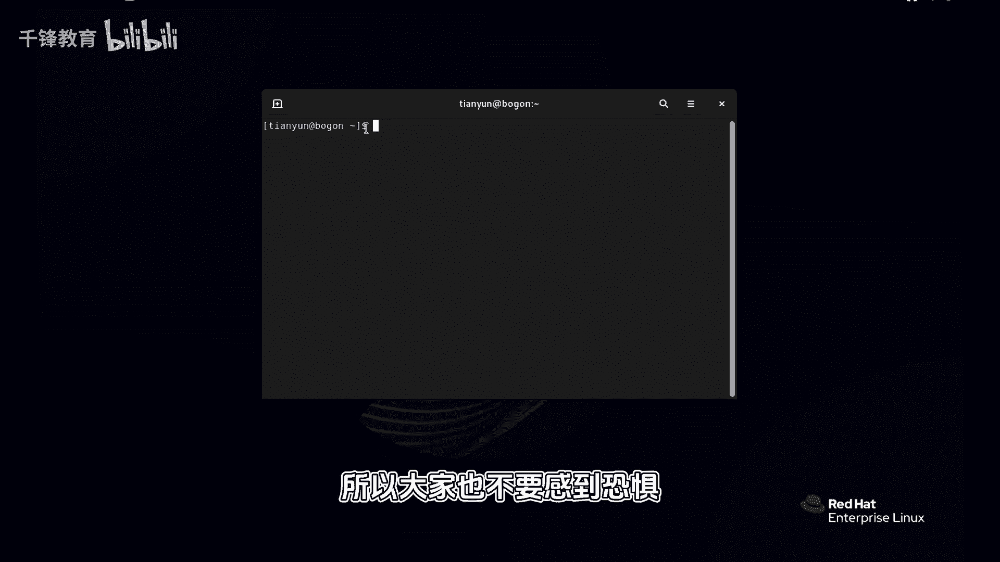

在终端窗口里，你会看到提示符 `[tianyun@localhost ~]$`。这里的 `tianyun` 是当前用户名，`$` 符号表示当前是**普通用户**权限。初学者暂时不需要理解其他部分的含义。

体验完普通用户界面后，我们登出系统，尝试用**root**账号登录。

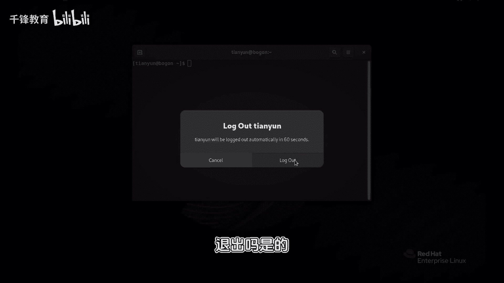


在登录界面点击“Not listed?”，然后输入用户名 **root** 和密码 **redhat** 进行登录。

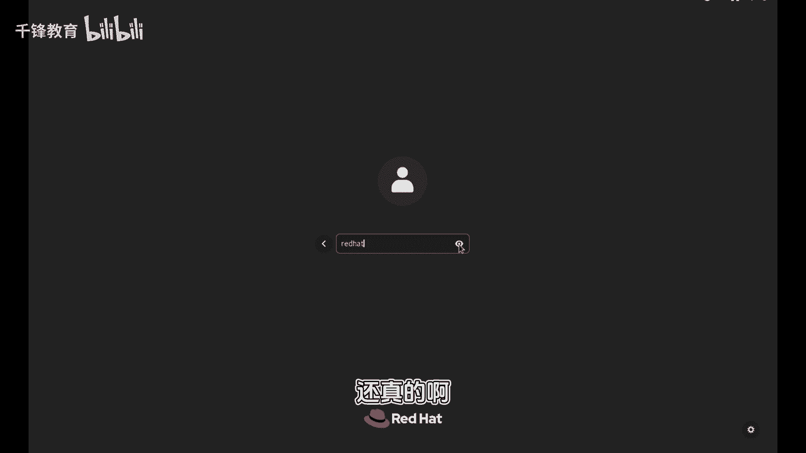


登录成功后，同样打开终端。

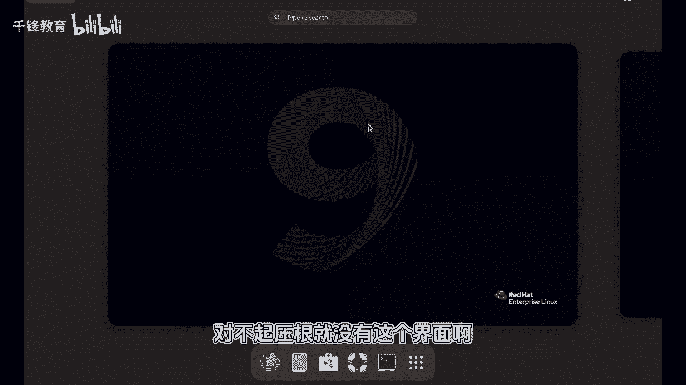


此时，终端的提示符变成了 `[root@localhost ~]#`。注意，这里的符号从 `$` 变成了 `#`。这是Linux中区分用户权限的重要标志：
*   **`$`** 符号代表**普通用户**权限。
*   **`#`** 符号代表**超级管理员（root）** 权限。

拥有 `#` 提示符意味着你拥有系统的最高权限，可以执行任何操作，包括一些危险的、能破坏系统的命令。因此，使用root账号时必须格外小心。

为了安全关机，我们可以在root用户的终端里输入命令：
```bash
poweroff
```
执行此命令后，系统将关闭。

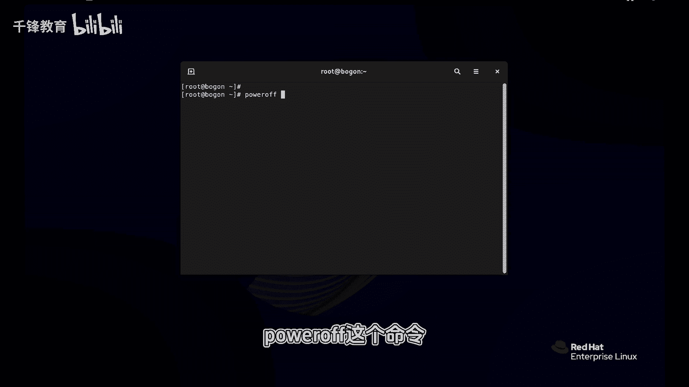

至此，系统安装和初次登录的体验就完成了。


---


上一节我们完成了系统安装，本节我们体验了两种账号的登录。为了便于后续可能进行的实验性操作，我们可以在虚拟机中为当前这个“纯净”的系统状态创建一个快照。


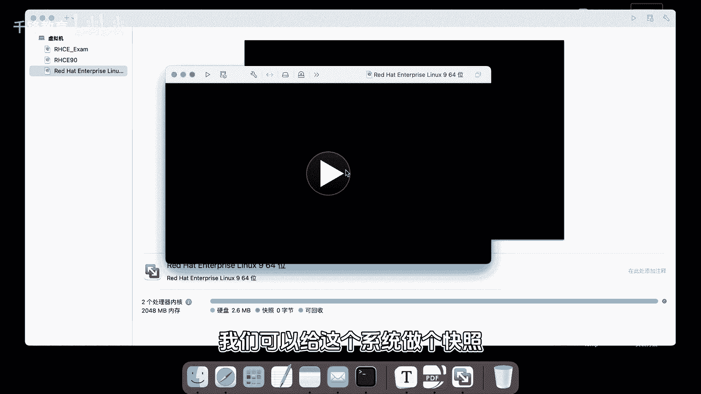

在VMware虚拟机软件中，可以使用“快照”功能为当前系统状态保存一个备份。这样，将来如果系统被意外修改，我们可以快速恢复到此刻的初始状态。这个功能是虚拟机软件提供的，与Linux系统本身无关。


创建好快照后，我们的准备工作就全部就绪了。

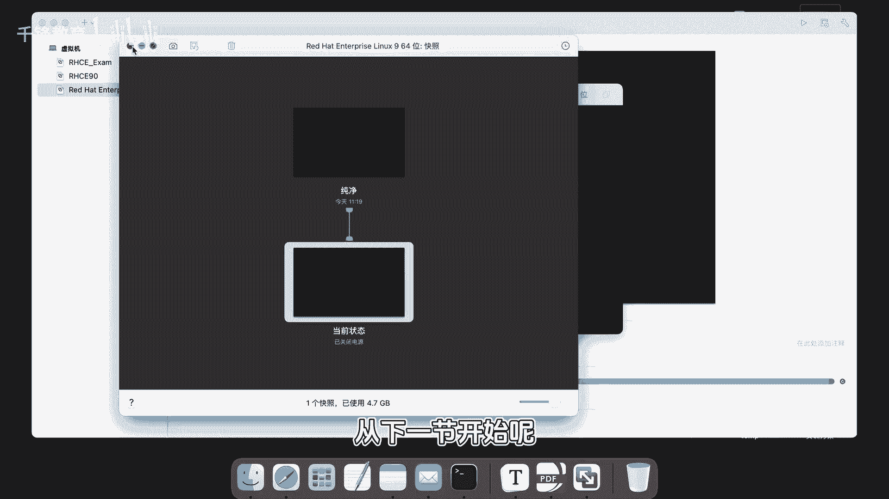


从下一节开始，我们将正式学习如何在Linux系统中使用各种命令来进行操作和管理。

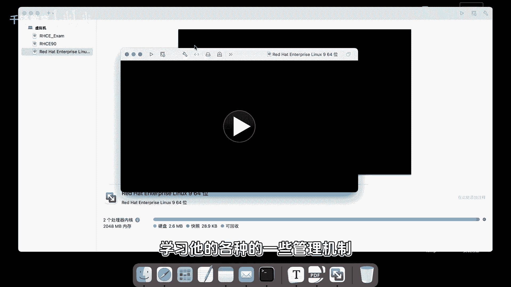

---


**本节课总结**
在本节课中，我们一起学习了：
1.  如何重启并登录Linux系统。
2.  区分了图形界面登录列表中的用户和“Not listed?”选项的用途。
3.  使用普通用户 **tianyun** 和超级管理员 **root** 账号分别登录系统。
4.  认识了终端（Terminal）并理解了提示符中 **`$`**（普通用户）和 **`#`**（root用户）的核心区别。
5.  使用 `poweroff` 命令关机。
6.  了解了为虚拟机创建快照的重要性，为后续学习做好准备。