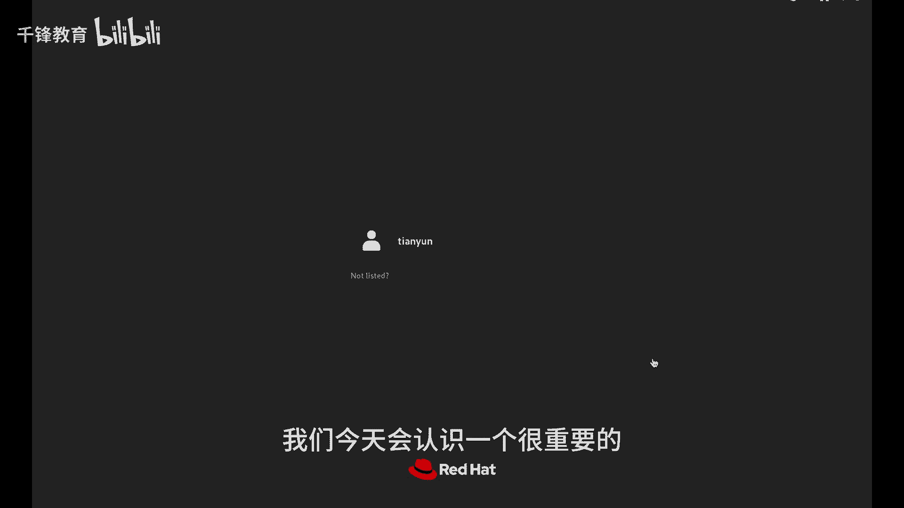
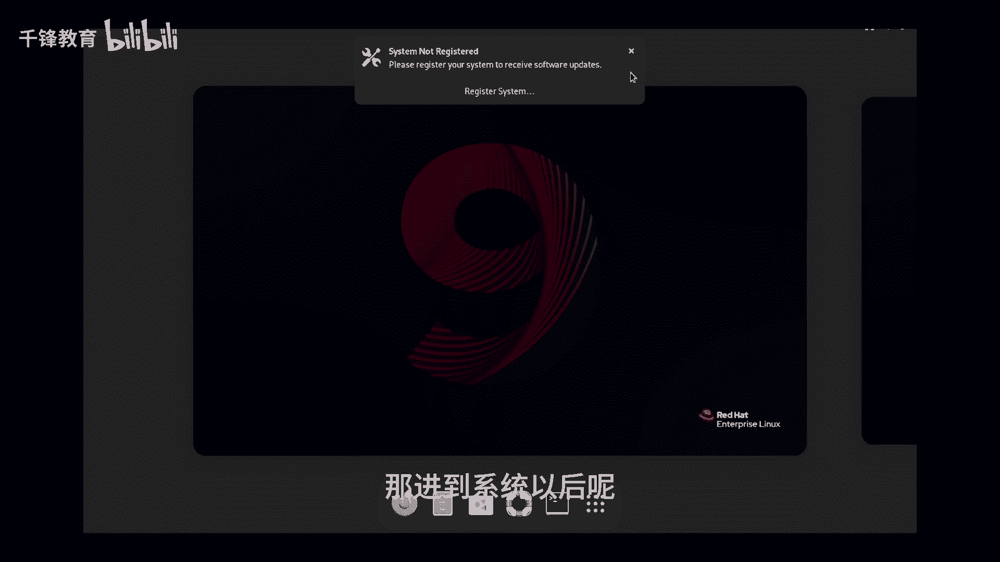
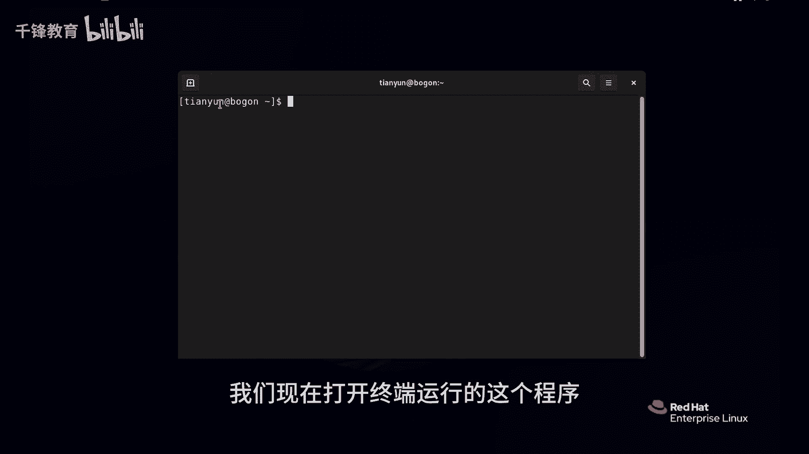
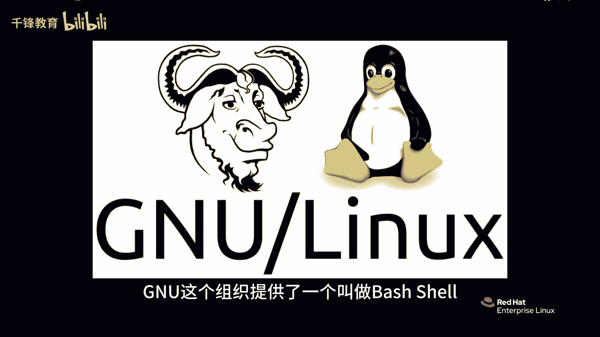
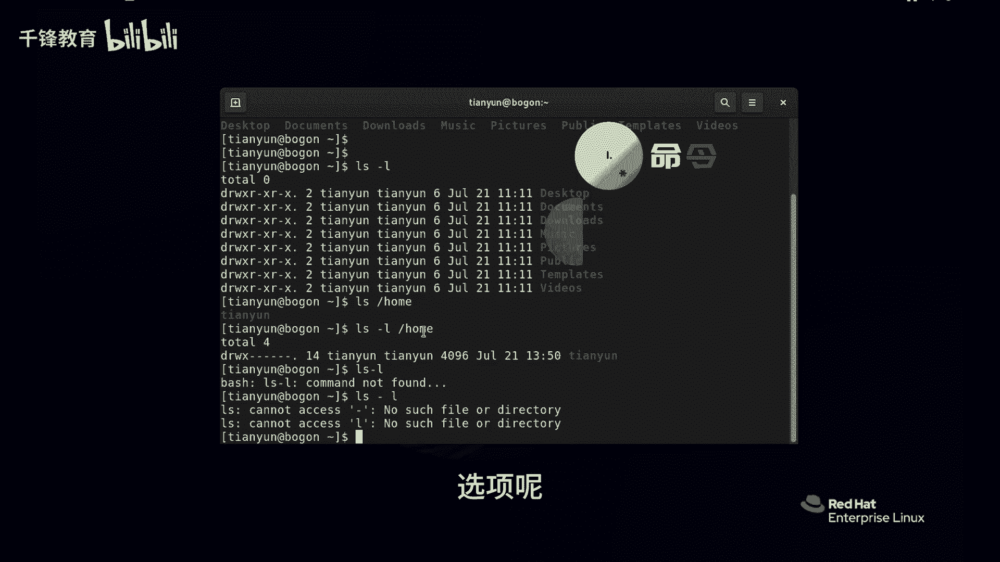

# Linux入门教程：005：Linux命令的组成 🐧


在本节课中，我们将要学习Linux命令行的核心组成部分。理解命令的结构是高效使用Linux的基础，我们将详细拆解命令、选项和参数的含义与用法。



## 认识Shell 🖥️



下面我们通过命令行的方式对Linux进行基本管理，因此需要认识一个重要的工具叫做shell。


我们使用普通用户登录系统。如果没有底边栏，可以点击上方“激活”位置。我们将借助终端进行操作。

终端可以进行一些简单操作，例如可以再打开一个小终端，也可以将终端窗口拉大。如果觉得字体太小，可以使用 `Ctrl` + `+`（加号）来放大字体。由于加号与等号在同一键位，需要按住 `Shift` + `+`。缩小字体使用 `Ctrl` + `-`。恢复标准大小使用 `Ctrl` + `0`。请注意这三个快捷键。

另外，新增一个终端也可以使用快捷键 `Ctrl` + `Shift` + `T`。这些操作仅针对终端界面，不会影响系统。但本节课的重点不是终端本身，而是终端里运行的程序。

这个程序叫做GNU组织提供的 **bash shell**。



## 什么是Shell？🔧



重点就是我们的shell。shell是什么呢？就是现在我们所运行的这个程序。shell程序主要提供两个功能：
1.  它为我们提供了一个输入命令的接口和界面。
2.  它会将命令传递给操作系统内核去执行，然后将结果输出到界面上。

我们今天使用的shell就是刚才提到的 **GNU bash shell**，有时简称为 **bash shell** 或 **bash**，它们是同一个意思。

## Shell界面解读 📟

大家首先要认识一下bash shell的整个界面。前面是一个美元符号 `$`，它代表当前用户的级别。在红帽Linux中主要有两种用户：
*   **管理员**：显示符号是 `#`。
*   **普通用户**：显示符号是 `$`。

`$` 符号前面是当前登录的用户名，接着是一个 `@` 符号，后面是主机名，第三个部分是当前所在的目录。例如 `[tianyun@localhost ~]$` 中，`tianyun` 是用户名，`localhost` 是主机名，`~` 是当前目录（主目录）。

在bash shell中，我们可以输入命令。例如，输入命令 `whoami`（我是谁），敲完回车后，shell会执行该命令并将结果输出到界面上，告诉我们当前用户是 `tianyun`。我们也可以使用 `date` 命令查看当前时间。

## 命令的组成 🧩

我要特别说明的是，在Linux中，我们运行的命令实际上分为三个部分：**命令**、**选项** 和 **参数**。

### 命令 (Command)

命令是主体，代表我们要执行的操作。例如，`ls` 是一个高频使用的命令，它的功能类似于用鼠标点开某个文件夹查看里面的内容。`ls` 是单词 “list” 的缩写。

### 选项 (Options)

选项用于微调命令的行为。它通常以 `-`（一个横线，短选项）或 `--`（两个横线，长选项）开头。短选项后跟一个简单字符，长选项后一般跟完整的英文单词。

例如，给 `ls` 命令加上 `-l` 选项：
```bash
ls -l
```
此时，文件的显示方式发生了变化，以类似Windows中“列表”或“详细信息”的形式显示，包含了文件大小、权限等更多信息。`-l` 是 “long”（长模式）的缩写，它改变了 `ls` 命令的显示行为，但核心的“查看”功能没有变。

### 参数 (Arguments)

参数是命令作用的对象。例如：
```bash
ls /home
```
这里，`/home` 就是一个参数，它指定了 `ls` 命令要查看的目标目录是 `/home`。

### 组合使用

我们可以将命令、选项和参数组合在一起使用：
```bash
ls -l /home
```
这条完整的命令包含了所有三个部分：命令 `ls`、选项 `-l`、参数 `/home`。

## 重要规则与常见错误 ⚠️

有一点要特别强调：**命令、选项和参数之间必须用空格隔开**。

以下是常见的错误示例：
*   `ls-l`：系统会认为 `ls-l` 是一个完整的命令名，结果自然是“命令未找到”。
*   `ls -l/home`：系统会将 `-l/home` 整体视为一个选项，而 `-l/home` 并不是一个有效选项，因此会报错或产生非预期结果。

很多初学者都会犯这样的错误，所以我花时间来强调。请记住：
*   **命令**是主体。
*   **选项**用于微调或改变命令的行为。
*   **参数**是命令作用的对象。



## 总结 📚


本节课中，我们一起学习了Linux命令行的核心结构。我们认识了shell作为用户与内核之间的桥梁，了解了bash shell的界面含义，并重点拆解了命令的三个组成部分：**命令**、**选项**和**参数**。掌握命令的正确格式（各部分用空格分隔）是后续学习所有Linux命令的基础。下一节，我们将开始学习一些最常用的基础命令。