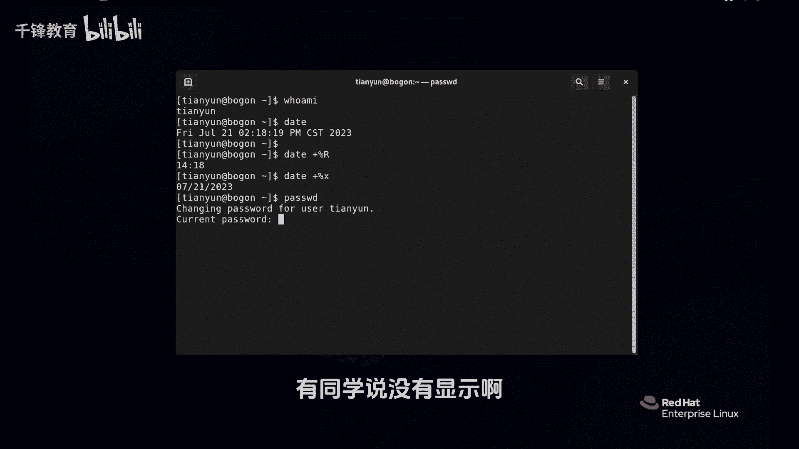
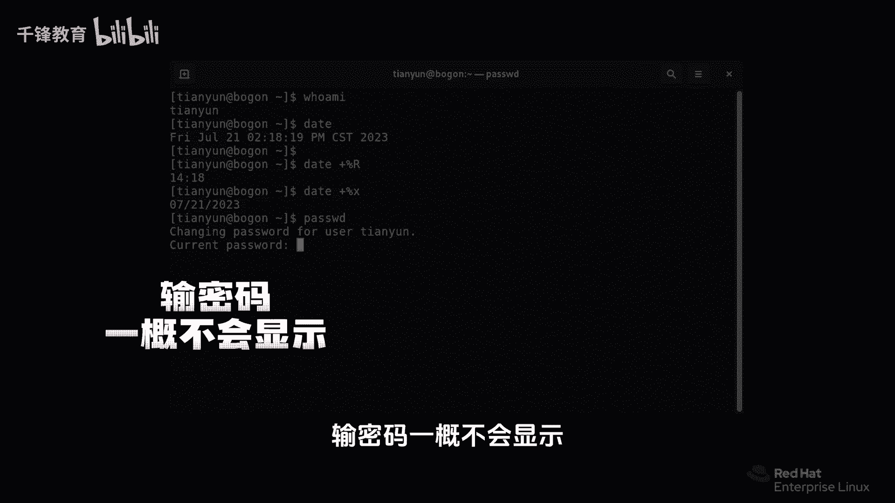
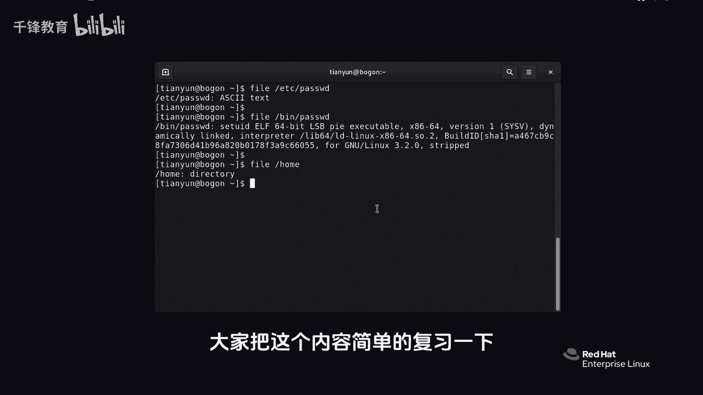

# Linux入门教程：P6：如何使用bash shell执行命令？


在本节课中，我们将学习如何使用bash shell来执行命令。我们将通过几个基础命令的演示，了解命令的基本格式、参数选项的使用，以及Linux系统中文件类型的特点。

---

上一节我们介绍了bash shell的基本概念，本节中我们来看看如何实际执行命令。

## 命令的基本执行

在bash shell中，执行命令非常简单。只需在提示符后输入命令名称，然后按回车键即可。

例如，输入 `whoami` 命令可以查看当前登录的用户名。

```bash
whoami
```

输入 `date` 命令可以查看当前的系统时间和日期。



```bash
date
```



## 使用命令选项和参数

许多命令支持通过**选项**和**参数**来改变其行为或指定操作对象。选项通常以 `-` 或 `--` 开头。

例如，`date` 命令可以使用 `+%R` 选项来只显示时间。

```bash
date +%R
```

也可以使用 `+%x` 选项来只显示日期。

```bash
date +%x
```

**注意**：在Linux中，命令和选项是区分大小写的。例如 `+%X` 和 `+%x` 可能代表不同的格式。

## 修改用户密码

`passwd` 命令用于修改当前用户的密码。执行该命令后，系统会提示你输入当前密码和新密码。

```bash
passwd
```

在Linux终端中输入密码时，出于安全考虑，屏幕上不会显示任何字符（不回显）。这并不意味着输入无效，系统已经接收了你的输入。

如果新密码不符合系统的安全策略（例如长度太短），命令会提示错误并要求重新设置。

## 查看文件类型

在Windows系统中，文件类型通常由扩展名（如 `.txt`、`.exe`）决定。但在Linux系统中，文件没有强制性的扩展名概念，仅凭文件名难以判断其真实类型。

`file` 命令可以揭示文件的本质类型。

以下是 `file` 命令的使用示例：

*   **查看文本文件**：`/etc/passwd` 是一个存储用户账户信息的文本文件。
    ```bash
    file /etc/passwd
    ```
*   **查看可执行文件**：`/usr/bin/passwd` 是我们刚才用来修改密码的程序，它是一个二进制可执行文件。
    ```bash
    file /usr/bin/passwd
    ```
*   **查看目录**：`/home` 是一个目录（在Linux中称为“目录”，相当于Windows的“文件夹”）。
    ```bash
    file /home
    ```

通过 `file` 命令，我们可以清楚地区分名称相同但类型完全不同的文件。



---


本节课中我们一起学习了bash shell执行命令的基础方法。我们实践了 `whoami`、`date`、`passwd` 和 `file` 等命令，了解了命令选项和参数的基本用法，并认识到Linux系统通过 `file` 命令而非扩展名来识别文件类型。请多加练习这些基础命令，为后续更复杂的学习打下坚实基础。