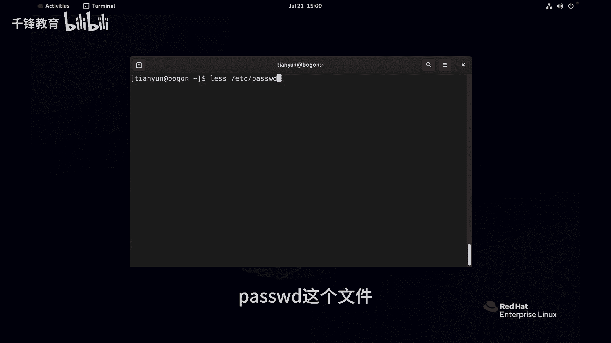
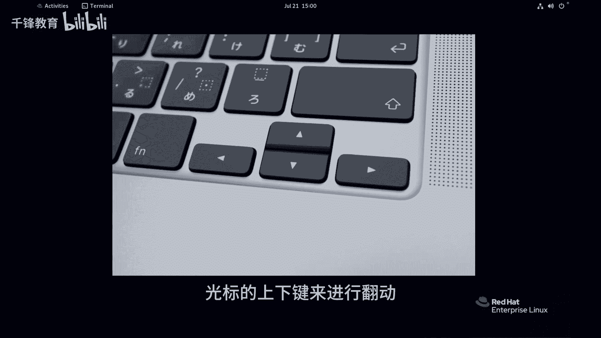
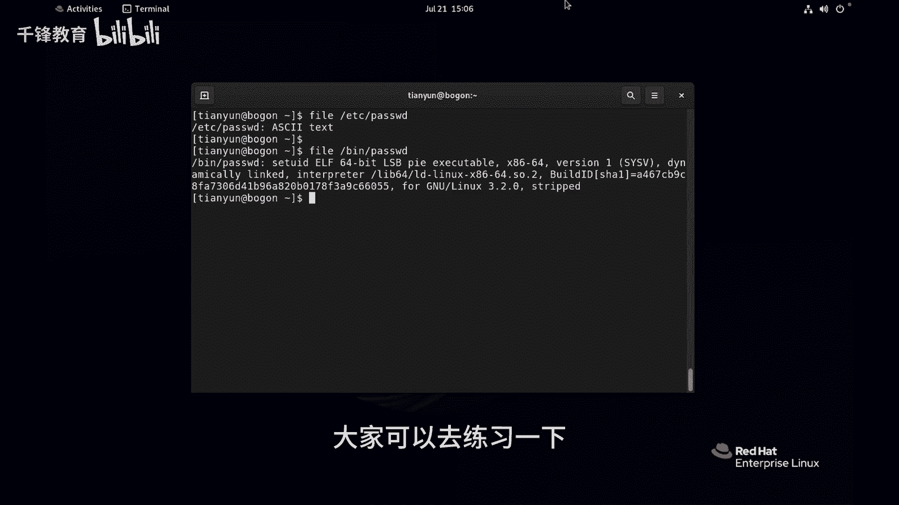

Linux入门教程：007：如何在Linux中查看文件内容？ 📄

在本节课中，我们将学习如何在Linux系统中查看文件的内容。这是文件管理中最基础且重要的操作之一。我们将介绍几个常用的命令，帮助你高效地读取文本文件。

---

上一节我们介绍了Linux的基本概念，本节中我们来看看如何查看文件内容。`cat`命令适合查看内容较少的文件。

例如，查看`/etc/postfix`文件：
```bash
cat /etc/postfix
```
该文件内容通常只有几行。但如果文件内容很长，例如`/etc/passwd`，使用`cat`命令会导致内容快速滚动，无法仔细阅读。



---



为了查看内容较多的文件，我们可以使用`less`命令。`less`允许我们逐页浏览文件内容。

以下是使用`less`命令查看`/etc/passwd`文件的步骤：
```bash
less /etc/passwd
```
进入`less`视图后，你可以使用**上下方向键**或**Page Up/Page Down**键来滚动内容。按 **`q`** 键即可退出`less`视图。

---

有时我们只需要查看文件的开头或结尾部分。这时可以使用`head`和`tail`命令。

`head`命令默认显示文件的前10行。如果想查看前N行，可以使用`-n`选项。
```bash
head /etc/passwd
head -n 2 /etc/passwd
```

`tail`命令默认显示文件的末尾10行。同样，可以使用`-n`选项指定行数。
```bash
tail /etc/passwd
tail -n 5 /etc/passwd
```

---

除了查看内容，我们有时还需要统计文件的基本信息。`wc`命令可以帮助我们统计文件的行数、单词数和字符数。

以下是`wc`命令的常用选项：
*   `wc /etc/passwd`：显示**行数、单词数、字符数**。
*   `wc -l /etc/passwd`：仅显示**行数**。
*   `wc -w /etc/passwd`：仅显示**单词数**。
*   `wc -c /etc/passwd`：仅显示**字符数**。

这个命令在后续进行日志分析等任务时非常有用。

---

最后，需要特别注意：上述命令主要适用于**文本文件**。如果尝试用它们查看二进制文件（如可执行程序），将会显示乱码。

我们可以用`file`命令来确认文件类型：
```bash
file /etc/passwd
file /bin/passwd
```
第一个命令会显示“ASCII text”，而第二个会显示类似“ELF executable”的信息，表明它是二进制文件。就像无法用记事本正常打开一个视频文件一样，不要用文本查看命令去处理二进制文件。

---



本节课中我们一起学习了在Linux中查看文件内容的多种方法。我们介绍了用于快速查看的`cat`命令，用于分页浏览的`less`命令，用于查看文件首尾的`head`和`tail`命令，以及用于统计信息的`wc`命令。记住，这些命令主要针对文本文件操作。熟练掌握这些命令，是你有效管理Linux系统文件的第一步。