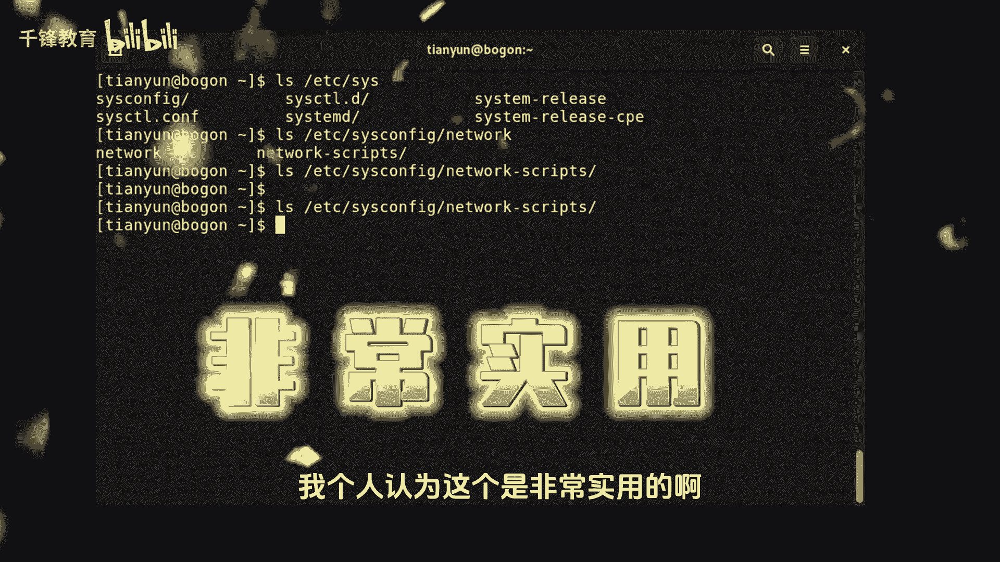
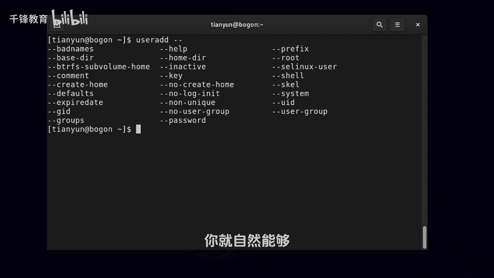

Linux入门教程：008：Linux自动补全技巧 🚀

在本节课中，我们将学习Linux命令行中一个极其重要的效率工具——自动补全功能。掌握它不仅能提高输入命令和路径的速度，还能有效避免拼写错误。

---

### 命令补全

上一节我们介绍了命令行基础，本节中我们来看看如何利用Tab键快速补全命令。当您输入命令的前几个字母时，按Tab键可以尝试补全命令。

**核心机制**：补全功能基于您已输入字符的唯一性。
*   如果已输入的字符能**唯一确定**一个命令，按一次Tab键会自动补全该命令。
*   如果已输入的字符对应**多个可能**的命令，按一次Tab键可能没有反应。此时，按**两次Tab键**，系统会列出所有匹配的命令供您选择。

例如，输入 `ps` 后按两次Tab键，会列出所有以 `ps` 开头的命令（如 `ps`， `passwd`）。当您继续输入到 `pass` 时，由于此时命令已具有唯一性，按一次Tab键即可自动补全为 `passwd`。

**操作建议**：Tab键通常由左手小指按击，这是一个高频操作键，建议通过打字练习熟悉其位置。

---

### 文件与路径补全

除了命令，自动补全对文件和路径同样有效，这在实际操作中非常实用。

**使用方法**：在需要输入文件或目录路径的地方，输入部分路径后按Tab键。
*   如果路径存在且输入部分唯一，将自动补全。
*   如果存在多个匹配项，按两次Tab键会列出所有可能性。

例如，输入 `/etc/pass` 后按Tab键，会自动补全为 `/etc/passwd`。这不仅**提高了输入效率**，也**验证了路径的正确性**。对于长路径，只需记住开头部分，即可通过多次Tab补全快速输入。

---

### 命令选项补全

对于命令的选项（参数），无论是短选项（如 `-a`）还是长选项（如 `--all`），也可以使用Tab键进行补全。

**使用方法**：在命令后输入空格和短横线（`-` 或 `--`），然后按Tab键。
*   输入 `--` 后按两次Tab，可以查看该命令所有可用的长选项。
*   输入 `-g` 后按Tab，如果存在多个以 `g` 开头的选项，按两次Tab会列出它们，帮助您找到正确的选项，例如 `-g` 或 `--gid`。

这对于记忆复杂或冗长的命令选项尤其有帮助。

---

### 总结

本节课我们一起学习了Linux中的自动补全技巧。我们了解了如何对**命令**、**文件路径**以及**命令选项**使用Tab键进行补全。记住：**按一次Tab尝试补全，按两次Tab列出所有可能**。这个技巧是提升Linux命令行操作效率的关键，请在后续的练习中多加使用和强化。