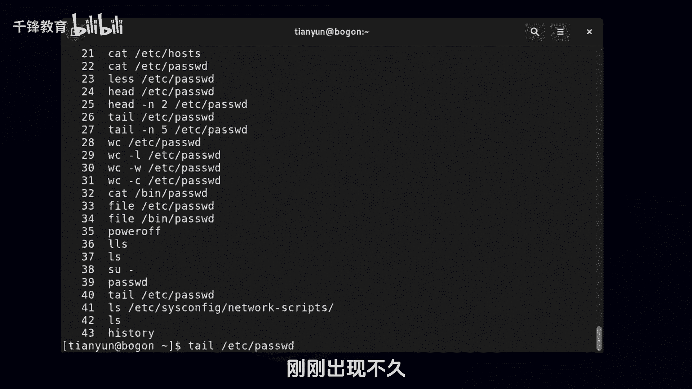
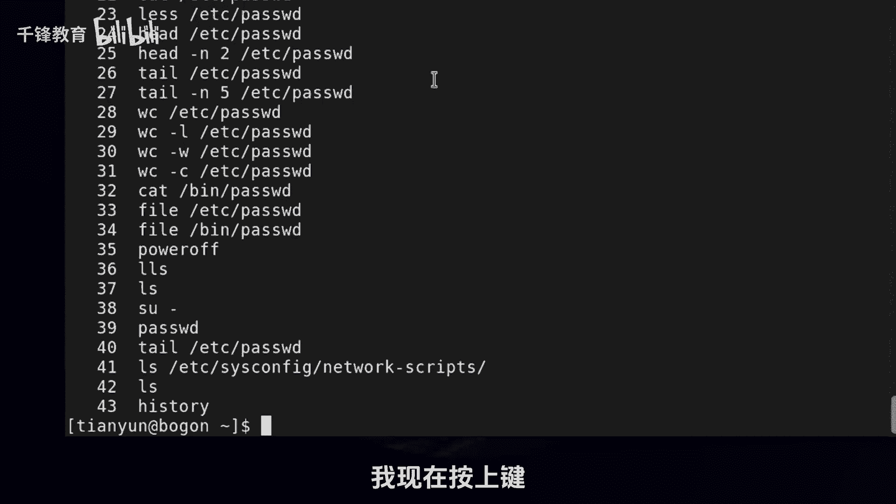
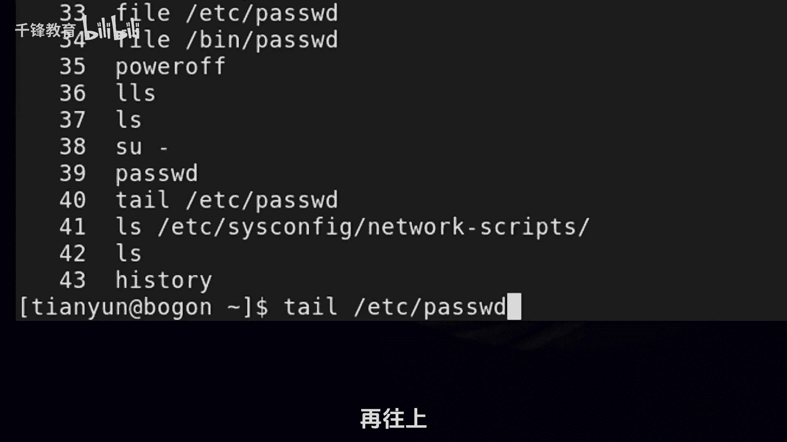
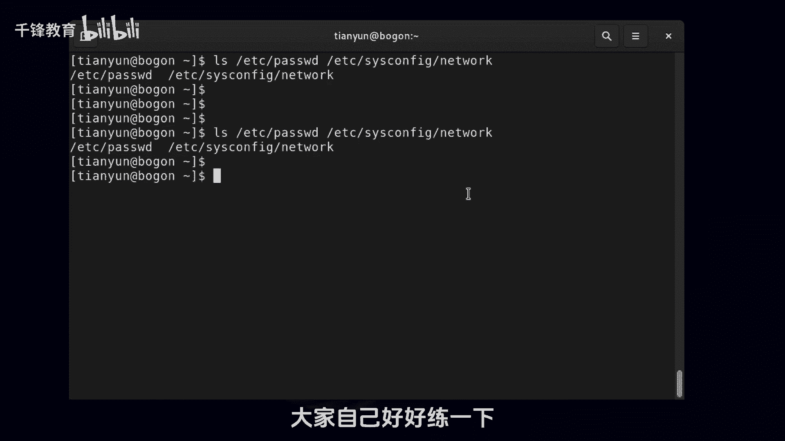

# Linux入门教程：009：bash基础特性之历史命令 📜


在本节课中，我们将要学习bash shell的一个核心特性——历史命令。掌握历史命令的使用，可以帮助我们追溯之前的操作，并高效地复用命令，从而提升工作效率。

## 查看历史命令

首先，我们可以使用 `history` 命令来查看当前用户在系统中执行过的所有命令记录。每一条历史命令前面都有一个唯一的编号。



**命令示例：**
```bash
history
```



执行此命令后，终端会列出所有历史命令及其对应的编号。



## 复用历史命令的方法

有多种方法可以快速找到并复用历史命令。以下是几种常用的方式。

### 1. 使用上下方向键

如果目标命令是最近执行的，最快捷的方法是使用键盘的 **上方向键 (↑)** 和 **下方向键 (↓)** 在历史命令列表中逐条浏览。找到目标命令后，可以直接按回车执行，也可以对其进行编辑后再执行。

### 2. 使用叹号 (!) 符号

叹号 `!` 是一个强大的符号，用于调用历史命令。它后面可以跟两种参数：

*   **跟数字**：执行指定编号的历史命令。
    **公式：** `!<历史命令编号>`
    **示例：** 执行编号为29的历史命令。
    ```bash
    !29
    ```

*   **跟字符串**：执行最近一条以该字符串开头的命令。
    **公式：** `!<命令开头字符串>`
    **示例：** 执行最近一条以 `tail` 开头的命令。
    ```bash
    !tail
    ```

### 3. 使用快捷键 ESC + . (点)

这是一个非常实用的快捷键组合。按下 `ESC` 键后再按 `.` (点) 键，可以快速调出**上一条命令的最后一个参数**。

**场景演示：**
假设上一条命令是：
```bash
ls /etc/passwd /etc/hosts
```
此时，在下一个命令提示符后，按下 `ESC` + `.`，系统会自动补全 `/etc/hosts` 这个参数。如果连续按 `ESC` + `.`，它会在最近几条命令的最后一个参数之间循环。

### 4. 使用快捷键 Ctrl + R 进行搜索

当历史命令很多时，使用 `Ctrl + R` 快捷键可以进入**反向搜索**模式。此时，提示符会变成 `(reverse-i-search):`。

在此模式下，输入历史命令中包含的任意连续字符串，系统会实时显示并高亮匹配到的最近一条历史命令。如果匹配到的命令不是想要的，可以继续按 `Ctrl + R` 向前搜索更早的匹配项。找到目标命令后，按回车即可执行。

**操作流程：**
1.  按下 `Ctrl + R`。
2.  输入你记得的命令片段（如 `cs`）。
3.  系统会显示包含 `cs` 的最近一条命令。
4.  如果匹配正确，按回车执行；如果还想找更早的，继续按 `Ctrl + R`。

## 总结



本节课中，我们一起学习了bash shell历史命令的多种使用方法。我们首先介绍了如何使用 `history` 命令查看所有记录。接着，详细讲解了四种复用历史命令的技巧：使用**上下方向键**快速浏览、使用**叹号(!)** 配合编号或字符串精确调用、使用 **ESC + .** 快捷键快速获取上一个参数，以及使用 **Ctrl + R** 快捷键进行灵活的反向搜索。熟练掌握这些方法，将极大提升你在Linux命令行环境下的操作效率。