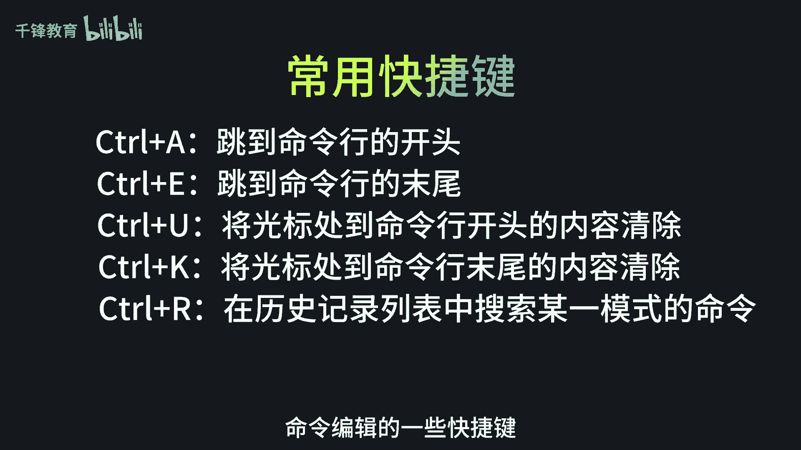
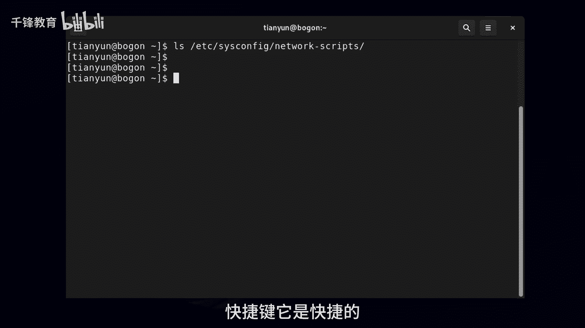
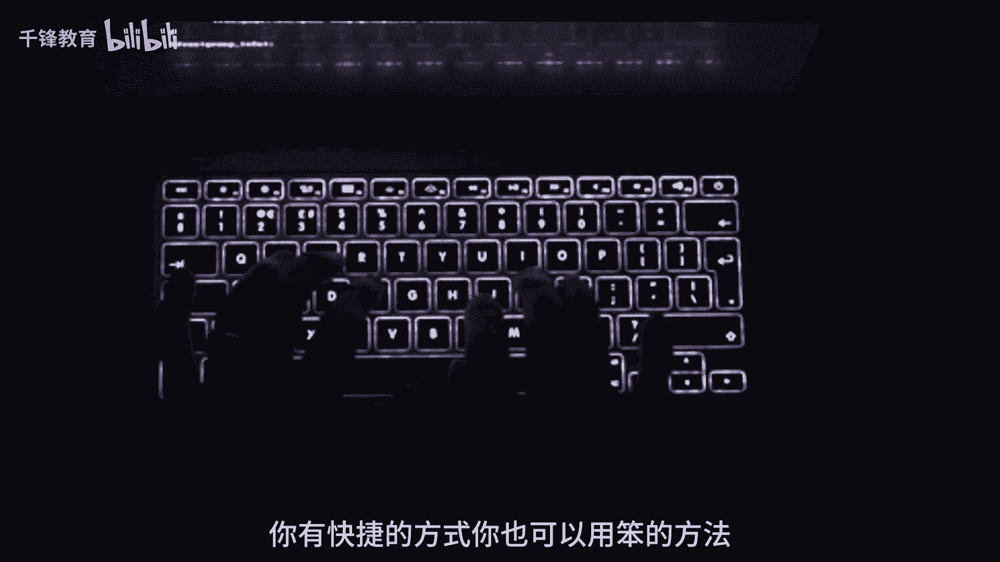
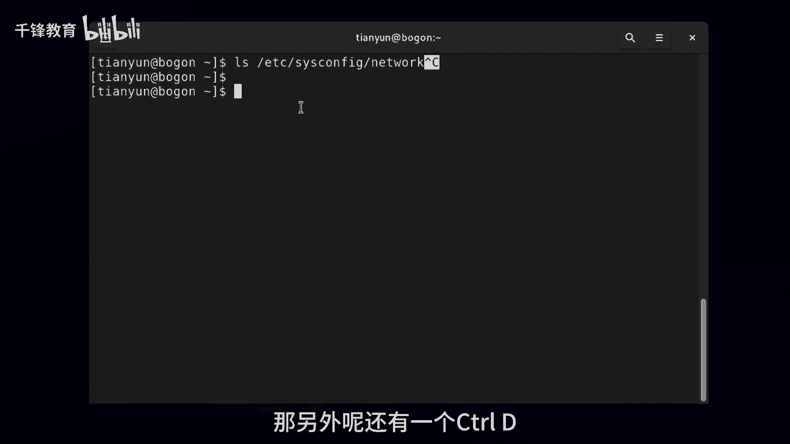
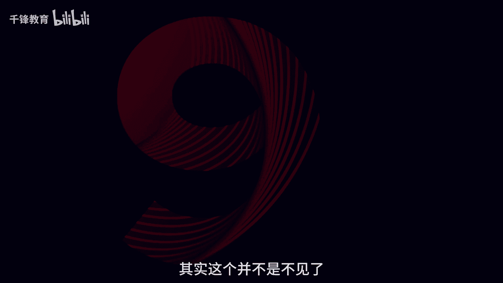
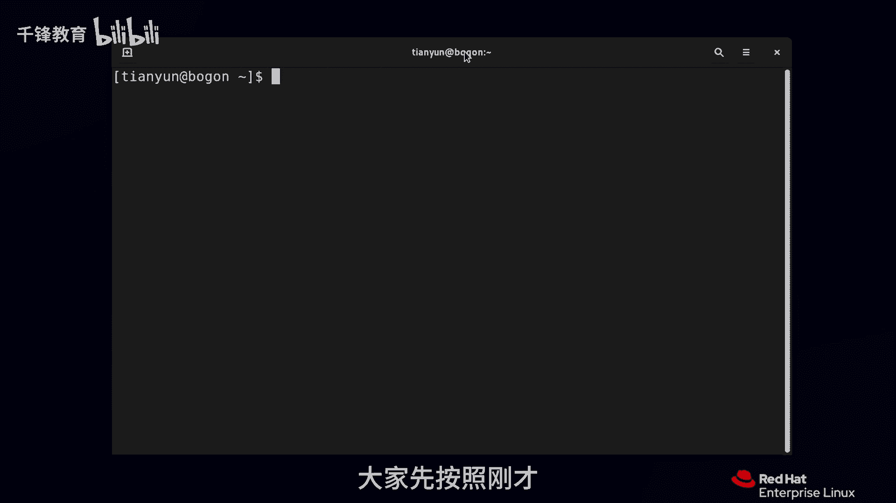

# 史上最强千锋杨哥Linux云计算入门教程，极速通关红帽认证RHCE（更新中） - P10：010.Bash Shell常用快捷键 - 千锋教育 - BV19N4y1X79P

我们继续来看一下在BSHELL下的一些快捷键，当然主要是针对命令编辑的一些快捷键。

首先呢我们先来设置一个场景啊，比如说本来是CAT啊，看文件我们打错了，打成CETTCR的sim filet work，看一下这个文件啊，好最后发现不对又不对的话，我们可能就涉及到改，最后一发现哦。

是这个CT它提示我们这个命令没有找到，那好我们向上翻出这个命令呢，那我们可以用快捷键直接定位在前面，不是鼠标啊，我鼠标只是给大家展示一下，我们这个时候就可以输入快捷键。

快捷键的通常都是CTRL加什么什么什么好，下面我们来看CTRL加A，CTRL加A呢就是直接到这个mini的最前面，但有小同学可能会问，说这个要不要把光标移到最后去呢，这个不需要这个，大家也不用担心。

就是不会说你像你想的那样的，我现在回车一下这个命令就断了，不是没问题啊，另外呢大家记住哦，你光标无所谓，在这个mini的哪个位置，只要你按回车就表示执行命令，不要以为他一定要在最后。

所以你不要纠结说想靠在杨哥这样扛出来A，然后还要干掉一个末尾去，末尾就是EBCTRLCTRL键，CTRL按CTRLE，现在大家可能看出来了，CTRA是到前面，CTRLE是到最后结束的时候，当结束的时候。

你要不要去那边，取决于你还要敲不敲什么东西，你还要敲点的话，那你就接着敲啊，还有呢就是比如说我现在我有这样一个想法，就从光标这个位置到后面我都不想要了，那这怎么弄呢，CTRL加K各位看清楚啊。

那就从光标处扇到了末尾，也能够从光标处删到前面，当然这个取决于你实际的编辑的需要，我现在呢是没有说每一个都有非常好的场景啊，所以考虑一下U看到了吗，插到前面了，快捷键它是快捷的。

你不快捷也行，比如说我们前面讲到历史秘密，你有快捷的方式，你也可以有笨的方法。

对命令行的编辑也可以省，快捷键也可以就笨笨的去使用，左右键也是一样的，但另外呢我们在前面给大家见过一个CTRL加R，这个扛下R的，这个其实也是算是mini的编辑，但是它是搜索历史mini啊。

这个也是经常推荐大家使用的，那还有两个快捷键呢，其实也给大家展示过，比如说我现在输了这一串cs config，我不想要了，不想要的方法，一种就是往前删，我觉得没必要，你说的再多，还不如按个CTRL加C。

当然CTRL加C的人家还给你显示一下，为什么要显示一下呢，我认为他想将回车和这个区分开，你要是不显示CTRLC，还以为按那个回车呢，但如果按回车的话，应该显示结果和用或这个不对，所以会造成歧义。

同样我给大家提示一下，以后大家见到这种写法啊，比如Ctrl e Ctrl Ctrl u Ctrl key什么的，注意这种写法，前面那个指数符号就是CTRL的意思在里面就是CTRL，当然它是表示法。

那么敲肯定不可以的，CTRLC就是把命令行终止，其实就是终止这个程序，那另外呢还有一个CTRL加D。

我给大家先演示一下效果啊，CTRL加D，大家看不见，其实这个并不是不见的。

他是退出了这个终端，有时候我们可能远程的一下以后呢，你想退出来，那我们就可以CTRLD或者是ex t exit也可以，这个相当于按CTRLD是一个意思，所以最后给大家讲到的。

在bh shell下用到的一些快捷键，这个会见到，大家先按照刚才能够所设定的这个场景。

