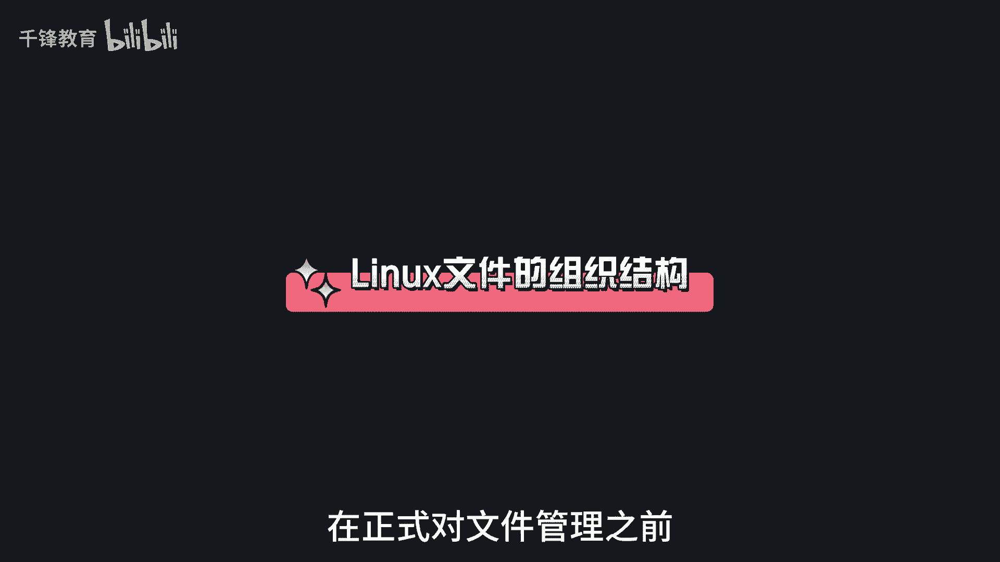
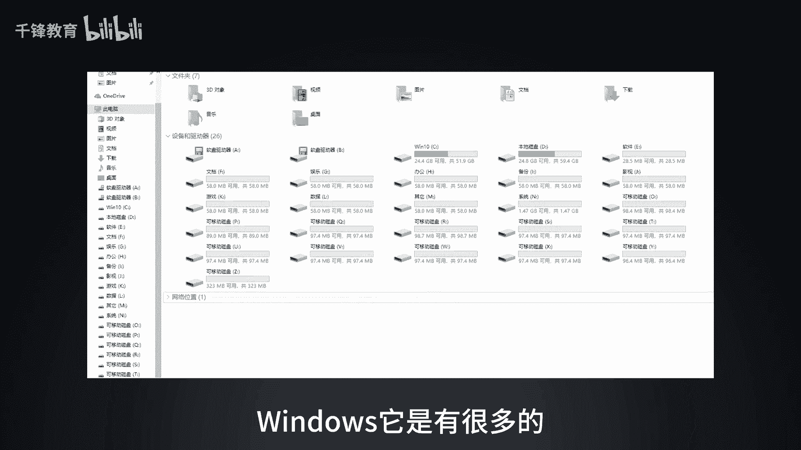
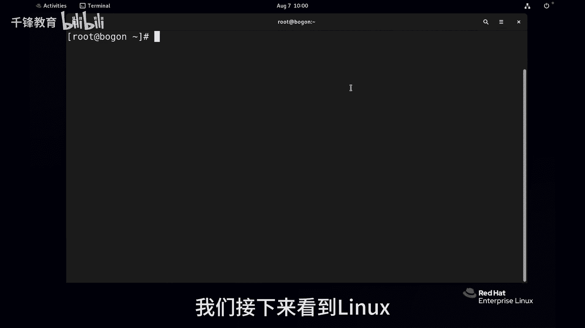

# 史上最强千锋杨哥Linux云计算入门教程，极速通关红帽认证RHCE（更新中） - P13：013.Linux文件系统层次结构 - 千锋教育 - BV19N4y1X79P

接下来我们将会带大家学习如何管理文件，在真实对文件管理之前呢。

接下来我们了解这个LINUX文件的组织结构，首先大家可以想象一下，windows它是有很多的项目。

像C盘，D盘，E盘好，F盘这样的一些分区，我们接下来看到LINUX呢可能看都不一样。

比如说首先给大家查看一下根目录下的内容，LINUX它首先是所有的这个文件，就像一棵倒挂的树一样，最上面是根往下拉才是各个子目录，这个可能跟有些同学有一种感觉，他会认为LINUX只有一个分区。

这个是不对的啊，这个我们后面再讲，在这棵树上面呢有很多重要的目录，这个是我们需要知道的。

以便于我们后期的一些工作，那比如说像天下的ADC，那么ADC就属于一个子目录，比如说这个文件就在跟下面，然后EDC这个木下面一个叫password，这样一个文件，在D下面有很多的这样一些目录。

这些目录里面放的东西呢也是不太一样的，大致的这些文件可以分为这么几类，一个是静态的这样一个文件，竞赛的文件呢图片我们可以重新去编辑，它的内容是不会发生变化的，主要是动态的可变化的型文件。

这些文件呢可能会由我们的进程进行修改，或者附加，就比方说我们会给大家提到的日志文件，那实际上呢它是一直在变化，那可能记录了某一个，比方说安全登录的一个事件，那这个日志文件呢。

就会随着我们登录的这样一个行为不断在增加，当然还会有一些文件呢，它的内容叫做持久内容，重新启动以后依然是那个保留的，比方说像我们的配置文件，比如我们的主机名，IP地址等于网卡的配置文件等等等等。

那除此以外呢，还有一类文件，这种文件在重新启动以后，它可能会被删除，因为它可能是来自于我们的进程或系统，运行的时候的这个内容，在重新启动以后呢，上一次的这个进程运行的相关的一些文件。

比如说像PID啊之类的会被删除，下面我们具体来看一下，天下的一些重要的目录是干嘛的，比如说第一个就是我们的啊不通目录，这个目录是我们的开机启动所需的配置文件，比如说启动为。

那个时候有一个那个读秒的那个过程，一个界面，那个界面就是grub grab，他提供的这个引导程序就是没有，他的话呢我们是没办法加载内核之类的，还有呢这个很重要的东西。

那我们一直在谈LINUXLINUX啊，这个NEUX是什么呢，它其实不是操作系统，它是一个内核里拉斯托瓦兹写的这个内核，那现在我们所看到的这个VMLINUX，就是我们的整个系统的内核内核。

对于我们整个进程管理，设备的管理等等非常重要，再一个呢就是我们的BEV设备这个单词，这里有很多很多很多的设备，包括我们的网卡，包括我们的各种硬件磁盘，还有我们的这个其他的一些硬件设备。

在这里面都会有相应的文件，有一点就是LINUX1切皆文件，这个是我们的这个后面讲到的终端，还有呢我们的这个标准输出，标准输入等等等等，还有呢我们的其他的一些特别的文件，紧接着是我们的etc DC。

这个是我们以后打交道特别多的地方，这个是我文件配置文件的一个目录，包括我们在后面看到的这个ADC下的HOSTNAME，的主机名，现在没有主机名哈，包括网络的配置全在这里面，我们安装了各种软件。

他们的配置文件呢基本上都在这里面啊，所以这个EDC是我们的配置文件所在的目录，一般情况呢，每一个程序都会有自己的一个目录存放，它对应的程序的配置文件，我们再来看一下根下的home目录。

那个home目录是什么地方呢，我们先来提一下root这个位置，是我们这管理员的家目录，每一个用户都会有一个我们叫做主目录，或者加目录，编下了root的目录，这是什么，是我们管理员的家目录。

也就是我们当前这个用户的家目录，那后面是个什么地方呢，home这个位置呢不是什么加目录，是我们普通用户家目录所在的一个主目录，由于我们现在系统当中有一个普通用户叫天云，天云，这个用户的家目录在哪呢。

就在天下的后面下的天云这个位置，我们可以看一下，这是我们天元用户的加盟类，现在呢里面有一些东西，但top dotments还有music，还有墙纸啊什么的，这是为什么呢，这是因为我们抓了图形界面。

而且我们以这个账号也登录过，所以呢它有一些图形这个界面的一些特性，如果说这是一个没有图形的，安装的时候压根就没有带图形的，那没有东西了，所以home是普通用户家目录的主目录。

我们再往后接着看下一个叫run的目录，RUN的目录，这里面放的是什么东西呢，通常是我们启动进程运行的数据，所以我们一般人为的不需要去干涉，比如说这里面可能有进程的一些，我们叫做pad，怎么讲。

每一个人都有一个身份证，一个id，每一个进程他也有一个编号，这个编号呢叫进程id，那这个PID呢就是这个进程的编号，比方说我说一个编号，大家知道是谁吗，9527，大家可以评论区回应一下，这是谁的编号。

下面呢我举一个例子，要用一下一个后面取到的mini distance control，然后stop一下，把这个进程给提，这个进程叫AHD，因为现在这个进程在运行，所以它会有PID，那他的死呢。

你看像这样没有什么提示，一般就是好提示，那我清一下屏，再来看一下VLOG好，大家可能看到已经没有TD那个进程的pad呢，接着呢我们再看一下这个TNP这个目录，这个目录里面呢它是我们存放临时文件的地方。

我们在后面会讲到权限的时候，会看到每一个进程，包括普通用户都可以去TP下面写东西，写自己的进程所需要的一些东西，但是有一点这个目录下面十天内未曾访问，也没有更改过它或者修改过的文件。

将会默认从这个里面的自动删除，所以呢这个地方是一个临时目录，当然还有一个也是VR下TMP，这个位置也是临时目录，只不过呢这个位置是30天内没有访问过，也没有更改或修过的，将会被删除啊。

所以两个地方一个是根下的TNP，一个是挂下TP这个位置，接下来我们介绍一个重量级的目录，叫啊USR这个目录，这个目录下面呢是什么呢，是我们安装的软件，还有我们的各种共享的库不在一个位置。

这是一个非常重要的目录，比如说给大家看啊，在USR下有一个BB呢是我们的二进制啊，像这里面，我如果打开好多的这样一些绿色的东西，这里面我们的一些mini，比如我们看看有没有我们的LS这个mini。

这就是我们现在用的JIOS，就是我们现在用的这个LS秘密，就在USR下面就叫IOS，所以呢在USR下的这个ping下面放的是什么，放的就是我们的UVI用户mini，当然是安装了某个软件。

如果某一个mini没有的，那有可能是没有装某个软件，这usr bin下面是我们的普通用户的mini，我们也简称为用户mini，负优是普通用户啊，比如说这里面有没有一个叫USADD的命令。

创建用户的mini，各位看没有没有这个mini，这个mini它在哪呢，在USRSP下面，这里面放的就是我们的系统管理命令，简单的说，上面那个呢，并下放的是我们的普通用户使用的mini。

而sb super super是我们的管理员使用的I，按照官方合照的人叫用户mini和系统管理mini，还有呢就是我们USI下有一个叫docker啊，这个是一些本地的一些软件。

把我们的top cat装在这里面，当我们的其他的一些程序装在这里面，大家也会在装软件的时候，特别是我们编译的一些软件，那通常我们是装在usr logo下面的，并且以他自己的一个目录来命名。

最后一个是我们的VR这个目录，这个目录呢正如它的名字上，可以看出来是变化的，动态变化的一些东西，就比方说我们日志文件，大家看到这里面有挂下的这个叫logo logo，这里面就放了很多很多的日志文件。

有些是安全日志，有些是各种服务的日志，有些是登录日志，所以这个是放数据动态变化的一个地方，包括数据库，还有我们的缓存的日志啊，都在下面，这是我们边下的一些重量级的一些目录，所以大家一定要去知道一下。

这个我们后面的学习呢，我们会逐渐了解这些目录里面的一些文件，到底是做什么的，他跟我们的系统管理相息息相关。

