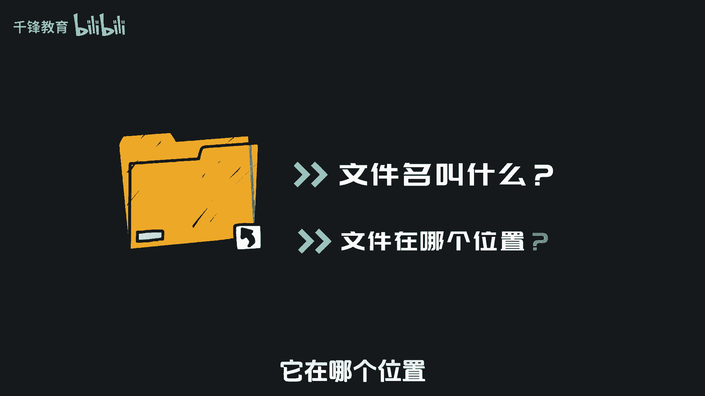
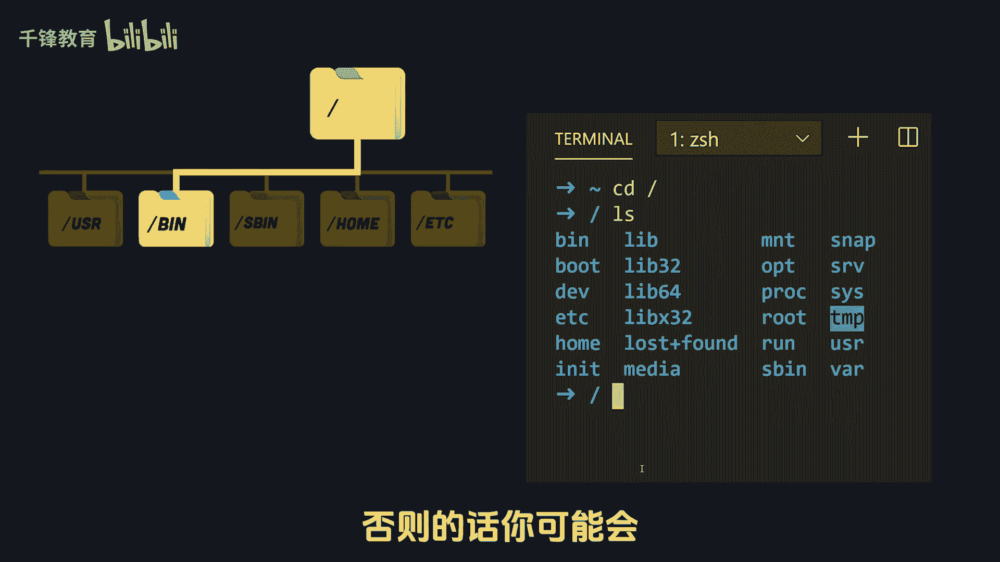
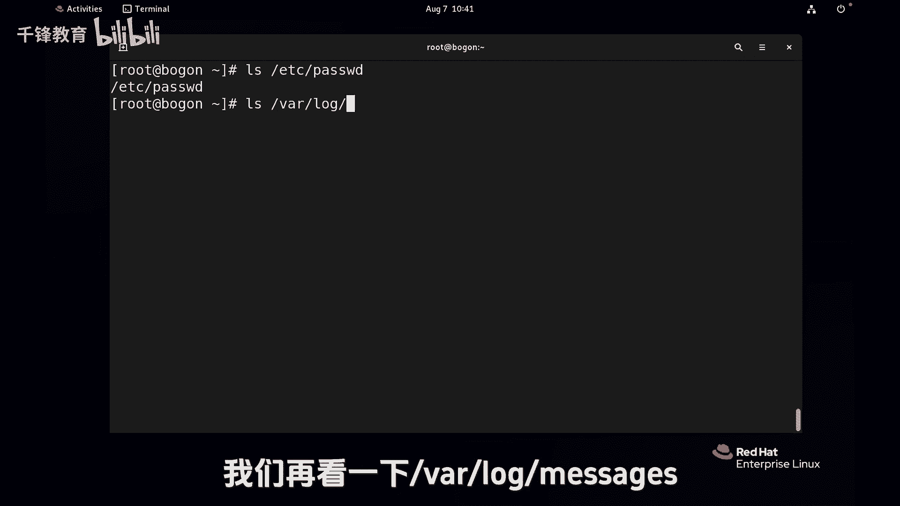
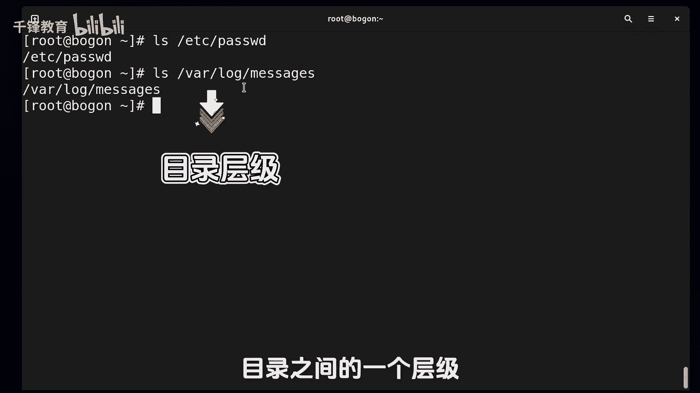
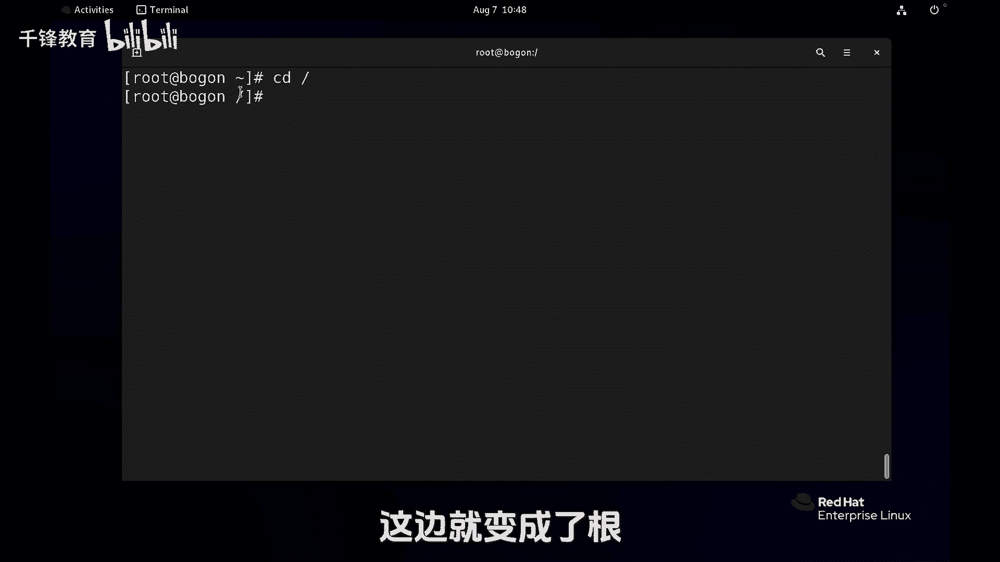
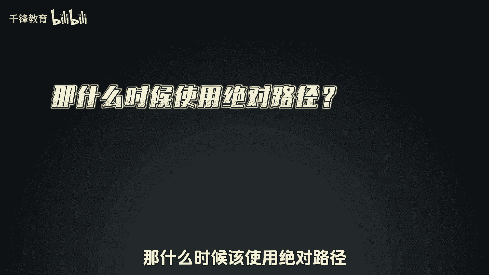
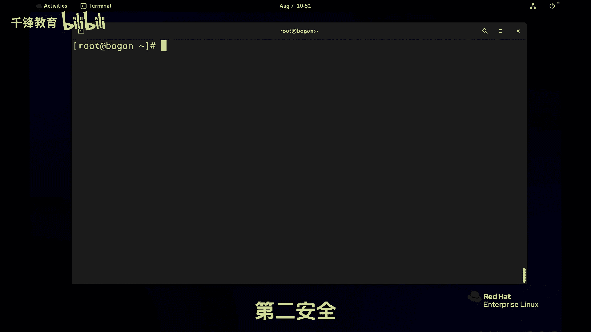

# 史上最强千锋杨哥Linux云计算入门教程，极速通关红帽认证RHCE（更新中） - P14：014.绝对路径和相对路径 - 千锋教育 - BV19N4y1X79P

好各位小伙伴，我们继续来学习文件的管理，那么在管理文件之前呢，我们首先要问自己，我们要对哪儿的文件进行管理，比如说我们要创建一个文件，创建这个文件的名字叫什么，它在哪个位置。

我们要删除一个文件，同样要删除每个地方的哪个文件，换句话讲就是我们要对文件进行定位，我们要通过名称来定位这个文件，否则的话你可能会操作了别的文件。

那要定位这个文件呢就会涉及到路径的问题，比如说我们来看看这个文件呢，它就涉及到一个定位的问题，这里面就用到了一个路径，那这是什么路径呢，接下来我们会讲到绝对路径，相对路径。

还有一个是这个当前工作目录的这样一个概念，三个概念，那现在杨哥这边对这个文件进行定位，用到了这样一个路径，其实就叫做绝对路径，我们再看一下胯下的logo下的message这个文件。

首先各位记住的就是，这个斜线和这个斜线不是一回事儿，前面这个是正斜线，是根是一切的起点，后面这个只不过是那个目录之间的一个层级。

它跟前面的这个完全不是一个概念啊，凡是以正斜线开始的命令，我们都叫做绝对路径，也就是说他能够绝对的表示这个文件，绝对这个词大家应该都明白，我说哎杨哥绝对是个好人，就是没有其他的歧义，那就是绝对的。

我不可能操作到别的文件，我就是操作的天下挂logo下的message这个文件，另外一个呢就会涉及到相对路径，先路径再怎么讲啊，那下面呢我们会用到几个mini，看似不起眼的石子呢，使用频率最高的几个命令。

首先来看一下PWB这个命令啊，PWD它的全称叫做打印工作目录，就是显示你现在在哪，特别是在LINUX里面，由于一些这个相关的需要，我们可能会切换到不同的目录里面，去做相关的操作。

那这个时候呢你自己有时候就不知道你在哪了，那就可以使用，随时可以使用这个PWD来显示你当前在哪啊，不管你去到再远再生，那你pd呢直接能够让你呢看到你在哪个地方，下面呢，我们还会用到第二个命令。

就是CD命令，比如说我现在根下的root，所以我如果看到的肯定是根下的root下内容啊，CD dog根下的VR想去发现有个地方发生了变化，就是这个地方刚才还是个波浪线，现在呢变成了VR。

注意这个位置呢它就显示的是当前目录，这个当前目录是会随着你的这个需求，不断的变化变化变化的，每个用户我们在前面给大家讲过，是有自己的家目录的，当一个用户打开一个终端，或打开一个shell程序的时候。

默认就在自己家里面，所以这个波浪线呢它指的是加的意思，然后现在呢这个目录变了，所以我们重新给他P1下啊，他现在就在跟下的VR下面，那如果这个时候我们LS他看到的就是什么呢，就是根下的VR下的内容。

我之前在其他地方的时候，我是用绝对路径，我就是这样写的，跟下的VR下logo massage，看到这个文件，那我现在的时间不用那么打了，为什么，因为我现在就已经在这个位置了，已经在最下面了。

所以我现在要再看这个下面的这样一个文件呢，就不必要像之前一样再打上VR，什么什么什么什么的，因为你本身就在这个VR下面，那就可以直接logo然后下载message，这就是一个人吗，我们叫相对路径。

相对是什么意思呢，是相对当前位置的一个路径，那你在别的地方打就不可以啊，如果我现在回到了这个跟下的root这个位置，回来以后，如果我这样打绝对入境呢，logo下的MASAGE没问题，能补全。

如果我现在打什么logo下的message，其实都不用打了，都补不全啊，我都table不了，那如果你要硬打下去的话呢，这也是不可以的，因为相对于当前根本就没有一个logo这个位置，所以相对位置。

相对路径是指的是相对于你当前的位置，另外呢刚才我也跟大家说过，前面这个位置是会发生变化的，那这里呢我们再来看看，如果我们到跟这边就变成了根。

如果到跟下的EDC，现在就变成了这个跟下的EDC，还有同学问我说，那什么时候该使用绝对路径。

什么时候消费路径呢，那就比如说我们已经进到了跟下的灰而下的logo，这个位置，我在看message，我就这样看见小亮，因为他本身就在哇logo下的message这个位置，那我就直接选路径去看。

这就是路径啊，那你没有必要再像这样哇，Logo message，这是可以的，那所以有时候看什么情况更省时间，那就使用相对路径，那再比如说我现在就想看etc下的password文件，那他在这吗。

他在这个目录下面吗，他不在，那如果说你要看它的内容呢，或者要对它进行操作，那么一种方法是你先回去，一种方法就是直接EDCR的password，我没必要再回去，我也没必要使用什么相对路径。

因为它相对于我来讲挺远的，那我还不如使用绝对路径，所以说使用相对路径和绝对路径的，第一个重要的一个策略就是什么，看哪个更加到达目的地更近，那你选一条最优路径，最短路径不就可以了吗，这是一种情况。

第二种是什么，就是在后面我会讲到的，有时候相对路径这个东西呢是可怕的，为什么，特别是我们在执行删除命令的时候，这个可能大家理解不了，现在删除的时候，我建议大家使用绝对路径删除，有两种情况。

一种就是在命令行人工删除，举一个小例子啊，那如果我们后面再讲到删除命令，就像这个RM这个命令的时候，这个命令很厉害，是见神杀神，见见鬼杀鬼啊，用的时候要特别小心，不小心就会把整个系统的重要文件删除。

至少我曾经在生产服务器上面犯过一个错，差点造成特别大的一个灾难，所以我们后面会给大家讲到，在命令行删除的时候，我们要用相对路径，但是在脚本里面删除的时候呢，一定要用绝对路径。

那等到讲到那个时候再给大家去讲，因为是血的教训，所以没有说什么是好什么是不好，我刚才给大家讲过两个原则，一种就是以到达目的地的最优，最短路径优先为原则，第二个原则是安全，所以有时候两者需要同时兼顾一快。

