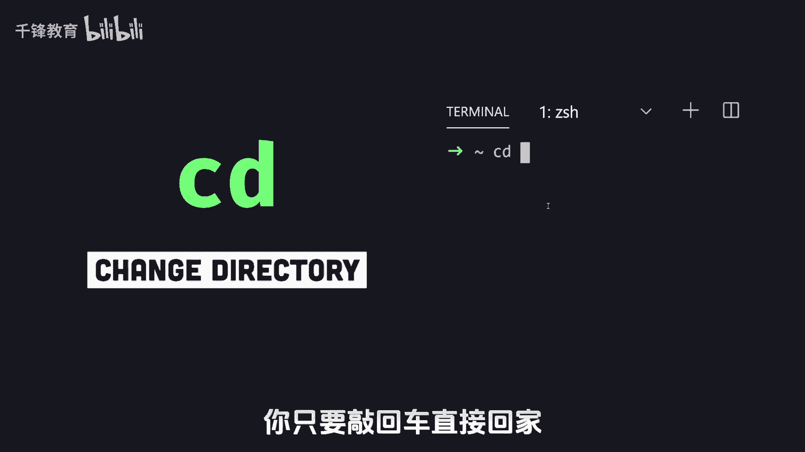
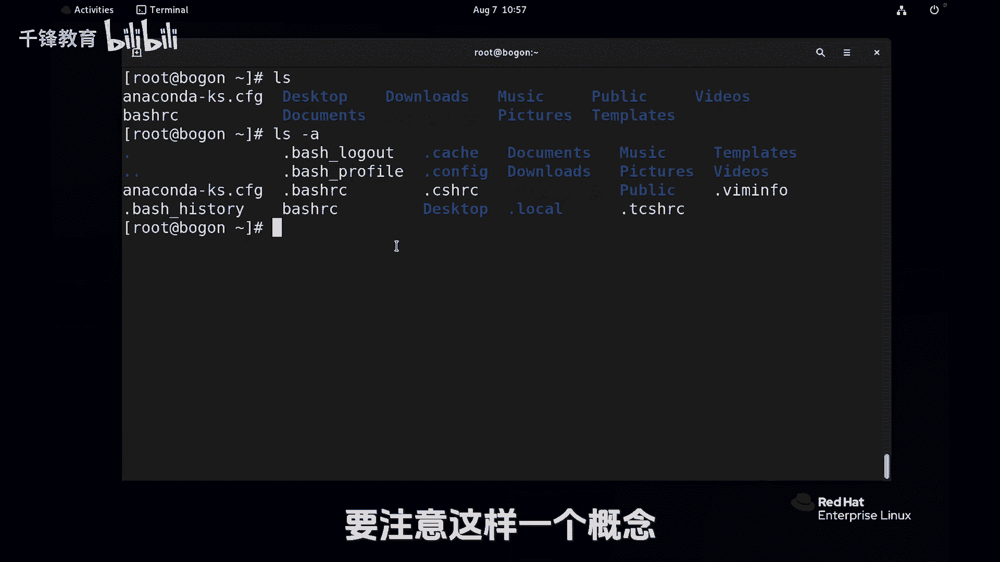

# 史上最强千锋杨哥Linux云计算入门教程，极速通关红帽认证RHCE（更新中） - P15：015.Linux中 “.“和”..“的含义 - 千锋教育 - BV19N4y1X79P

不管你去到再远的地方，家永远是你温馨的港湾，而CD不管在哪，你只要敲回车直接回家。

比如说各位看CD到画下的logo下去，因为CD命令是用来切换目录的，就是政治directory改编目录啊，那如果我现在要回到那个目录的上一层，就是VR这一层，那一种方法是CD到根下的VR重新向上敲。

一种方法是CD点点，我们看到了直接回到了上一层，你看AR下面实际上是没有点点那个目录的，因为我刚才讲过CD呢是用来切换目录的，可见到后面跟那一定是一个目录，也就是一个文件夹。

但是我没有看到在VR下面或者哪个地方，看到这个东西，包括logo下面也应该是没有的，也是看不到的，默认那这里我们加一个选项叫杠A的选项啊，马上就能看见，一是所有的bar的意思是个短选项。

这有两个很特殊的目录，一个是点，一个是点点点是什么呢，当前目录就是自己点点上一级，这两个都可以用，那比如说我现在CD点R6变化还在这，或者LS点，看当前目录就跟L1样，没有什么不一样。

那如果我CD点点呢，对看这个时候回到了上一级目录，这个时候大家发现这个VR下面呢，它也有一个点和点点，但是这个点和点点不是刚才的那个点和点点，因为这是一个相对概念，这个顶点表示的是他自己当前目录。

而点点呢是指的是他的上一级，那他的上一级是哪一级呢，它的上一级是这个位置是根，所以如果现在再次CD点点又回到了根，因此呢大家注意就是，点和点点是两个非常非常特殊的两个目录，为什么有这样的东西啊。

这里给大家说一个概念，在我们的LINUX里面，凡是一点开始的文件都是隐藏文件，我们回到回到家里面，CDLS杠，各位注意到了吗，好多好多一点开始的，点开始的不见得是目录啊，看这个颜色，蓝色是目录。

这个白色呢，通常这个文件LINUX里面是支持文件一点开始的，甚至还支持空格，我再给大家举个例子，这个例子又睡到一个新mini，所以不要太纠结，arch这个是用来创建一个文件。

那比如说这个文件这个文件的名字，各位猜一下到底它叫点是RC还是叫HRC呢，它有一点是肯定的啊，同一个位置肯定不能允许两个相同文件出现的，那我回车，我创建了一个文件。

touch命令呢是用来创建一个空文件啊，也可以用来触摸一个文件，复学者我们就用来创建个空文件啊，杨哥再次给大ALEX杠A，大家发现有一个best rc，这个文件如果你不使用杠A是看得见的。

而那个呢这也使用杠A，所以这两个文件不是同一个文件，这个点它同样是文件的一部分，就像你脸上那个痣一样，它是你身体顶部分，你用那个字来展示，你没有那个痣，那是另外一个人。

