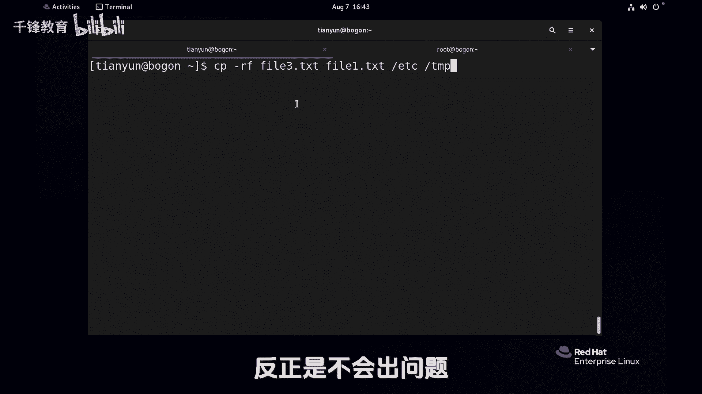

# 史上最强千锋杨哥Linux云计算入门教程，极速通关红帽认证RHCE（更新中） - P18：018.文件复制 - 千锋教育 - BV19N4y1X79P

各位小伙伴们，接下来看文件的copy，那么文件copy呢也就是复制啊，首先这个mini用法呢非常简单，比如说我们当前要将fl1，这个文件拷贝到TP下去啊，可以使用CPCP这个mini的用法是CP源文件。

目标文件和源文件呢，也就是当前位置下的fl一点TXT，然后将它拷贝到TP下去，而如果说后面没有指定新的文件名，那它就会默认就是原来的文件名，那同样呢我们也可以CP一下，FIL一点TXT到TP下去。

如果指定的文件名表示幺幺点TX，这个跟上一个比你的区别在于呢，这个圆圆没问题，目标这是一个目录，由于我们没有指定目标的文件名，所以呢它就会还是原来的标一点TXT，而这个TNT下的非要幺幺等ta系列。

这个文件实际上是不存在的，也就是我们考过去的时候，连口袋改名就可以，我们来验证一下，结果偏下的TNT好，这点F1和F11都有，当然也可以在当前位置call it。

像这样file一点TXT口译成file3点TT这都没问题，那这里呢我们再来看一个小事情啊，这是我们刚才考编的时候，把fl1考到那个tb下去的，那大家想象一下，这个时候TP下是不是已经有这个叫file。

一点TC这个文件了，那在考的会怎么样，在考的时候大家看呃，它没有提示，再考还是没有提示好，那就是覆盖了，相当于再考还是没有提示，但是呢我们来换一个用户试一下，我们打开一个新的一个终端。

这边可以使用Ctrl shift加T，先用一下后面我们要讲的内容，也就是切换用户SU杠回车输入用root用户密码，看不见啊，它是不回显的，LINUX本身就不会显好，同样的道理，我们来试一下。

比如它是一个文件叫file22点TSD吧，我们将其拷贝到TP下去，好回收，第一次拷贝没有提示，第二次拷贝会没有提示呢，有同学告诉我们，open right要覆盖吗，Yes，再考虑肯定还会有提示。

与其这样的话，我先加一个选项false，强制各位看到仍然有普通用用呢，这怎么考都没有提示管理员呢，考编的时候覆盖的时候有提示，大家想想这是为什么，那我们的普通用户如果说加一个杠I的选项。

I呢是interactive，也就是交互，如果遇到有相同文件名的文件的时候，他会询问你跟你交互，你看这个时候就按Y再考呢，还是一样要海外是否覆盖，那么可见，普通用户使用的CP好像是默认就没有障碍。

而管理员呢就有这个道理，很简单，因为普通用户啊，你就是一个小喽啰，你的权限很小，再比如说我们将fl1考到根下去，这都是不可以的，为什么不是考到根下的，碰不下去，这也是不可以的。

它会提示你permission dnt，也就是说你的权限很小，你想把什么覆盖掉，那也不可以，而我们刚才考的是TNP，因为TMP呢，在前面我们给大家讲过是全局科学目录，你考过去你只能覆盖你自己的，别人的。

你也覆盖不了的哈，但是作为管理员，大家知道它的权限很大，它能够对任何一个文件覆盖，如果没有限制的话，那就太可怕了，所以管理员使用的CP实际上是什么CP钢癌，那我们这边知识稍微做一下。

扩展盘里面使用的CP是什么呢，这样我们可以看一下type杠1CP，就是现在有两个CP，一个叫CP，一个还叫CP，最下面这个呢我们应该大家应该知道，这是放在根下USR下的B下的一个叫CP的命令。

这是一个普通用户使用的命令，而上面还有一个CP，它是一个别名，它是CP杠A的别名，也就是说默认情况下它是放在最上面的，你使用的这个CP呢实际上是CP杠A，也就是说，无形当中已经帮你把这个枷锁给你套上了。

你管理员太疯狂了，不可以的，而普通用户是什么情况呢，我清一下屏啊，Tab cp，普通用户的使用的CP呢，它就是一个CP，它就是USIB下的CP，当然它是一个哈希，而且就是你内存当中一直在用的。

加载到内存里面的一些，然后管理员不是，那如果管理员使用的也是我们那个CP呢，那当然他就跟我们一样了，怎么不用别名呢，怎么直接用下面那个呢，可以很简单，有两种方法啊，大家认真听一下，还是这个mini。

一种方法是你就直接使用USRB下的CP，这个大家能想通吧，这个F5实际上没有用的，这个在这好像就是打酱油的硅胶可以了，你这样做就跟普通用户一样，使用的是这个传统的CP或者是什么呢，你不想使用笔名。

我们可以斜线，这样也可以，就相当于不用CP的笔名，用CPV名呢转下来就是这款了，当然还有很多别的方式，现在先不去做扩展了，总之就跟大家说一下管理员，他在使用CP的时候。

其实CPGI刚才考的是文件下面考目录，我们先尝试copy一下DR这个目录考到TAB下去，回说他说不可以，他说没有一个杠R选项，杠R是什么呢，是变异，便利地思说，连同这个目录和他下面的子子孙孙孙孙孙孙孙。

全靠过去，把他考目录的必备神器啊，杠二加上吧，没问题，然后呢我们再来看看R，比方说将etc这个目录拷到TP下去，大家千万不要纠结后面那个斜线什么都不影响，它是目录后面的那个斜线啊。

会说大家看到考考试考了，但是呢有些地方可能要注意，就是那个权限不够，因为有一些文件呢我们是没有权限的，但是管理员不是管理员在拷贝的时候，gr etc跑到TNP下去回车，这是要覆盖吗，好好好，我受不了了。

因为这个太多了，这里有几百个文件，我要一个一个干到底吗，互动不了，这个为什么是这个情况，刚才讲过了，因为哥们使的是别名，那怎么办，我们可以放弃别名，一种就是使用了比较长的一个，一种是使用斜线。

也就是取消别名啊，当然这个是临时取消啊，下次用，还有你看你不可能歪歪歪歪歪到底呀，那么多万，你怎么办，一个文件夹下面有很多文件，你总不可能这么干吧，所以呢请大家记住我们copy的时候的终极用法。

就是CP杠R，所以那个RF呢，基本上那个force强制呢是没有什么太大的用处的，只不过我习惯了已经CP表示这样，然后拷到哪里去，但是我们CP的时候可以拷贝什么，可以拷贝这个多个文件。

比如说将F3点TSTLETST，甚至是将EDC都考到BB下去，它可以将多个前面的所有的都作为语言，后面的是作为目标，将一堆的语言文件拷到目标那个位置上去好，这就是我们的copy对，不管是文件还是目录。

你就把这个R加上，反正是不会出问题。

听杨哥的没错。