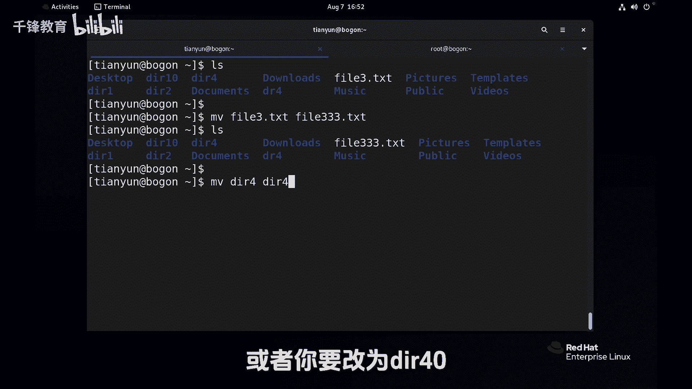
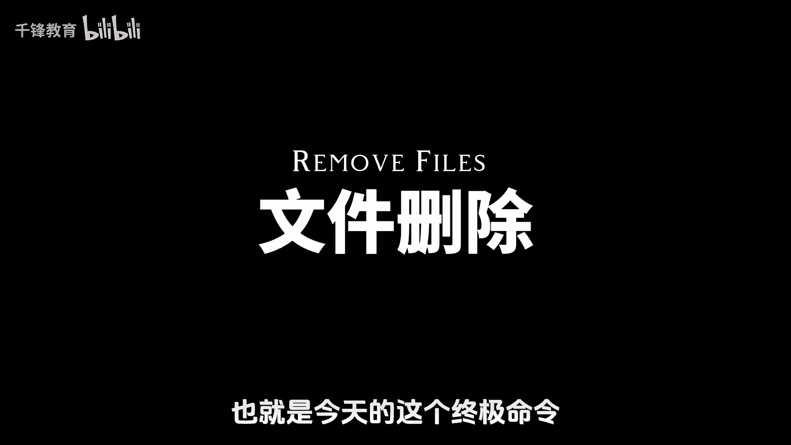
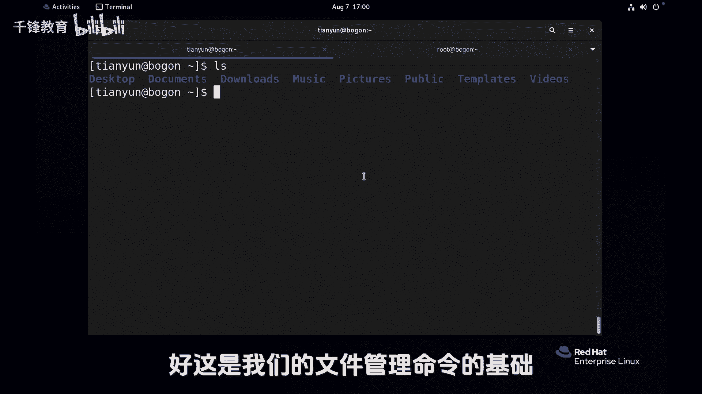

# 史上最强千锋杨哥Linux云计算入门教程，极速通关红帽认证RHCE（更新中） - P19：019.文件移动和删除 - 千锋教育 - BV19N4y1X79P

接下来我们来看文件的移动，那文件的移动呢也就是mp相当于windows里面的剪切，这个道理答案应该很清楚，他跟copy的区别就是原来的东西还在不在，比如说这边有一个叫file v didc文件。

我们通过MV1啊file一点TNC，它也是源文件，目标文件如果没有起这个文件名的话，自动就会是原来的文件名字移过去，移过去以后呢，我们再看当前位置，FIL1不见了，同样非要二点TXT1到TMP下去。

表示叫做6file2TC，这是连移动带改名了，这个没问题，来检测一下目标位置，dmp new file的VCU，如果在当前位置移动，比如说mv file3file333回车好，大家看到这里相当于改名字。

当然它也可以对目录进移动，MVDR4就是改名了，或者你就改为DRDR四四十没问题啊。

这个MV呢特别特别简单，那下面我们就来说一下文件的删除，也就是今天的这个终极迷你。

那网上大家比较习惯说山根的这个操作，那就是典型的RM mini RM rf根，现在呢我们就来看看rr mini有多么的豪爽，首先这是我们当前内容，删除FIL333没问题，文件没问题，目录的话。

删除的这个不用想，肯定不让删，再加一个R选项，也就是DR2后面那个项有没有都不重要，DR一一起删吧，四一块删好，删的很干净，还有一个DR40没有删，删的时候也没有什么提示，也没有什么交互。

里面有内容也没问我们一下哇，删的太豪爽了，所以说普通用户删呢，你发现这个权限感觉很大，其实它并不是很大，音响删别的你也删不掉，当然我们也不要轻易去试一下啊，这是管理员，首先我们给大家切换过管理员的话。

先删个文件试试，File2，这管理员上来就让我们这个要放个外，这太痛苦了吗，管理员看来真的是很严格呀，刚才说过，如果说你是管理员，你在执行这个命令的时候，你真的要特别小心，曾经我就犯过错。

我会给大家讲一下这个错误是怎么产生的，然后大家谨记于心，所以删除比例请大家务必要特别小心，要说什么呢，为什么管理员删的时候就只有提示呢，就杀一个目录的话呢，也很痛苦，你杀一个目录，我们考一个目录过来吧。

将etc目录跑到这来，这个大家应该看得懂啊，来我们删一个试试，RM肯定要加R选项递归嘛，ADC注意这个ADC不是那个ADC啊，我真是给我胆子，我也不敢删回车，他说什么怎么1YY吗。

哇这个Y简直是要这么说吧，太痛苦了，不可以，CTRC吧，我取消太多了，这个之前大家应该领教过，为什么是这样呢，因为管理员使用的RM，他这个命令是一个别名，直接就是一个别名RM杠I啊。

当然我们杠A的话是看他所有的命令啊，B它也是两个，一个是传统的地道的RM，一个是这个RM杠I，你默认使用的这个I就是要交互，那这个时候怎么不用呢，那我们可以利用一个F选项。

也就是force强制选项都提示了，但你也可以使用把别名去掉，用我们前面讲的方式，所以RM gr f是一个比较厉害的选项啊，那这里呢还要给大家说一说一件事情，你看这个地方EDC文件夹已经不见了。

我们再考一个过来，把那个etc拷过来，叫EDC1，再考一个叫EDC2，考俩过来了，如果说这样删的话，注意这个有没有斜线，我跟大家讲过不重要，不要太纠结这个斜线，这不就是我随手补全的吗，回车好。

我问大家一个问题，它是将etc整个文件夹删呢，还是将TC下面的内容删了呢，将EDC整个删了，那如果这样删呢，E d c2，各位猜一下什么结果呢，这个删的是EDC2和它下面的所有文件。

还是只删的是DCL2下面的文件呢，答案呢在这DC2已经空空如也，所以这个RF命令真的是很豪爽，就算你有I也可以干掉，所以管理员千万小心，那刚才我说的是那个错到底是什么，怎么引起的。

我是曾经在一台服务器上面，我当时我使的是管理员，给大家说一下，我本来是想删除home下的天翼云下的etc的，这是我想要的效果，我是想这么干的，但是我那个手啊，不知道怎么就欠我输的都还没有输到。

那我就回撤了，所以最后我立马CTRLC，我都发现呢都差点来不及，就已经把好多文件删掉了，你哪有系统款呀，特别是你是管理员的时候，就算你不是管理员删的时候，你也给我使用相对路径，什么意思。

去哪home下的天云，你现在你这么扇，你能扇出什么羊来，你别再从根开始打了，你会不会路径尽量使用相对路径，也就是说你去到这个目录，眼睁睁的看着他被干死，手下的路径，当然在脚本里面呢。

张哥也是犯过天大的错误，在脚本里面一定要使用绝对路径，但是在命令行人工来做，请使用下载路径回车好，这就是我们的RM命令，见鬼杀鬼，请大家务必小心谨慎，平时呢还是使用我们普通用户啊，万不得已的时候。

有需要的时候再使用管理员好，这是我们的文件管理命令的基础。

