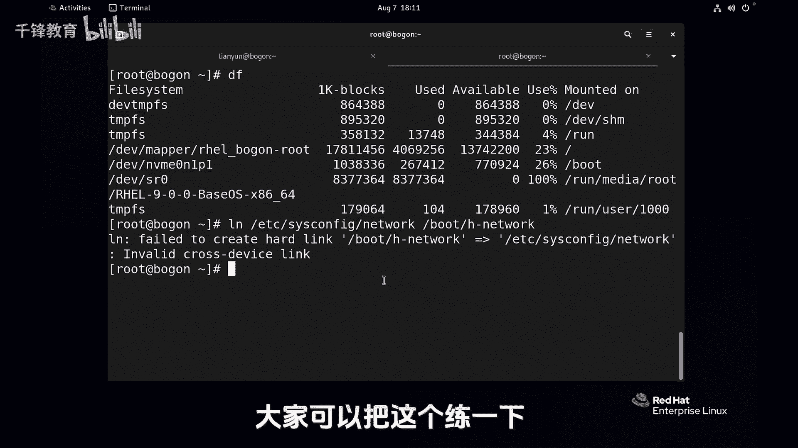

# 史上最强千锋杨哥Linux云计算入门教程，极速通关红帽认证RHCE（更新中） - P20：020.文件链接-硬链接 - 千锋教育 - BV19N4y1X79P

下面给大家介绍的是LINUX的文件链接，也就是说我们可以通过链接的一种方式呢，可以呢把一个路径比深的文件啊，给他做一个比较简单的一个访问的入口，有点像windows的快捷方式。

但是LINUX远远比windows要强大得多，因为LINUX它支持两种链接，一种我们叫一连接，一种叫符号链接，也称之为软链接，那下面我们来看看这个实验啊。

首先我们在这边呢来创建一个文件，好比touch一个file一点TXT，但是这个文件没有内容，没有内容怎么办呢，今天我们先前瞻性的用一下一些mini吧，比如说他一个杨科这几个字先用一下。

我们大家先不用太纠结这个文件呢，我们先看一下，首先LS啊，杠L大家都知道这个是用来看文件的长列表的，我们可以看文件的详细信息，当然其实在LINUX里面呢，你可以直接使用LI，因为它有这样一个别名。

它相当于就是IOSGL，大家不妨看一看是不是这样的，有一个原因就是IOSGL，并且还显示颜色呢，所以我们就大胆的放心的用这个LOL，就可以显示当前所有文件好大家看到这里，我们教大家认识一下啊。

第一个是文件的类型，D呢表示它是一个文件夹，也就是一个目录，而这个小横杠表示他是一个普通文件，也就是常规文件，除此以外呢，大家可能看到在这一列有一个数字，这个数字呢好像文件夹是二个文件是一。

这个表示文件被硬链接的次数并链接的次数，那现在是一，因为当前就这么一个文件，我们再来用一个叫杠I的选项，注意这个I呢不是那个交互的意思啊，是IO的，我们叫索引节点，就是每一个文件实际上它都有编号。

我们可以简化一下了，L就看FIL1就内容就少一点，但忘了加了个杠I了，但你也可以使用LI，像这样LSLI没问题，只不过习惯了，那就把那个L去掉吧，就这样OK了，他的这个编号是50641747。

他这个不是一定的，就看那个存储的位置，目前这是一个一啊，内容呢，你现在访问这个file1没问题，是这样的，那我们怎样给文件做链接呢，用这个link nn link这个命令，首先跟源文件。

原文件呢就是我们的file1跟目标文件，也就是你要链接的那个链接成文，那个文件，比方说叫做H杠file一点TXT，就是我们哈link1011年间，这个时候呢我们来看一下这两个文件。

这两个文件的颜色都一样的，而且大家注意到没有链接的次数，加了个一，我们并不知道他俩是不是一起的，是不是同一个文件，但是有一点是肯定的，我们来验证一下他俩的链接数都是二，刚才还是一呢，对不对。

我们先检测一下内容，cat一下file1，这个就是我们刚才所谓的原始文件，它的里面内容是杨哥没问题，再看一下那个HFIL1好，也是杨哥没问题，那如果说你改了一个文件，我们可以试一下啊。

就先占用一下我刚才用的那个echo，怎么快捷命令调出来呢，CTRL加R海口这边以前忘了提醒大家，你想编辑的话呢，就先不要按回车，先按ESC，先按ESC就取消那个模式，我们来加点内容，杨哥天云好。

编辑一下，现在还没有学任何的编辑工具，所以我们就先占用一下这个mini啊，看起来有点复杂，我们后面会讲到，我们来验证一下这两个文件是不是发生了变化，我们改的是file1。

也就是我们心目中那个原来的那个文件，好没问题，我们再看一下file h file1好也没问题，那如果说你改了这个文件呢，那这个文件会发生变化吗，肯定的，我们看看file1和h file1好。

被小伙伴看到他俩的实际指向的位置是一样的，也就指向的是同一个索引号，同一个L的号，所以他俩实际上都是同一个，那如果我再做一个链接呢，给file1再指向一个地方，比如放到我们我找个地方啊。

file1倒贴P下去，file16点TXT好，那这个时候我们看有三个文件，首先这个file一点TXT，他给这个三哦，我们来看看他们三个文件啊，L杠i fail一点TXT。

HF一点TT还TB下的f file e6点DSD好，我清一下苹果，这三个其实是同一个文件，所以呢你对哪一个文件的操作都不会有影响，因为他们只要是同一个位置，同一个索引号，你访问哪一个文件都可以。

那这三个文件我问大家一下，比如说把这个FIL1删掉行不行，单纯命令我们学过了啊，把那个FIL1删掉，这两个文件还在吗，或者说他们内容还可以访问吗，首先我们再来向上看一下这三个文件。

当然我们清楚第一个文件已经被干掉了，我们回车看第一个文件其实已经没有了，同样的去访问什么，访问那个h file，一再访问呢，TP下的file16没问题都一样，那这种一年级的特点。

就是你给这个文件增加了链接的次数，你访问哪一个文件都是可以的，当这个最后一个文件被删除的时候，比方说对FIL1这个删了也没问题，还有一个就是贴P下的file，一六好，我把这个文件删掉。

也就是说一链接只有当最后一个链接，最后一个文件被删除的时候呢，那么这个文件相当于从硬盘上删除了，那你再也无法访问，因为你找不到那个位置，这就是一年级的特点，所以一年级很很强大。

那比如说我们现在换一个用户吧，我们守住的用户，免得大家觉得权限不够，比如说当前位置在这，在更加root下面，我们想将TC下的csconfig at work变到这个地方，叫什么，就叫at work。

我们看看这两个文件，DCC4config network和那个当前的network，他俩是同一个文件，所以你现在访问他俩任何一个文件都可以，这样的话你可以加一个很深的文件点到这边来。

一年级的这个特点已经大家很清楚了，这个确实是很帅气，但一年级它有它的缺陷，什么缺陷呢，一个是比如说我们现在普通用户吧，我创建一个目录，创建一个DR1，我尝试给DR1目录呢链接一个叫做DI2，他说不行。

一连接HARDLINK不允许对目录创建，也就是我们的硬连接，它只能对常规文件创建，这是其一，其二呢，还有一点它不能够跨这个文件系统，也就是我们常规讲的分区该怎么解读呢。

当然同样我们的普通用户可能没有权限，所以我还是切过来，现在我们先看一个命令，就是DF，看一下这边有两个分区，一个根是一个分区，boot是一个分区，也就是说你现在你你要在跟这个分区以内去，这个链接的文件。

硬链接好，没问题，就刚才我们都试了没问题，但是如果说你想将根下的文件列到boot下面去，或者相反从不念过去，那是不可以的，这是跨了分区呢，我们试一下LN1根下的EDC下的six。

Config network，还是这个文件，我们列到boot下面就叫H名，就HNE，反正不成功啊，好了，他说了不可以看到了吗，cross device不能够去跨越设备，不能跨越设备。

也就是说这个一年级的他有两个不能做的，一个就是呢不支持目录，只支持常规文件，第二是什么呢，是不能够去跨分区的专业讲教，不能跨文件系统的啊，前面这个叫分区或者叫设备，后面是文件系统，这是根文件系统。

这是我们的bot，因为这两个对应的是两个设备，两个分区，你可以简单理解为这个根就是一个像C盘一样，这个步骤呢可能是地板，像这样的，而他俩之间是不能互相做一连接的，一连接只能够针对在同一个文件系统。

或者叫分区上面，针对普通文件做，所以大家把这个限制一定要记住，好处呢就是真的是特别好，有时候防止文件被误删除，那你给他做个一连接或者做多个要多个一年级，他不是说复制了三份啊，或者复制了几份。

它也不会让你的空间变大，它只是创建了三个文件，它其实指向的是同一个位置，所以这个是很帅气的，windows不具备这个特性好，这是我们LINUX里面的第一种连接，我们叫E连接。

