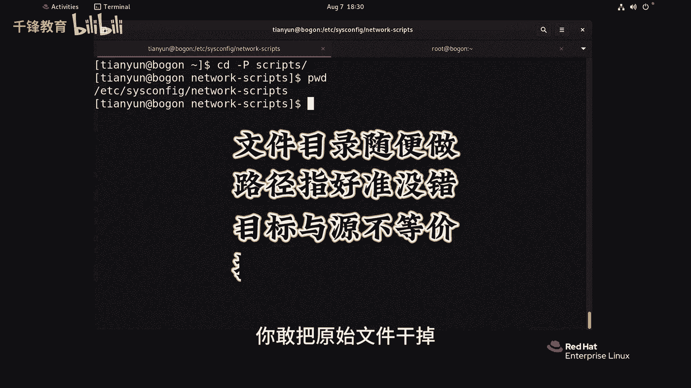

# 史上最强千锋杨哥Linux云计算入门教程，极速通关红帽认证RHCE（更新中） - P21：021.文件链接-软链接 - 千锋教育 - BV19N4y1X79P

符号链接也就是软连接，它们都可以干，这目录也可以，下面我们来做一个演示啊，首先在这边呢有一个DR1的目录，我们在DR1里面创建一些文件，比方说不要到file10。

好看看DR1里面有这个file1file10，我们现在对文件做一个软链接看看啊，在这边还是按我们之前的这个用法，两颗到一个文件里面去，到比如说猪猪侠点cs里面去，软连接的方法就是这样，LN加一个S。

这个S就是连接的选项，链接文件叫S主持下吧，好各位看看这个软连接呢，刚才不一样了，那首先我们加杠I吧，这两个文件，这个文件和这个文件完全不像纸箱的桌子，两个地方，一个是9021903。

后面呢我们看到这边有一个有一个指向S，而且颜色也变了，是这种淡蓝色，最关键是这边显示的是一个L，也就是这是一个非常明显的什么链接文件link，它指向的是猪猪侠点TXT，当然访问任何一个文件都没问题。

你看访问这个S杠猪猪侠没问题，访问这个也没问题，就是关于这个文件的这个符号链接，那你改任何一个文件呢也都没问题，这是文件，那我们可以目录来做一下看看啊，现在我们每个目录叫VR1LN。

然后杠SDREDIE，后面到了六点L看一下好，非常清晰，而且前面也是一个L显示一个那个link，最关键是大家有注意到没有，刚才忘说了，这个文件的链接数并没有被增加，只有一年级的链接数才会增加。

而符号链接的链接数是不会增加的，我们现在使用的用户啊，我们看看这两个文件EDCR的cs config work，这个文件ESC加点啊，回到上面我们的这个另外一个文件。

boot下的s network指向的是这个位置，我建议大家在做软连接的时候，一个符号链接的时候尽量跟上全路径，也就是绝对路径，否则可能会造成一些不必要的麻烦，所以符号链接它的灵活性是很强的。

或者软连接的灵活性很强，但是对它肯定有它的缺点，现在如果你把这个文件删了没问题，当然一个文件可以做多个符号链接啊，我们再给这个叫猪猪侠的做一个S2，当猪猪侠你看到了吗，这两个文件都是同一个。

这个文件没问题啊，那些吸收率没有增加的啊，而且它们的大小都会容易小，就一样大，现在我们如果把这个S2文件删了，不影响的，各位，你现在无论访问S杠猪猪侠，还是那访问猪猪侠都没问题。

但是有一点各位如果说你敢把这个删掉，那就出问题了，来试一下，我们直接就删除，这叫原文件，这才是原始文件，删了以后哇，大家看到这个颜色就很清晰的提醒你，它所指向的链接失效的。

这个在我们的LINUX里面叫什么叫悬空文件，就是悬空了的，它没法落地了，所以你现在敢去访问这个叫S这个文件名还在，但是呢它没有内容了，他找不到里面的内容了，因为在纸箱的那个猪猪侠给死掉了。

那么这个尾翼呢留着它也没有什么价值了，但是有个陷阱，什么陷阱呢，这个文件不是已经没了吗，原来内容各位应该知道叫什么杨哥内容，那现在大家想象一下，如果现在我们在当前位置，创建了一个同名的文件。

我们怎么创建，我们就踏实一下，或者说换一个内容来带内容的，这个时候我们就换个111，到这个叫做猪猪侠也贴上去好，我不知道大家听明白我的意思没有，其实原来的那个猪猪侠已经死了，因为他死掉以后。

让这个符号链接从此就失效了，变成了悬空文件，但现在呢可能是因为某种原因呢，又投胎来了一个，那昨天来的这个新的呢，已经不是那个猪猪侠内容了，这个新的猪猪侠已经变了，那试问各位上面那个S猪猪侠。

也就是那个连接它现在的状态是什么，是悬空文件吗，答案是不是相当于你跟你对象给踹了，她哭了一段时间，她没有依靠，但是又来了一个新的，找到了新的依靠，她就不再管你了，所以你看这个新的S猪猪侠内容也变了。

大家都明白了吗，所以呢这个你要注意，你被女朋友给甩掉以后，只要来一个备胎，和你这个名字是一样的，大家很关注你吹过你吹过的晚风，那我们算不算相，这就是我们的符号链接，它的一个特别的副作用吧。

也是这种悬空文件，理论上讲悬空文件就已经没戏了，完蛋了，因为它的原始文件都丢了，它有啥用，但是呢不小心又来了一个同名的文件，那这个时候苹果文件呢又出现比较正常了，但是我觉得这个文件图像也罢了。

要他干什么呀，都换了，你你还依靠着这肯定不合适，我们的这个符号链接，还有一个点啊，大家看一下目录的一个概念，我看看我能不能做这样一个链接啊，杠s etc下的cs config mework，Gps。

这个目录不是很长，各位我连接到当前这个位置就叫CRIPTS，看行不行啊，我们挨了挨了可以看到了吗，就是你现在访问clips的话，这边有一个连接文件就叫scripts，不要这么访问啊，只要看的方法不对。

来了来了，哎有时候不定怎么怎么，我刚才看文件的时候，LL就可以就可以看到这个文件的详细信息，看文件夹不可以呢，是这样的，我大概讲是这样，要注意一下，我们LS要加一个或者L加一个杠D。

你看我两次看什么区别啊，我们就拿先拿同一个目录来看，我们拿一个叫DR1来看啊，LDR1他看到的是他下面的内容，注意到了吗，如果你只想看这个文件夹本身的一个，相关的信息，那就加一个GD就可以了。

我就看目录本身directory信息看到了吗，各位走到这里了，L看key scripts不要加斜线，好，看到了吗，它指向的是这个e DC is config network。

所以你现在CD到scripts里面去，它变了吗，没变啊，当然本身一点也没什么内容，我们先回答一下，先回退一下，也就是说我现在CD到IPS里面去，他的这个路径，就是我们当前home下天雨下的scrips。

它并没有到实际的路径里面去，这个路径是链接文件的路径，那怎么做呢，CD杠p scripts这个P呢就是我们的physical物理，各位看变化啊，回车我们如果加杠P的话，它会直接杀到真实目录的路径里面去。

而不是链接文件的目录，所以大家注意到没有，这是我们的这个符号链接的一个特点，包括它的制作的方式，还有它的优点，优点是想一见的，你随便做对文件，做对目录做都可以，只要路径就好了，就没问题。

但是呢也有它的副作用，就比如说它的链接文件和原始文件是不等价的，你敢把原始文件干掉。

你就做多少个编辑文件都没有用。