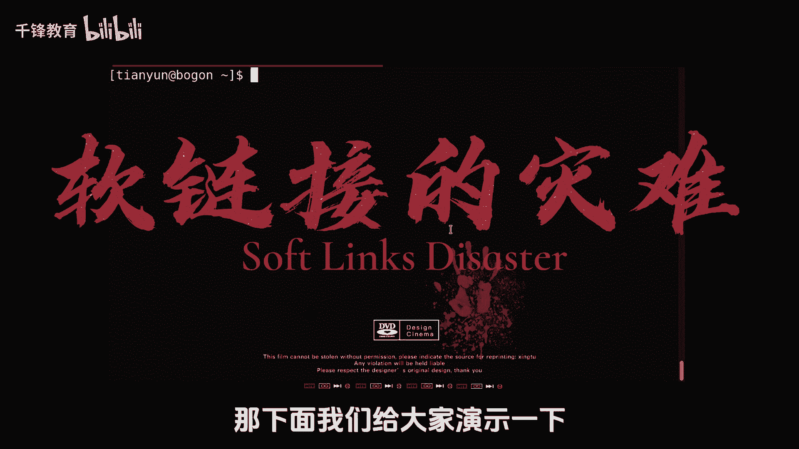
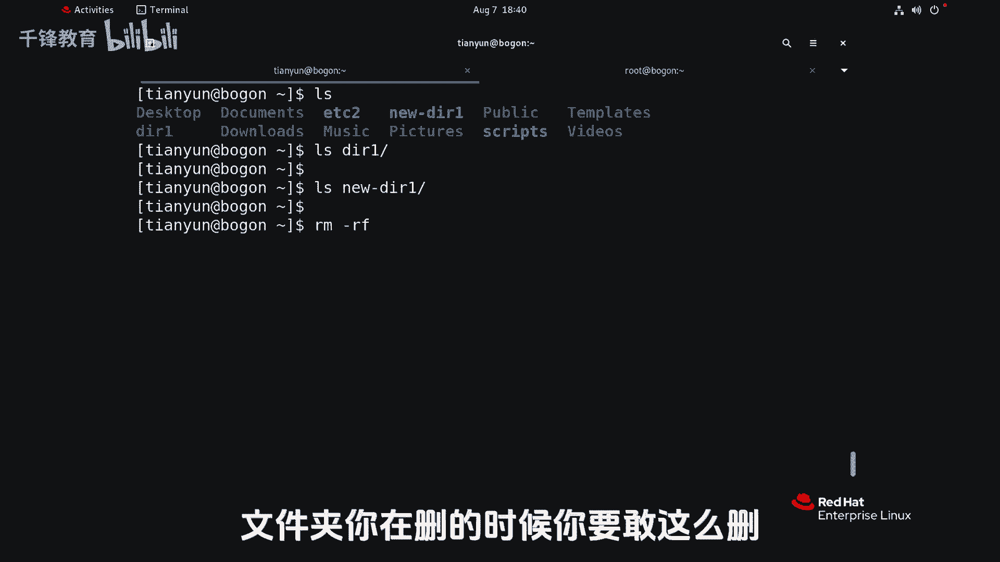
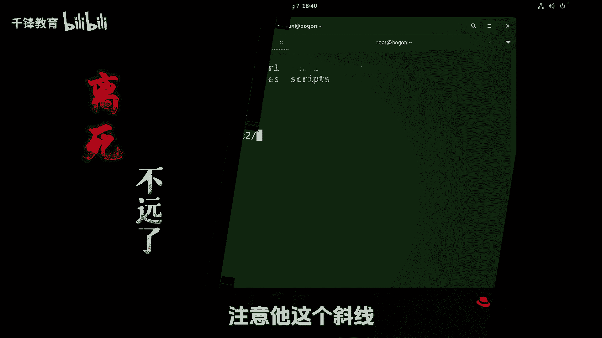
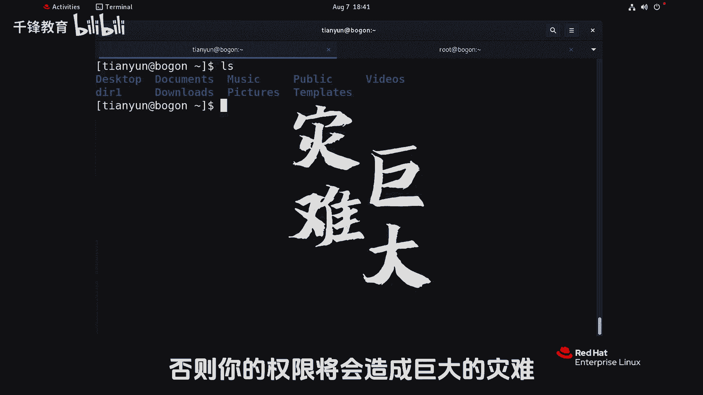
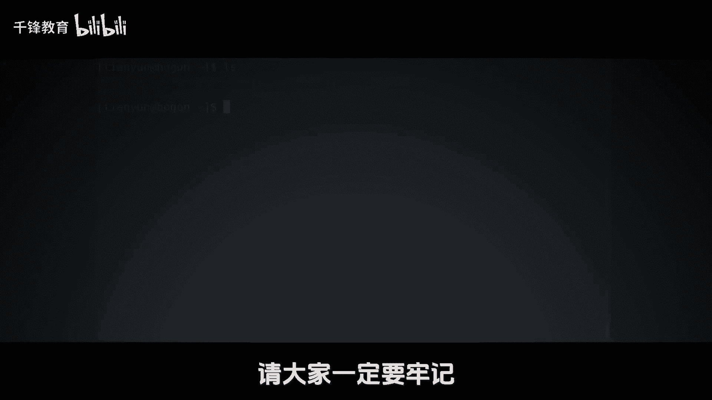

# 史上最强千锋杨哥Linux云计算入门教程，极速通关红帽认证RHCE（更新中） - P22：022.软链接的灾难 - 千锋教育 - BV19N4y1X79P

下面的关于连接文件内容很短，但是如果你不知道的话，可能会是灾难，那下面我给大家演示一下啊。

首先我们符号链接，大家知道是可以对文件夹做的，也是可以跨文件系统的，那我们就可把EDC这个文件夹引到这个，当前我这个位置，这是普通用户可以看到点到当前就叫EDC吧，叫EC2，好。

各位看一下这边EDC2指向的是真JEDC，当然如果大家知道的话，可以开L杠DEDC2，不看到了吗，一个斜线一个不带显示还不一样，带斜线那个直接是D，这个实际是L先不管那些哎，现在干什么事呢。

这个符号链接删除怎么删呀，是不是直接删了，我们看试一下RM r f e c2哇，他怎么就报错呀，各位这不就是链接吗，现在好像在删真实文件啊，我想告诉各位的是，如果说你是root用户。

假如说你也做了这样一个动作，EDC连软连接符号连接连到当前，比如说叫EDC没有，你看看会有136，你要是刚才做了这样一个动作，ac6回车，那你可能会被开除了，我是不敢这么干的，为什么呢，看看效果。

我们拿一个不相干的目录，或拿一个内容不是很重要的目录，给大家做个演示，因为这入的用户太可怕了，幸好没有听大家的，直接敲命令回车好，那我们制造一个场景吧，我先来看看这里面有一个DIE的一个文件夹。

里面有内容好我们该做一个符号链接，做了是吧，做了个6DIE，那就只用它就行，6ti一样的内容，现在我们要干嘛呢，我们要删除这个符号链接，6ti1好，请注意看啊，RM杠IF这个没毛病啊。

回车事件传的对不对，回车好痛快，没问题了，但是大家发现这个6TRE怎么还在呀，不删了吗，但是呢请注意，看我们的DIE下的内容已经没了，6DIE里面内容吗也没了，所以说删除符号链接，就像我刚才一样。

千万注意，一定要特别注意这ADC2怎么删的，不是那么删的哦，说的是目录啊，文件好说，特别是目录文件没有没有什么毛病，你随便删呀，我念加你在删的时候。

你要敢这么删回车，如果你还是受到用户，那你就离死不远了，所以他这个斜线和我们之前讲的还有点小区别。

这个链接的文件，你不要把它看成是真正是一个目录啊，因为你斜线table键，你过去哇塞，他就看到那个目录下面去删下面的文件了，所以删链接文件的时候，这个软链接的时候，你要删目录的时候，后面一定不能有信心。

因为我现在没有权限，所以我删也删不掉帧EDC，但如果说你是一个管理员的话，你像刚才一样，你要删了一些六，像这样回车，各位想看效果吗，想看效果的话呢，我们也可以恢复一下，你自己可以试一下。

反正我不想看效果了，我这么扇就行了，老老实实规规矩矩的删就可以了，好特别注意你要扇木木的这种软连接的时候，请大家注意不要加斜杠，否则你的权限将会造成巨大的灾难。

所以我专门拿了一小节给大家来，特别的重申一下这个事情。

