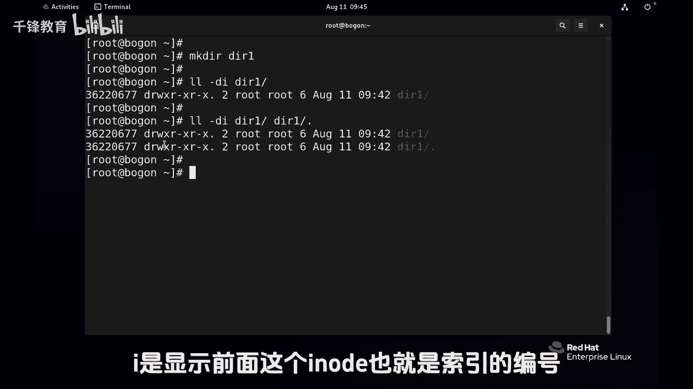

# 史上最强千锋杨哥Linux云计算入门教程，极速通关红帽认证RHCE（更新中） - P23：023.为什么根目录的链接次数是18？ - 千锋教育 - BV19N4y1X79P

下面给大家一个问题啊，一起可以思考一下，我这条给你了杠D跟查看了根的详细信息，注意这个位置，18这个位置这个数字它到底是什么，当然可以这样写，两个选项可以分开在一起，也可以写到一起，然后我们再看一下。

大家知道根下面呢这是第一个目录啊，当我是空格分开了，但是默认就有空格啊，根下的比方说点点，大家还记得这个点点目录吗，它是隐藏目录，每一个目录里面都有一个点点的目录，还有一个点的目录。

而且呢还有一个更加的点，这三个位置各位看一个是根本身，一个是呢根下的点点，根下的点好，大家注意观察啊，三个目录是一样的，他们的L的编号都是128，我们看一下根下的，还有一些其他什么目录啊，S根太多了啊。

首先L杠D比如说根下的AFS，它下面的点点是谁呢，其实也是根它下面的点点，就是它的上一级，这个点点呢也指的是根啊，我们把前面敲上，我们要对照来看根下的AFS下的点点好，大家不要不要觉得有点乱，这是参数。

这是跟这个目录，这是根下的点点目录，空格根下的点目录，这是根下AFS的下面的点点点目录，所以大家不要觉得很混乱啊，慢慢的习惯就好，大家发现根下的AFS的点点它也是128，其实也指的是根。

同样呢我们再往下走，表示根下的啊，put下的点点EDC下的点点，media下的点点好，opt下的点点，root下的点点，根下的cs下的点点，天下的USR下的点点，根下的DEV点点。

tom下的点点是MD下的点点是PLC下的点点，海run下的点点SRV下的点点，tb下的点点，还有一个是VR下的点点，回车以后可能显示内容比较多，我这边如果没有打错的话，应该把所有都列出来了。

你看这些目录下的点点都是都是什么，128比例都指的是根，这个是根，最下面点点是根目录下的点，也是根目录，所以呢我们的练习次数，细数下来好像有点不太一样，应该是19个，我们用一下后面我们要学到的知识管道。

给WC统计一下L啊，这是19个，但实际上呢我们知道这个位置呢是这个是18，跟实际上是特殊的，因为跟目录跟别的目录还是有点小区别，虽然说我们感觉这三个应该是三个，最下面的是16个。

16个加上面三个应该是19个，但实际上呢这个根呢比较特殊，他的这个根目录本身应该是不能算的，所以它其实只有两个，但是其他目录呢我们再来看一下啊，现在大家记录是18个对吧，我们在根目录下面。

注意我这边是管理员啊，在根目录下创建一个div目录，L杠D杠D，然后跟大家应该能猜到这点成了19，为什么49呢，也就是说在这下面的DR一下面也有一个点点，这个点点是谁呢，就是根目录，所以变成了19。

看到了吗，那如果删除一个目录，也就把这个目录删除，RFDR1别删错了啊，因为这是管理员一定要小心好删除一个目录，这个时候呢就变成了18，那现在呢我们再给大家举一个例子啊，你看如果我现在新建一个目录。

就在这创建吧，叫做DR1，我们想要看这个目录的信息，大家可以猜一下这个目录呢，它的那个链接位置是几呢，可以把它打在屏幕上啊，杠D注意看目录一定要杠D，如果你不加D呢，那就直接看到下面的。

至于后面这个斜线有没有，那都无所谓，加一个I的选项吧，反正一会儿也想也想用好，这个数字很大，因为这是个新的，人家为什么排的比较早啊，128，那是因为你是先来的系统创建的嘛，我们这边都比较新的啊。

你别管这个速度是多少，总之呢这边是二，那为什么是二轮，因为这个目录本身和这个目录下面的，大家一定要注意这个斜线，这个斜线呢是我不全的时候造成的，有没有都可以，一个是DRE，一个是DIE下面的这个点点。

这个目录点目录我们说一直是自己对吧，好卫生，大家看到他显示的就是两个，每创建一个目录呢，它的这个连接次数呢默认就是两个，因为它下面如果还有新目录，这个次数也会发生变化，但有同学说我们之前讲到的这个链接。

好像不能针对目录是吧，只能针对文件，当然一年级还有一些别的限制，比如说不能跨分区，跨文件，系统不能针对目录什么的，但是我想说的是呢，有些东西呢应该是系统保留的，这个默认我们是不可以做。

但是系统是可以可以使用的，所以呢在这个位置，大家注意到，连续次数就是跟这个目录的一些点和点点相关，所以在此我们也看到了，那个点和点点到底是什么，点自己点点是什么，是这个目录的上一层，也就是上一个目录好。

这个大家可以测试一下，去查看一下，别忘了加这个DD选项，因为只有D选项呢才是查看目录本身，I呢是显示前面这个i load。

