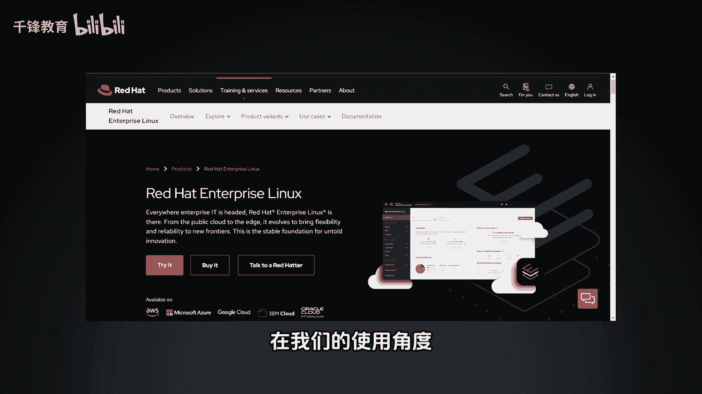
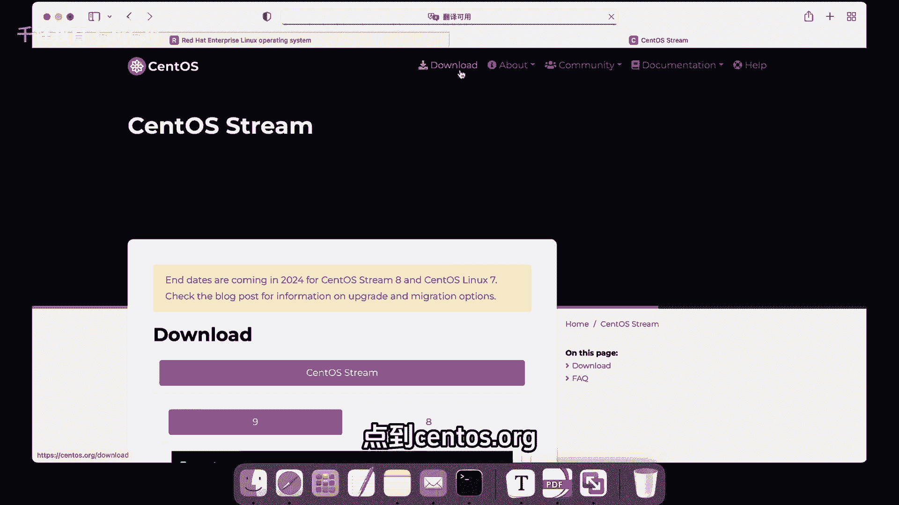

# 史上最强千锋杨哥Linux云计算入门教程，极速通关红帽认证RHCE（更新中） - P2：002.Linux系统安装包 - 千锋教育 - BV19N4y1X79P

零基础学it进大厂，拿高薪就选千锋教育。

我们在学习LINUX之前，第一步就是我们得先有一个LINUX系统。

那这里呢有两款命令系统，一个呢是咱们的呃红帽LINUX啊。

red hat我们叫做红帽的企业版啊，简称为RHEL红帽的企业版LINUX，另外一个是CTOS，它有两个版本，一个是森TOSLINUX，这个其实已经现在没有了，现在主要是它的一个另外一个版本。

叫做cbos stream，这个版本我建议大家这两个你都可以试一下，或者拿任意一个都没问题，当然最终的考那个C的话呢，要必须要使用这个企业版啊，但这两者在我们的使用角度。

基本上没有什么太大的区别，所以大家不用纠结这一点了，如果说你使用的是这个企业版的话呢，呃那你首先可能需要去他的官方网站，red heart点com这个网站。

然后去下载来下载呢，这边有一个产品就叫做red heart and press and pass linux。

我们简称为RHEL，红帽企业版的那个点进去以后呢，你可以通过这个去购买或者是去试用的方式，它会有一个60天的一个试用期，这个试用期当中你可以去订阅一些东西，或者说你可以去更新页内容之后呢。

你还是可以使用哈，它不需要说你过期了就不能用，只是没有这个相关的升级这样一些服务了啊。

那这边呢也可以去使用这个我们的snow dream，点到这个SNOS点org这个站点啊。

然后去下载，那这边它提供九的版本啊，还有八大版本，那我们一般选择九。

如果说你这边不知道怎么从红帽官网下载的话，那也没关系，我这边已经给大家准备好了，这个版本啊是我们的9。0的一个版本，大小呢是好几个G。

可以给杨哥这边要一下啊，一键三连加关注。

