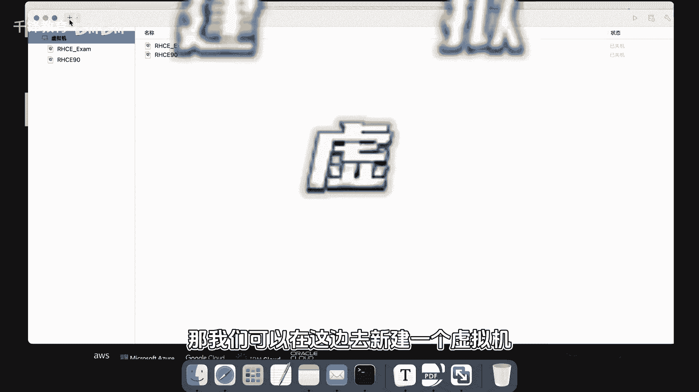

# 史上最强千锋杨哥Linux云计算入门教程，极速通关红帽认证RHCE（更新中） - P3：003.Linux系统安装 - 千锋教育 - BV19N4y1X79P

零基础学it进大厂，拿高薪就选千方教育。

那我们就直接上手，准备开始来部署安装，那我们可以在这边去新建一个虚拟机。

虚拟机软件呢，简单的讲，就是可以让你在一台计算机上面去。

再模拟其他的计算机，就像你又买了一台电脑一样啊，把这个镜像拽到这来，拽过来以后就开始一步一步的去进行安装，点击继续啊，还要使用什么快捷安装，我们就暂时不使用快捷安装了，好我们点击继续使用默认就行。

不用过多的去做这个配置好，这些呢也是一样，我们使用默认就行，来让你起一个名字，让你把这个虚拟机放在哪个位置啊。

也默认吧，1米2也默认，但不改啊，那这边呢我们就开始运行，大家看到他有一个倒计时。

有两个像，第一个是安装安装我们企业版的mix9，第二项呢是先测试一下媒体，就测试一下这个ISO，你下载的时候是不是有问题啊，我们不测试了，就直接安装企业版。

九六点这个开始，那如果v vm work会装什么的啊，那这边我也可以再出一个小视频，给大家去演示一下，那下面呢我们到底是选中文还是英文呢，说实在的呢，没有必要选中文。

因为我们的LINUX系统呢它不是用来玩游戏的，所以你也不用装什么中文，就直接使用英文环境就可以，这样的话后面的一些显示什么的，都不会说出现什么异常之类的啊，行那点击继续英语啊，ocean的英文。

所以呢给大家简单的解释一下键盘，别管他默认就行，连到红帽没有注册，对我们是没有注册啊，我们是试用的，第三个是安装了一个分区，安装分区这边有个箱子，有个叹号，大家也注意到这边的这个开始安装，是不让你点的。

也就是说你得点一下，点一下这个地方分区的方式，其实是可以点击手动分区的，看到这边有一个自定义分区，这边是一个这个叫自动分区，我个人觉得没必要在这炫什么东西，千万不要去走这一步。

因为你不清楚你走这个干什么，那你就按照最原始的最简单方法走就行，点击这个完成就可以了，那这边大家看到他其实就是帮你做了自动分区，然后还是不知道你下一步原因是什么呢，原因是这边还有一个密码要设置。

当然还有什么时区，时区的话，这边还是得强调一下，你得选择亚洲上海，当然也不用改了，还有这个安装的软件选什么，它有很多种选择，比方说这个GUI就是图形的意思，就是安装以后呢。

你的LINUX是有graphic图形接口，图形界面，其实这玩意重要吗，我认为一点用都没有啊，你选图形界面，这个大象以后右边还有很多小项，你还可以选择什么什么DNS服务器啊，文件存储服务器啊。

MDB服务器，你不用担心任何你今天错过的，我们后期用啥再装啥，在需要的时候装，我们尽可能的保持一个原则，让我们LINUX瘦身轻松一些，跑得快，我们继续下一个就是server，它是没有图形的。

还有什么最小安装工作站自定义训机，说白了呢前两个记住就可以了，你喜欢图形选这个，不喜欢选这个，所以呢默认吧说了这么多，默认了，后面再紧接着呢，还有呢就是网络的方式，这台这个机器呢能不能联网啊。

当然默认呢也是可以的，你看默认的话，它是给我的笔记本一样的联网的方式，还有这个密码，我们得设置一个密码，就LINUX的最高权限的用户叫做root r o o t。

windows呢叫做ORGANIZERO，那这两个都是两个系统的最高级别的长官，他可以有任何的生杀大权，他能够成就一切，也能毁掉一切，所以root这个账号呢，我们在后期是不会上来就用的。

那密码设的复杂一点。

重复一下，复杂一点，当然这边他给我一个提示，说你的密码其实是太简单了，在生产环境里面。

你要是敢搞这么一个密码，我想说的是你的服务器很快就会被攻击，被人扫掉，扫描到，然后连上植入木马之类的，所以是绝对不可以的，必须要使用英文字母数字大小姐扣除符号，好杨哥死的神密码了，给大家见识一下啊。

这边有个小眼睛，点开一下是read hard，因为这个红帽我是比较有感情的，所以我就谁的hard，但是你们呢就不要这么用了，否则的话会死的很惨啊，为了我们初学者不要制造太多的障碍，一我不锁定入的用户。

就是我们可以使用的用户登录的，从本地登录也可以，第二呢我们允许远程也能够使用的，尽管这种风险很大，就这样了，不行是吗，再点一次，哪儿都不行，必须是他还有一个是用户创建，他说没有用户创建。

这段是什么意思呢，我刚才差点丢掉了哈，这个其实当然你先点个安装也没问题，因为最后呢装完以后，他发现你没有创建一个用户，他说哥们儿，你这个挺可怕的，你现在就只有一个录的账号，权力太大了。

你应该平时你应该使用一个普通账号吧，否则的话太危险了，所以我们就老老实实吧，今天就把这事干了，不然的话后面再提醒我们，好像挺没面子的好，我们创建一个网络账号，这个用户名叫什么呢，天云嘛。

然后把它设置为管理员算了吧，没必要啊，我们有一个管理员，还搞一个管理员干什么，不要这么做，然后需要一个密码使用这个账号，当然这密码叫什么呢，叫杨杨哥天云啊，给大家看一下，杨哥天云。

我看了两次密码输的是不一致的啊，是的好，各位朋友帮我记住这个密码哦，我自己都记不住这个密码，密码比较简单，所以人家还警告了我一下啊，你还警告不警告跟我有什么关系啊，那下面点击安装。

这个安装过程呢是一个相对慢的过程。

那我们就不等了，那我们下一小节呢就从那个安装完的时候开始，一定要跟着天云老师的步伐啊。

放心啊，我们绝对带大家通关一键三连。

加关注。

