# 史上最强千锋杨哥Linux云计算入门教程，极速通关红帽认证RHCE（更新中） - P4：004.Root账号和普通管理员账号登录 - 千锋教育 - BV19N4y1X79P

我们继续来学习红帽LINUX，这边我们直接双击打开这个虚拟机，它显示已经安装完成了。

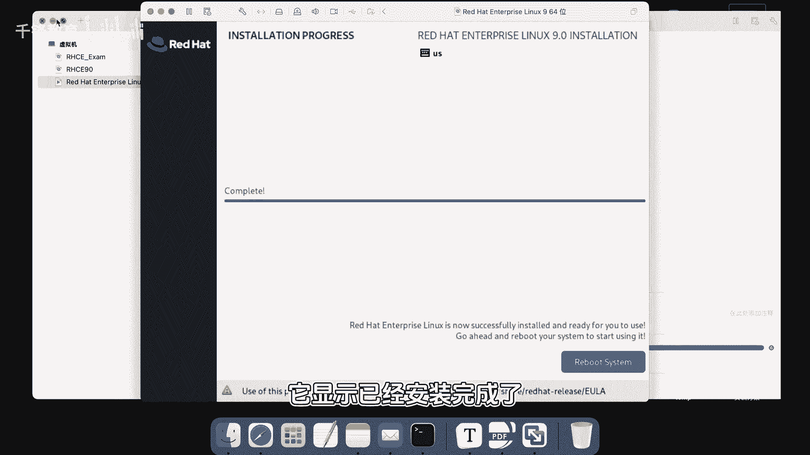

然后可以直接点击reboot来进行重启，这个重新启动以后，我们把这个界面最大化一下啊。

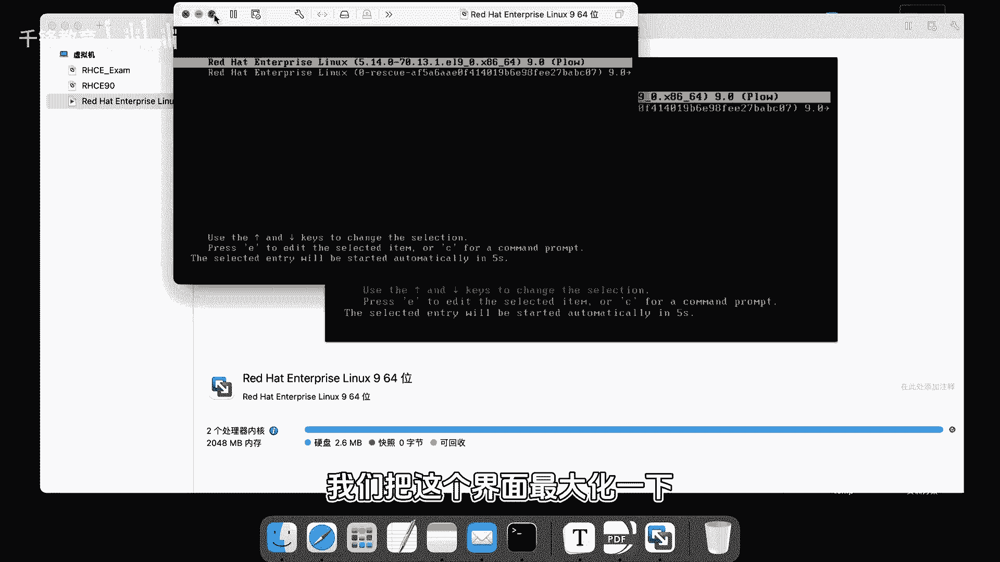

同学们看啊，这个是哪个用户啊，大家还记得有两个账号对吧，一个账号是root账号，也就是我们超级管理员，一个账号呢是我们的普通账号听名啊，这个是我们自己创建的，当然在这边呢其实也可点击关机啊。

暂停重启关机都可以啊，除此以外呢，下面呢有一个not least，就是没有列在这个表当中的，也就是说如果说你使用天云账号登录的话，那就点这当就行，如果说你使用的账号登录呢，那就选下面这个标签。

这个位置就没有列在这里的账号啊，我们现在分别使用这两个账号登录，给大家看一下啊，先是这个天云吧，密码叫什么来着，杨哥嗯，没有地方点确定，那就回车就行了。

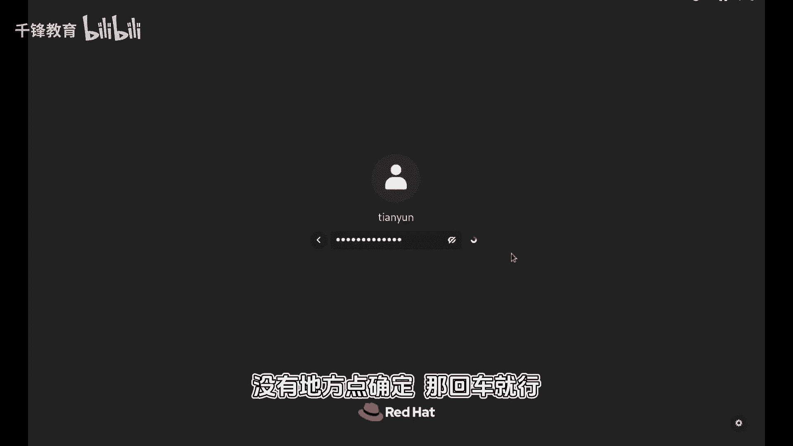

好欢迎使用LINUX，你要学习更多的东西啊，那你可以选择这个啊。

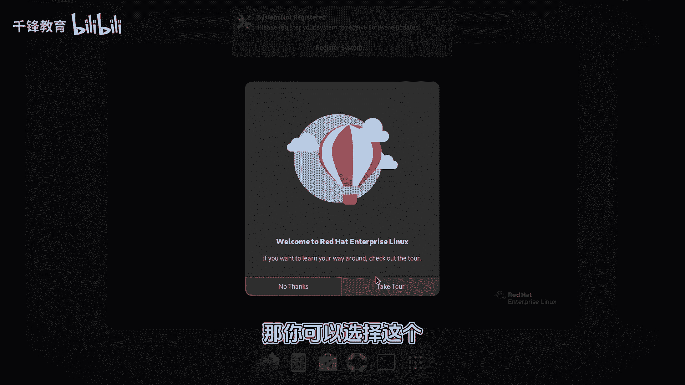

先LOSSE，另外我们也暂时不注册我们的系统，如果你安装的是那个斯诺as dream，这个是不存在注册的，也就是它本身就没有订阅服务，好下面呢这个有点像苹果的界面，大家看看这只小鸟啊，还有一个终端。

这个终端还可以在这边点，实际上我们的这个操作，更多的是使用这个终端的方式，也就是命令行的方式好，先等一下点起来啊，大家欣赏一下这个九的界面，九的这个这个logo，还有下面这个图标。

还有呢这几个钮还可以显示更多的一些菜单啊，另外呢在左侧还可以点，还可以切换多个屏幕，这东西对我们来讲的话，好像也没有什么太多的用处，然后同样在这里面也可以选择什么蓝牙呀，无线连接呀，设置啊，锁定啊。

还有这个关机关机重启退出，这个最后一个是灯珠啊，Logo out，不说别的。

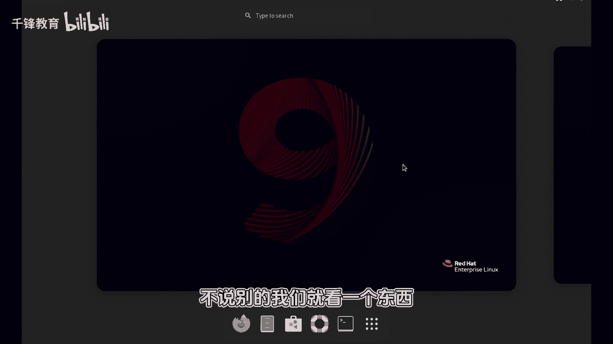

我们就看一个东西，我们点进去点了个中单，进来以后呢，大家可能唯一的认识的就是这个天云，这是我们的用户名，这些是什么东西呢，我们不着急来认识，所以大家也不要感到恐惧。

还有呢有一个钱的标志，这是个美元符号行，那咱们换一下啊，我们登出一下退出吗。

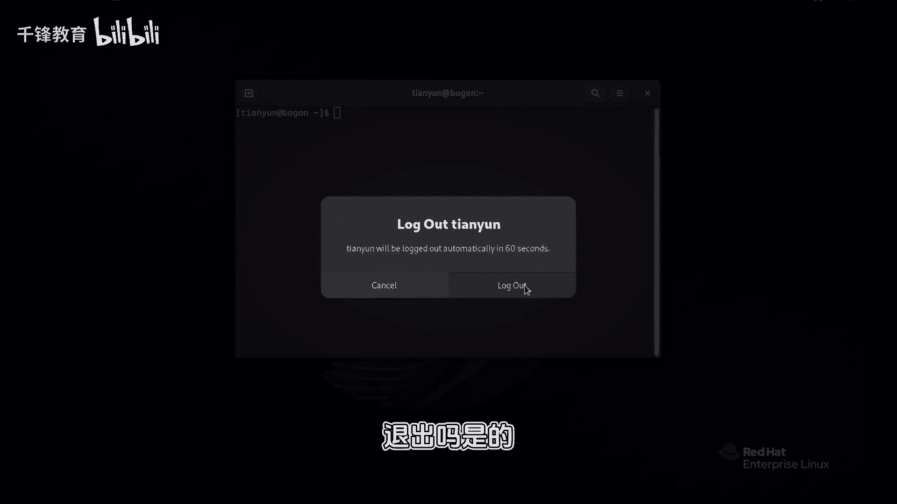

是的我们就偏要守住的账号，登录最高权限的账号，我们都不玩玩，你这种感觉是不是肯定不爽，所以我们root，然后密码是red hand，这不还可以显示是吗啊，真的啊。

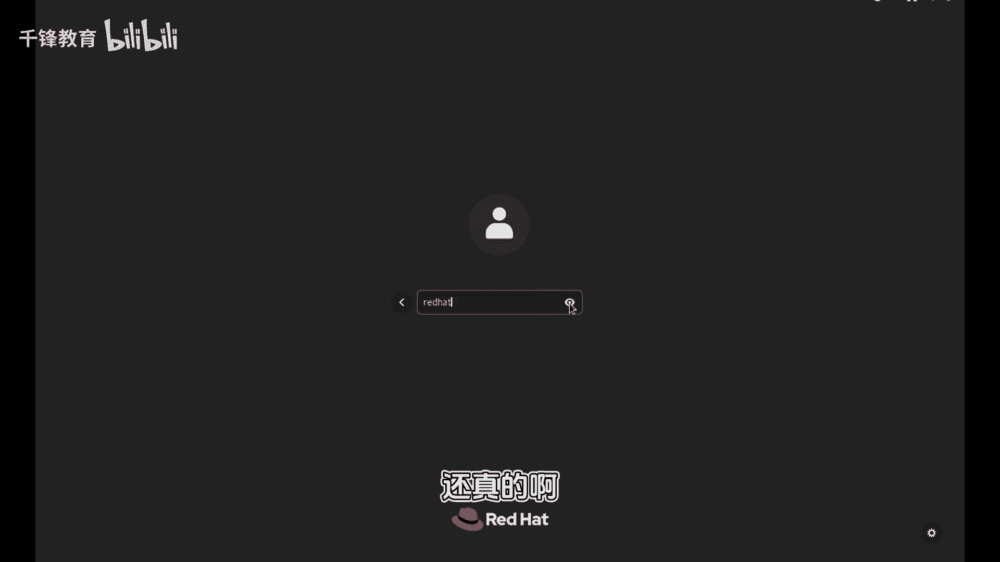

你说这个进来以后呢，也有这些按钮，这些没有什么区别，这个是它的图形界面，为什么有图形界面呢，是因为我们在装系统的时候，我们本身就选择了图形界面的这个环境，如果说你选的是server的那个环境的话呢。

对不起。

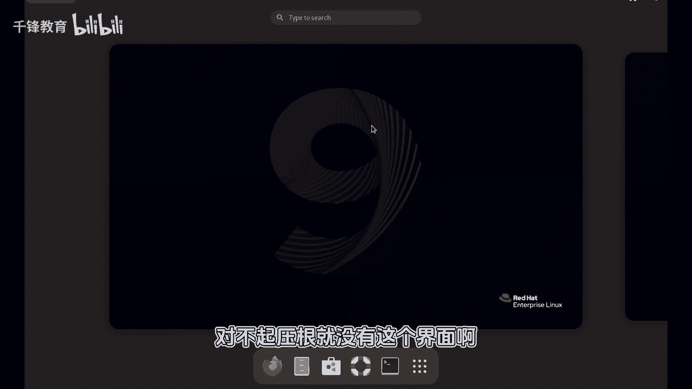

压根就没有这个界面，咱们也不多说了，我们就来再点一下这个特MINAL终端，大家看看啊，这个账号是root，刚才好像不是，刚是天云，是个普通账号，还有呢变了变成了一个井字符号以后，大家重点见到这两个符号。

一个是井号，一个是那个美元的符号，这两个符号呢就意味着权限的不同，一个是普通账号，一个是管理员几号，在LINUX里面就意味着你是一个超级管理员，你有生杀大选，有同学说那个开玩笑讲什么山库跑路啊。

说LINUX里面也有一个很重要的mini，后面我们有机会啊，我现在不敢展示，我怕大家模仿，所以有一个mini能够把整个系统删掉，你放心，普通用户他是给他那个胆儿，他也没那个能力，所以大家一定要注意。

现在呢这个关机的命令呢，先选一个p o w e r o f f k mini在关机。

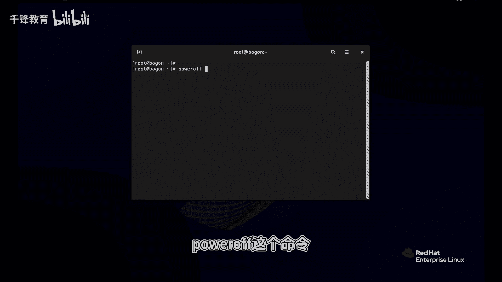

然后点击好好好，那我们这个系统就装完了，好。

大家可以照着这个天宇老师的方式，来装一下系统，由于我们后面会对这台机器做好多种操作，在所难免的，可能会有破坏性的，因为我们刚刚出血没有那么谨慎，所以我们可以给我们的这个系统做个快照。

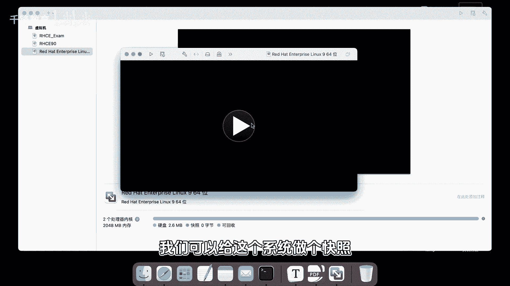

VIVO这个快照功能我们可以点一下它，然后拍个照片，这是最纯净的那个状态，最纯洁的那个状态，当有一天你想恢复到这个状态的时候呢，你可以穿越回去，当然这个跟系统没关系啊，跟LINUX没关系。

它是VM2这个虚拟机提供了一种机制，那做好拍照以后呢，我们就算是OK了，从下一节开始呢。

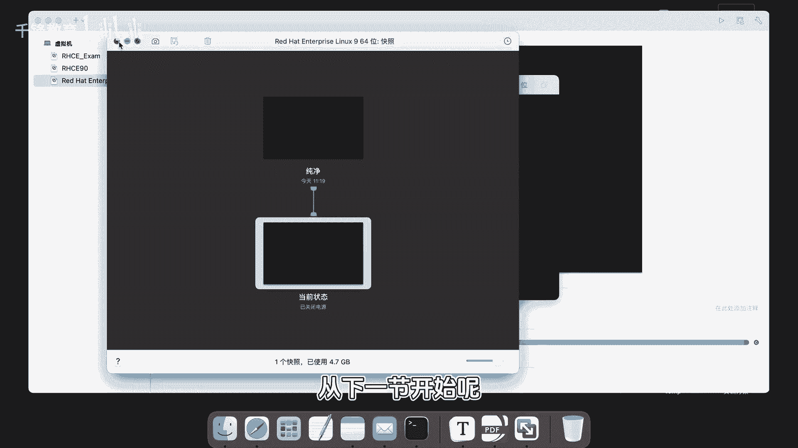

我们将学习在LINUX上面怎样用mini来，一步一步的学习他的各种一些管理机制。

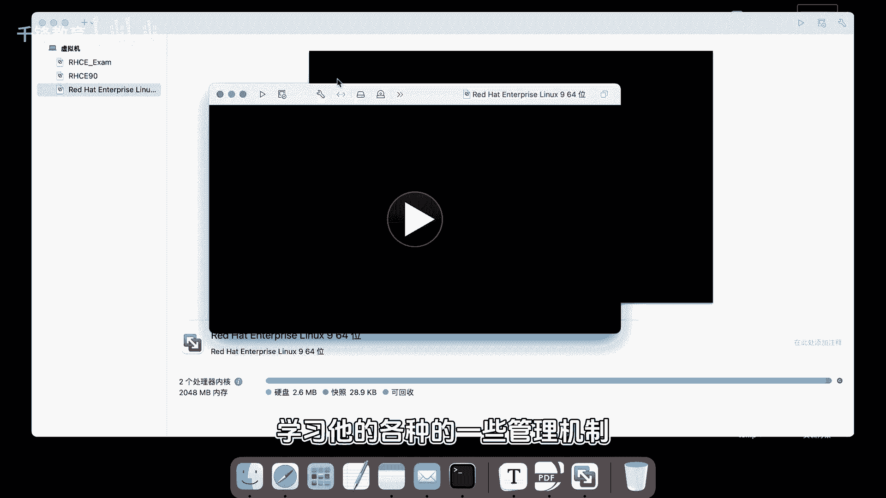

所以大家千万要跟上田宇老师的脚步，你相信我。

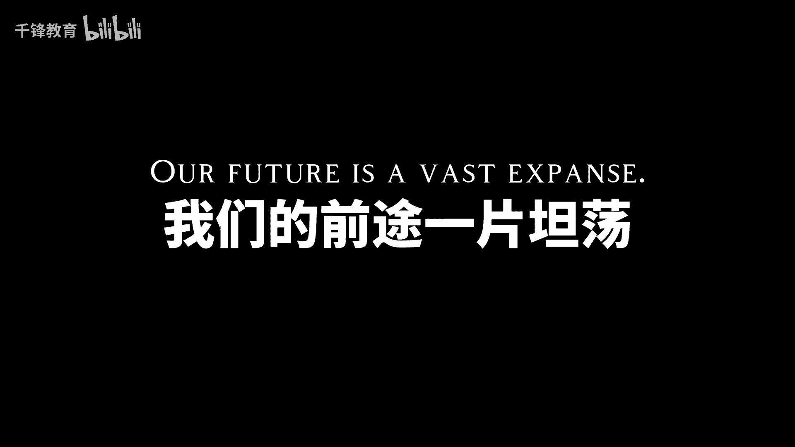