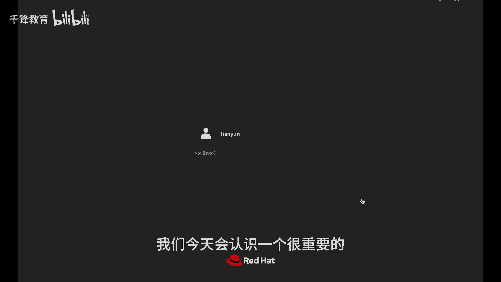
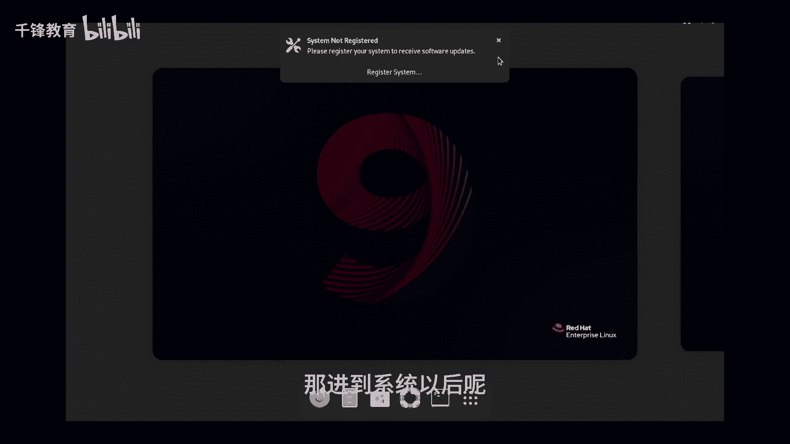
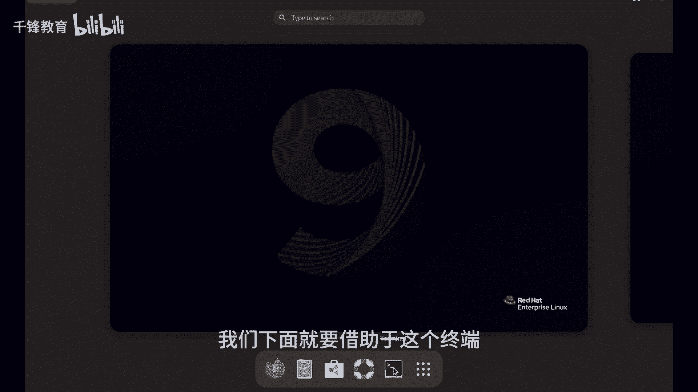
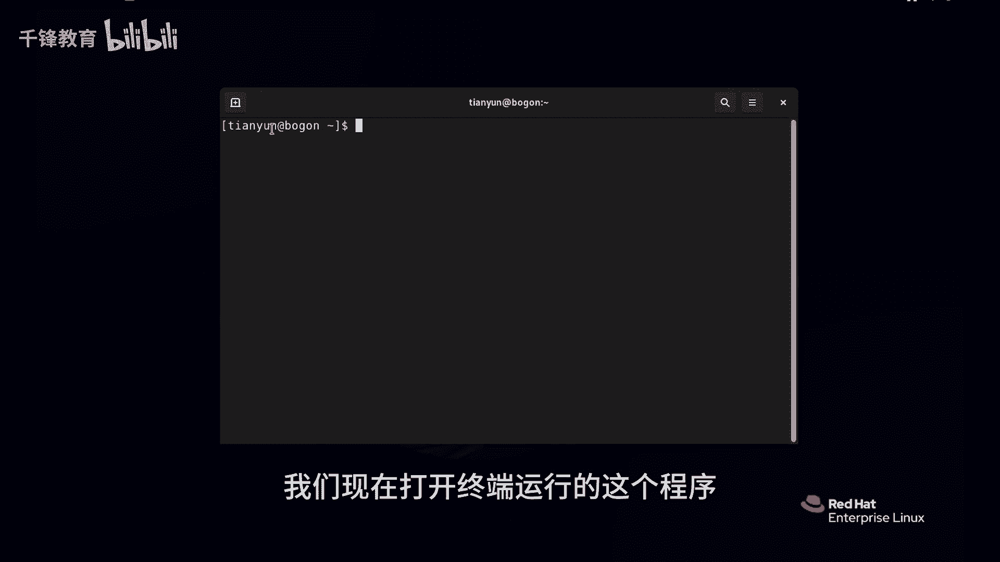
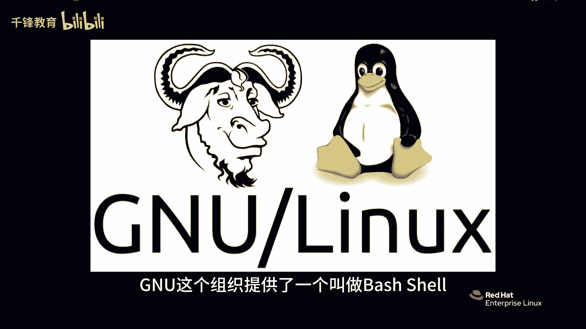
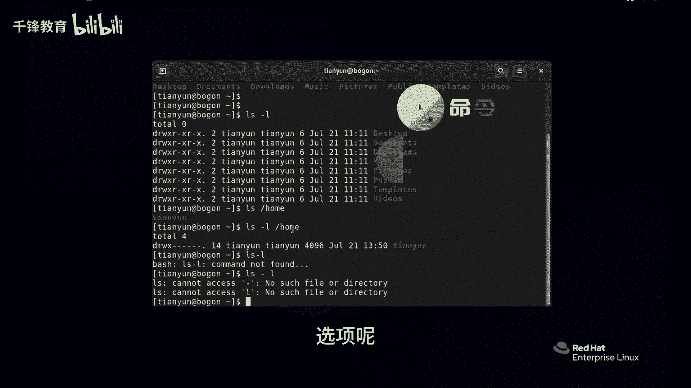
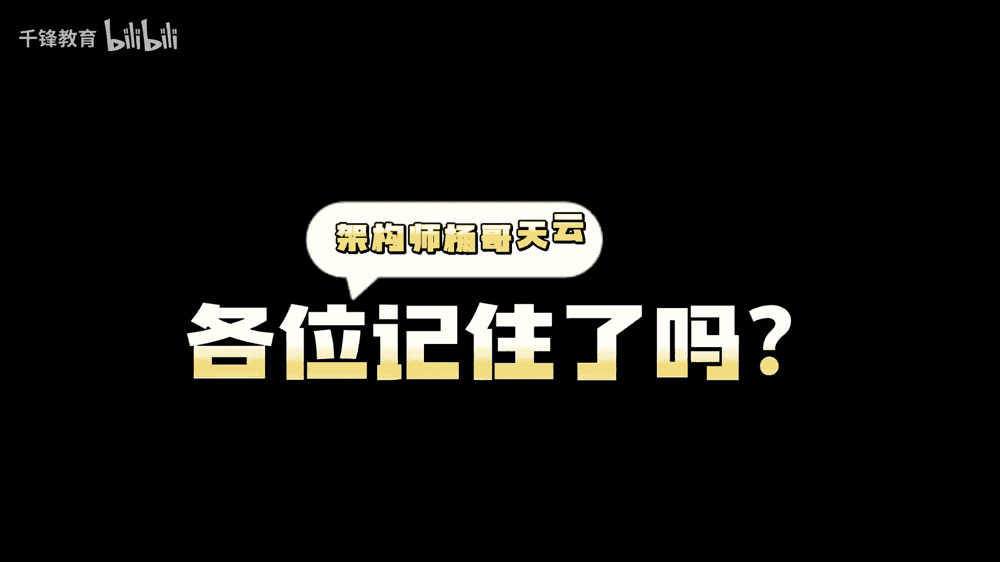

# 史上最强千锋杨哥Linux云计算入门教程，极速通关红帽认证RHCE（更新中） - P5：005.Linux命令的组成 - 千锋教育 - BV19N4y1X79P

下面我们带大家通过命令行的方式来对LINUX，进行一些基本管理，因此我们今天会认识一个很重要的工具叫做shell。

首先我们就使用普通用户登录吧，那进到系统以后呢。

如果说没有这个下面那个底边栏的话，大家可以点一下上面这个激活这个位置好，我们下面就要借助于这个终端。

当然这个终端呢，我们简单的可以做一些什么操作呢，比方说这边可以再加一个小终端，像这边你可以点也可以把这个终端呢拉大一点，如果说你觉得这个字体太小的话呢，也可以使用CTRL加加号啊。

由于加号那个位置有一个等号啊，所以他在上面，所以按住shift加加号，这样的话整个字体也会变得大一点，缩小的话呢直接CTRL加减号就可以，标准状态就CTRL加零啊，大家注意一下这三个快捷键。

另外我们这边加一个终端呢，也可以按快捷键CTRL加shift加T键，这个操作是对我们终端的一个界面的操作，实际上是不会影响任何东西的，当然我们现在重点要说的不是这个终端，而是这个位置。

我们现在打开终端运行的这个程序。

这个程序叫什么呢，这个程序叫做gnu，这个组织提供了一个叫做bash shell。

首先重点就是我们的shell，shell是什么呢，就是现在此时此刻，你看到的我们所运行的这个程序shell，这个程序呢，第一它给我们提供了一个输入秘密的一个接口，一个界面。

第二呢它会把这个mini传递给我们的操作系统，也就是内核去执行，然后紧接着呢，会把会将这个结果呢输出到这个界面上，这就是我们的shell程序，那今天呃我们所使用的shell呢，就是刚才跟大家说的。

我们叫做基因U的bh shell，有时候可以简称为BH，bh shell或者BH都指的是同一个意思，这个办事shell，大家首先要认识一下它的一个整个的一个界面，前面的这是一个dollar符号。

它代表的是我们当前用户的一个级别，实际上这是一个普通用户，在红帽LINUX里面其实就两种那个用户，一种是女管理员，他的显示符号是井字号，这个是什么，是我们的这个普通用户。

那前面呢是我们当前登录的用户名啊，然后呢一个艾特符号后面呢是我们的主机名，就是我们这台主机的名字，第三个呢是当前所在的目录，就是你当前在哪个位置，当然现在的这个包线呢它是有特指的，这个我们在后面来解释。

在这个办事shell当中呢，比如说我们敲一个mini，Who am i，我是谁，谁是我，我们直接把这个mini敲完以后回车，那他就执行了，也就是说我们这条mini呢就是有best shell。

来进行执行了，并且把结果输出到我们的界面上，他告诉我们当前的用户呢叫天云，没错，这是我们登录的用户，另外我们也可以使用，像比如说贝塔查看当前的时间，那我要特别要说的是呢，在这里面我们要运行的命令。

它实际上是分为三部分的，一部分呢就是我们的mini1部分是选项，还有一部分是参数，那这怎么解读啊，那比如说给大家举一个例子，我们敲一个LS这个mini，这是一个高频使用的命令，这个命令它是干嘛呢。

它就相当于你点开鼠标的某个文件夹，看了里面的内容，这个感觉它是一个查看命令，其实呢它是单词list的这个意思啊，如果我们加一个L的话，这个时候呢它的显示方式呢就发生了变化。

它显示的好像是类似于我们windows里面的一个，列表的形式，大家在windows里面看文件的时候，其实也有小图标，大图标还有列表，如果想要看文件的一些详细信息，表示文件的大小啊，扩展名什么的。

有时候可能使用这种方式，那很显然呢我刚才加了一个选项杠，L前面这个是秘密，这是我们整个运行的秘密，这是我们的主体选项呢，它会微调命令的行为，L是哪个单词呢，是long长模式，它会把查看的这个文件呢。

以这种长模式的方式显示，很显然我们获得了更多的信息，所以呢到L呢没有说影响了LLS，本质上发生变化还是看，但是呢看的方式呢就不一样了，那参数是什么呢，比如说举个例子。

IOS我指定一下跟跟下面的内容或者根下的home，大家对比一下，看看IOS我们没有加任何的参数，那他就只看到当前位置的内容了，IOS杠home呢明显加了一个参数，这个参数是mini作用的对象。

所以呢那如果说你要把这三块加起来的话，可以怎么做呢，可以LLS杠L，然后是这样，这三块就全了，mini选项和参数，首先要有一点是确认的秘密，我刚刚讲过是主体，他代表我们要干什么。

这个选项呢可能会微调命令的行为，在我们的办事里面，他通常有两种选项，一种是杠，一种是杠，杠，就是一个横线和两个横线，一般一个小杠呢后面跟着一个简单的字符，如果是刚刚一般可能是几个英文单词。

也就短选项或者长选项，那么有一点要特别强调的是，秘密选项和参数之间必须要有空格隔开，那如果说我们这样来敲LS杠L，你看我如果回车的话，但是他告诉你了，说你这个东西没有找到，也就是说你像这样。

他就会认为你说的第一个，那就是整个是一个命令，结果肯定是自然就是错的了啊，另外呢如果说LLS这样输也是不对的，你看这个结果，可能就是这么一个乱七八糟的东西啊，当然当然后面有提示啊，那他会认为这是个秘密。

你没有输错，然后呢选项呢杠L它其实是不知道的，就相当于没有选项了一样，L呢在这其实变成了参数了，因为你的选项是必须，不管是以小杠还是两个杠开头，你得跟着，所以不知道大家听明白没有。

很多同学都会犯这样一个错误，所以我在这边我花时间来强调，小伙伴们记住秘密选项和参数，mini是主体，选项呢可能会微调改变命令的行为。

而参数是mini作用的对象。

