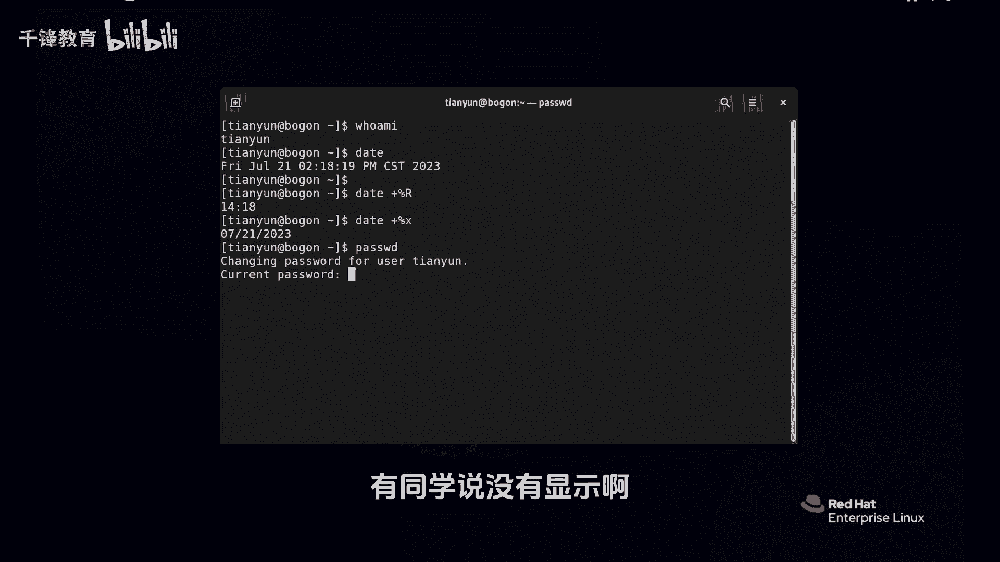
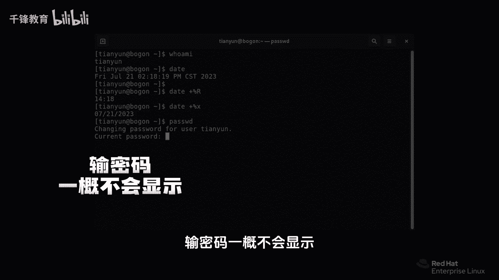
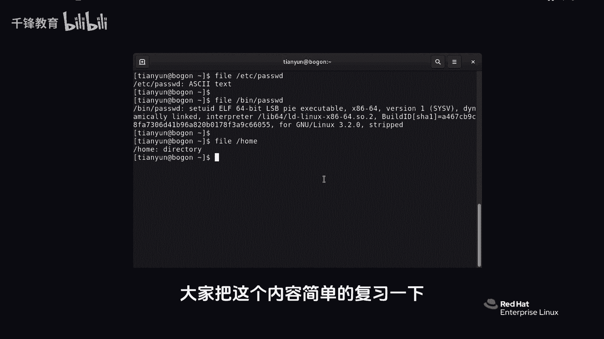

# 史上最强千锋杨哥Linux云计算入门教程，极速通关红帽认证RHCE（更新中） - P6：006.如何使用bash shell执行命令？ - 千锋教育 - BV19N4y1X79P

下面我们就开始来正式的做一些示范了哈，就是我们如何使用BSHELL来执行一些mini，就比如说那个who am i没问题，或者是那个beta也没问题，当然有一些参数啊，很奇怪，它是使用加号的。

比方说加百分号R，这个大家先不用记啊，因为我们后面会教大家怎么去查看，帮助获得这些个相关的参数，那比如说百分R是干嘛的，好回家，各位看到现在是14。18分，他只看了时间，因为默认情况下它看的是时间日期。

还有了这个星期月份都看了，那如果说你使用了非法加号，百分号X小X，注意在LINUX里面这个大小写它是区分的好，那这里看到的是202372 11，它显示的是日期，有人说这太无聊了，我们要看看日期时间。

还用跑到LINUX来看吗，这你就肤浅了，各位如果我们在后面要使用一些脚本之类的，我们要获取当前时间，那就可以使用这个mini，当然如果是管理员的话呢，它不只是可以使用这个命令来查看相应的时间，日期。

还可以设置时间日期好，那么再比方说pasta d这个mini，注意不是你想象中那个password啊，这个时候回车，你看我们要干什么事都得看，他说你要改变用户天云的密码，就是你自己的，我要改我自己密码。

请输入当前密码，当前密码是什么呢，那我们假如说输错了或者瞎说一遍，各位看看，有同学说没有显示啊。

大家注意在LINUX里面，特别是在我们的bash shell提示符里面，输入密码一概不会显示。

不代表他没有收到，是他不回显在屏幕上而已，所以你看我说错了，他就是说你再输一回啊，再输一次那个当天密码行了，咱们不玩它了，然NGGE天晕，那我对刚才那个密码已经很痛苦了，我受不了了，我改成杨哥吧。

Y a n g g e，他说要八个字符，密码太短，大家看一下，普通用户改密码还真的是让人觉得很受不了，我快崩溃了，没关系，这些东西呢我觉得也是系统给你的一个宝库，来我们再改一遍，我就不相信你得改不明白。

YANGGE天云，那我现在改一个给大家不说的啊，反正我的密码肯定很复杂吧，过去了啊，我现在不告诉大家猜也猜不出来，你也不是黑客提示说升级successful成功了，那就命令这个结果达到了好。

我们刚才其实就使用password这个mini来完成了一下，改密码的这样一个行为，各位我们加没加选项，没有加对吧，我们加没加参数呢，没有加，所以呢我们不是说参数和选项一定要加的，这个不一定的啊。

我们可以再介绍一个很重要的mini叫file mini，我们下面使用file这个mini来做一些小小的动作，要给大家讲一下啊，这个windows上面呢，这个文件是通过所谓的那种扩展名，也就是后缀。

那么点doc啊，点TT啊，点ex e啊，这样的一些东西来确定文件的类型，但是在LINUX上面文件就没有扩展名这个说法，所以呢有时候你从表面上看，你还真看不出来他到底是个什么样的文件。

就在我们偶尔在LINUX里面，可能看到了一些所谓的扩展名，那也是照顾大家的感情加上去的，不要太在意，那如何看文件本质上是什么呢，我们非要这个mini让机械文件原形毕露，现在呢注意啊。

我们现在由于还没有讲一些知识，所以我们有时候敲的很累，没关系，我们学习会越来越简单，一开始你觉得很复杂，越来越简单，但是你别忘了你别连着整就行好，etc下的password好，没关系，像我一样敲。

现在原则上讲我没有讲别的mini，没别的方式的时候，你能给我敲对了好回车，看到了吗，这才是一个文本文件，哪有什么后缀，就是你现在看到的位于根下的etc，下面的一个叫做这个文件，它是一个文本文件。

你现在看到的B下的password文件，在我没有敲回车之前，你能看出他是什么文件吗，你还真看不出来，为什么他俩长得一样，都叫password，多一个字母都没有，但是这是一个二进制文件，是我们刚才用过的。

用来改密码的那个程序，这是一个可执行的文件，就相当于mini的这样一个东西，在windows里面相当于一个mini或EXE，你能看出来他们的区别吗，他也是password，他也是password。

从表面上看，杨哥跟你说的看不出来，再比如说F我们home这是个directory，是一个目录，就是个文件夹，在LINUX里面啊，我们把那个文件夹叫做什么，叫做目录，这是一个基本的一个用法。

所以大家要注意的是，在LINUX里面是没有这个文件的扩展，名字也说的好了，大家把这个内容简单的复习一下。

敲一下我们，然后呢后面再一步步学习。

