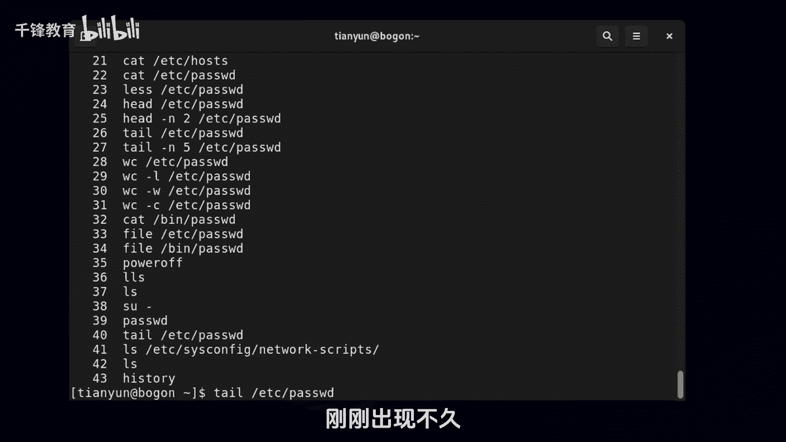
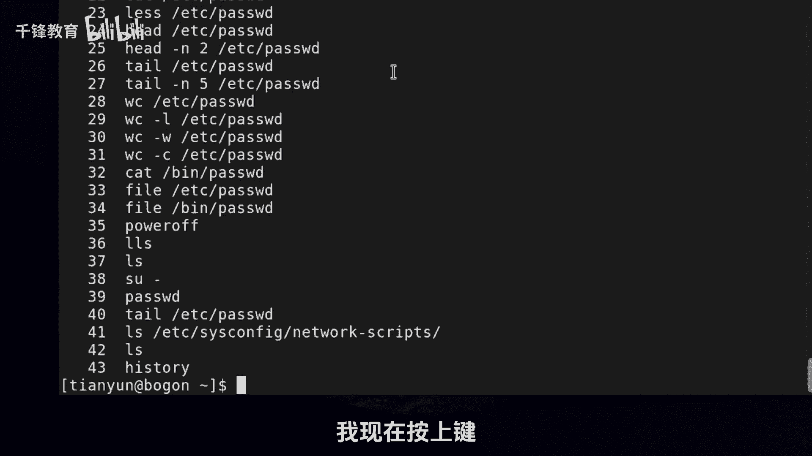
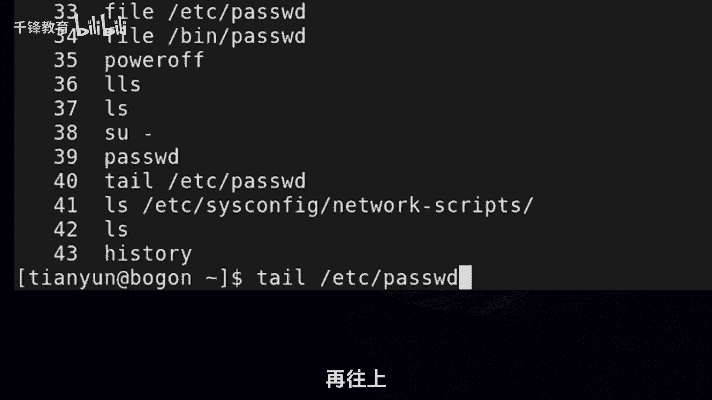
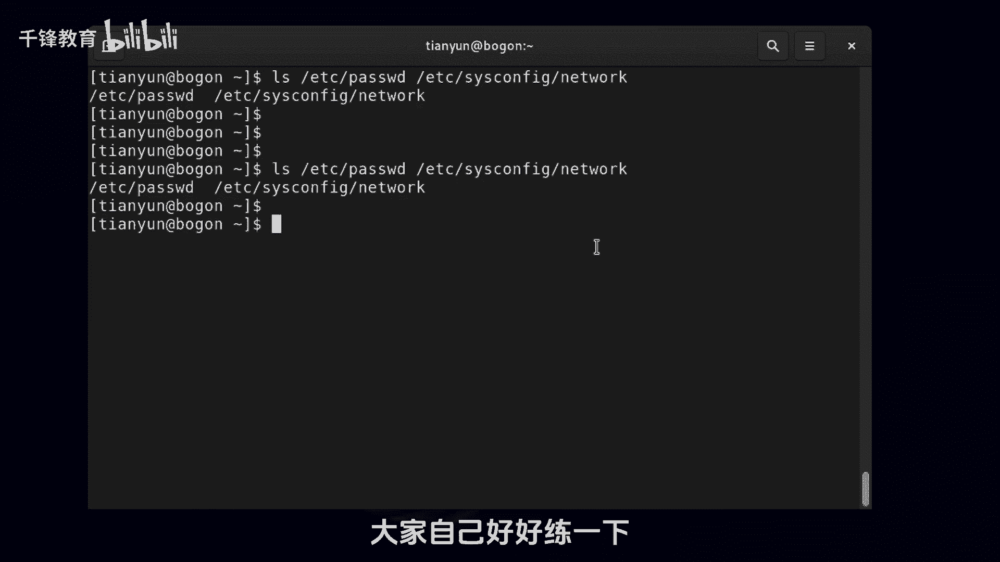

# 史上最强千锋杨哥Linux云计算入门教程，极速通关红帽认证RHCE（更新中） - P9：009.bash基础特性之历史命令 - 千锋教育 - BV19N4y1X79P

那接下来我们来看一下DH的另外一个特性，叫做历史秘密，那比如说我们想查看某个用户的，曾经在这台机器上面有哪些操作，有出过哪些秘密，这个手机可逆时针相关系，逆时命呢既可以看到我们来溯源，也可以吗。

来重复使用，所以在20下面，对逆时针的使用也是非常重要的，首先我们可以使用history这个mini来查看历史，Mini，每一个逆时命令前面的都有一个编号，后面还有一个就是具体的命名令。

我们有多种方法来对历史命令进行复用，就重复使用一种呢，就是如果那个mini刚刚出现不久。

就可以按照按照上下键来快速找到，你要用的那个历史命令，我现在按下上键。

它出现的是这个命令，那我再往上的话呢，LLS再往上是那个再往上再往上也可以往下。

当然找到以后你也可以进行重新编辑，不是说非得就是就着他用啊，那除了这个上下键以外，还有呢就是一个叹号，这个符号这个符号后面可以跟两个东西，一个是跟上一个数字，这个数字在哪呢。

比方说我们看到的是R7这个数字，它代表的是每一条历史命运呢会有一个记录，第二呢可以按一个字符串，这是两种比较常用的一个方法，好那比如说我们现在呢来跟上这个数字，试一下叹号，29飞车以后呢。

他会把这个29这个命令重复执行一次，看他告诉我们呢，最近的WCGL，然后是e DC password，这个37，别误会啊，这37是什么，是这个命令执行后显示的结果，一共是三十三十七行吗。

好这是后面跟上一个数字，那也可以跟上一个字符串，然后我们看一下这跟上一个字符串怎么分的啊，同样我们显示一下，首先叹号，比方说他要各位找一下他被集体里的命令，二七这个命令和40这个命令呢都有tell。

都是看文件的最后几行，但是不同的是，二期是五行，这个是十行，那我这条命令并没有指定是二七还是40好，那我回车大家看到的是十行吧，为什么呢，他找到的是最近一个以这个字符串开头的命令。

从这往往前找最近的可以，大家明白了吗，这是那个杀人剑和叹号的方式，这个下面呢，我给大家展示一个很特别的一个意识运用法，我们现在制造一个场景特别看啊，我现在先LS一下。

Etc is copig at work，这个文件我先看一下啊，现在我们先不管它到底是历史命名哪一条，我们现在就想干嘛了，我给大家展示一下它的效果哦，我的视频没有剪辑，大家看到直接就出来了，为什么呢。

我按了一个快捷键叫ESC，我输到屏幕上的ESC，然后加上点，我按了这两个键，看我再按一次ESC加点，它会直接调出上一个命令的最后一个参数，如果上一个命令有好多参数，我们再来再来这个演示一下啊，好IOS。

比如说etc password，还有e DC l csm fiat work，有小伙伴们可能就有点懵啊，我大家解释一下，本来是IOS这个文件，但是后面呢我空格加了第二个参数啊。

注意这一历史空格不是埃及的，这是两个文件，相当于我同时显示了一下，这两个文件的一个信息，那下面呢我们表格要cut一下，没有说一定是cat啊，这跟第一名没关系，我们EC加角，那他会补全哪一个呢。

还看到的是他立马就把那个mini给叫出来了，所以这个用的非常的爽啊，下面呢我给大家讲一个特别有用的方式，一个快捷键就是CTRL加R2，请大家注意前面的提示符变了，再是那个dollar符号。

也不再是什么几号，它变成了一个什么一个搜索的search的一个东西，这个时候就进入到了历史命令的搜索的，这样一个状态，这个时候很灵活，你只要能打出历史命令当中的某一段，比如说那我们就近的这个啊。

你看这条迷你很长，我就记得在这这几个字母，我如果打cs会发生什么对待SOS，他直接把追踪一个包含cs的战士出来了，如果说你发现好像不是这条，你得再多打几个字母标，co好，回家以后呢。

如果你要的就是这条mini，那正好就合适了，也就是说CTRL加R的话呢，它支持从历史命当中去搜索历史命运当中，任意的字符都行，反正你搜的这个内容必须是连续的啊，好这就是我们在办事下的一个历史命运的用法。

好，就是插件，还有呢就是叹号的方式，还有就是history查看，还有就是我们的这个EC加点儿，另外一个就是刚才提到的这个杭州建R去搜索，是一定要大家去活用的。

