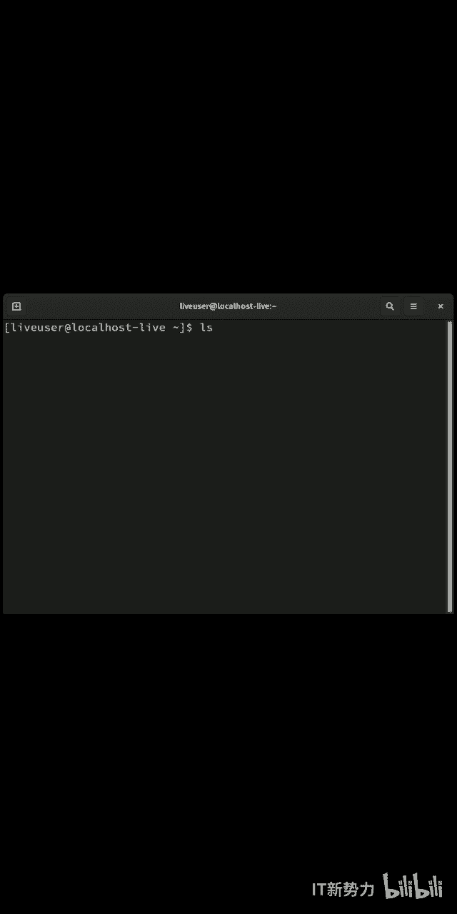
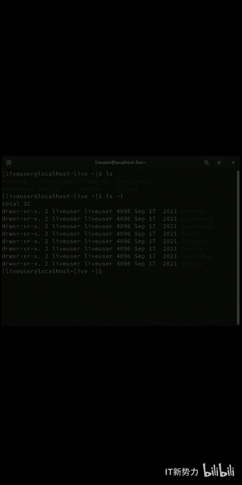
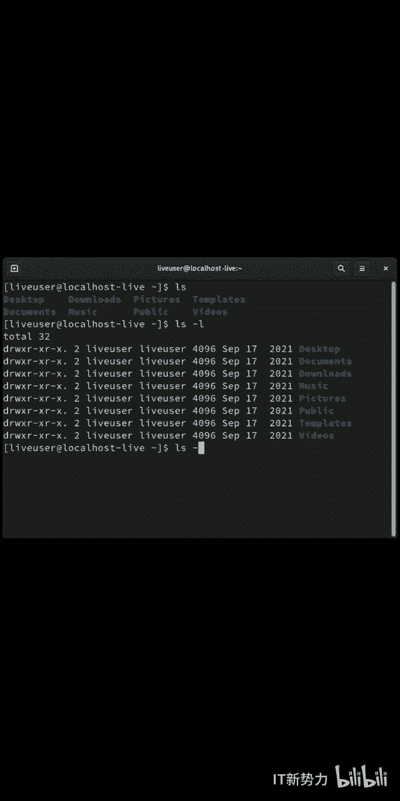
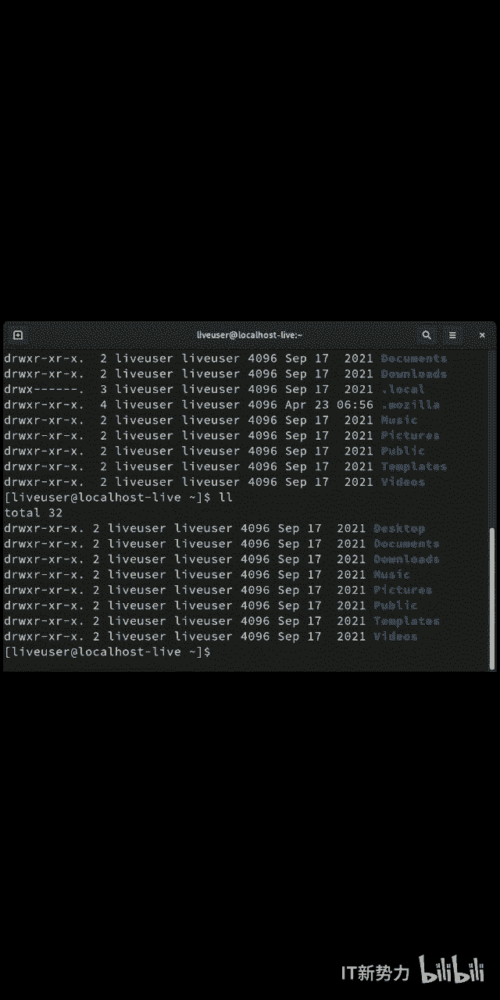

# 在linux中如何查看隐藏文件 - P1 - 开源码头 - BV1P341127Qb

。

🎼lininux查看隐藏文件的方法。🎼LS及list用来显示当前目录清单或指定目录清单下的文件以及文件目录。

🎼LS杠L可以以长格式显示列出文件的详细信息。

🎼如果想要看到文件目录下的隐藏文件。

🎼可以使用LS杠LL这个命令会显示出目录文件下的所有文件，并包含隐藏文件。

🎼在一些发行版本中，LIS杠L可以使用简化的LL命令来实现同样的指令。

🎼关注公众号IT新势力，获取更多学习资料。