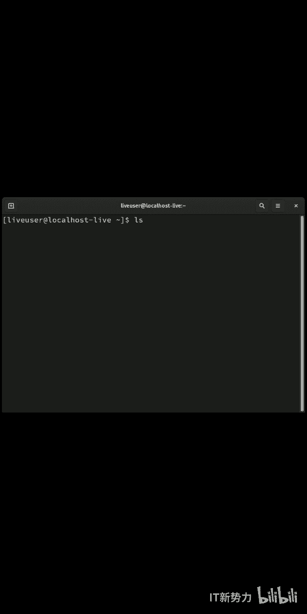
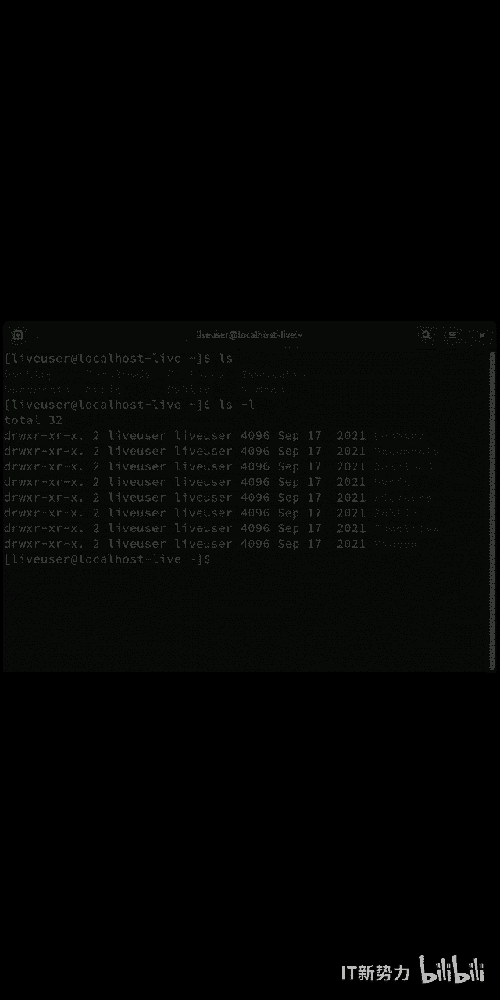
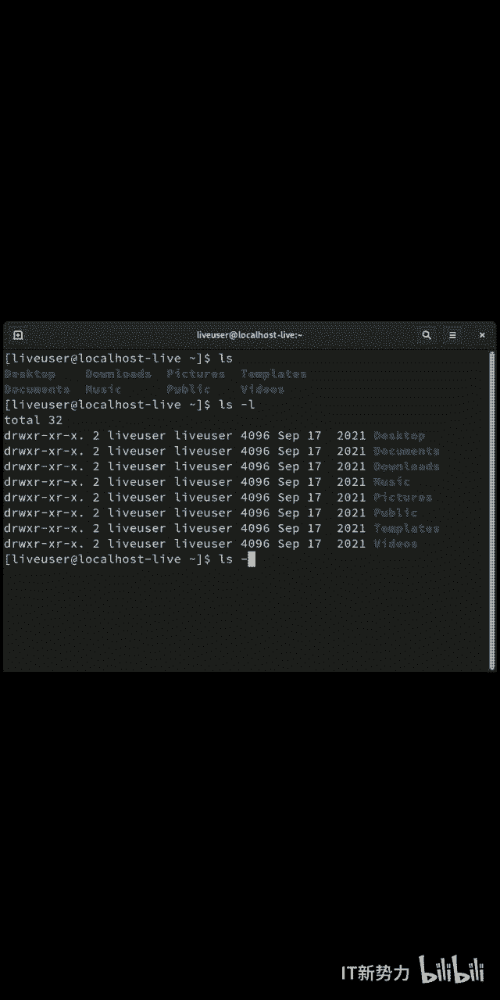
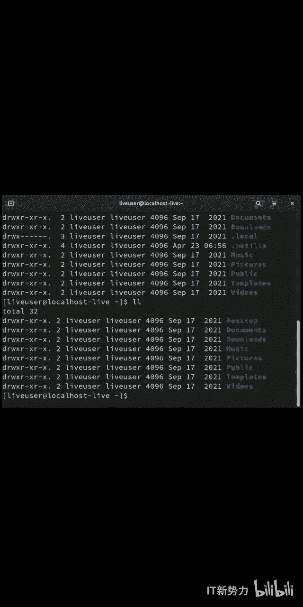

# Linux文件管理：P1：如何查看隐藏文件


在本节课中，我们将要学习在Linux系统中查看隐藏文件的方法。隐藏文件是文件名以点（`.`）开头的文件或目录，默认情况下不会在普通的文件列表命令中显示。掌握查看它们的方法是进行系统管理和配置的基础。

## 理解 `ls` 命令

`ls` 是 `list` 的缩写，用于显示当前目录或指定目录下的文件和目录清单。


例如，在终端中输入 `ls` 命令，会列出当前目录下所有非隐藏的项目。



## 查看文件的详细信息

上一节我们介绍了基本的 `ls` 命令，本节中我们来看看如何获取更详细的信息。使用 `ls -l` 命令可以以长格式显示文件，列出包括权限、所有者、大小和修改时间在内的详细信息。


其命令格式为：
```bash
ls -l
```

## 显示隐藏文件



了解了如何查看普通文件的详细信息后，我们自然会问：如何看到那些被隐藏起来的文件呢？在Linux中，隐藏文件通常以点号开头，例如 `.bashrc`。

要查看包括隐藏文件在内的所有文件，可以使用 `ls -a` 命令。`-a` 参数代表 `all`。

其命令格式为：
```bash
ls -a
```


## 结合使用参数



我们已经分别学习了查看详细信息和查看所有文件的方法。那么，有没有一个命令能同时实现这两个功能呢？答案是肯定的。

使用 `ls -la` 命令可以显示出目录下的所有文件（包括隐藏文件），并以长格式列出它们的详细信息。这是最常用、最全面的查看方式。


其命令格式为：
```bash
ls -la
```

以下是该命令输出中几个关键部分的说明：
*   第一列代表文件类型和权限。
*   第三列和第四列代表文件的所有者和所属组。
*   第五列代表文件大小。
*   后续列代表文件的最后修改时间。
*   最后一列是文件名，其中以点开头的就是隐藏文件。



## 命令的简化形式


在一些Linux发行版中，`ls -l` 命令有一个常用的简化别名 `ll`。这意味着你输入 `ll` 得到的效果与输入 `ls -l` 相同。

需要注意的是，`ll` 通常**不**包含显示隐藏文件的 `-a` 参数。如果你想用 `ll` 查看所有文件，可能需要使用 `ll -a`，或者直接使用标准的 `ls -la` 命令。

本节课中我们一起学习了在Linux中查看隐藏文件的几种方法。我们首先认识了基础的 `ls` 命令，然后学习了使用 `-l` 参数查看详细信息，使用 `-a` 参数显示所有文件，最后掌握了结合两者的 `ls -la` 命令来全面查看目录内容。记住，以点开头的就是隐藏文件，熟练使用这些命令是有效管理Linux系统的第一步。