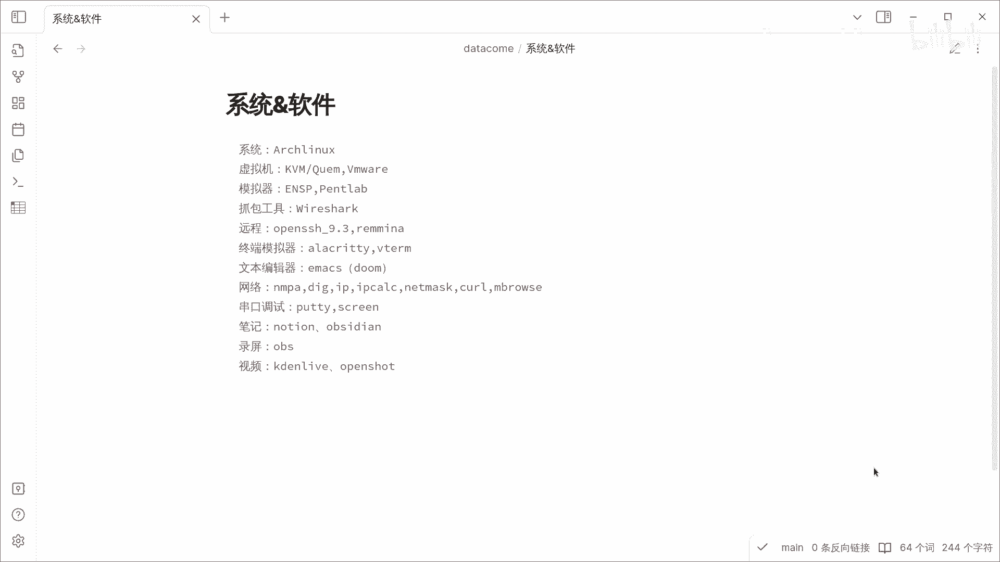
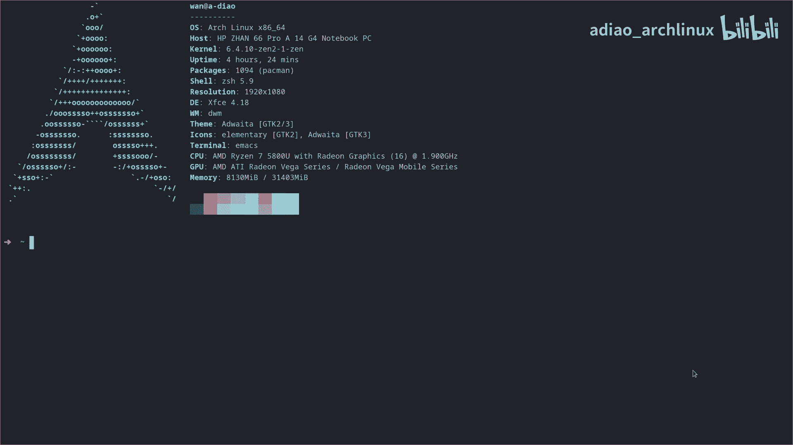
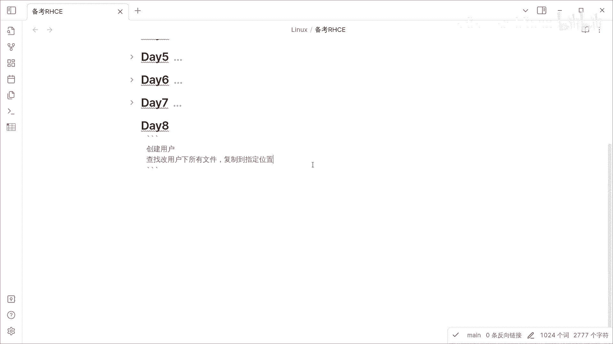
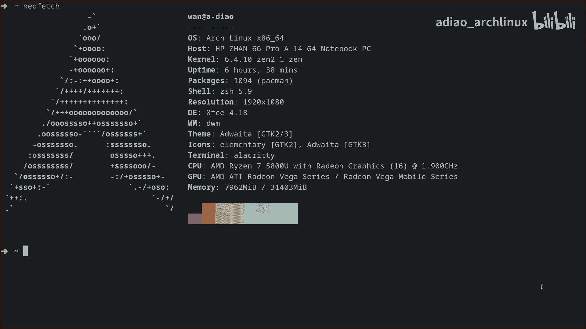

# 备考RHCE的第8天 - P1 - adiao_archlinux - BV1Ru4y1Y79h

大家好，我是阿屌，这是我的系统及常用的一些相关软件。

今天是备考RHC的第八天，第八天呢创建用户，查找该用户下所有的文件，复制到指定的位置。

现在我们登录一下虚拟机。创建一下用户。然后我们切换到该用户效。然后我复制一下文件，复制到本地。这个25年呢是我的本机，我本机呢开始FTFTP服务。我现在登登录一下，复制一下文件到我的虚拟机。

让我们看一下我现在。现在的目录有没有文件？啊，现在这里有两个文件。我现在切换到root用户。然后我创建一个目录。让我现在搜索刚才我创建那个用户的。呃，用户下所有的文件。嗯，我现在看一下这个目录。

刚才新建的这个目录。是否有？这个就是刚才。嗯，复制下复制创建呃，新建用户home目录下载文件。我先把它清空。再重新执行一遍。让我们重新来看一下。就这两个文件。我可以看一下 home目录下的。

买网络设备找阿屌，买设备找阿屌。

