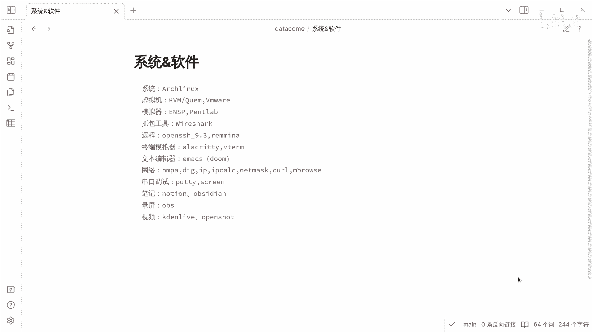
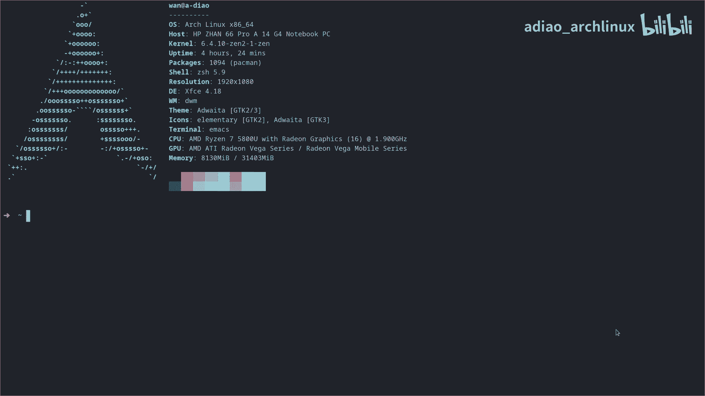
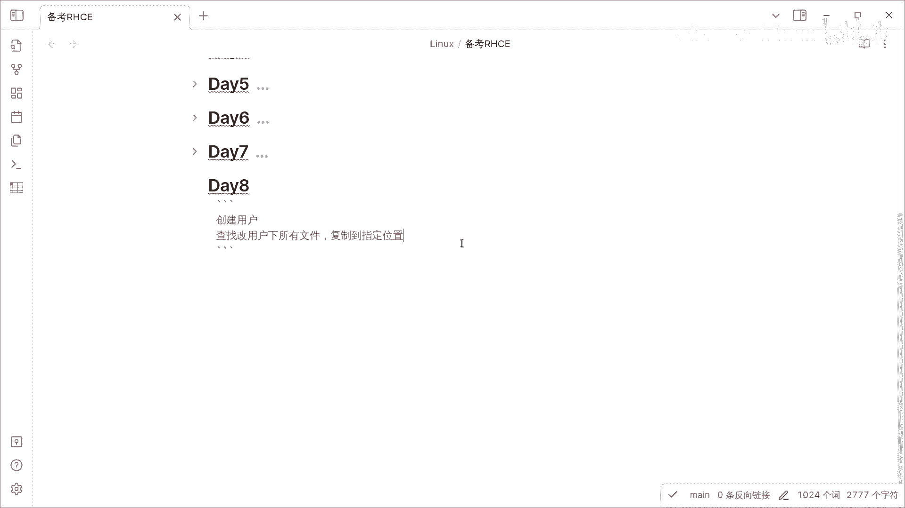
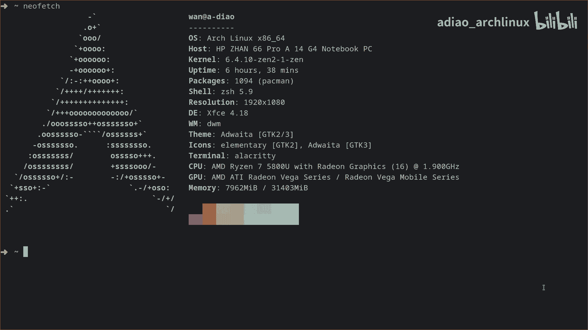

# RHCE备考教程：第8天：用户文件管理与复制

在本节课中，我们将学习如何在Linux系统中创建用户，查找该用户拥有的所有文件，并将这些文件复制到指定的位置。这是系统管理中的一项基础且重要的任务。

## 环境与工具准备

上一节我们介绍了课程目标，本节中我们来看看操作前的准备工作。



我的操作系统是Arch Linux，并使用了一些相关的系统管理软件。





## 创建用户与切换环境

现在，我们登录到虚拟机开始操作。首先，我们需要创建一个新用户。

以下是创建用户的命令：
```bash
useradd [用户名]
```
例如，创建一个名为 `testuser` 的用户：
```bash
useradd testuser
```

创建用户后，我们需要切换到该用户的环境下进行操作。使用 `su` 命令可以切换用户。

以下是切换用户的命令：
```bash
su - [用户名]
```
例如，切换到 `testuser` 用户：
```bash
su - testuser
```



## 文件复制与传输

在切换到新用户后，我们可能需要将一些文件复制到本地。这里，我的本机IP地址是192.168.1.25，并且本机开启了TFTP服务用于文件传输。

首先，从本机复制文件到虚拟机。可以使用 `scp` 或 `tftp` 命令，这里以TFTP为例。

以下是使用TFTP下载文件的命令：
```bash
tftp 192.168.1.25 -c get [文件名]
```

操作完成后，我们检查当前目录下是否存在文件。

以下是列出当前目录文件的命令：
```bash
ls -la
```
执行后，可以看到当前目录下存在两个文件。

## 查找用户文件并管理

现在，我们切换回root用户，以便进行系统级操作。

以下是切换回root用户的命令：
```bash
su -
```
或者输入 `exit` 退出当前用户会话。

作为root用户，我们创建一个新的目录，用于存放查找到的目标用户文件。

以下是创建目录的命令：
```bash
mkdir /opt/user_files_backup
```

接下来，我们需要搜索之前创建的那个用户所拥有的所有文件。使用 `find` 命令配合 `-user` 参数可以实现。

以下是查找指定用户所有文件的命令：
```bash
find / -user [用户名] 2>/dev/null
```
例如，查找 `testuser` 的文件：
```bash
find / -user testuser 2>/dev/null
```
命令中的 `2>/dev/null` 是为了忽略权限错误等无关信息。

然后，我们查看一下新建的备份目录。

以下是查看目录内容的命令：
```bash
ls -la /opt/user_files_backup
```
此时目录应该是空的，因为还没有复制文件进去。为了演示，我们先清空可能存在的旧数据（如果目录非空），然后重新执行查找与复制操作。

## 完整流程演练

让我们重新演练一遍完整的流程，确保理解每个步骤。

首先，确认目标用户home目录下的文件。通常，用户文件位于 `/home/[用户名]` 目录下。

以下是查看用户home目录的命令：
```bash
ls -la /home/testuser/
```
可以看到该目录下存在两个文件。

最后，我们将查找到的用户文件复制到之前创建的备份目录中。使用 `cp` 命令，并结合 `-r` 参数来复制目录及其内容。

以下是复制文件的命令：
```bash
cp -r /home/testuser/* /opt/user_files_backup/
```
或者，使用之前 `find` 命令的结果来复制：
```bash
find / -user testuser -type f -exec cp {} /opt/user_files_backup/ \;
```



---

本节课中我们一起学习了Linux用户管理的核心操作：创建用户、切换用户环境、查找用户所属文件以及进行文件复制与传输。掌握这些命令是RHCE认证考试和日常系统管理工作的基础。

