# 备考红帽认证必修课：P10：2.05-SELinux调试 🛠️

在本节课中，我们将学习如何调试SELinux，以解决因SELinux安全策略限制而导致的服务（如Web服务器）无法启动的问题。我们将从检查Yum源开始，逐步深入到SELinux的基本概念、排错方法以及Web服务器的相关配置。

## 检查Yum源配置

上一节我们介绍了Yum源的基本配置，本节中我们来看看如何检查和排除Yum源的常见问题。

执行 `yum repolist` 命令可以检查Yum源是否可用。如果命令执行成功并列出仓库信息，说明源配置正确。如果命令报错，例如提示“无法同步缓存”或“找不到源”，则说明源配置存在问题。

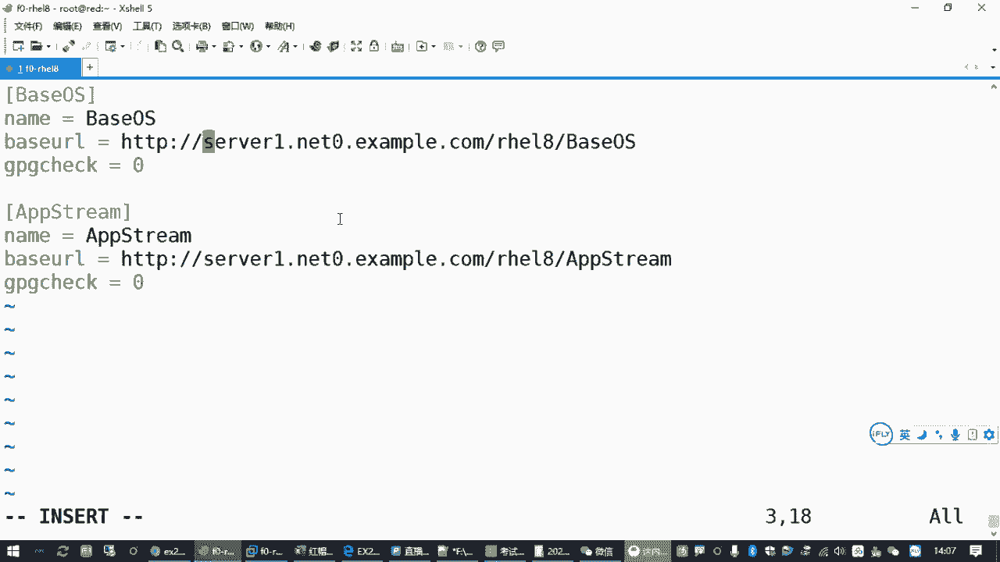

Yum源无法访问通常有以下三种原因：

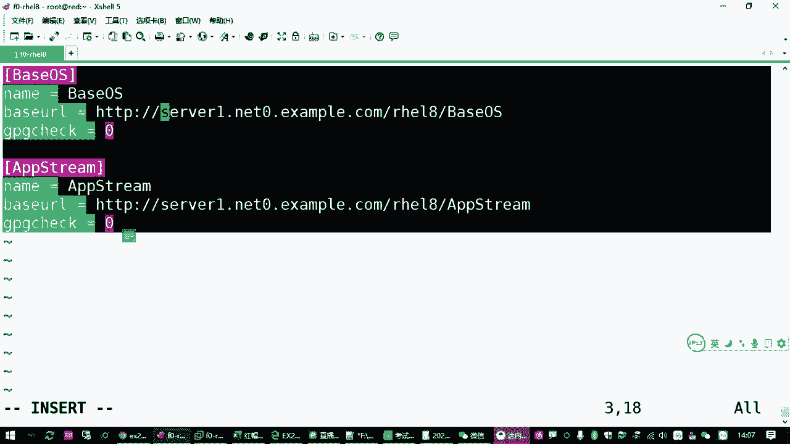

1.  **服务器端问题**：提供Yum源的服务器本身不可用（例如网站未开启）。在考试或标准练习环境中，这种情况较少见。
2.  **客户端网络配置问题**：本地主机的网络配置（IP地址、子网掩码、默认网关、DNS服务器）不正确，导致无法连接到Yum服务器。
3.  **配置文件错误**：`/etc/yum.repos.d/` 目录下的 `.repo` 配置文件内容有误，例如URL拼写错误、存在多余空格或使用了中文标点。

以下是检查和排除网络配置问题的常用命令：
*   `ip address show`：检查IP地址和子网掩码。
*   `route -n`：检查默认网关（需先安装 `net-tools` 包）。
*   `cat /etc/resolv.conf`：检查DNS服务器配置。

如果怀疑是配置文件错误，最快捷的排错方法是删除现有配置文件并重新创建。

```
rm -f /etc/yum.repos.d/*.repo
```

然后，按照正确格式重新创建 `.repo` 文件。注意配置项中不要有多余的空格，URL地址要准确无误。创建完成后，可以执行 `yum clean all` 清理缓存，再执行 `yum repolist` 测试。

## SELinux基础与排错方法

上一节我们解决了Yum源的问题，本节中我们来看看SELinux调试的核心内容。

SELinux（Security-Enhanced Linux）是一套由美国国家安全局（NSA）开发的内核级安全增强机制。它为Linux系统中的进程和文件对象提供了强制访问控制。

SELinux有三种运行模式：
*   **enforcing**：强制模式，策略规则被强制执行。
*   **permissive**：宽容模式，策略规则仅被记录而不强制执行。
*   **disabled**：关闭模式。

查看当前SELinux模式：
```
getenforce
```

临时切换模式（重启后失效）：
```
setenforce 0  # 临时切换到permissive模式
setenforce 1  # 临时切换到enforcing模式
```

永久修改模式需编辑 `/etc/selinux/config` 文件，修改 `SELINUX=` 后的值，并重启系统生效。

在RHCE考试中，常会遇到因SELinux处于 **enforcing** 模式，导致Web服务（`httpd`）在非标准端口（如82端口）无法启动的问题。题目要求是在不关闭SELinux的前提下，让服务正常运行。

### SELinux排错流程

标准的SELinux排错流程如下：

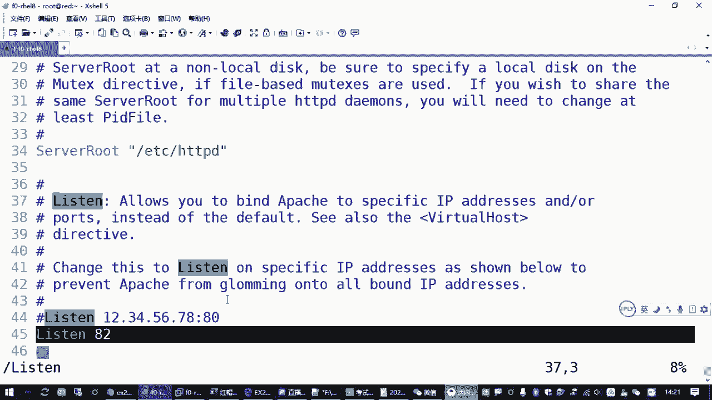

1.  **安装排错工具**：安装 `setroubleshoot` 软件包，它可以将SELinux的拒绝访问信息记录到系统日志中。
    ```
    yum install -y setroubleshoot
    ```

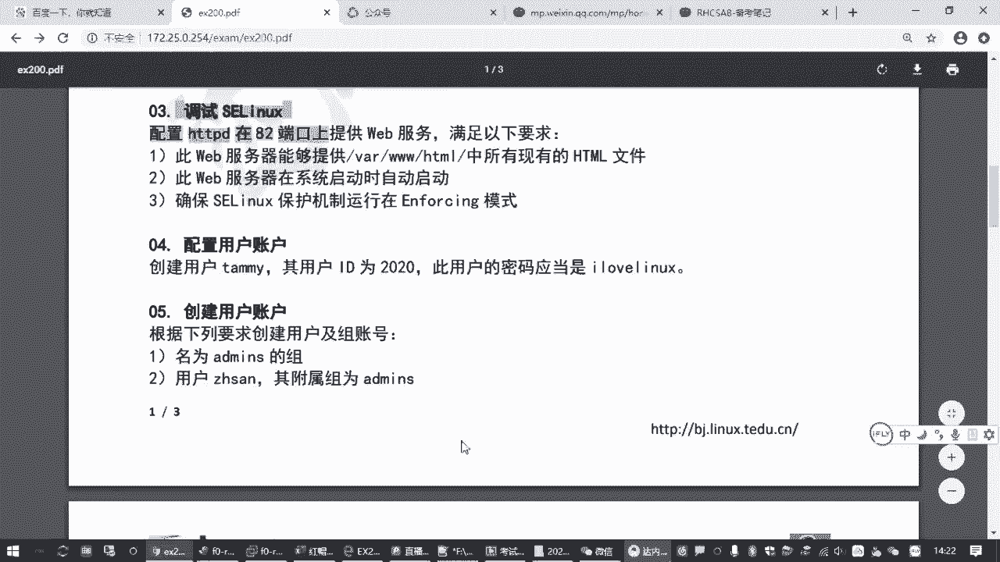

2.  **触发并查看错误**：尝试启动服务以触发SELinux拒绝事件，然后查看系统日志获取详细信息。
    ```
    systemctl restart httpd  # 此时服务应启动失败
    journalctl | grep -i sealert
    ```
    或者使用更专业的 `sealert` 命令查看最新的SELinux警报：
    ```
    sealert -l "*"
    ```

3.  **分析日志并应用建议**：日志或 `sealert` 的输出中通常会包含详细的错误分析和修复建议。例如，它可能会提示你需要为HTTP服务添加82端口的访问策略。

### 快速解决方案

在考试环境中，通常可以采用更直接的方法。当启动 `httpd` 服务失败时，系统返回的错误信息中有时会直接包含修复命令。

例如，错误信息可能显示：
```
建议执行以下命令以允许 httpd 绑定到 82 端口：
semanage port -a -t http_port_t -p tcp 82
```

直接执行该命令即可。这条命令的含义是：使用 `semanage` 工具管理SELinux端口策略（`port`），添加（`-a`）一条规则，将TCP协议（`-p tcp`）的82端口类型（`-t`）设置为 `http_port_t`。

验证端口策略是否添加成功：
```
semanage port -l | grep http_port_t
```
在输出列表中查看是否包含了 `tcp 82`。

## Web服务器配置与测试

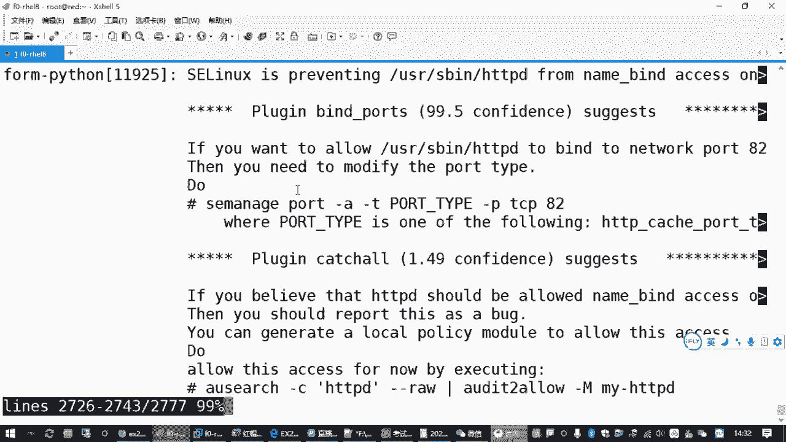

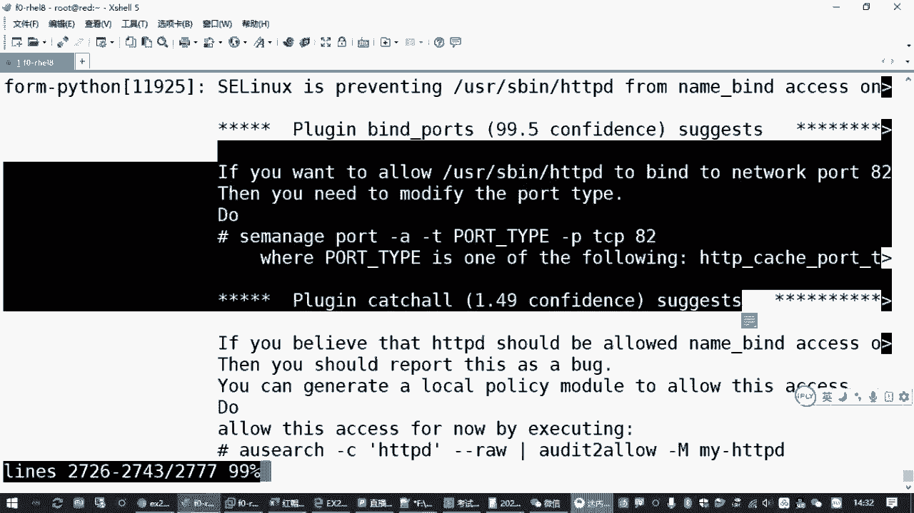

上一节我们解决了SELinux策略问题，本节中我们来看看如何配置和测试Web服务器以满足题目要求。

### 配置监听端口

考试题目通常要求 `httpd` 服务监听82端口。此配置位于 `/etc/httpd/conf.d/` 目录下的某个配置文件中（例如 `00-listening.conf`）。我们需要确认其中包含 `Listen 82` 指令，但通常不需要手动修改。

### 关闭防火墙

Red Hat系统默认启用防火墙（`firewalld`），它会阻止外部对82端口的访问。为了让测试成功，需要停止并禁用防火墙服务。

```
systemctl stop firewalld
systemctl disable firewalld
```

### 禁用默认欢迎页并启用目录列表

默认情况下，如果Web根目录（`/var/www/html/`）下没有 `index.html` 文件，`httpd` 会显示一个默认的欢迎页面，而不是列出目录下的文件。这与题目要求“提供该目录下所有现有HTML文件”相悖。

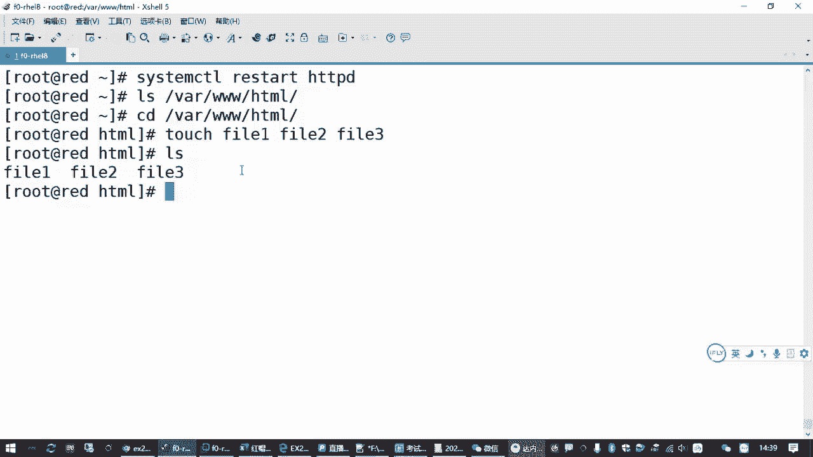

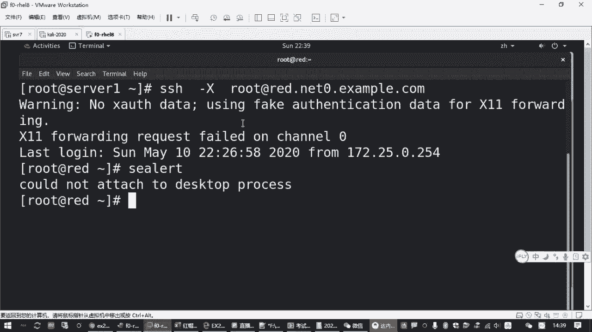

解决方法是将欢迎页的配置文件移除或重命名。
```
mv /etc/httpd/conf.d/welcome.conf /etc/httpd/conf.d/welcome.conf.bak
```

然后重启 `httpd` 服务使配置生效。
```
systemctl restart httpd
```

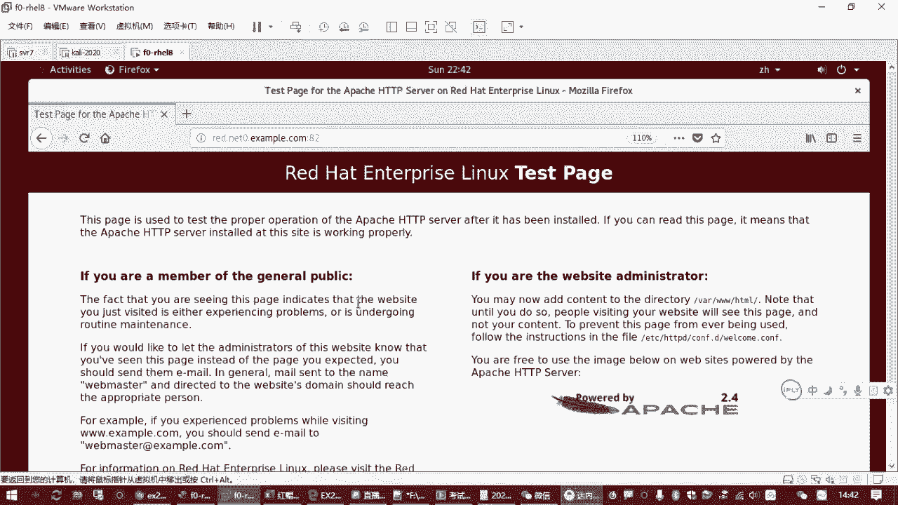

### 设置服务开机自启

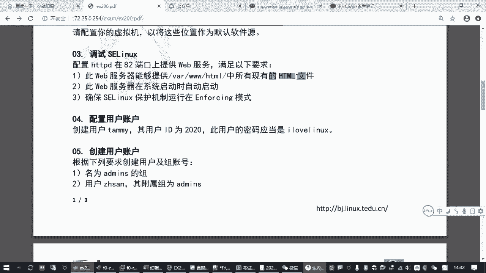

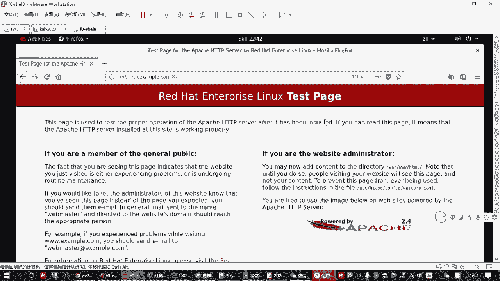

确保 `httpd` 服务在系统启动时自动运行。
```
systemctl enable httpd
```

### 最终测试

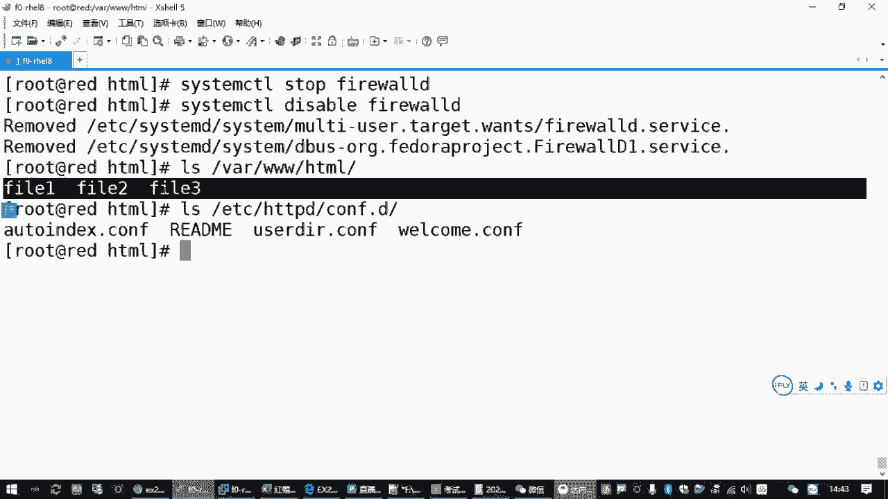

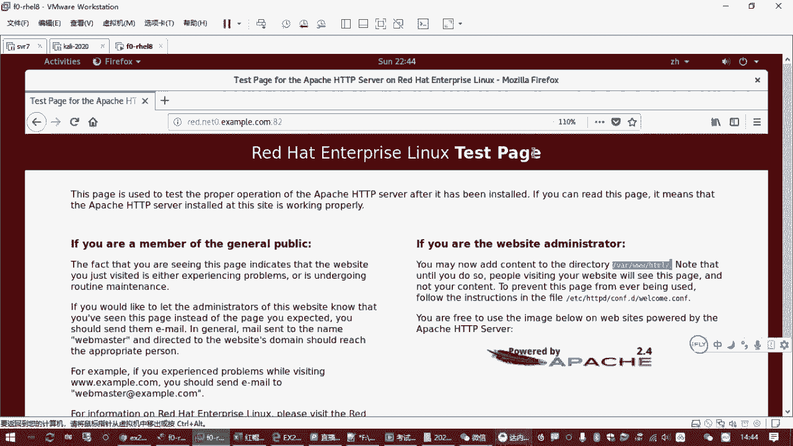

在浏览器或使用 `curl` 命令访问Web服务器，指定82端口。
```
curl http://服务器IP地址:82
```
或
```
curl http://服务器主机名:82
```
此时，应该能看到 `/var/www/html/` 目录下的文件列表（如 file1.html, file2.html），而不是默认的欢迎页面。

## 总结

本节课中我们一起学习了SELinux的调试方法。主要内容包括：
1.  **Yum源排错**：从服务器、客户端网络、配置文件三个方面排查Yum源不可用的问题。
2.  **SELinux核心概念**：了解了SELinux的三种模式（enforcing, permissive, disabled）及其查看与设置方法。
3.  **SELinux排错流程**：掌握了通过安装 `setroubleshoot`、查看日志获取修复建议的标准排错方法，以及直接使用错误信息中提示的 `semanage` 命令快速解决问题。
4.  **Web服务器配置**：完成了关闭防火墙、禁用默认欢迎页以启用目录列表、设置服务开机自启等操作，确保 `httpd` 服务能在82端口正常提供Web服务。

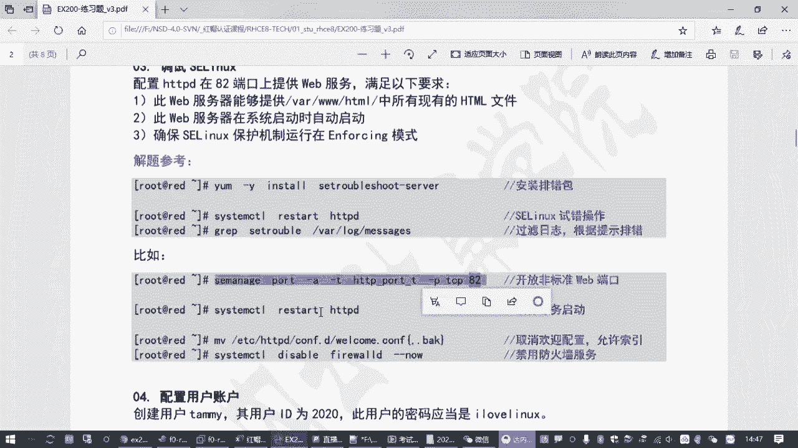

通过本课的学习，你应能独立解决因SELinux策略限制导致的常见服务访问问题，这是RHCE认证考试中的一项重要技能。