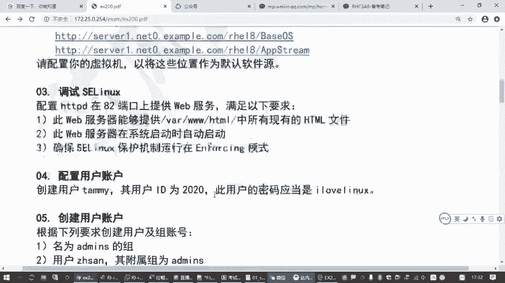
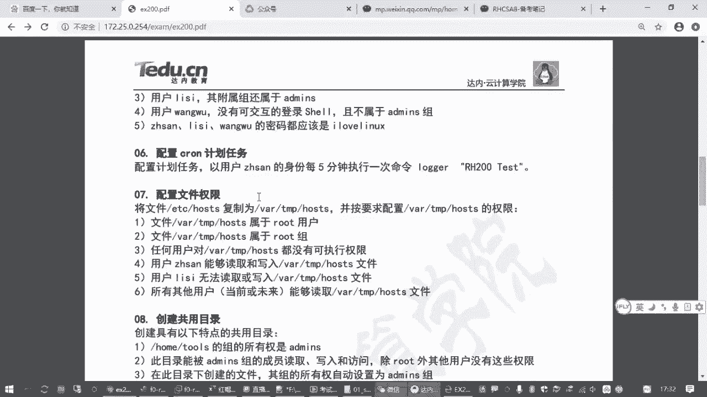
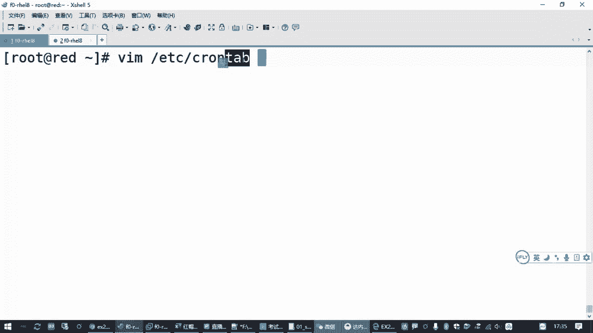
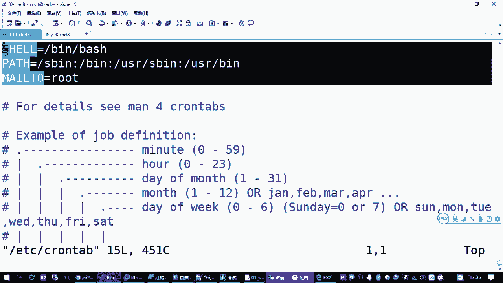
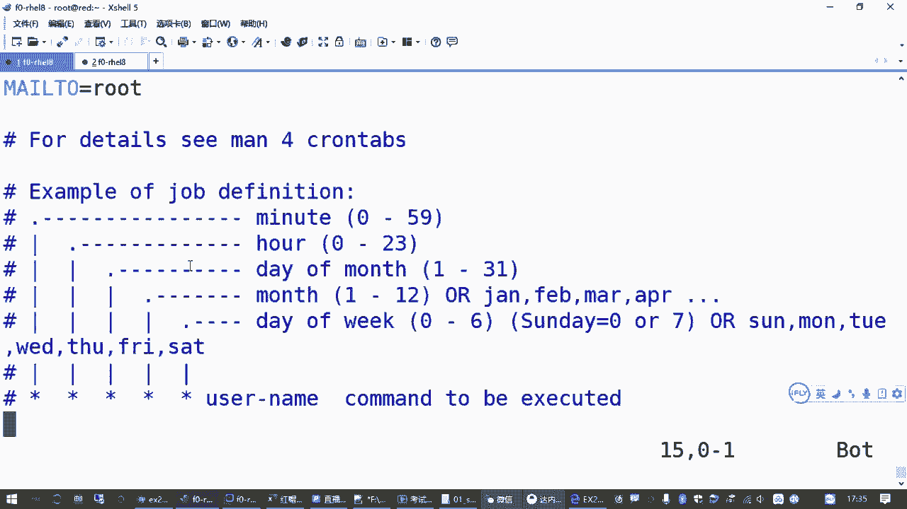
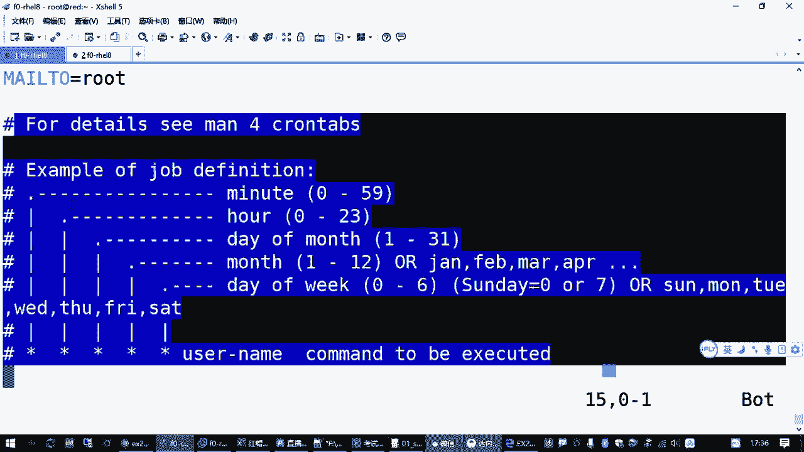
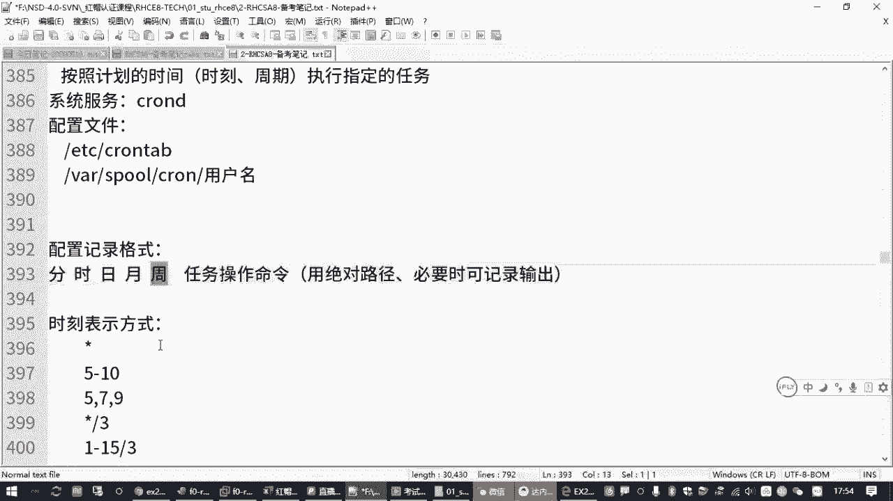

# Linux运维基础：P14：2.09-cron计划任务 📅





在本节课中，我们将要学习Linux系统中的计划任务。计划任务是系统管理员用于在指定时间自动执行特定命令或脚本的强大工具。我们将了解其基本概念、配置文件、时间表示方法以及如何为用户配置计划任务。

## 什么是计划任务？

上一节我们介绍了课程概述，本节中我们来看看计划任务的核心概念。

计划任务的含义是按照管理员预先规划好的时间点，在指定的时刻自动执行某一个任务。例如，每个星期六晚上自动备份数据，或者每周一早上自动开启防火墙规则。

在红帽（Red Hat）系统中，实现此功能的软件包是 `cron`。该软件包通常是系统必备组件，默认已安装且服务自动运行。对应的服务管理命令为 `systemctl`。



## 计划任务的配置文件





了解了基本概念后，我们来看看如何配置计划任务。



系统有一个全局的配置文件 `/etc/crontab`，用于定义整个操作系统的计划任务。该文件包含环境变量设置和具体的任务定义。

以下是 `/etc/crontab` 文件中任务条目的基本格式样板：

```
* * * * * user-name command-to-be-executed
```

这五个星号从左到右分别代表：

*   **第一个星号**：分钟 (0-59)
*   **第二个星号**：小时 (0-23)
*   **第三个星号**：一个月中的第几天 (1-31)
*   **第四个星号**：月份 (1-12)
*   **第五个星号**：星期几 (0-7，其中0和7都代表星期日)

最后一部分是**要执行的命令**。在全局配置文件中，需要在时间字段后指定运行该任务的**用户身份**。

## 时间表示方法

配置计划任务的关键在于正确书写时间字段。以下是几种常见的时间表示方法：

*   **星号 (`*`)**：代表每一个有效的时间点。例如，在分钟字段使用 `*` 表示每分钟。
*   **特定值**：指定一个具体时间。例如，在小时字段写 `22` 表示晚上10点。
*   **范围 (`-`)**：表示一个连续的时间范围。例如，在日期字段写 `1-15` 表示每月1到15号。
*   **列表 (`,`)**：表示多个不连续的时间点。例如，在分钟字段写 `0,15,30,45` 表示每小时的第0、15、30、45分钟。
*   **步长 (`/`)**：表示间隔频率。例如，在分钟字段写 `*/5` 表示**每5分钟**。在小时字段写 `*/3` 表示每3小时。

**重要提示**：时间字段是“与”的关系。例如，配置 `0 22 * * 5 command` 表示**每个星期五的22点0分**执行命令。如果日期和星期字段都指定了具体值，则满足其中任一条件即会触发（是“或”的关系）。

## 管理用户计划任务

虽然可以直接编辑 `/etc/crontab` 文件，但更推荐使用专用工具 `crontab` 来管理用户级别的计划任务。

`crontab` 命令常用选项如下：

*   `crontab -e`：编辑当前用户的计划任务列表。
*   `crontab -l`：列出当前用户的计划任务。
*   `crontab -r`：删除当前用户的所有计划任务。

**以管理员身份为其他用户配置任务**：使用 `-u` 选项。例如，为用户 `zhangsan` 编辑计划任务：
```bash
crontab -e -u zhangsan
```
执行此命令会调用默认文本编辑器（如vim）打开一个临时文件。用户添加的任务会保存在 `/var/spool/cron/` 目录下以用户名命名的文件中。编辑完成后保存退出，`cron` 服务会自动加载新任务。

**工作建议**：在计划任务中书写命令时，**尽量使用绝对路径**，因为cron执行任务时的环境变量可能与用户登录时不同，使用相对路径可能导致命令找不到。

## 实战：配置每五分钟执行的任务

现在，我们来实践一个具体需求：以用户 `zhangsan` 的身份，每五分钟执行一次指定的命令 `/usr/bin/echo “Hello Cron”`。

以下是操作步骤：

1.  使用 `crontab` 命令为用户编辑任务：
    ```bash
    crontab -e -u zhangsan
    ```
2.  在打开的编辑器中，按 `i` 键进入插入模式，输入以下行：
    ```
    */5 * * * * /usr/bin/echo “Hello Cron”
    ```
    *   `*/5`：表示每5分钟。
    *   后面的 `* * * *` 分别表示每小时、每天、每月、每周都有效。
    *   最后是要执行的命令。
3.  按 `ESC` 键退出插入模式，输入 `:wq` 保存并退出编辑器。
4.  系统会提示 `crontab: installing new crontab`，表示新任务已安装。

## 验证与排查

配置完成后，如何验证任务是否生效或进行问题排查？

*   **查看任务列表**：使用 `crontab -l -u zhangsan` 确认任务已添加。
*   **检查执行日志**：Cron服务的执行记录会输出到系统日志。可以使用以下命令查看最近的cron日志：
    ```bash
    tail -f /var/log/cron
    ```
    等待任务触发时间（如5分钟后），观察日志中是否出现对应的执行记录。
*   **调试时间格式**：如果在 `crontab -e` 编辑时时间格式书写错误，保存时会得到明确的错误提示（如 `“bad minute”`），根据提示修改即可。

## 课程总结

本节课中我们一起学习了Linux下的计划任务管理。

我们首先了解了计划任务的概念和作用。然后，学习了系统全局配置文件 `/etc/crontab` 的格式和字段含义。核心部分在于掌握灵活的时间表示方法，包括特定值、范围、列表和步长。

我们重点介绍了使用 `crontab` 命令管理用户计划任务的方法，并通过一个“每五分钟执行一次命令”的实例进行了演练。最后，了解了如何通过查看任务列表和系统日志来验证和排查计划任务。



掌握计划任务，能够让你自动化完成许多重复性的系统管理工作，是运维工作中一项非常实用的技能。