# Linux系统管理：P16：文件查找与文本过滤

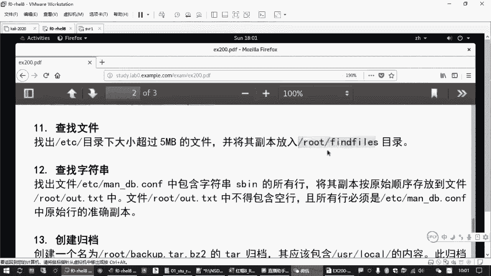

在本节课中，我们将要学习两个在Linux系统管理中至关重要的命令：`find` 和 `grep`。`find` 命令用于在文件系统中搜索符合条件的文件，而 `grep` 命令则用于在文本内容中过滤出包含特定模式的行。掌握这两个命令是高效进行系统维护和问题排查的基础。

## 文件查找：`find` 命令详解

上一节我们介绍了课程概述，本节中我们来看看如何使用 `find` 命令在文件系统中精确地定位文件。

`find` 命令的基本格式是：
```bash
find [目录路径] [查找条件]
```
*   如果不指定目录路径，则默认在当前目录下查找。
*   如果不指定查找条件，则默认查找所有文件。

以下是 `find` 命令常用的几种查找条件：

*   **按名称查找 (`-name`)**
    查找指定名称的文件。可以使用通配符 `*`（匹配任意字符）和 `?`（匹配单个字符）。
    ```bash
    find /etc -name "resolv.conf"  # 查找名为 resolv.conf 的文件
    find /boot -name "vmli*"       # 查找以 vmli 开头的文件
    ```

*   **按类型查找 (`-type`)**
    查找指定类型的文件。常见类型有：
    *   `f`: 常规文件
    *   `d`: 目录
    *   `l`: 符号链接文件
    *   `b`: 块设备文件
    *   `c`: 字符设备文件
    ```bash
    find /dev -type b  # 查找 /dev 目录下的块设备文件
    ```

*   **按大小查找 (`-size`)**
    查找符合指定大小的文件。使用 `+` 表示大于，`-` 表示小于。
    ```bash
    find /etc -size +5M  # 查找 /etc 目录下大于 5MB 的文件
    find /home -size -100k # 查找 /home 目录下小于 100KB 的文件
    ```
    **注意**：单位 `K` (KB) 为小写，`M` (MB) 和 `G` (GB) 为大写。

*   **按修改时间查找 (`-mtime`)**
    查找在指定天数前被修改过的文件。`+n` 表示 `n` 天前，`-n` 表示 `n` 天内。
    ```bash
    find /var/log -mtime +7  # 查找 /var/log 目录下 7 天前修改过的文件
    ```

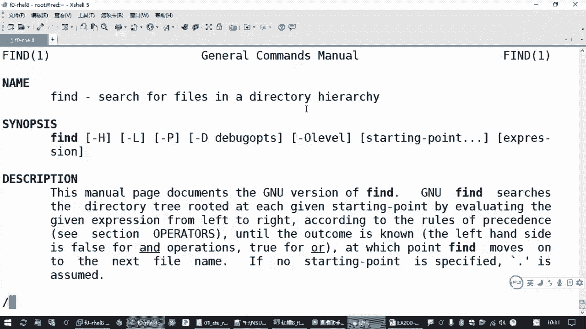

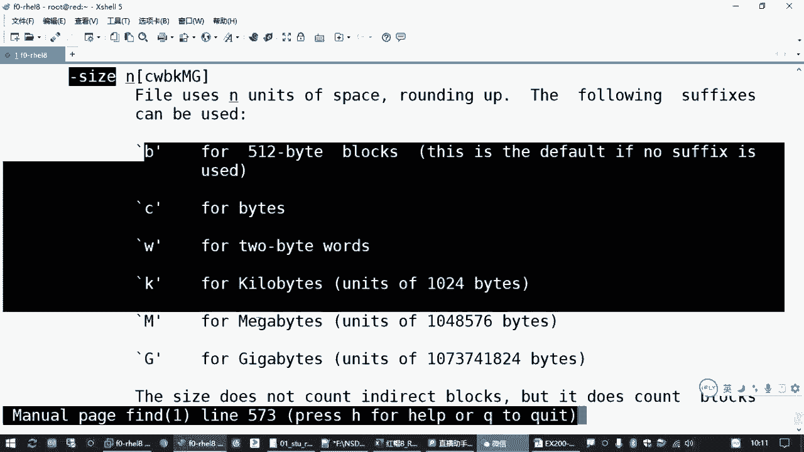

*   **按用户/组查找 (`-user` / `-group`)**
    查找属于指定用户或组的文件。
    ```bash
    find /home -user alice  # 查找属于用户 alice 的文件
    ```

## 组合条件与处理结果

上一节我们介绍了单个查找条件，本节中我们来看看如何组合多个条件，并对找到的文件进行处理。

### 组合查找条件

可以使用 `-a` (and，逻辑与，通常可省略) 和 `-o` (or，逻辑或) 来组合多个条件。
```bash
find /tmp -name "*.log" -size +1M  # 查找 /tmp 下名称以 .log 结尾且大于 1MB 的文件
find /etc -name "*.conf" -o -name "*.cfg" # 查找 /etc 下以 .conf 或 .cfg 结尾的文件
```

### 对查找结果执行操作 (`-exec`)

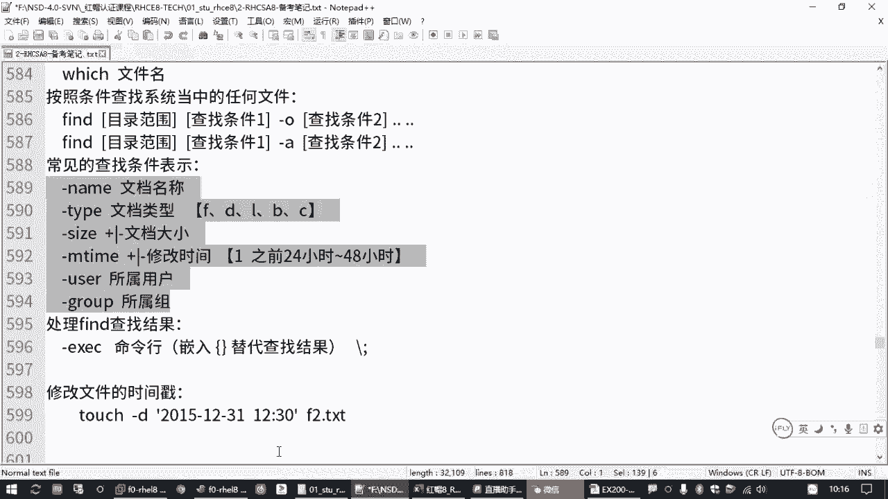

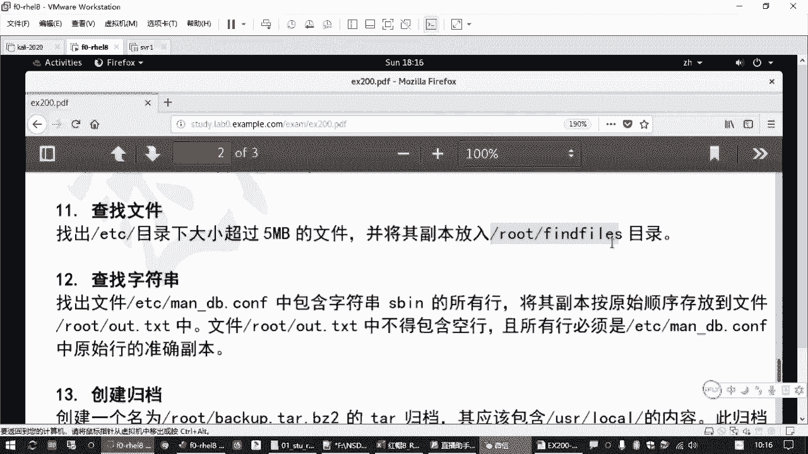


`find` 命令的强大之处在于可以对找到的每一个文件执行指定的命令。这通过 `-exec` 选项实现。
```bash
find [路径] [条件] -exec 命令 {} \;
```
其中 `{}` 是一个占位符，代表 `find` 命令找到的每一个文件路径。命令末尾的 `\;` 是必需的，表示 `-exec` 参数的结束。

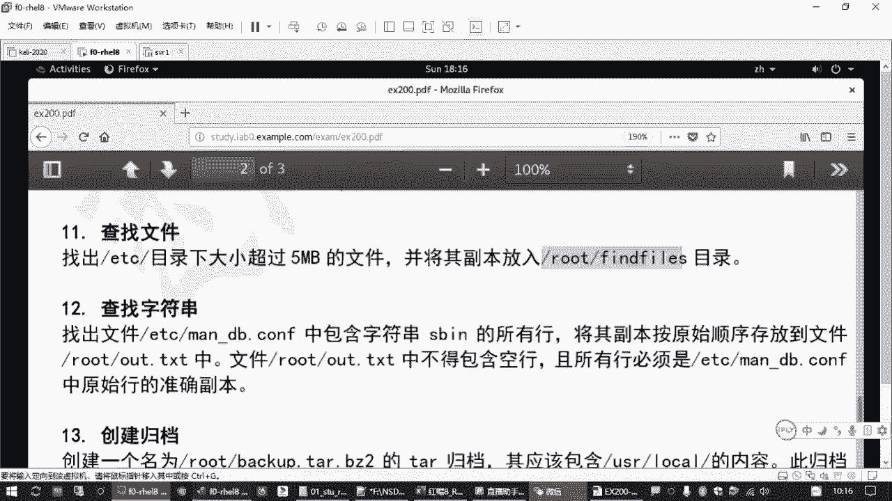

例如，查找 `/etc` 下大于 5MB 的文件，并用 `ls -lh` 命令查看其详细信息：
```bash
find /etc -size +5M -exec ls -lh {} \;
```

更常见的操作是移动或复制文件。例如，将找到的文件复制到另一个目录：
```bash
find /etc -size +5M -exec cp -p {} /root/findfiles/ \;
```
`-p` 选项用于保留文件的原始属性（如权限、时间戳）。

## 文本过滤：`grep` 命令详解

上一节我们学习了如何查找文件，本节中我们来看看如何在文件内容中查找特定的文本模式。

`grep` 命令的基本用法有两种：

1.  **在文件中搜索**
    ```bash
    grep [选项] “搜索模式” 文件名
    ```
    例如，在 `/etc/hosts` 文件中查找包含 “localhost” 的行：
    ```bash
    grep “localhost” /etc/hosts
    ```

2.  **对命令输出进行过滤**
    使用管道符 `|` 将前一个命令的输出作为 `grep` 的输入。
    ```bash
    ifconfig | grep “inet ”
    ```
    此命令先执行 `ifconfig` 显示网络信息，然后 `grep` 从中过滤出包含 “inet ”（注意空格）的行，通常就是 IP 地址所在行。

以下是 `grep` 命令的一些常用选项：

*   **`-i`**：忽略大小写。
    ```bash
    grep -i “error” /var/log/messages
    ```

*   **`-v`**：反向选择，即输出不包含模式的行。
    ```bash
    grep -v “^#” /etc/ssh/sshd_config # 输出所有不以 # 开头的行（即非注释行）
    ```

*   **`-n`**：显示匹配行所在的行号。
    ```bash
    grep -n “failed” /var/log/secure
    ```

*   **`-E`**：启用扩展正则表达式。也可以直接使用 `egrep` 命令。
    ```bash
    grep -E “127|localhost” /etc/hosts # 查找包含 127 或 localhost 的行
    # 等同于
    egrep “127|localhost” /etc/hosts
    ```

## 输出重定向：保存命令结果


上一节我们使用 `grep` 过滤出了文本，本节中我们来看看如何将这些结果保存到文件中，而不是仅仅显示在屏幕上。

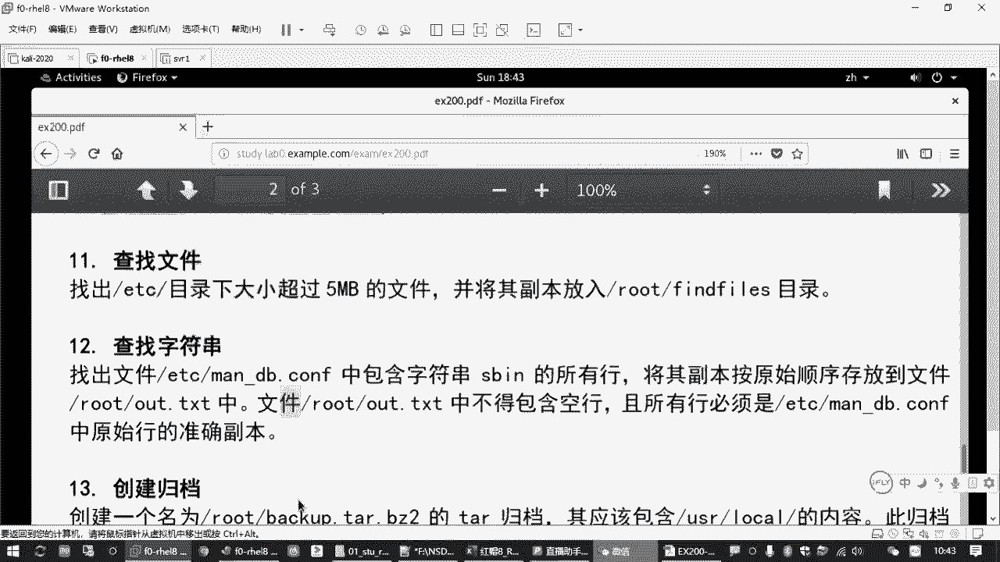

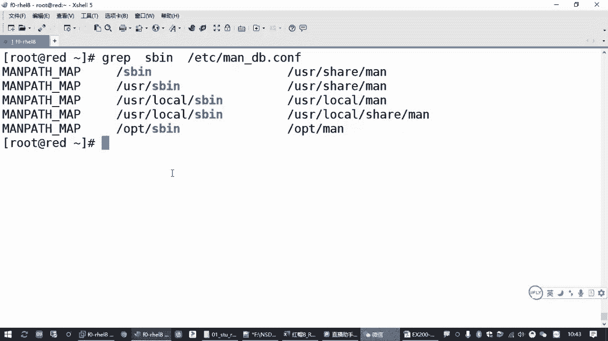

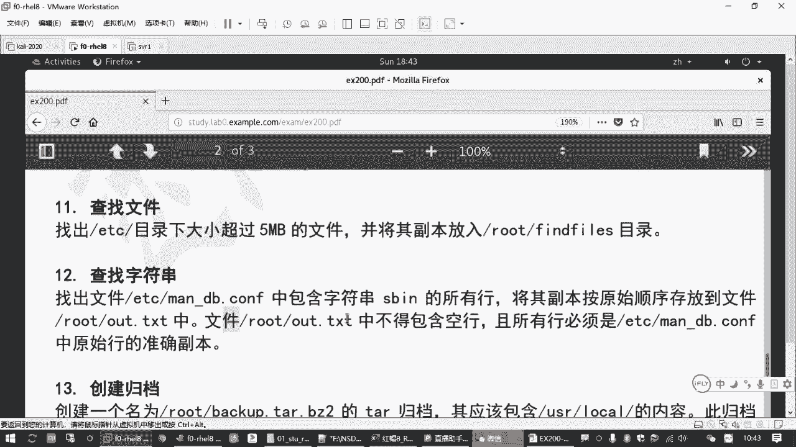

Linux 使用 **输出重定向** 操作符 `>` 和 `>>` 来将命令的输出保存到文件。

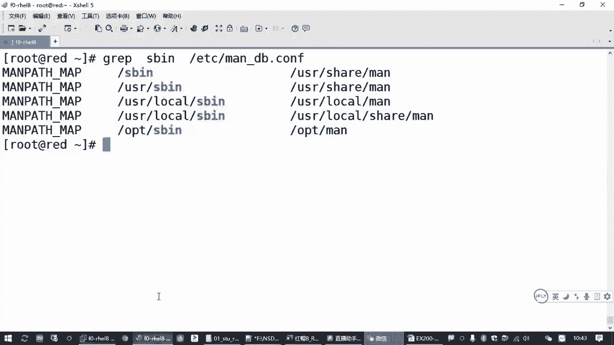

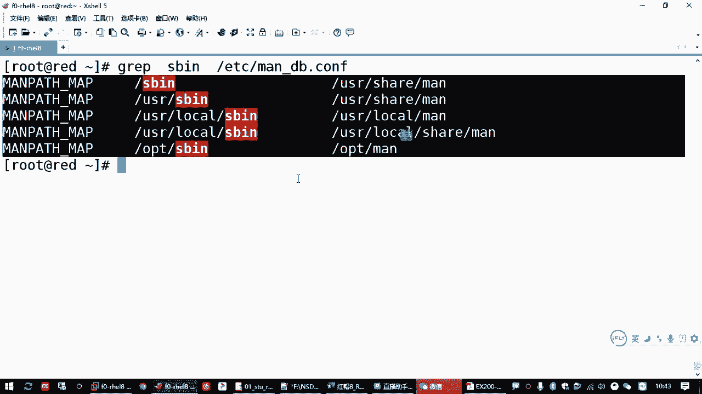

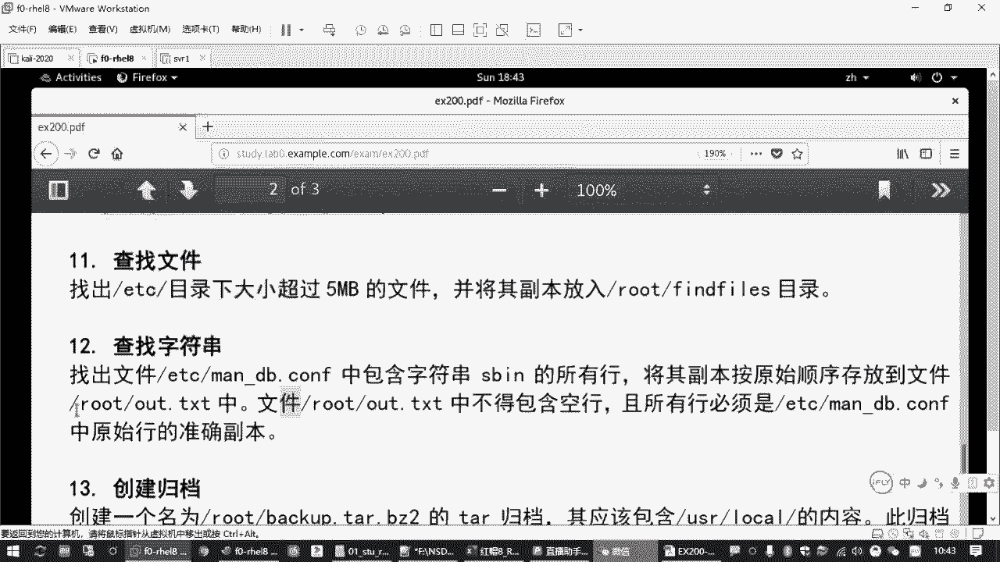

*   **`>`**：将命令输出覆盖写入到指定文件。如果文件不存在则创建，存在则清空后写入。
    ```bash
    grep “SBIN” /etc/man_db.conf > /root/out.txt
    ```
    这条命令将 `grep` 的查找结果直接保存到 `/root/out.txt` 文件中，高效且准确，避免了手动复制粘贴可能引入的错误（如多余空行、内容缺失）。

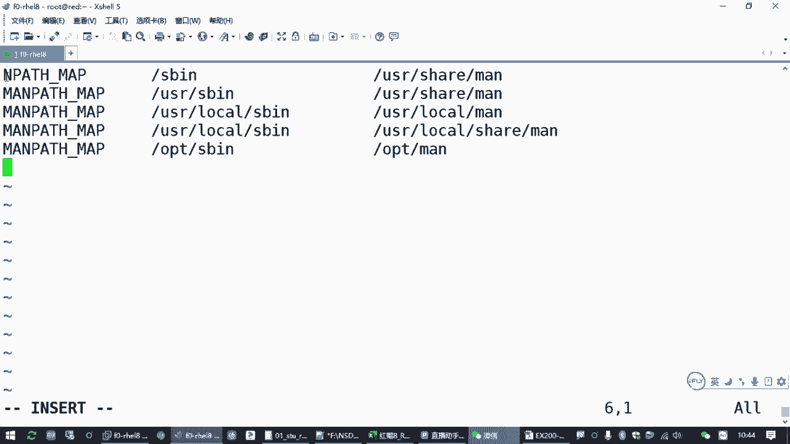

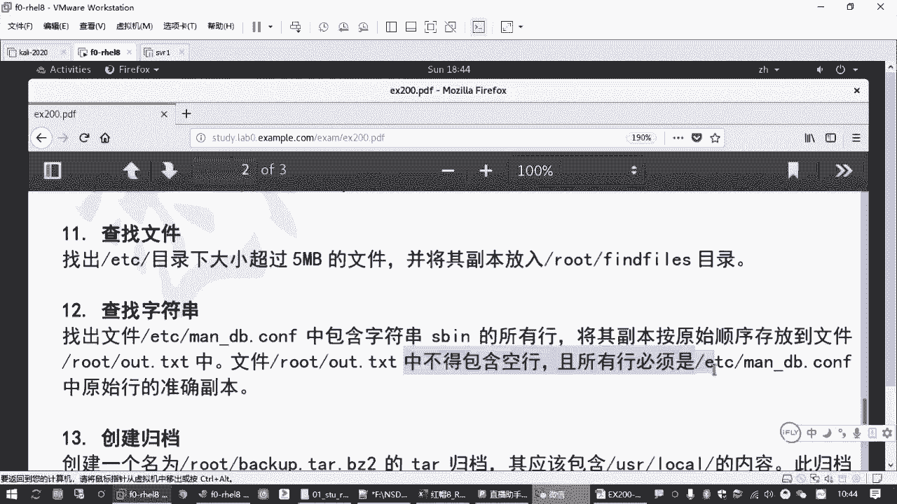

*   **`>>`**：将命令输出追加到指定文件的末尾。文件原有内容保持不变。
    ```bash
    date >> /root/out.txt # 将当前日期时间追加到 out.txt 文件末尾
    ```

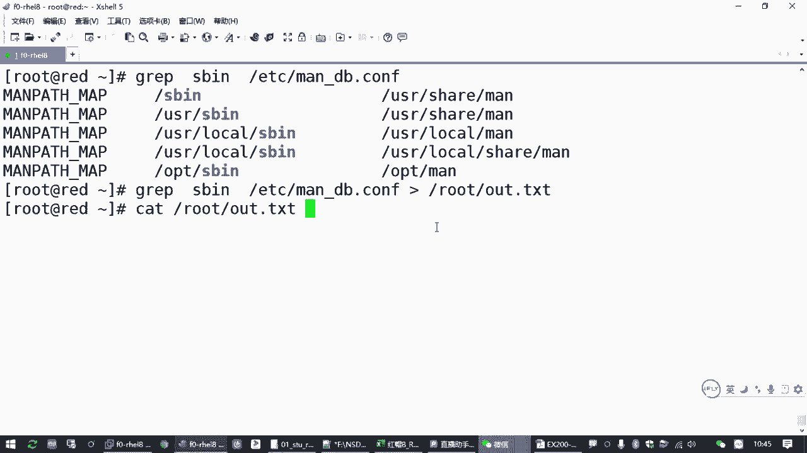

**重要区别**：
*   **管道 `|`**：连接两个命令，将前一个命令的 **输出** 作为后一个命令的 **输入**。
*   **重定向 `>` / `>>`**：将一个命令的 **输出** 发送到 **文件**。

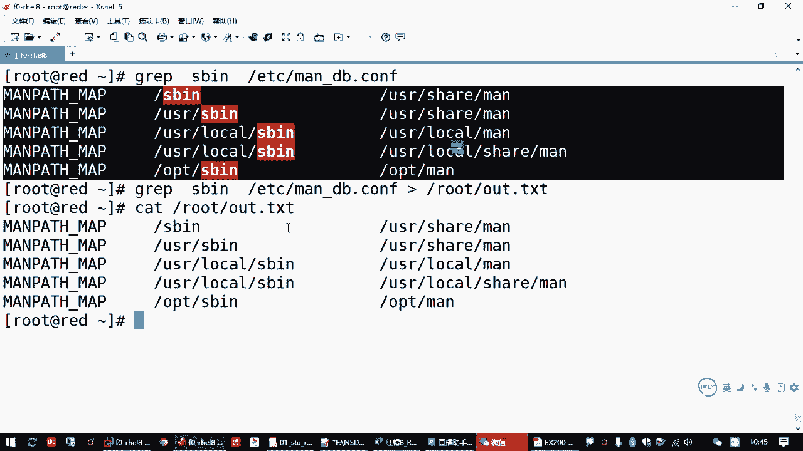

---

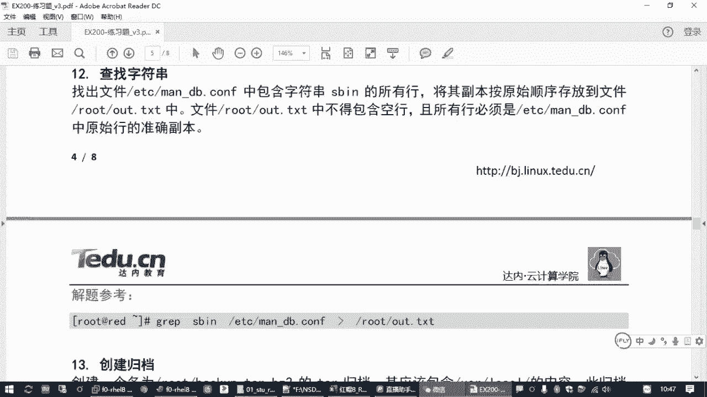

本节课中我们一起学习了 `find` 和 `grep` 这两个核心命令。`find` 命令帮助我们在复杂的文件系统中定位目标文件，并能对它们执行后续操作；`grep` 命令则让我们能够快速从大量文本中提取关键信息。结合输出重定向技术，我们可以轻松地将命令执行结果归档保存。这些技能是每一位 Linux 系统管理员日常工作中不可或缺的工具。