# 备考红帽认证必修课：P18：3.04-autofs自动文件系统 🗂️

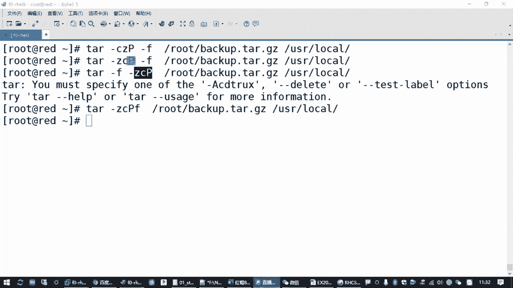

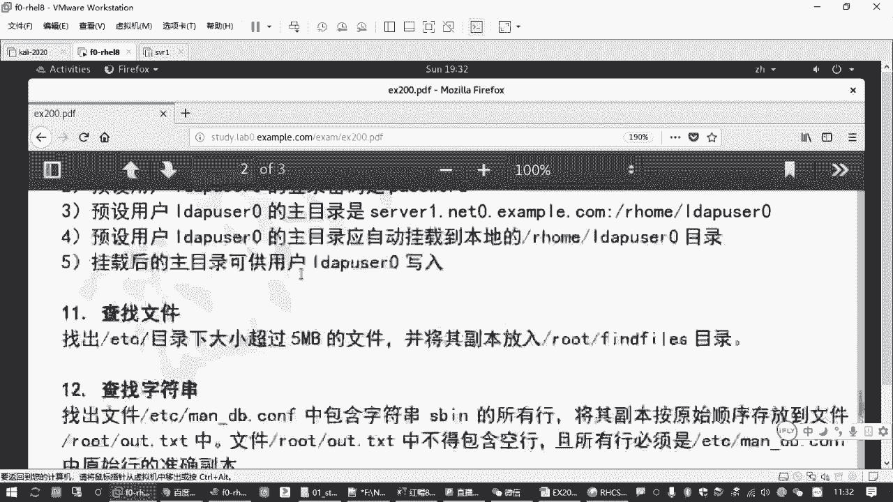

在本节课中，我们将学习如何配置 **autofs** 自动文件系统，以实现按需自动挂载远程 NFS 共享目录。这对于为远程用户（如 LDAP 用户）提供动态主目录至关重要。


## 课程概述与环境说明

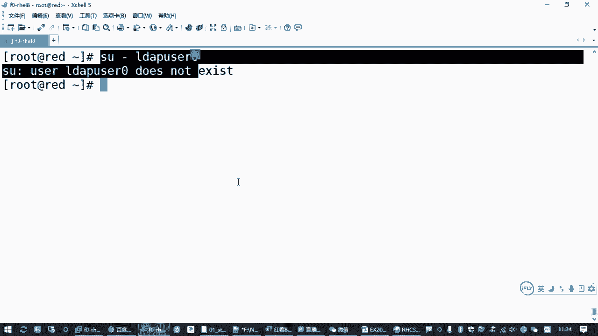

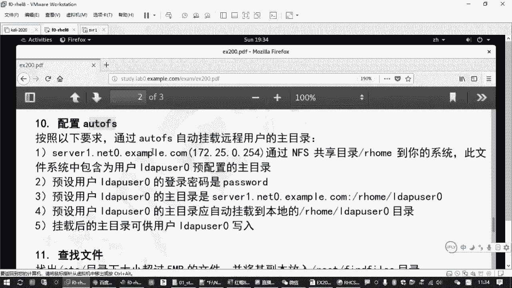

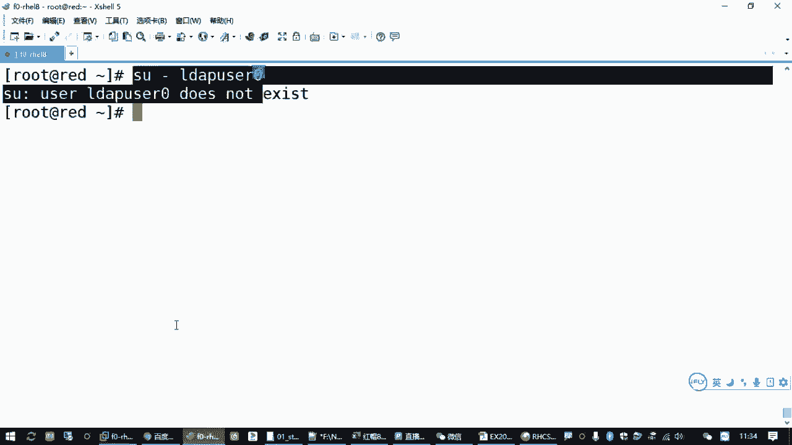

本节内容基于红帽认证考试的一道典型题目。题目要求配置 **autofs**，以便当远程用户（例如 `ldapuser0`）登录时，能自动将其主目录从 NFS 服务器挂载到本地。

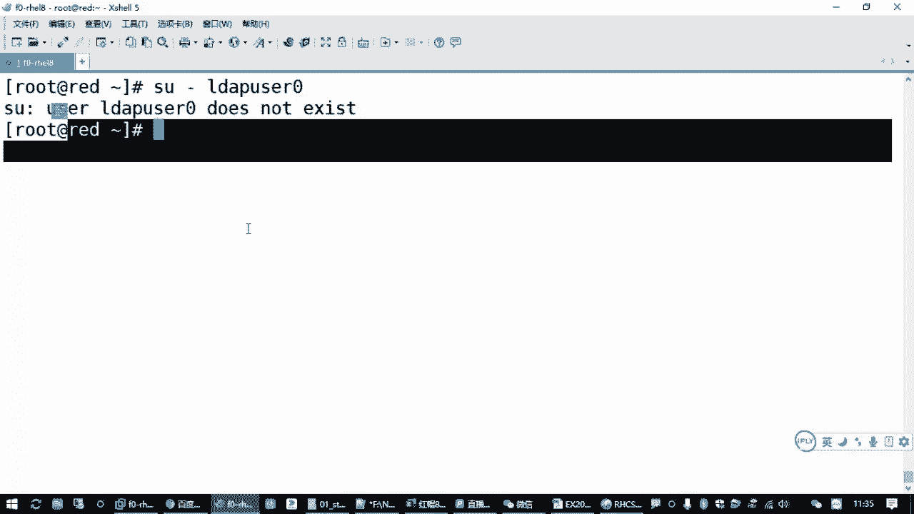

在考试环境中，LDAP 客户端通常已预先配置好，我们可以直接使用 `ldapuser0` 账号登录。然而，该用户的主目录并不在本地，而是由考试服务器通过 NFS 共享提供。我们的任务就是配置 **autofs**，使得用户登录时能自动获得其主目录。

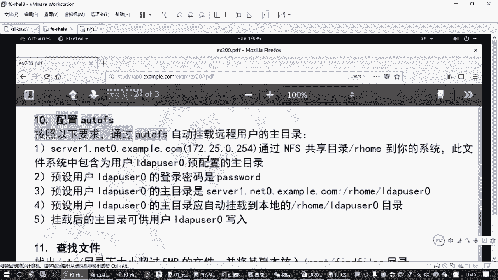

> **注意**：我们的练习环境可能没有配置 LDAP 服务器和 `ldapuser0` 用户，但配置 **autofs** 的核心步骤是相同的。我们将通过访问一个模拟的 NFS 共享目录来验证配置是否成功。

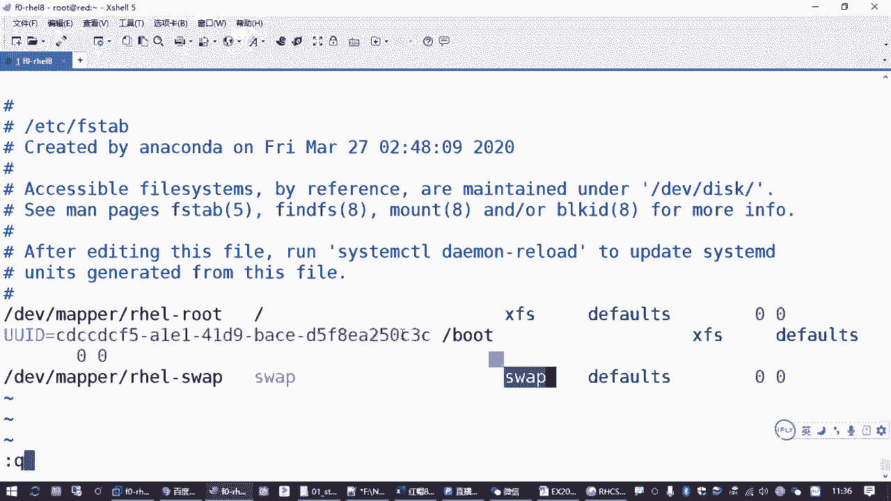

## 理解核心概念：NFS 与 Autofs

在开始配置之前，我们需要理解两个核心概念：**NFS** 和 **Autofs**。

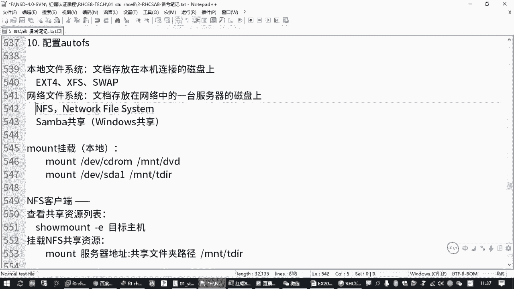

### 网络文件系统 (NFS)

NFS 允许将远程服务器上的目录共享到网络中的其他计算机上，使其像本地目录一样使用。这与仅使用本地磁盘的 **EXT4** 或 **XFS** 等文件系统不同。

要查看 NFS 服务器共享了哪些目录，可以使用 `showmount` 命令：
```bash
showmount -e <服务器地址>
```

### 自动挂载 (Autofs)

**Autofs** 服务实现了“按需挂载”或“触发挂载”。其工作原理是：
*   **挂载点平时不存在**：在用户或程序访问特定目录之前，该目录（挂载点）并不存在。
*   **访问时自动创建并挂载**：一旦尝试访问该目录，**autofs** 会立即创建挂载点，并将指定的远程资源（如 NFS 共享）挂载上去。
*   **闲置后自动卸载**：如果一段时间（默认5分钟）内没有访问，**autofs** 会自动卸载该资源并删除挂载点。


这就像设置了一个“地雷”：踩到（访问）特定路径时，才会“引爆”（挂载资源）；不用时，现场会自动清理。

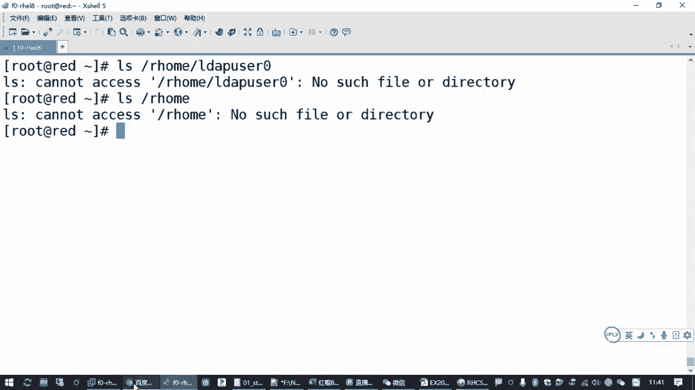

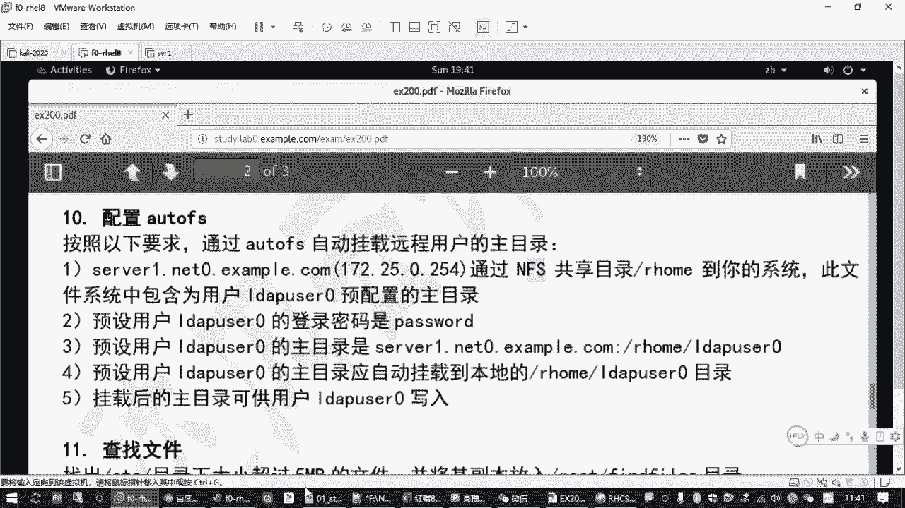

## 配置 Autofs 的详细步骤

上一节我们介绍了 NFS 和 Autofs 的基本概念，本节中我们来看看如何一步步配置 Autofs 服务。

### 步骤一：安装必要软件包

首先，确保系统已安装支持 NFS 客户端和 Autofs 服务的软件包。
```bash
yum install -y nfs-utils autofs
```
*   `nfs-utils`：提供访问 NFS 文件系统所需的工具和命令。
*   `autofs`：提供自动挂载服务。

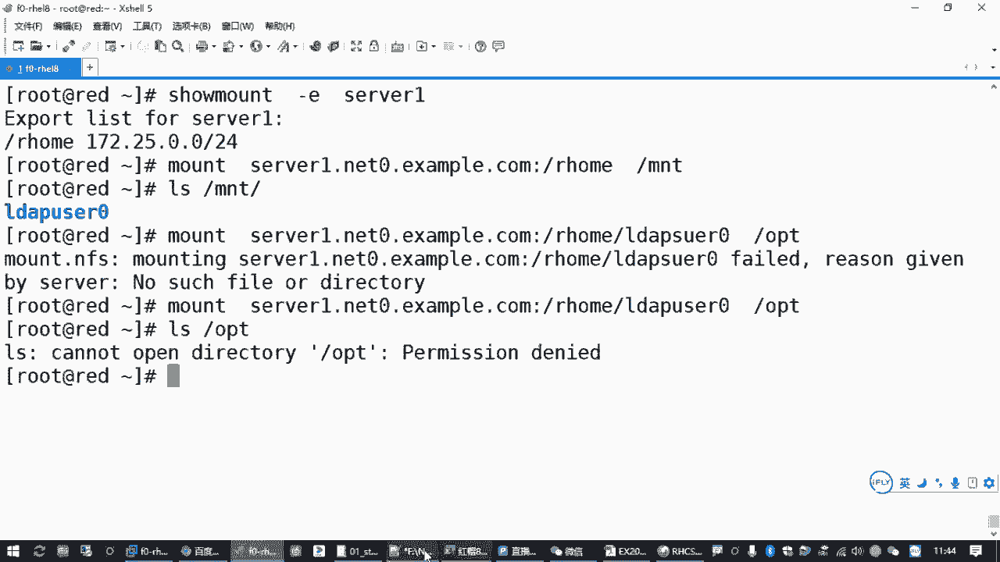

### 步骤二：检查 NFS 共享资源

在配置挂载之前，先确认 NFS 服务器（例如 `server1`）共享了哪些目录。
```bash
showmount -e server1
```
如果命令成功，你将看到类似输出，表明服务器共享了 `/home` 目录。

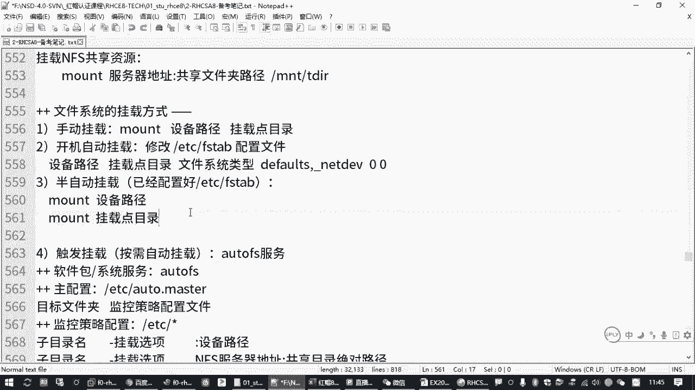

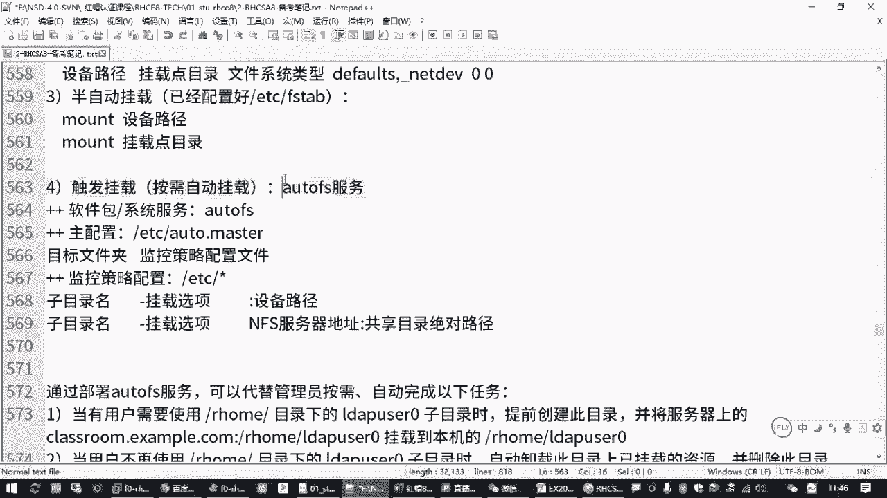

### 步骤三：配置主映射文件 (`/etc/auto.master`)

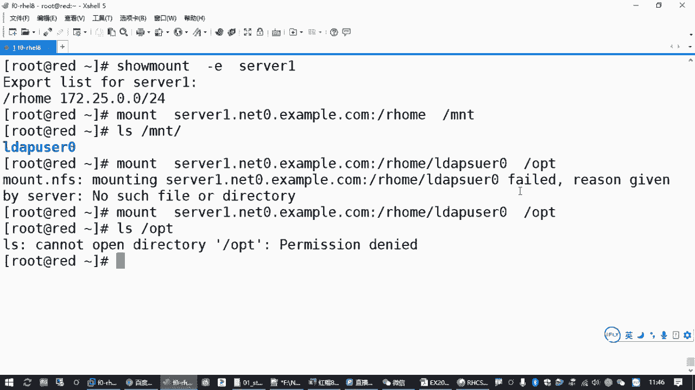

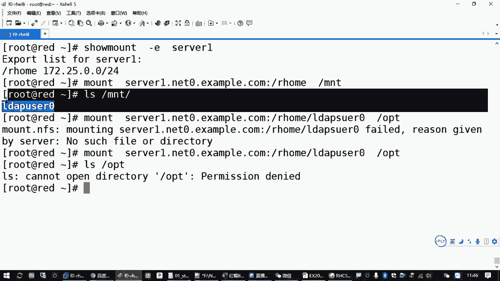

这是 Autofs 的主配置文件。我们需要在此文件中指定“监视目录”和对应的“映射文件”。

编辑 `/etc/auto.master` 文件：
```bash
vim /etc/auto.master
```
在文件末尾添加以下一行：
```
/home   /etc/auto.home
```
*   **`/home`**：这是本地的“监视目录”或“挂载点父目录”。Autofs 将监视此目录下的子目录访问。
*   **`/etc/auto.home`**：这是“映射文件”的路径。该文件定义了在 `/home` 目录下具体如何挂载子目录。文件名可以自定义。

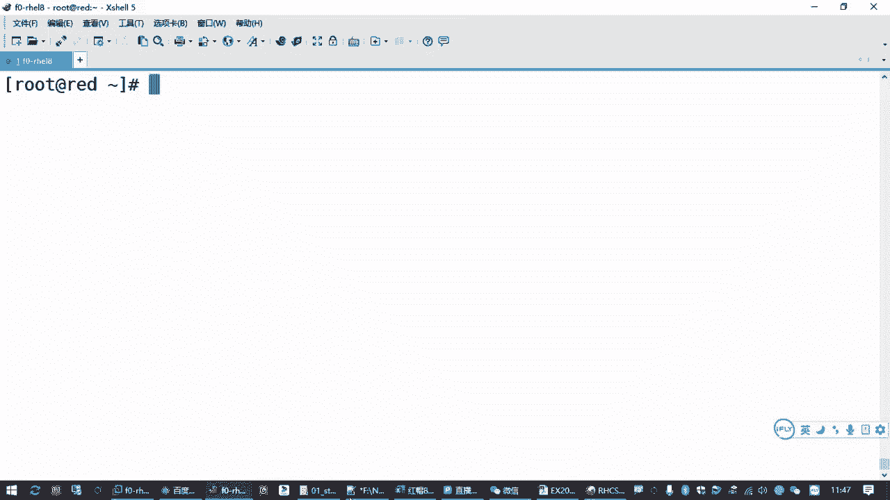

保存并退出编辑器。

### 步骤四：创建并配置映射文件

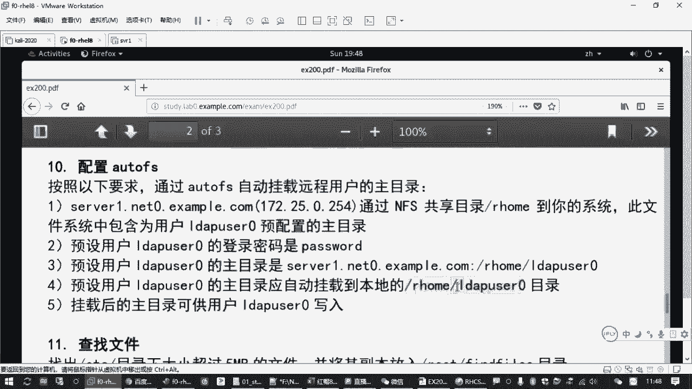

现在，创建并编辑上一步中指定的映射文件 `/etc/auto.home`。
```bash
vim /etc/auto.home
```
在文件中添加以下内容：
```
ldapuser0  -fstype=nfs,rw  server1:/home/ldapuser0
```
让我们分解这行配置的含义：
*   **`ldapuser0`**：这是“键”或“触发点”。当用户或程序访问 `/home/ldapuser0` 时，Autofs 将被触发。
*   **`-fstype=nfs,rw`**：这是挂载参数。指定文件系统类型为 `nfs`，并设置挂载为可读写 (`rw`)。参数部分可选，默认即为可读写的 NFS。
*   **`server1:/home/ldapuser0`**：这是要挂载的远程资源。格式为 `服务器:共享目录路径`。

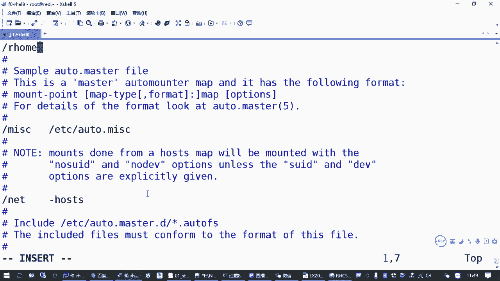

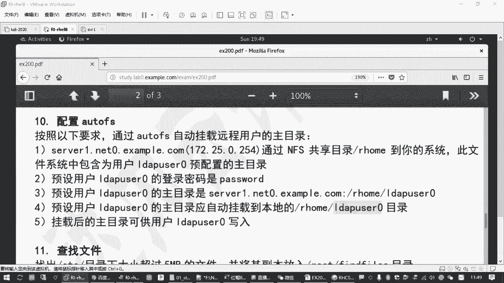

保存并退出编辑器。

### 步骤五：启动并启用 Autofs 服务

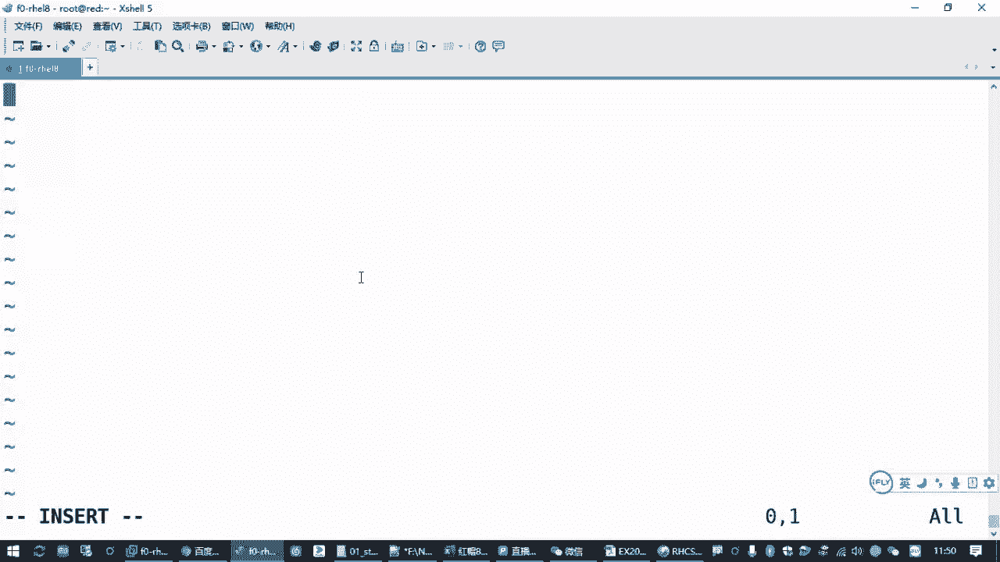

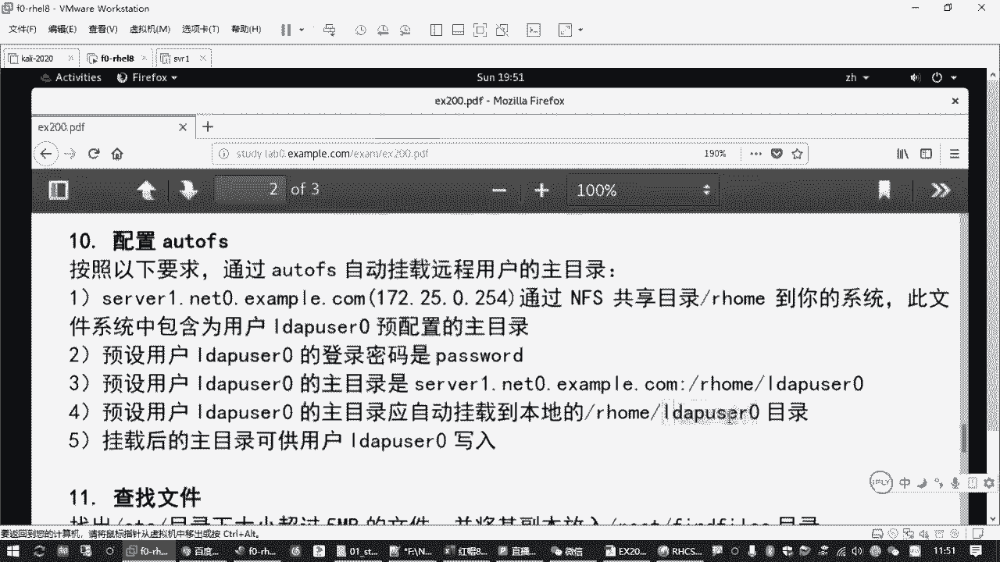

配置完成后，需要启动 Autofs 服务使其生效，并设置为开机自启。
```bash
systemctl enable --now autofs
```

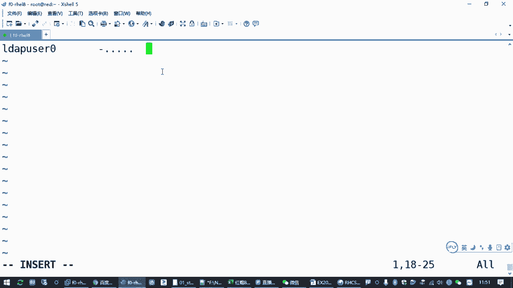

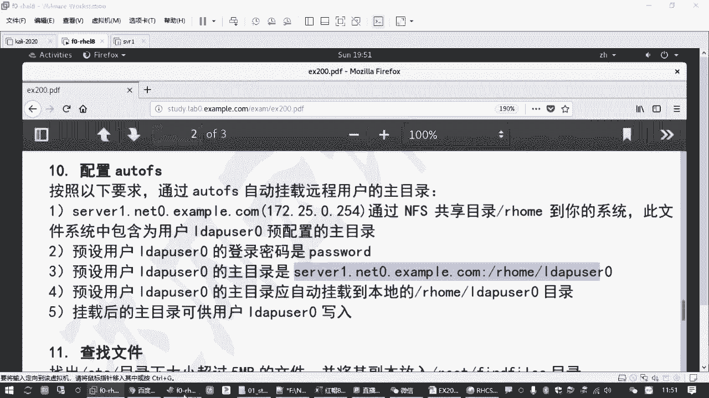

## 验证 Autofs 配置

配置完成后，让我们来验证 Autofs 是否按预期工作。

1.  **初始状态检查**：首先，查看 `/home` 目录。此时 `ldapuser0` 子目录应该不存在。
    ```bash
    ls /home
    ```

2.  **触发自动挂载**：尝试访问或列出 `/home/ldapuser0` 目录。这个操作会“踩到地雷”，触发 Autofs。
    ```bash
    ls /home/ldapuser0
    ```
    *   **如果成功**：你会看到类似 `Permission denied` 的提示。这非常好！它意味着：
        *   Autofs 已成功自动创建了 `/home/ldapuser0` 目录。
        *   已成功将 `server1:/home/ldapuser0` 挂载到了该目录。
        *   由于该目录权限属于远程用户 `ldapuser0`，本地 `root` 用户没有权限进入，所以报错。但这恰恰证明了挂载成功。
    *   **对比测试**：可以尝试访问一个未配置的目录（如 `/home/ldapuser1`），你会看到 `No such file or directory` 的错误，这与之前的 `Permission denied` 不同。

3.  **查看挂载点**：使用 `ls -l /home` 命令，现在你应该能看到 `ldapuser0` 目录已经出现。

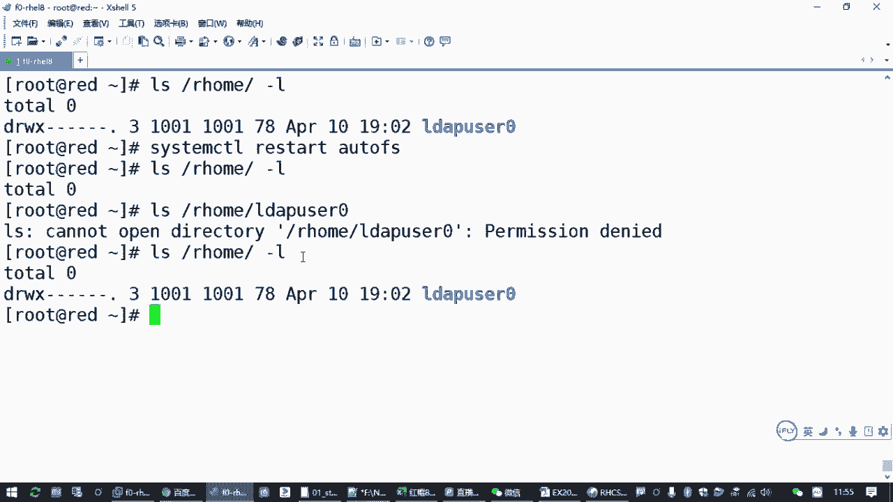

4.  **验证自动卸载**：等待大约5分钟（或重启 `autofs` 服务：`systemctl restart autofs`），再次检查 `/home` 目录，`ldapuser0` 目录会自动消失。当你再次访问它时，它又会自动出现。

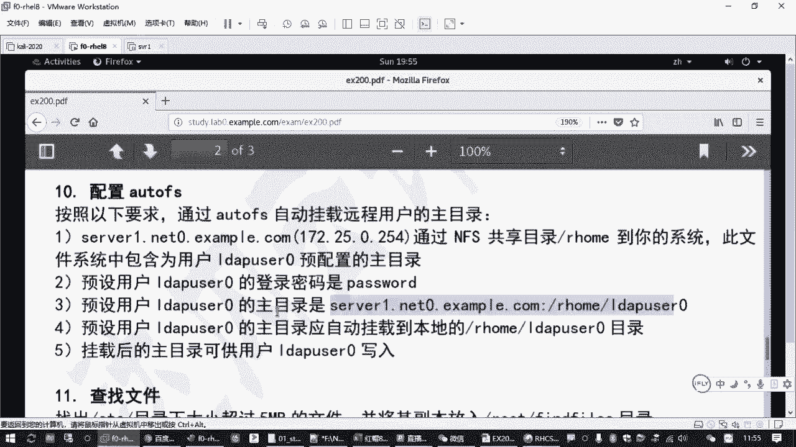

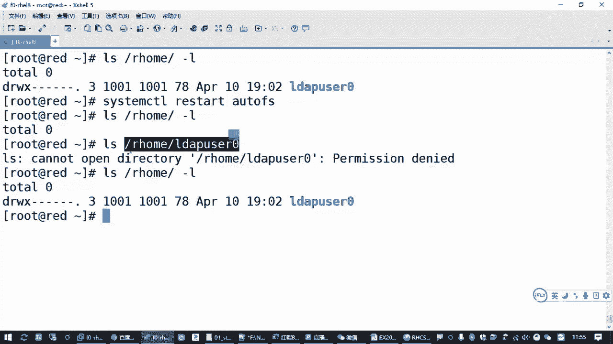

## 课程总结

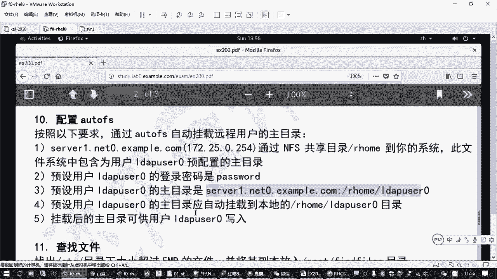

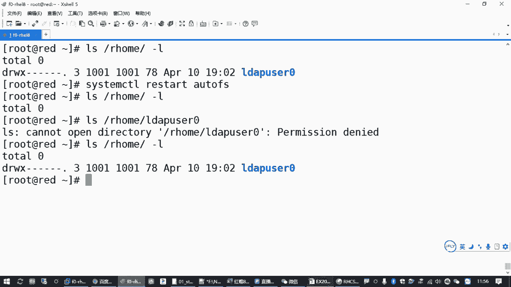

本节课中我们一起学习了 **Autofs 自动文件系统** 的配置与管理。我们掌握了以下核心技能：

1.  **理解应用场景**：Autofs 常用于动态挂载远程用户的主目录（如 LDAP 用户），实现按需使用，节省资源并提升安全性。
2.  **掌握配置流程**：配置 Autofs 主要涉及两个文件：
    *   主配置文件 `/etc/auto.master`：定义监视目录和映射文件。
    *   映射文件（如 `/etc/auto.home`）：定义具体的触发点、挂载参数和远程资源。
3.  **学会服务管理**：使用 `systemctl` 命令来启动、启用和重启 `autofs` 服务。
4.  **完成验证测试**：通过访问配置的触发目录来验证 Autofs 是否成功实现了“访问时自动挂载，闲置后自动卸载”的功能。

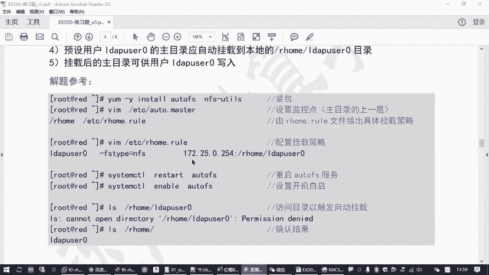

通过本课的学习，你已掌握了在红帽认证考试中配置 Autofs 服务的关键考点，并理解了其在企业实际环境中的重要用途。