# 备考红帽认证必修课：P19：3.05-重置root密码 🔑

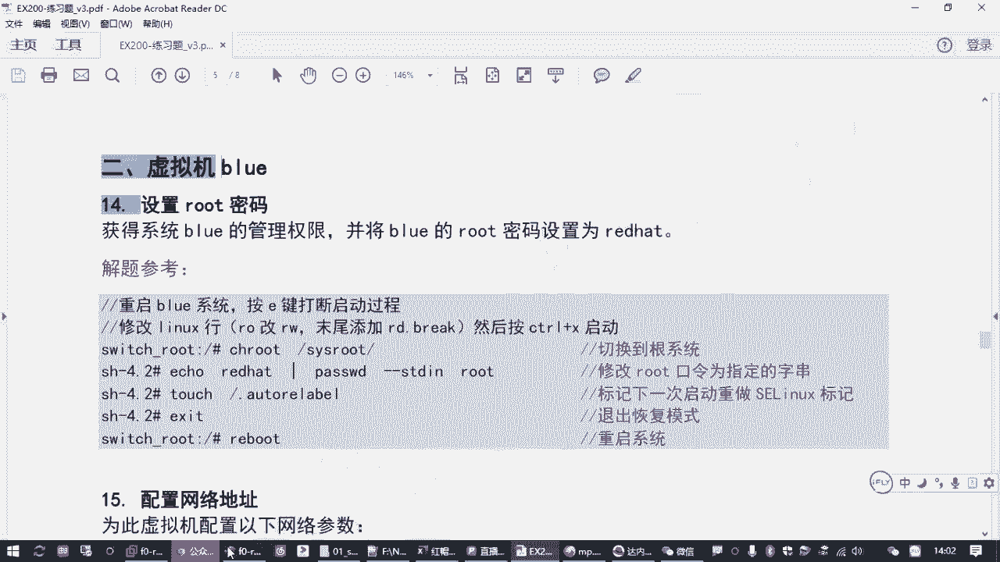

在本节课中，我们将学习如何重置红帽Linux系统的root用户密码。这是系统管理员必须掌握的一项关键技能，尤其当您忘记密码或需要接管一台未知密码的系统时。我们将通过修改系统启动参数进入恢复模式，从而绕过密码验证并完成密码重置。

## 概述与背景

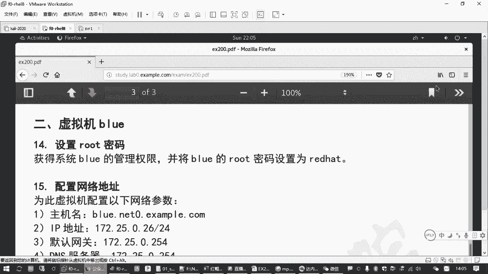

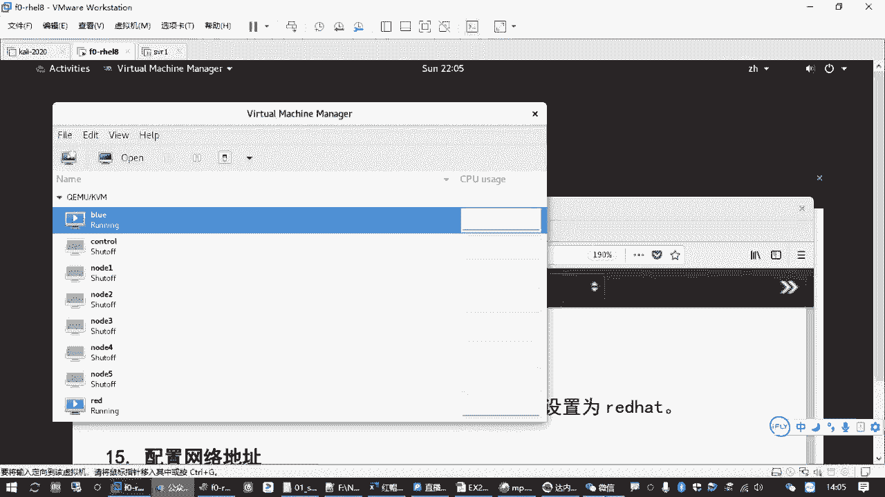

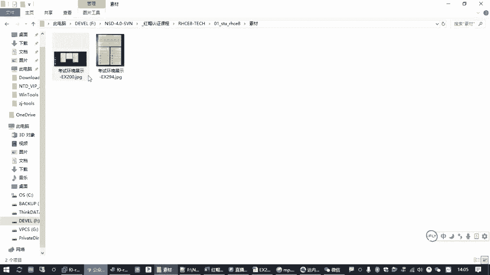

上一节我们介绍了基本的系统管理操作，本节中我们来看看如何应对忘记root密码的情况。在红帽认证考试中，此操作可能出现在名为`blue`的第二台虚拟机上。您需要获取该系统的管理员权限，并将密码设置为指定值（例如`redhat`）。核心在于**无需原密码进入系统**并**正确修改密码**，同时注意`SELinux`安全机制可能带来的影响。

## 操作步骤详解

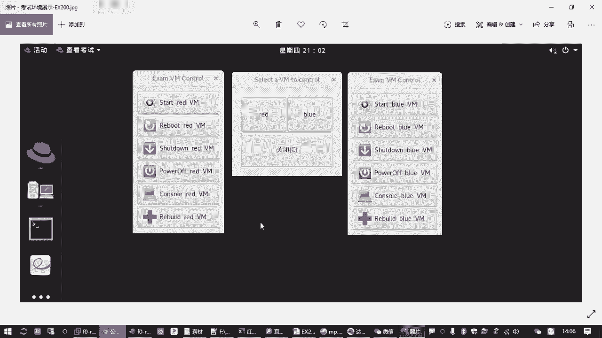

以下是重置root密码的完整流程，请按照顺序操作。

### 第一步：重启并中断引导过程

首先，您需要将目标虚拟机（如`blue`）关机并重新启动，在启动过程中快速中断其正常引导。

1.  将虚拟机**强制关机**（`power off`）。
2.  立即**启动**虚拟机，并迅速点击打开其控制台（`console`）。
3.  在控制台窗口出现后，**快速连续按两次 `e` 键**。第一次按`e`是为了显示隐藏的启动菜单，第二次按`e`是为了编辑默认的启动项。

### 第二步：修改内核启动参数

成功中断后，您会看到启动配置界面。找到以 **`linux`** 开头的那一行，这是我们需要编辑的核心。

1.  使用方向键将光标移动到 **`linux`** 这一行。
2.  找到该行中的 **`ro`** 参数（表示只读挂载），将其修改为 **`rw`**（表示可读写挂载）。
3.  将光标移动到该行末尾，添加参数 **`rd.break`**。
    *   修改后的关键部分应类似：`... ro crashkernel=auto ...` 变为 `... rw crashkernel=auto ... rd.break`
4.  修改完成后，按 **`Ctrl+x`** 组合键以使用修改后的参数启动系统。

### 第三步：进入系统并切换根环境

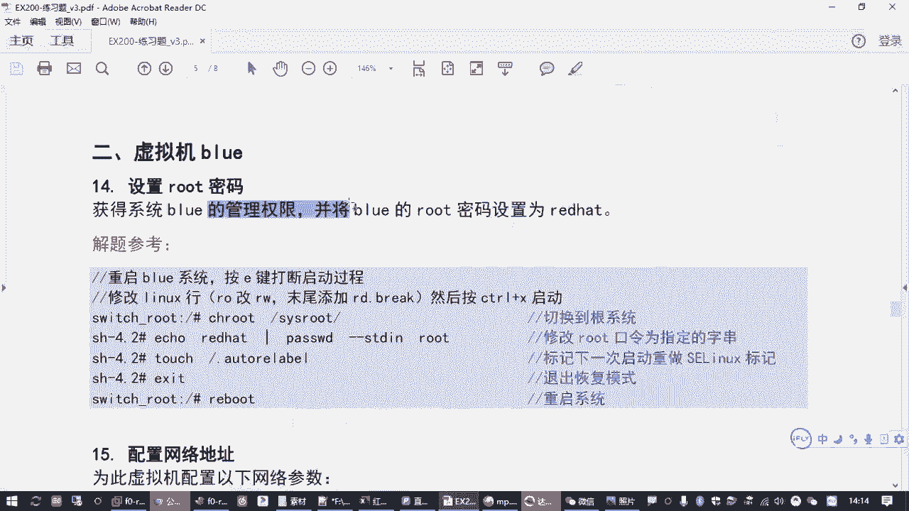

系统将进入一个临时的恢复模式（`recovery mode`）环境。在此环境下，需切换至真实的系统根目录才能进行有效修改。

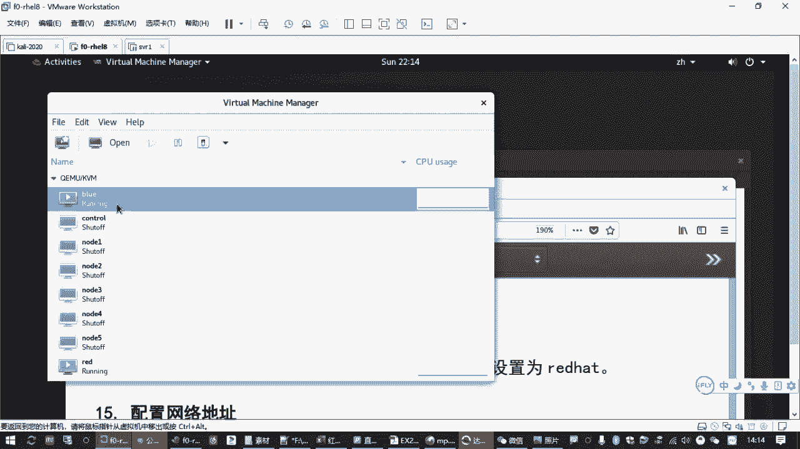

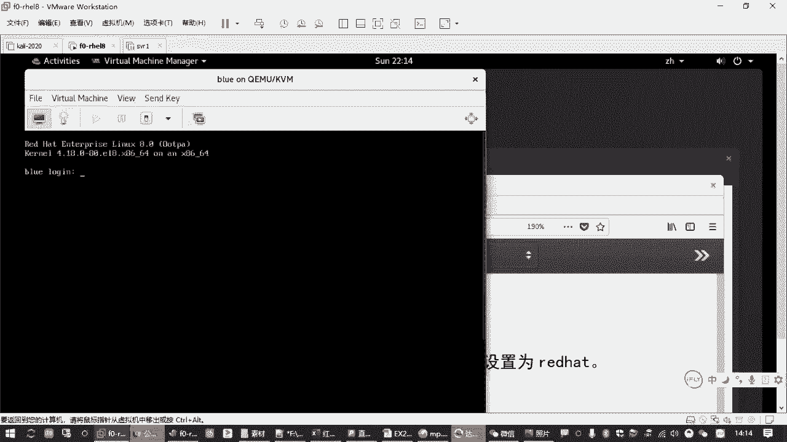

1.  系统启动后，您会看到提示符：`switch_root:/#`
2.  执行以下命令，将根环境切换到硬盘上的真实系统：
    ```bash
    chroot /sysroot
    ```
3.  执行后，提示符通常会变为 `sh-4.4#`，表示已进入真实的系统环境。

### 第四步：重置root密码并处理SELinux

现在可以修改root密码了。如果系统启用了`SELinux`，还需执行一个额外步骤，否则新密码可能无法生效。

1.  使用 `passwd` 命令修改root密码：
    ```bash
    passwd root
    ```
    根据提示输入两次新密码（如 `redhat`）。
2.  创建 `.autorelabel` 文件，通知系统在下次启动时重新标记`SELinux`安全上下文：
    ```bash
    touch /.autorelabel
    ```

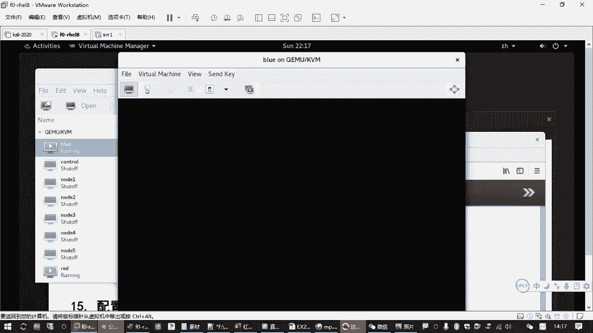

### 第五步：退出并重启系统

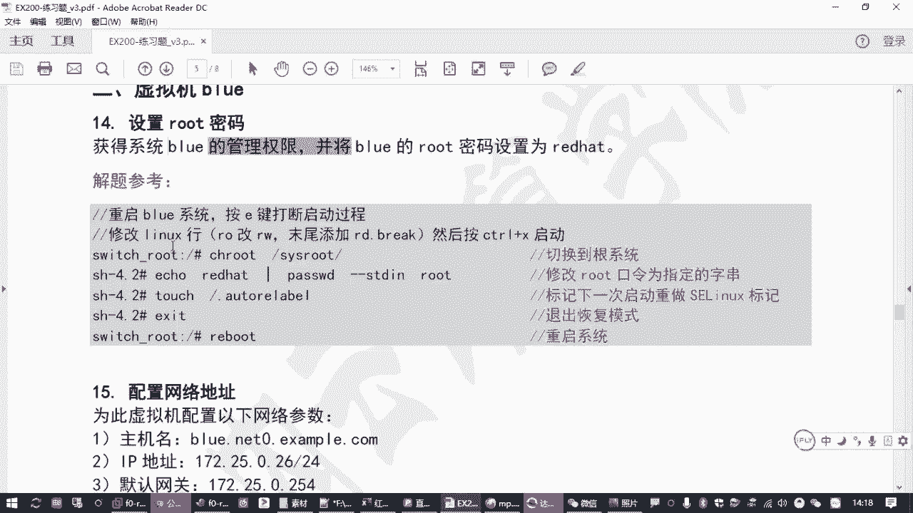

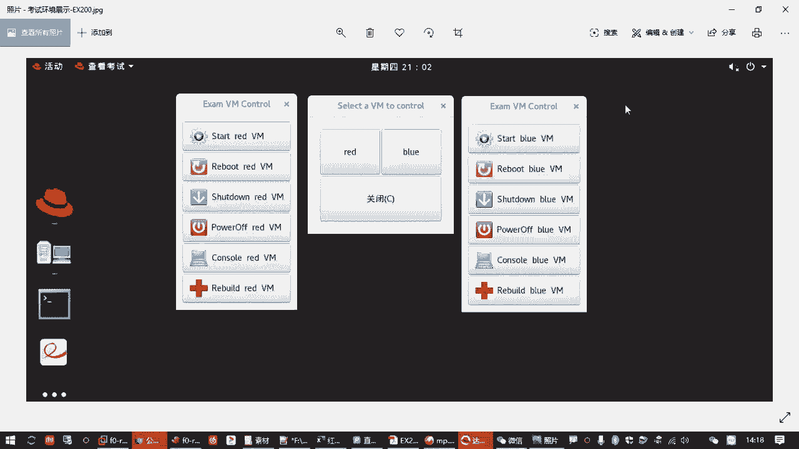

完成所有修改后，退出`chroot`环境并重启系统。

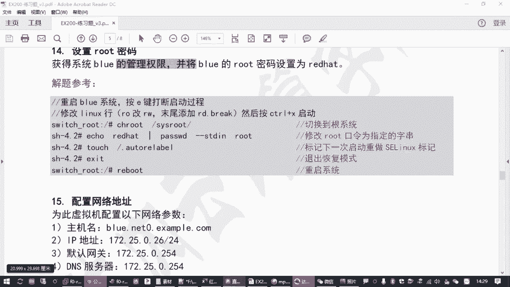

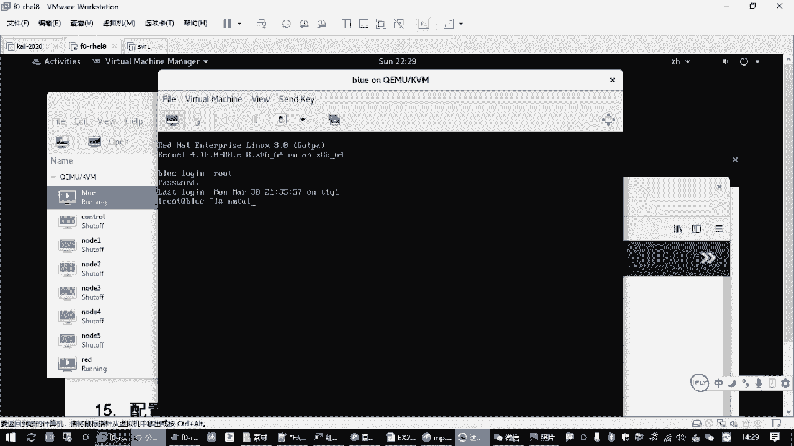

1.  退出`chroot`环境：
    ```bash
    exit
    ```
2.  再次执行`exit`或直接重启系统：
    ```bash
    reboot
    ```
3.  系统重启后，即可使用新设置的`root`密码登录。

## 后续配置建议

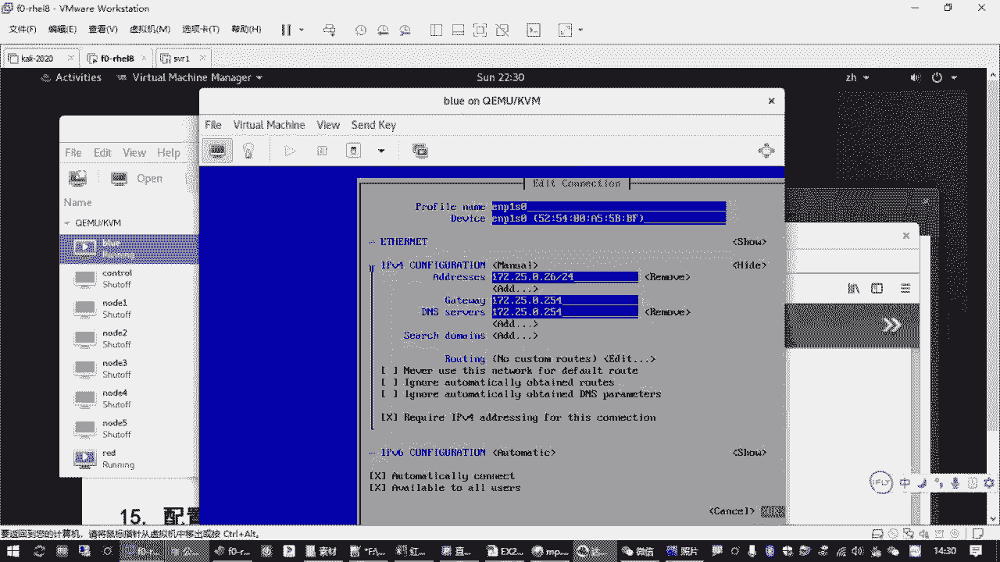

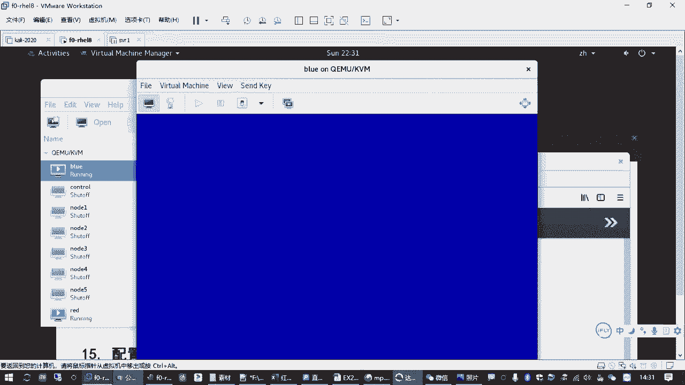

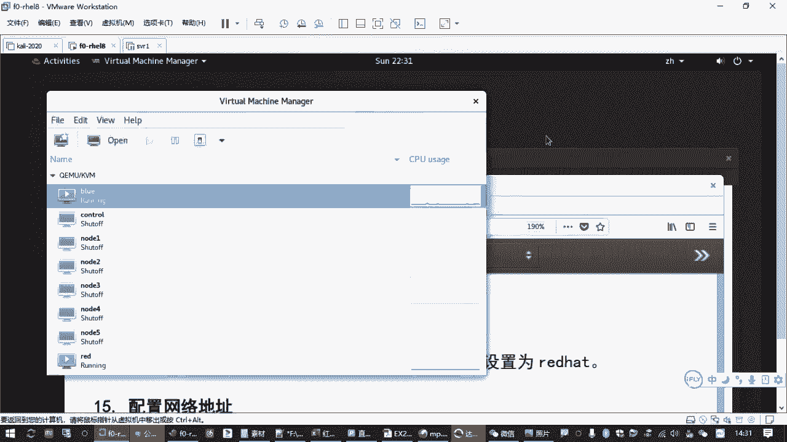

成功登录`blue`虚拟机后，建议您完成以下基础配置，以便后续操作。

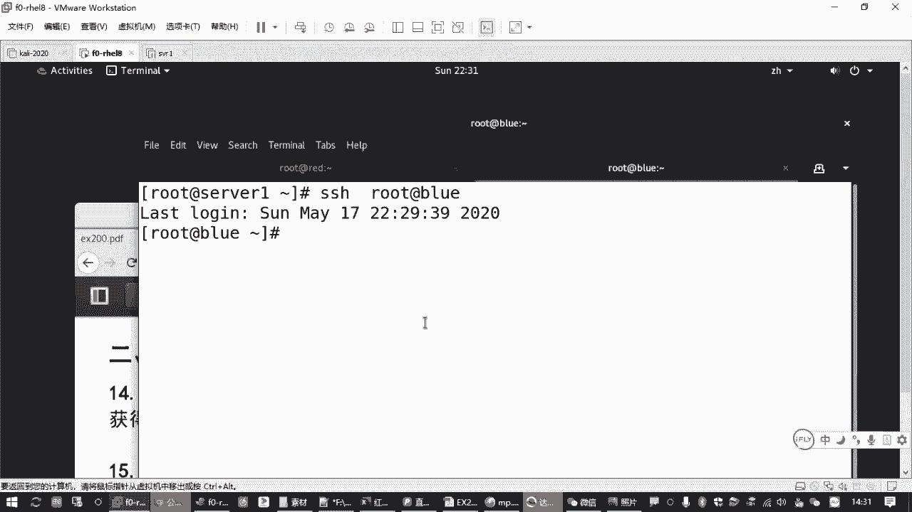

以下是建议进行的网络和软件源配置：

*   **配置网络与主机名**：使用 `nmtui` 命令工具，为虚拟机配置指定的静态IP地址（如`172.25.0.11`）和完整主机名（如`blue.network0.example.com`）。
*   **配置软件仓库（Yum Repo）**：为了后续安装软件包，需要配置Yum源。一个高效的方法是直接从已配置好的`red`虚拟机复制配置文件：
    ```bash
    scp /etc/yum.repos.d/*.repo root@blue的IP地址:/etc/yum.repos.d/
    ```
*   **安装常用工具**：配置好Yum源后，可以安装一些常用工具包，例如：
    ```bash
    yum install -y bash-completion vim-enhanced net-tools bind-utils
    ```

## 总结

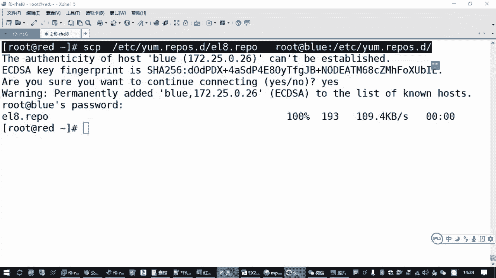

本节课中我们一起学习了在红帽Linux 8系统中重置root密码的完整流程。关键步骤包括：通过按`e`键中断启动、修改内核参数（`ro`改为`rw`并添加`rd.break`）、使用`chroot /sysroot`切换根环境、执行`passwd`修改密码，以及为启用`SELinux`的系统创建`/.autorelabel`文件。掌握此方法，您将能够应对管理员密码丢失的常见运维场景。