# 备考红帽认证必修课：P23：RHCSA考前串讲 📝

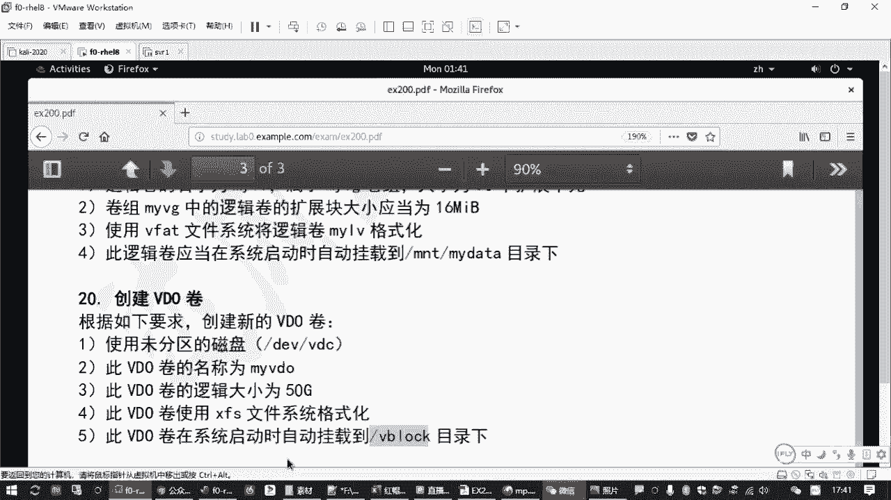

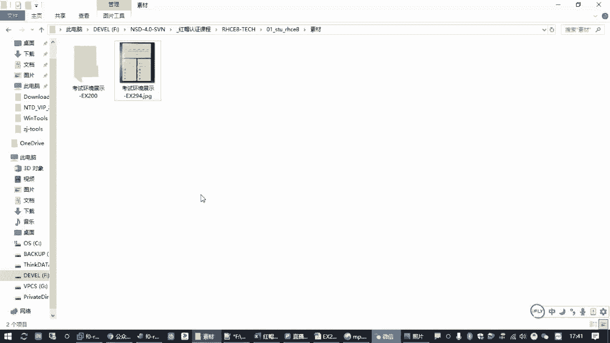

在本节课中，我们将对RHCSA考试的关键信息、操作流程和注意事项进行系统性的梳理与总结，帮助大家为正式考试做好充分准备。

---

## 考试环境与界面介绍 🖥️

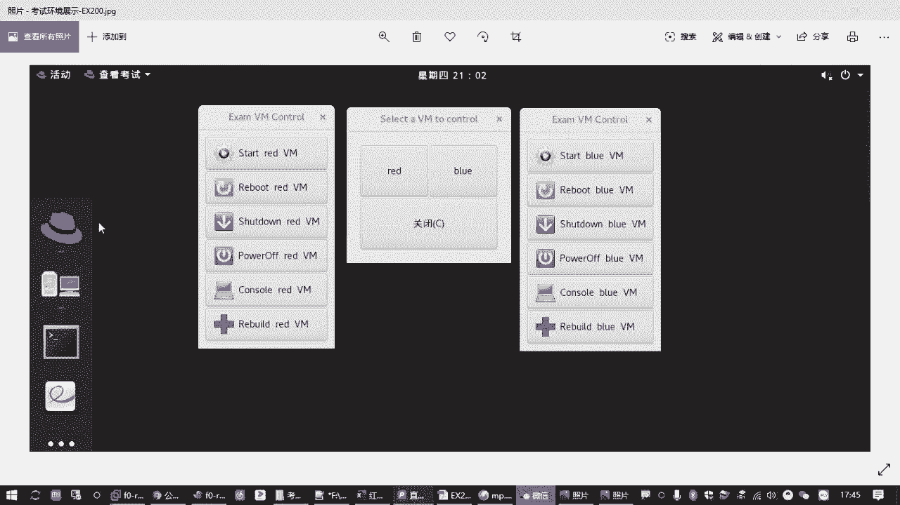

上一节我们介绍了考试的整体情况，本节中我们来看看具体的考试环境与操作界面。

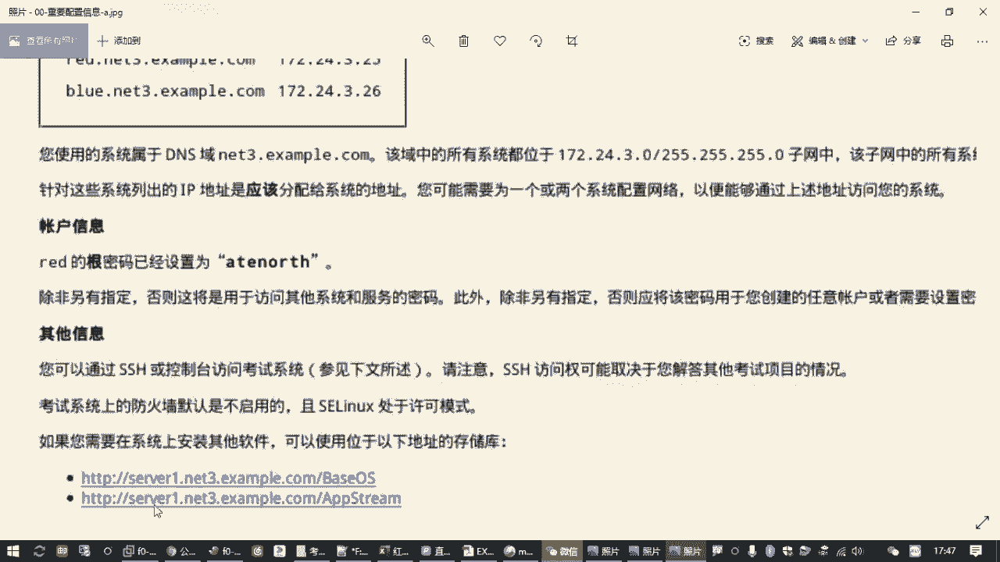

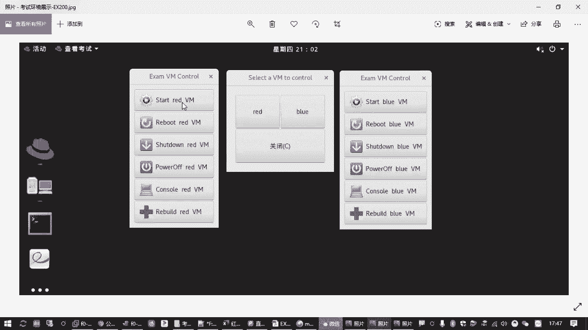

考试时，每位考生会使用一台真实的物理机。进入系统后，你将看到考试桌面。你需要使用以下三个主要图标：

*   **红帽图标**：点击查看详细的考试要求。
*   **虚拟机控制器图标**：位于红帽图标下方，用于控制考试用的虚拟机。
*   **终端图标**：用于打开命令行终端。

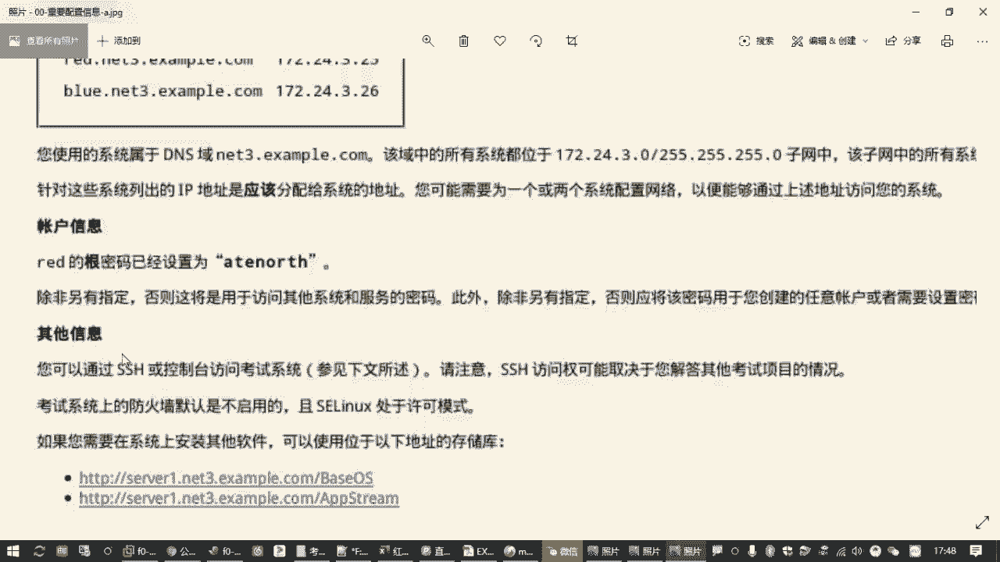

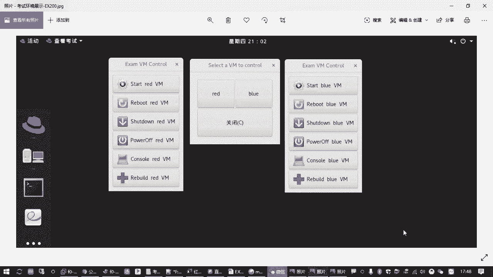

除了这三个图标，在物理机环境中你几乎不需要使用其他工具，因为你没有管理员权限。登录后，你将以普通用户身份操作，所有答题操作均在指定的虚拟机内完成。

考试要求会明确说明如何控制虚拟机以及如何答题。RHCSA考试部分需要操作两台虚拟机。

**重要提示**：
*   两台虚拟机的名称不一定是 `red` 和 `blue`，IP地址、用户名和密码也都会变化。
*   你需要清楚虚拟机控制器上各个按钮（如开机、重启、关机、强制关机、显示界面、还原）的功能。

---

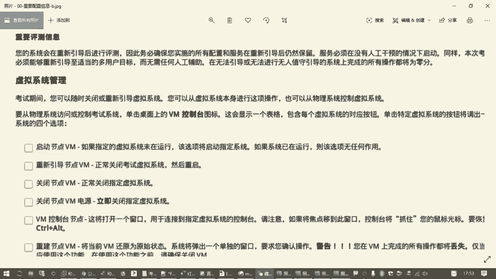

## 重要配置信息解读 📋

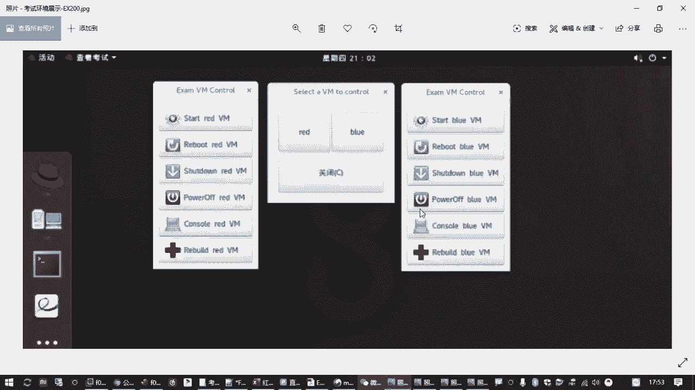

了解了操作界面后，我们来看看考试中最关键的部分——重要配置信息。

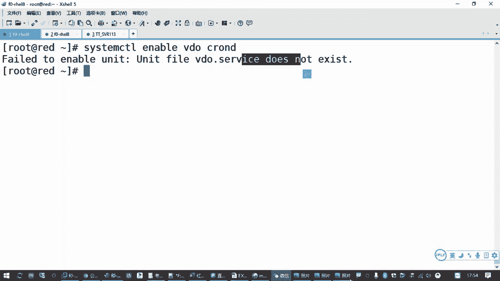

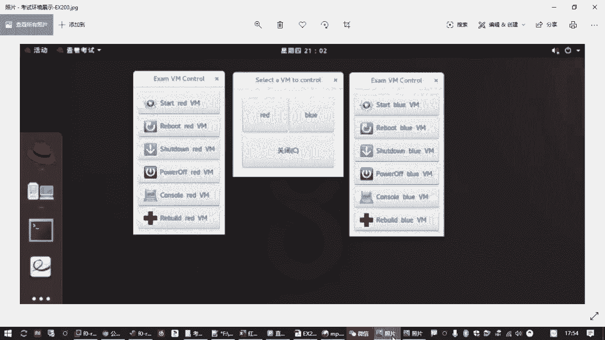

点击桌面上的红帽图标，会打开一个浏览器页面，其中包含“重要配置信息”部分。以下是该部分的核心内容：

1.  **虚拟机信息**：明确列出考试将用到的虚拟机的主机名和IP地址。**网段可能与练习环境不同**，务必以考试信息为准。
2.  **管理员密码**：会提供虚拟机的root密码。**考试时的密码以题目要求为准**，此处的信息仅作参考。
3.  **访问方式**：推荐通过SSH方式从物理机的终端远程连接到虚拟机，这样可以方便地复制粘贴题目中的命令和路径。通过虚拟机控制台（Console）界面则无法复制粘贴。
4.  **防火墙与SELinux**：考试系统防火墙默认不启用，除非题目要求，否则无需操作。SELinux状态不固定，需根据题目要求处理。
5.  **软件源**：信息中会提供软件包的资源地址。**无论题目是否明确要求，只要需要安装软件包，就必须自行配置好软件源**。考试环境无法访问外部互联网。
6.  **持久化要求**：这是最关键的一点。考试结束后，考官的脚本会收集成绩，期间会**重启你的虚拟机**。你必须确保所有配置和服务在系统重启后依然有效。这意味着：
    *   所有服务必须设置为开机自启。
    *   所有配置（如挂载、网络）必须在重启后自动生效。
    *   无需人工干预即可正常访问。

---

## 答题策略与核心题目要点 🎯

掌握了环境信息，接下来我们聚焦于具体的答题策略和易错点。

考试题目会分为两部分，分别对应两台虚拟机。**务必看清每道题要求在哪台机器上操作**，避免做错位置导致丢分。

以下是针对核心题目的要点提醒：

**对于第一台虚拟机（通常任务较简单）：**
*   **SELinux排错**：这是相对复杂的题目。标准流程是：先故意让服务（如Web服务）在SELinux强制模式下启动失败 -> 根据错误日志安装排错包（`setroubleshoot-server`）-> 再次启动服务并利用 `sealert -a /var/log/audit/audit.log` 或图形化工具获取修复建议 -> 执行建议命令。
*   **AutoFS**：理解其作用是自动监控并挂载指定目录。配置时需编辑 `/etc/auto.master` 和 `/etc/auto.misc` 等文件。
*   **其他题目**：如创建目录、修改权限等，按题目要求操作即可。

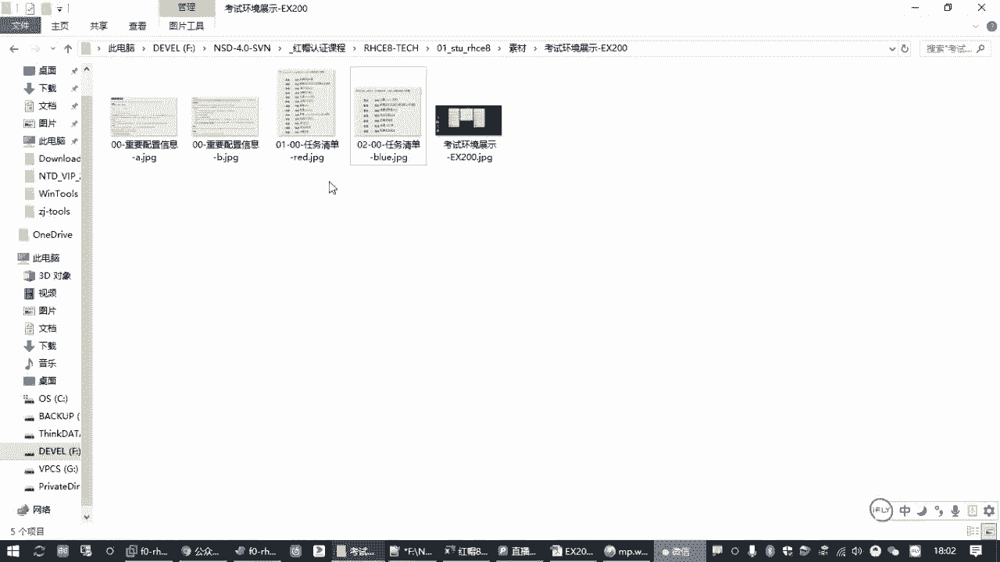

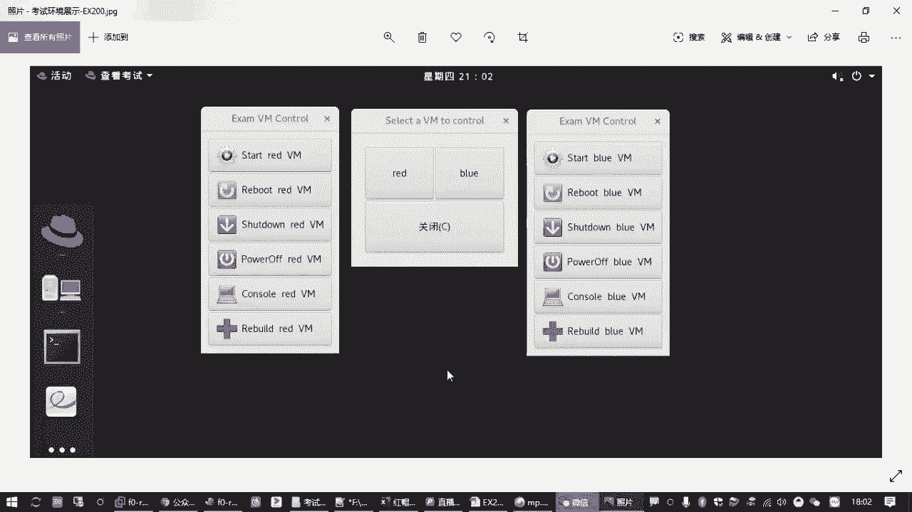

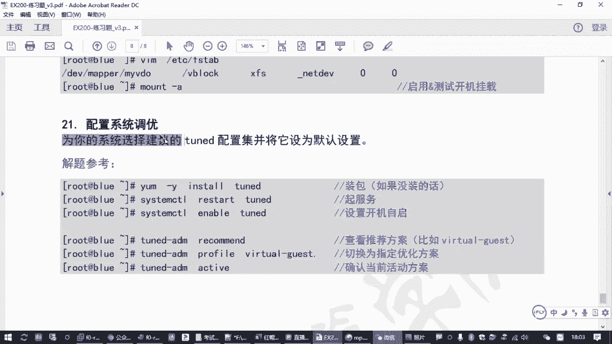

**对于第二台虚拟机（通常涉及存储和破解）：**
*   **破解Root密码**：必须熟练掌握。操作不熟练可能导致无法进入系统，从而丢失大量题目分数。关键步骤是在内核启动参数中加入 `rd.break` 或 `init=/bin/bash`。
*   **磁盘分区与管理**：操作需谨慎，避免破坏系统导致无法启动。建议先完成此部分题目。
*   **VDO卷配置**：创建和挂载相对简单，但**务必在 `/etc/fstab` 中为挂载点添加 `_netdev` 挂载选项**，以确保网络存储能在系统启动的正确阶段被挂载。例如：
    ```bash
    /dev/mapper/vdo-name /mount-point xfs defaults,_netdev 0 0
    ```

---

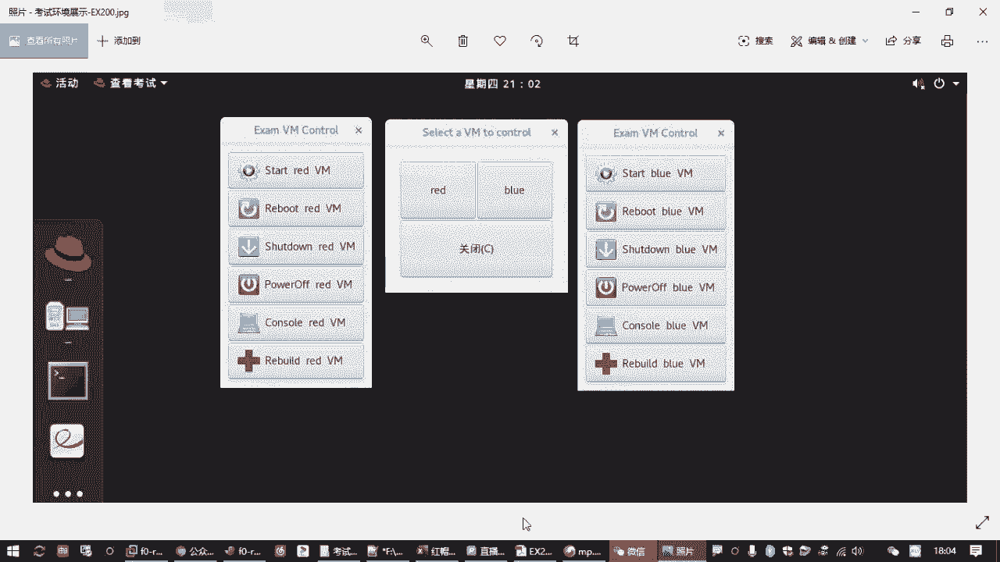

## 考试流程与考场纪律 ⚖️

最后，我们来梳理完整的考试流程和必须遵守的考场纪律。

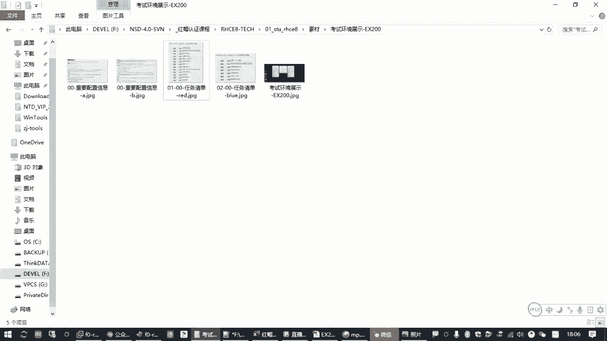

1.  **考前准备**：只允许携带一支笔入场，身份证放在座位前。考场会提供草稿纸。
2.  **答题过程**：合理分配时间。建议先完成有风险（如分区、破解密码）的题目。题目界面有“完成”和“复查”复选框，供自行标记进度。
3.  **最终检查**：**强烈建议在交卷前，自行将两台虚拟机关机，然后重新启动**。启动后，通过SSH重新连接，逐一检查所有题目的要求是否仍被满足。
4.  **交卷**：检查无误后，可告知考官交卷。交卷后，草稿纸必须留在座位上，不得带出考场。
5.  **考后纪律**：离开考场后，严禁讨论考题内容。红帽公司对考题保密要求极其严格，违规可能导致成绩作废、禁考三年甚至终身禁考。
6.  **成绩发布**：考试结束后通常需要**3个美国工作日**，你会收到邮件通知结果。

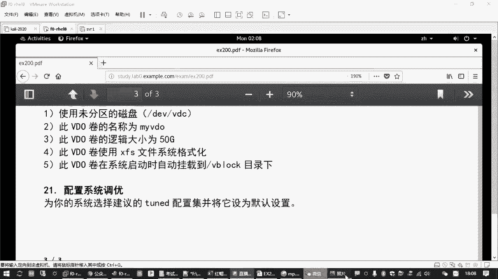

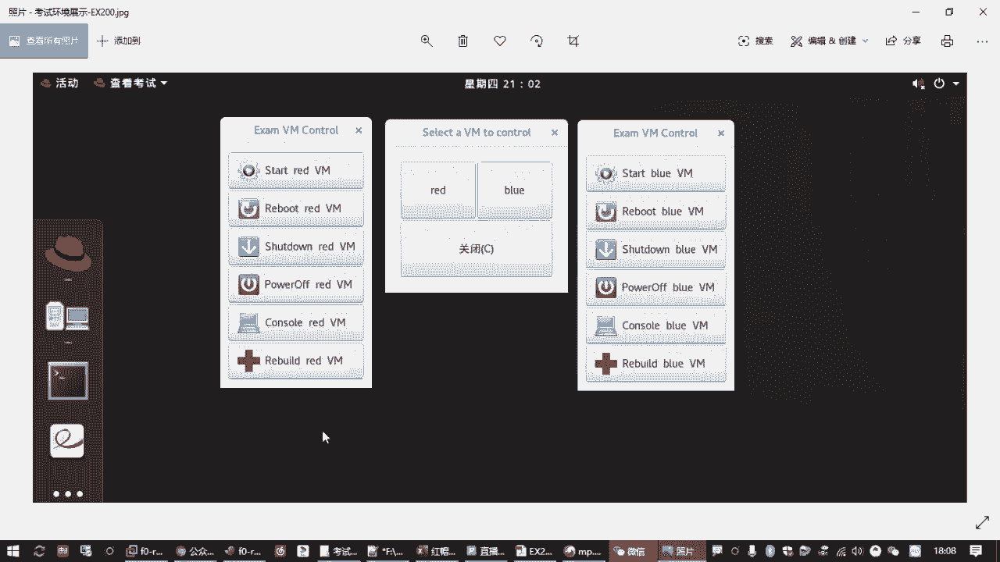

**关于模拟练习**：
可以使用课程提供的 `RHT-lab-check` 脚本进行自我评测。该脚本能检查你的练习结果是否符合题目要求。目标是：在不看资料的情况下，能在1小时内完成所有题目，且脚本检查全部为绿色对勾（通过）。连续多次达到此状态，说明准备已比较充分。

---

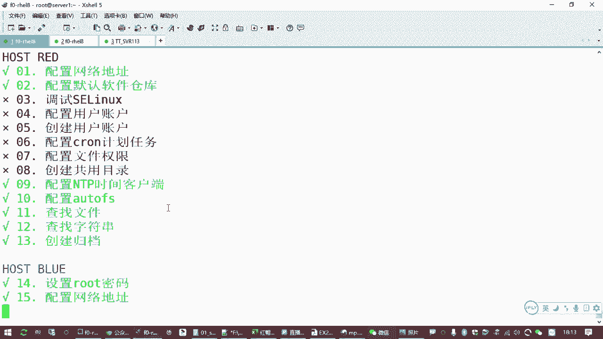

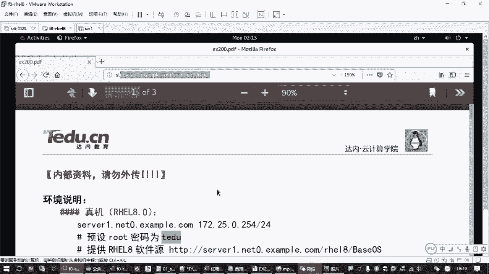

## 总结 📚

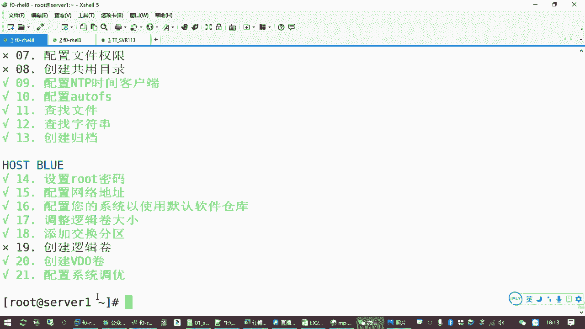

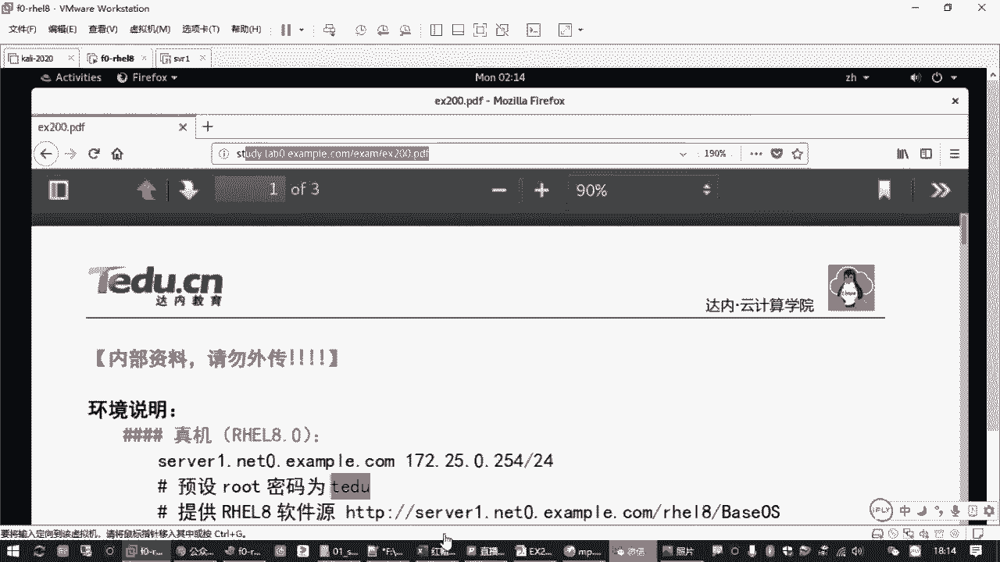

本节课中我们一起学习了RHCSA考试的完整流程和关键细节。我们明确了考试环境的操作方式，解读了至关重要的配置信息，分析了核心题目的解题要点与易错处，并熟悉了从入场到离场的完整流程与纪律要求。

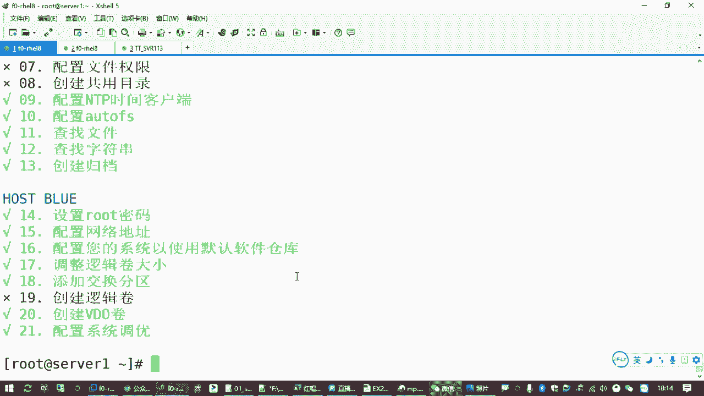

请记住：充分练习是基础，仔细审题是关键，配置持久化是保障，遵守纪律是前提。祝大家考试顺利！