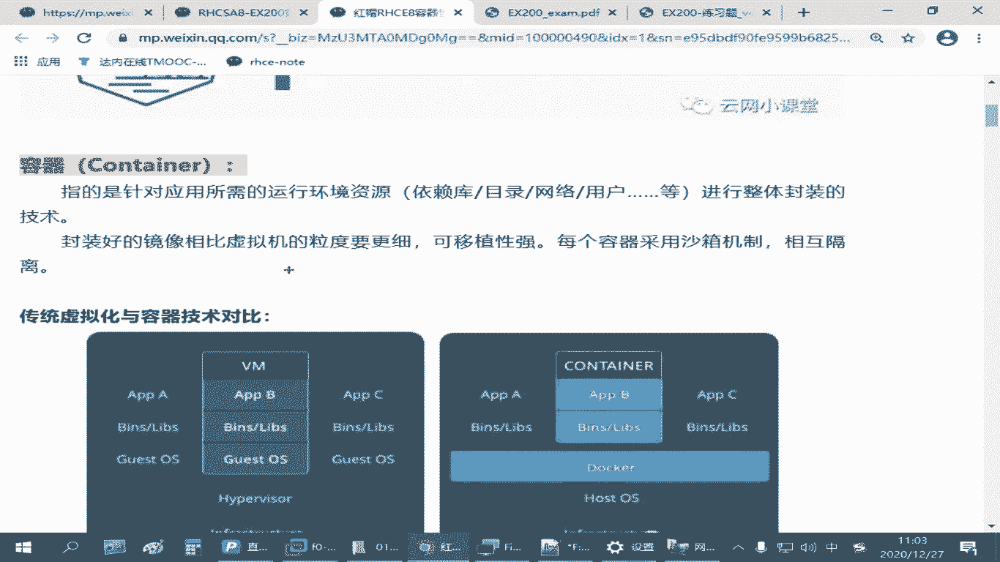
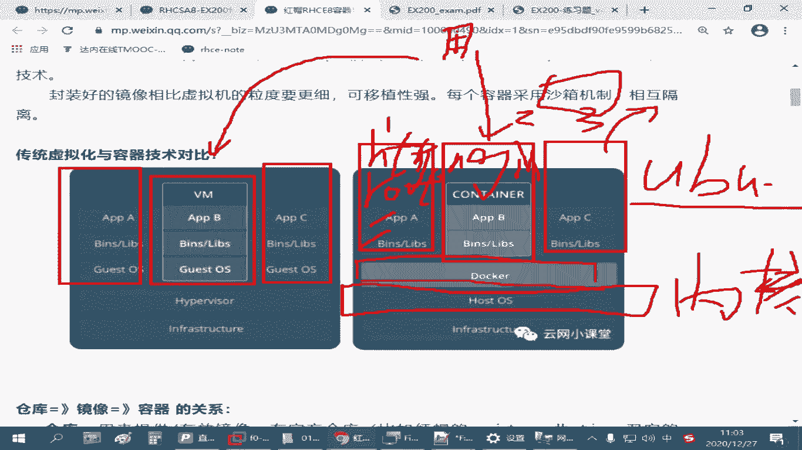
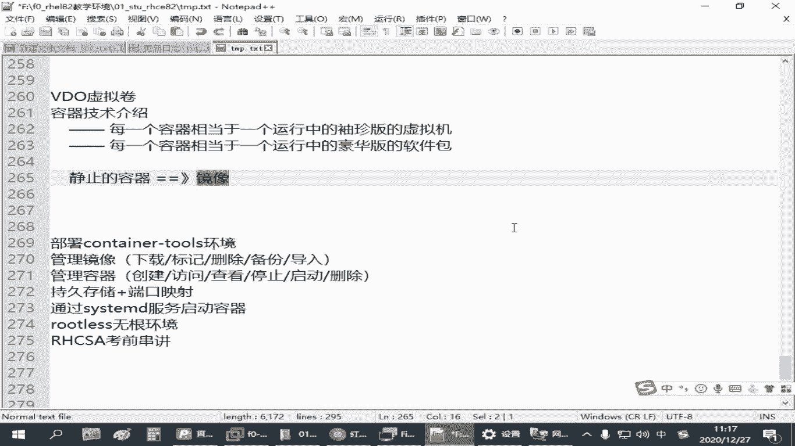
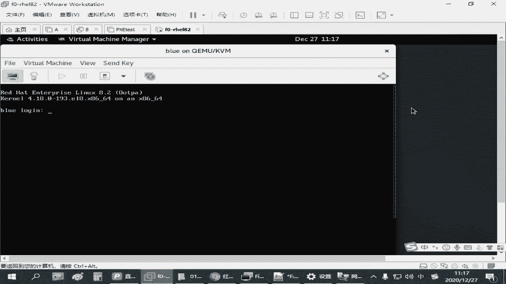
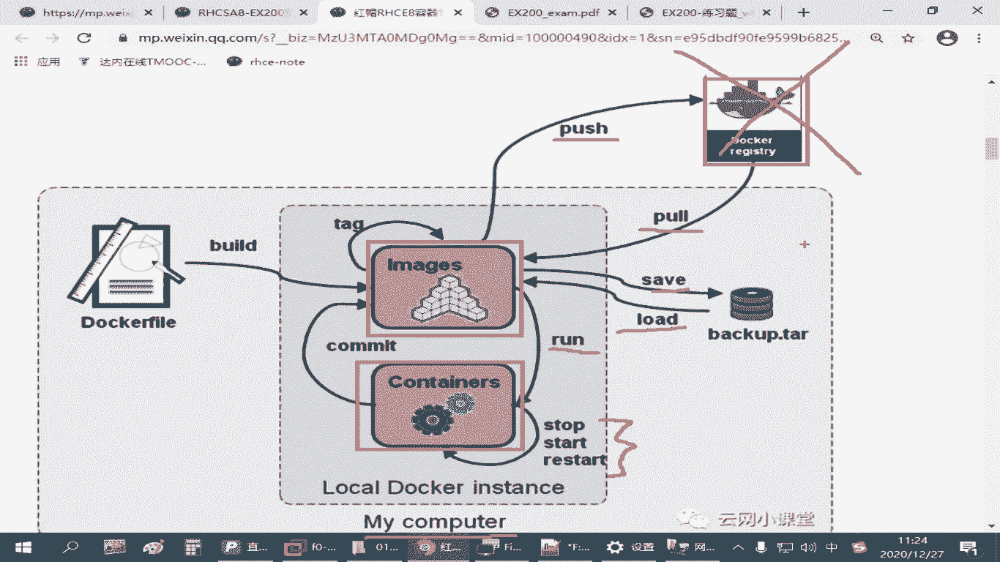

# 备考红帽认证必修课：P24：4.01-容器技术介绍 🐳

在本节课中，我们将要学习容器技术的基本概念，了解它与传统虚拟机的区别，并掌握容器、镜像和仓库这三个核心概念之间的关系。这对于理解后续的容器操作至关重要。

## 容器技术概述

容器技术是一种封装应用及其运行环境的技术。在红帽8系统中，官方推荐使用 `podman` 工具来管理容器。`podman` 可以看作是 `docker` 命令的替代品，大部分操作兼容，但功能更完整，执行效率更高。红帽8的容器技术已深度整合到更高级的云架构（如 OpenShift 和 Kubernetes）中，便于在云计算环境中进行部署和迁移。

## 容器与虚拟机的对比

上一节我们介绍了容器技术的基本定位，本节中我们来看看容器与传统虚拟机有何不同。

容器和虚拟机都用于为用户提供服务，例如运行一个网站。但它们的技术实现和资源占用方式有显著差异。

以下是两者的核心区别：

*   **虚拟机**：需要完整的底层硬件、虚拟化平台（如 VMware、VirtualBox）和独立的客户机操作系统。每个虚拟机都是一个完整的、隔离的系统环境，可以安装不同的操作系统（如 CentOS、RHEL、Windows）。它封装了整个操作系统环境。
    *   **优点**：隔离性极强，环境独立。
    *   **缺点**：占用资源多（磁盘、内存），启动较慢。

*   **容器**：与宿主机（Linux）共享操作系统内核。容器只封装了应用运行所需的软件包、依赖库、目录结构、网络配置等，不需要独立的操作系统。
    *   **优点**：启动快速，资源占用小，封装密度高，便于快速交付和部署应用。
    *   **缺点**：隔离性弱于虚拟机（但通过命名空间等技术实现了有效隔离）。

简单理解，容器可以看作是一个更加袖珍、轻量级的“虚拟机”，或者一个包含了完整运行环境的“豪华版软件包”。它介于虚拟机和单个软件包之间，旨在简化应用的交付和部署难度。

## 核心概念：镜像与容器

理解了容器是什么之后，我们需要明确两个紧密相关的核心概念：**镜像** 和 **容器**。

*   **镜像**：镜像是容器的静态模板，是一个只读的文件层集合。它包含了运行应用所需的代码、运行时环境、库、环境变量和配置文件。你可以把它想象成虚拟机的“安装光盘”或软件的“安装包”。
    *   镜像可以从仓库下载，也可以从文件导入。
    *   镜像本身是静止的、可存储和传输的。

*   **容器**：容器是镜像的运行实例。当你基于一个镜像启动一个进程时，就创建了一个容器。容器是动态的、可操作的。你可以启动、停止、重启或删除容器。
    *   容器提供了独立的运行环境（如独立的文件系统、网络、进程空间）。
    *   只有运行起来的容器才能对外提供服务。

**关系总结**：**先有镜像，后有容器**。镜像是构建容器的蓝图，容器是蓝图的运行实体。这类似于“软件安装程序（镜像）”和“正在运行的软件（容器）”之间的关系。

## 核心概念：仓库

有了镜像和容器的概念，我们自然会问：镜像从哪里来？答案就是 **仓库**。

仓库是集中存储和分发镜像的地方。你可以把它类比为 Linux 系统中的软件包仓库（如 yum repo）。

以下是关于仓库的关键点：

*   **功能**：用于下载（`pull`）和上传（`push`）镜像。
*   **类型**：
    *   **公共仓库**：如 Docker Hub (`docker.io`)，提供了大量官方和社区镜像。`podman` 兼容这些镜像。
    *   **私有仓库**：企业或个人搭建的仓库，用于存储内部镜像。在红帽考试环境中，通常会提供一个内部仓库地址（如 `registry.lab.example.com`）。
    *   **红帽官方仓库**：`registry.redhat.io`，提供经红帽认证的容器镜像（部分可能需要订阅）。
*   **操作流程**：通常，我们从仓库拉取镜像到本地，然后基于该镜像创建并运行容器。在无法连接互联网的环境（如考试环境）中，会使用预先配置好的内部仓库。

## 镜像与容器的生命周期管理

为了更直观地理解镜像、容器和仓库的交互，以下是它们之间的核心操作流程：

1.  **拉取镜像**：从仓库服务器下载镜像到本地。
    *   命令示例：`podman pull nginx:latest`

2.  **运行容器**：基于本地镜像启动一个新的容器实例。
    *   命令示例：`podman run -d --name myweb nginx:latest`

3.  **管理容器**：对运行中的容器进行控制。
    *   停止容器：`podman stop myweb`
    *   启动容器：`podman start myweb`
    *   重启容器：`podman restart myweb`

4.  **导入/导出镜像**：在离线环境或不同主机间迁移镜像。
    *   导出镜像为文件：`podman save -o nginx.tar nginx:latest`
    *   从文件导入镜像：`podman load -i nginx.tar`

5.  **制作镜像（高级）**：通过编写 `Dockerfile` 定义构建步骤，可以创建自定义的镜像。这部分内容在基础阶段暂不深入。

## 总结

本节课中我们一起学习了容器技术的基础知识。我们了解到容器是一种轻量级、可移植的应用封装技术，它通过共享宿主机内核来显著提升资源利用率和部署速度。我们重点区分了三个核心概念：**仓库**是镜像的存储中心，**镜像**是容器的静态模板，而**容器**则是镜像的动态运行实例。掌握 `podman` 管理镜像（拉取、导入）和容器（运行、启停）的基本操作，是后续在红帽环境中实践容器技术的基础。