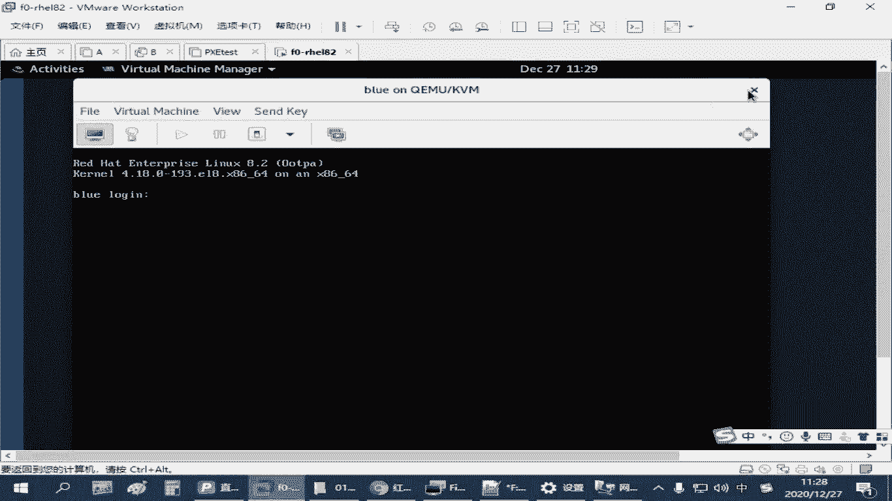
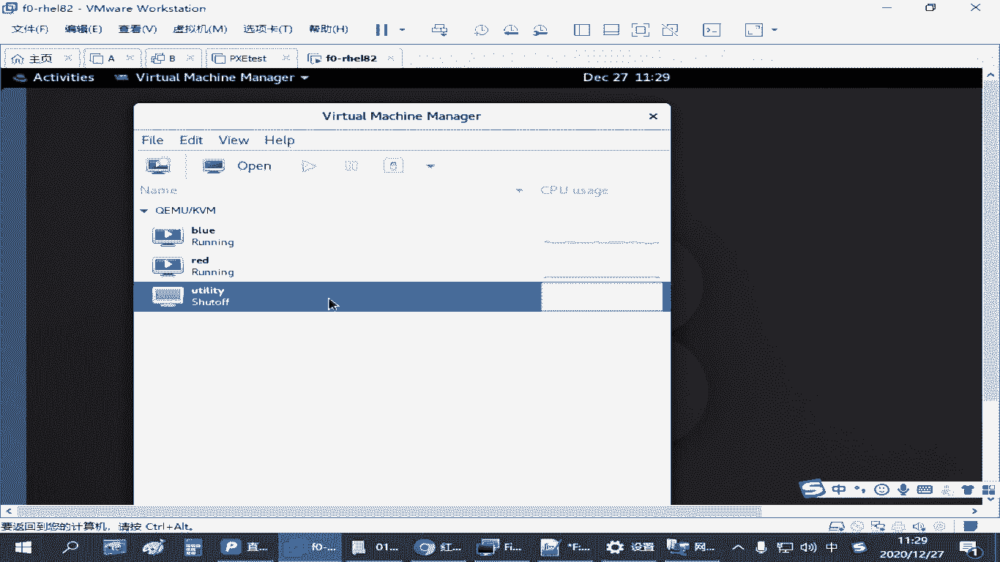
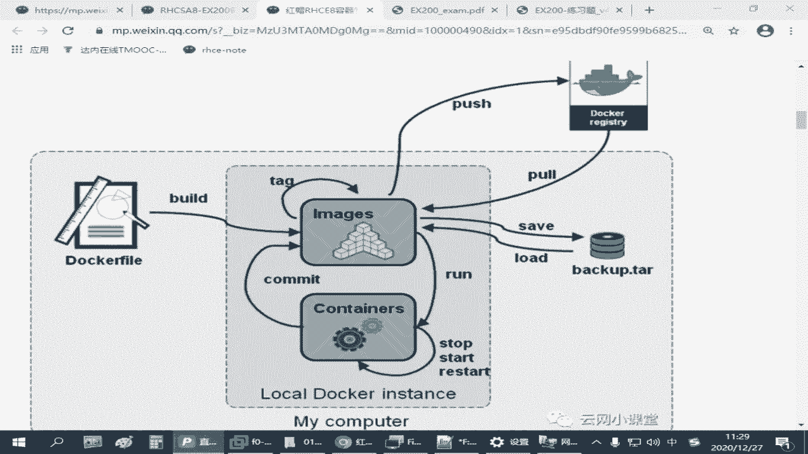
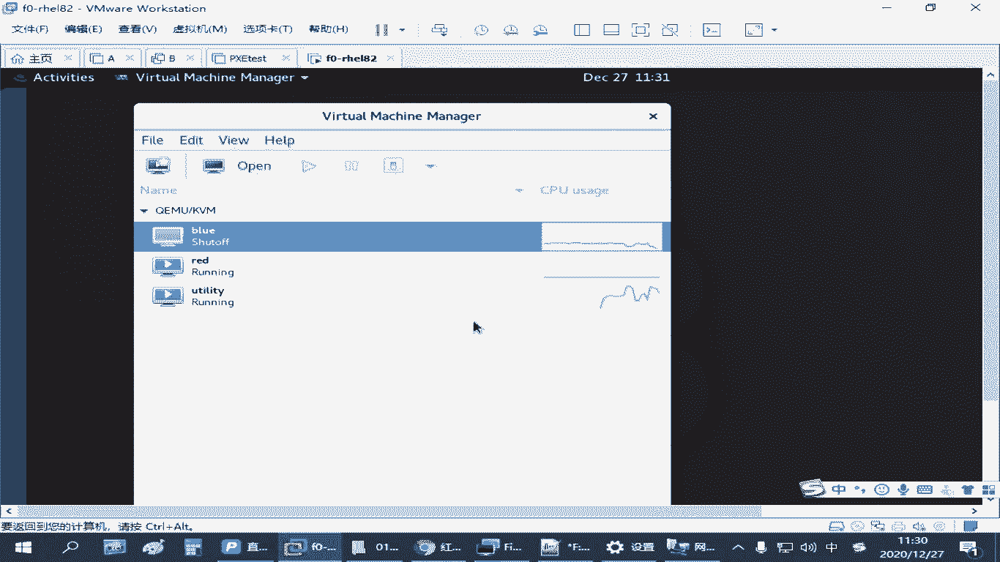
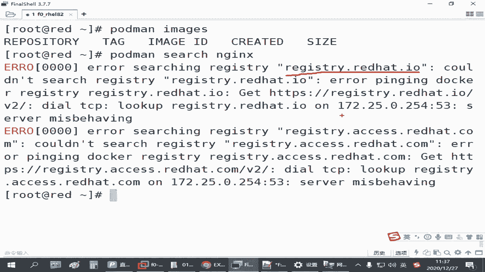
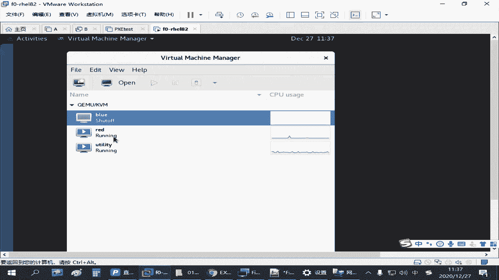
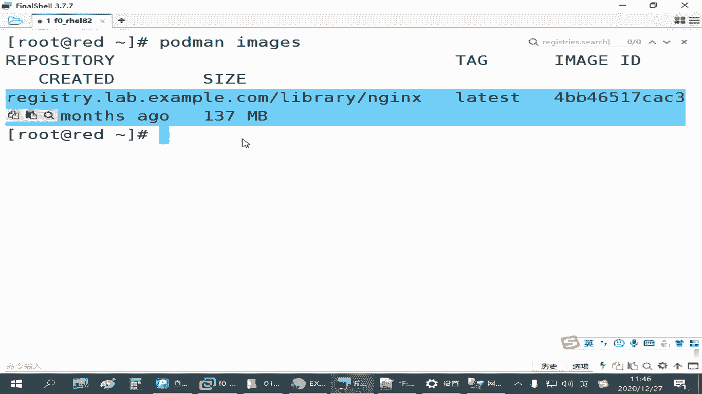

# 红帽认证备考课程：P25：4.02-仓库环境配置 🛠️





在本节课中，我们将学习如何配置和使用红帽练习环境中的容器仓库服务器，以便为后续的容器管理和使用做好准备。



## 练习环境说明

上一节我们介绍了容器的基础概念，本节中我们来看看如何配置我们的练习环境。在红帽练习环境中，已经预先准备了一个名为 `u t t` 的虚拟机作为容器仓库服务器。


这个虚拟机包含了我们所需的仓库数据，**请勿删除或重置此虚拟机**，我们无需对其做任何参数修改。




要使用这个仓库，你需要手动启动这个虚拟机。


由于该虚拟机占用资源较多（内存约4GB以上），为了节省系统资源，在默认设置中它并未开机。当你需要练习容器相关操作（如下载镜像）时，才需要启动它。使用完毕后，可以将其关闭以释放资源。如果你练习时感觉系统卡顿，可以关闭其他暂时不用的虚拟机（如 `blue`）来优化性能。

## 配置练习主机

准备好仓库服务器后，我们将在 `red` 这台主机上练习容器的使用，因为考试是在第一台虚拟机中进行。首先，我们需要连接到 `red` 主机并安装必要的软件包。

以下是安装容器环境的步骤：

1.  **配置Yum源**：确保主机的Yum源已正确配置。
2.  **安装容器工具**：使用模块化方式安装容器工具集。

```bash
yum module install -y container-tools
```

3.  **（可选）安装兼容工具**：如果你习惯使用Docker命令，可以安装 `podman-docker` 包以实现命令兼容，但考试中并非必需。

```bash
yum install -y podman-docker
```

安装完成后，核心的管理工具是 `podman`。

## 镜像管理基础

在管理容器之前，我们首先需要管理镜像。`podman` 管理镜像的基本命令是 `podman image`。

*   `podman images`：列出本地已有的镜像。
*   `podman pull`：从仓库下载镜像。



在下载镜像前，我们通常需要查询仓库中有哪些可用的镜像。这需要使用 `search` 命令。



```bash
podman search nginx
```

然而，直接执行搜索命令可能会失败，因为它默认尝试连接红帽官方仓库而无法连通。接下来，我们需要配置 `podman` 以使用我们练习环境中的仓库。

## 配置容器仓库

我们的仓库服务器位于启动的 `u t t` 虚拟机中。


其地址为：`registry.lab.example.com`


我们需要修改 `podman` 的配置文件来指定这个仓库。

配置文件路径为：`/etc/containers/registries.conf`

以下是需要修改的两个部分：

1.  **指定搜索仓库**：找到 `[registries.search]` 部分，将其值修改为我们的仓库地址。

    ```
    [registries.search]
    registries = ['registry.lab.example.com']
    ```

2.  **允许不安全的仓库**：由于练习环境的证书可能不受信任，需要在 `[registries.insecure]` 部分添加该仓库地址，以允许连接。

    ```
    [registries.insecure]
    registries = ['registry.lab.example.com']
    ```

完成这两处修改并保存后，再次执行搜索命令，即可成功查询到仓库中的镜像。

## 搜索与下载镜像

配置完成后，我们可以搜索特定镜像，例如 `nginx`。

```bash
podman search nginx
```

搜索结果显示镜像的完整标记（Tag），其格式通常为 `仓库地址/路径/镜像名`。根据这个标记，我们可以下载镜像。

下载镜像使用 `pull` 命令：

```bash
podman pull registry.lab.example.com/nginx
```

下载的镜像会存储在系统的 `/var/lib/containers/` 目录下。下载完成后，使用 `podman images` 命令可以查看本地镜像列表。

此时，你会看到镜像的详细信息：
*   **仓库来源与镜像名**
*   **标记（Tag）**：通常表示版本，例如 `:latest`。完整镜像名格式为 `名称:标记`，例如 `nginx:1.9`。同一镜像的不同版本可以共存于本地。
*   **镜像ID**
*   **创建时间**
*   **大小**

## 总结



本节课中我们一起学习了容器仓库环境的配置。我们首先了解了练习环境中仓库虚拟机的用法，然后在练习主机上安装了 `container-tools`。接着，我们通过修改 `/etc/containers/registries.conf` 配置文件，将 `podman` 指向了正确的内部仓库地址，并解决了证书安全问题。最后，我们实践了使用 `podman search` 搜索镜像以及使用 `podman pull` 下载镜像的基本操作，为后续运行和管理容器打下了基础。