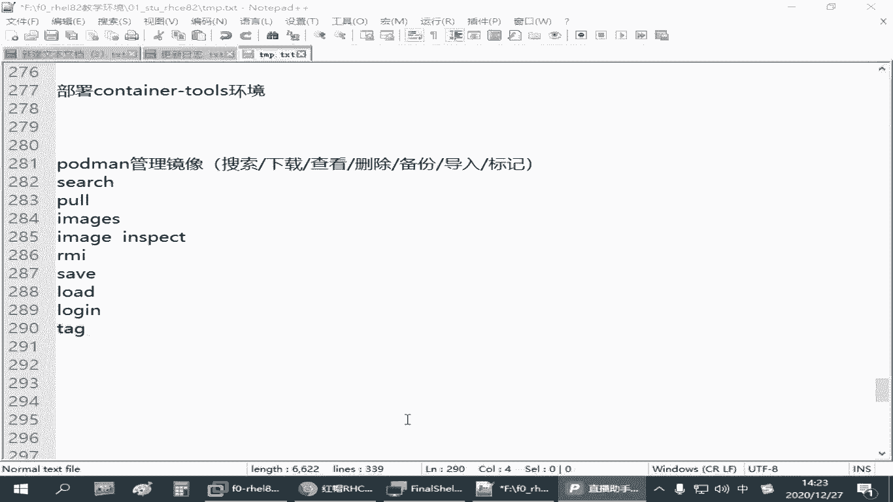
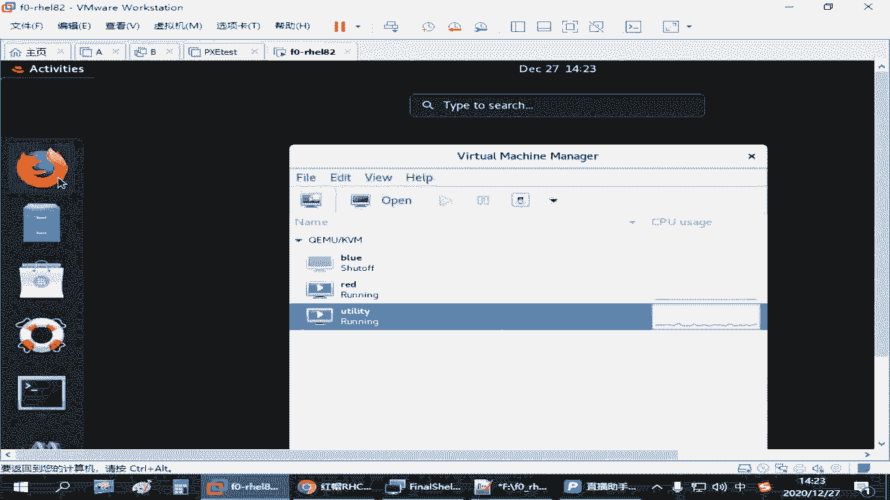
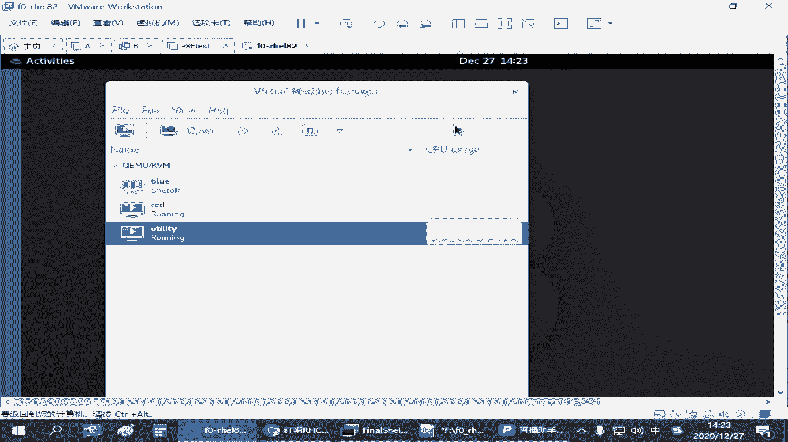
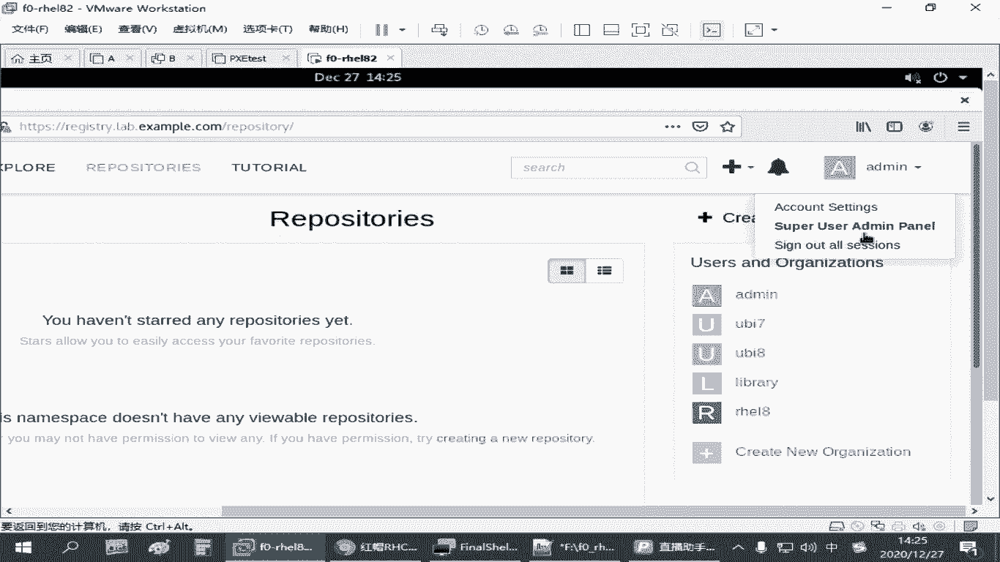

# 备考红帽认证必修课：P26：4.03-podman镜像操作

在本节课中，我们将学习如何使用Podman进行容器镜像的基本操作，包括搜索、下载、查看、删除、备份和导入等。掌握这些命令是管理容器环境的基础。

---

## 🔍 搜索镜像

要查找可用的容器镜像，可以使用 `search` 命令。它会在配置的镜像仓库中搜索与关键词匹配的镜像。

以下是搜索镜像的命令格式：
```bash
podman search <关键词>
```

---

## ⬇️ 下载镜像

找到所需的镜像后，可以使用 `pull` 命令将其下载到本地环境中。

以下是下载镜像的命令格式：
```bash
podman pull <镜像仓库地址/路径/名称:标签>
```

---

## 📋 列出本地镜像

要查看当前系统中已下载的所有镜像，可以使用 `images` 命令。

以下是列出镜像的命令：
```bash
podman images
```

---

## 🔎 查看镜像详细信息

如果想深入了解某个镜像的配置信息，例如其基于的操作系统、创建时间等，可以使用 `inspect` 命令。

以下是查看镜像详情的命令格式：
```bash
podman image inspect <镜像名称>
```

---

## 🗑️ 删除镜像

当某个镜像不再需要时，可以使用 `rmi` 命令将其从本地删除。

以下是删除镜像的命令格式：
```bash
podman rmi <镜像名称>
```
为了精确删除，建议使用完整的镜像名称和标签。

---

## 💾 备份与导入镜像

上一节我们介绍了镜像的常规管理，本节中我们来看看如何备份镜像到文件，以及如何从文件恢复镜像。

### 导出（备份）镜像

要将本地镜像保存为一个文件，以便迁移或备份，可以使用 `save` 命令。

以下是导出镜像的命令格式：
```bash
podman save -o <输出文件路径> <镜像名称>
```

### 导入（恢复）镜像

要从一个备份文件中将镜像加载到当前系统中，可以使用 `load` 命令。

以下是导入镜像的命令格式：
```bash
podman load -i <镜像文件路径>
```
导入时可以指定新的镜像名称和标签。

---

## 🏷️ 管理镜像标签

有时我们需要修改镜像的标签（名称或版本），这时可以使用 `tag` 命令。

以下是修改镜像标签的命令格式：
```bash
podman tag <原镜像名称:标签> <新镜像名称:新标签>
```





---



## 🔐 登录镜像仓库

如果镜像仓库需要身份验证才能进行上传或下载操作，则需要先使用 `login` 命令登录。

以下是登录镜像仓库的命令格式：
```bash
podman login <仓库地址>
```
执行后会提示输入用户名和密码。请注意，对于大多数公共镜像仓库的下载操作，通常无需登录。

---

## 📝 总结



本节课中我们一起学习了Podman镜像管理的核心操作。我们掌握了如何搜索、下载、列出、查看详情和删除镜像。此外，还学习了镜像的备份、导入以及标签管理。最后，了解了在需要身份验证时如何登录镜像仓库。这些是使用Podman管理容器镜像的基础技能，请多加练习以熟练掌握。